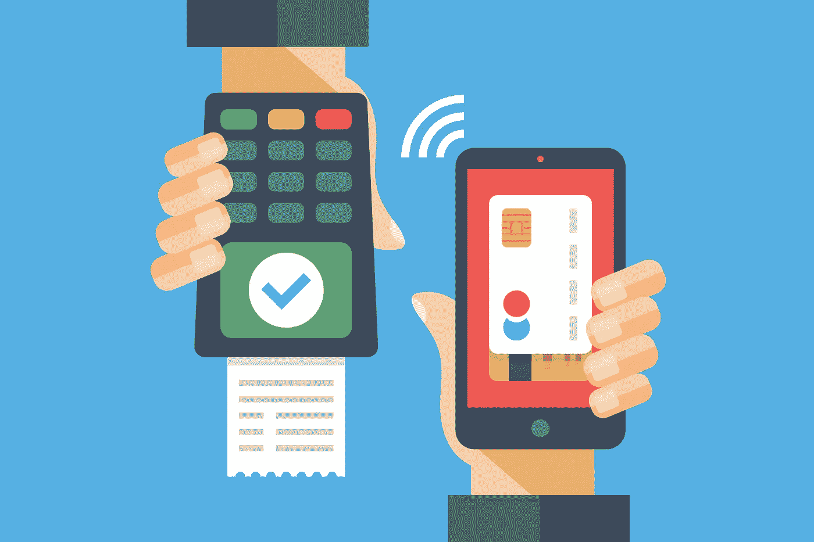
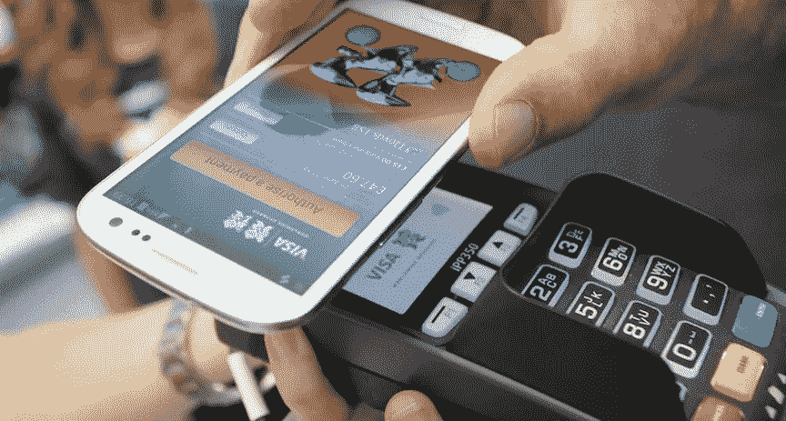
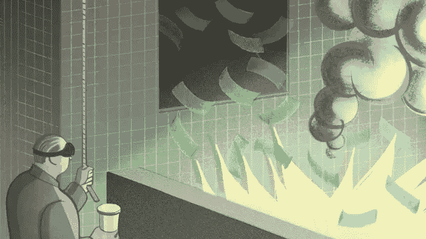
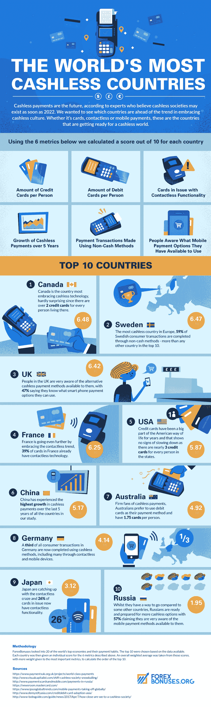

# 我听说现金在非洲不见了

> 原文：<https://medium.datadriveninvestor.com/i-heard-the-cash-is-gone-in-africa-144f8606c364?source=collection_archive---------1----------------------->

我听说一些国家大胆尝试无现金:北欧的瑞典公开表示希望在 2020 年或类似的时候实现完全无现金。

仅在 2012 年，现金支付**就占了美国交易的 40%。中国、印度、日本、俄国，所有的大男孩都把钞票扔进垃圾箱，全力投入** [**无现金**](https://www.worldatlas.com/articles/which-are-the-world-s-most-cashless-countries.html) 。

但是其他经济体呢？…

嘿，怎么回事

政府喜欢这种趋势。当你能追踪和记录付款时，你真的无法逃避税务员。例如在法国，用现金支付“任何超过 1000 欧元的东西”都是非法的。

无现金交易对于“钱少”和有门路的人来说不太现实。预付费信用卡是一种选择，iTunes、亚马逊或 Spotify 优惠券也是一种选择。电子前沿基金会(Electronic Frontiers Foundation)的一位行动主义主管表示:“许多没有银行账户的人由于各种原因无法获得信贷额度，禁止现金尤其会对他们造成影响。

瑞典人说不；希腊人说了些别的

在瑞典这个处于**现金淘汰**前沿的国家，无家可归者携带*形势斯德哥尔摩*提供的信用卡读卡器。当你能够“交谈”并理解非无家可归者的语言时，销售额就会增加。人们用信用卡向教堂捐款，用 Swish 拆分支票。

在希腊，一个在 08 年被金融混乱蹂躏的国家，有一个城镇采用了一种替代货币，Volos' TEM。你只能在那里交易和消费。没有人可以拥有超过 1200 TEMS 或欠超过 300，所以一个人不能像普通的钱一样囤积它。花出去接受=通过当地企业的现金流。

这并不罕见

**想少点现金多点现金光** / **这年头无现金**。你是优步人，你出国旅行甚至不考虑外汇，你通过你的智能手表汇款，甚至贝宝今年也满 20 岁了。

现在非洲发生了什么？

they know how to party indeed!

你可能会认为无现金是西方世界的事情，但事实证明……**津巴布韦和肯尼亚**正在为移动支付铺平道路。事实上，当你使用 M-Pesa 时，你运行的是 10 年前的代码。支付账单。在钱包之间换钱。申请贷款。

仅在肯尼亚，每天就有 1600 万笔交易和 3600 万个注册账户。尽管如此，80%的肯尼亚人将使用现金而不是 M-Pesa。

在 Kibera 这样的低收入地区，"*我为我的客户提供了 M-Pesa 服务，但很少有人使用它；在路边卖菜的简·奥蒙蒂说:“我的许多顾客更喜欢现金支付。*

FSD Kenya 的数字创新经理塔玛拉·库克(Tamara Cook)表示，“*在(更多)人获得数字支付之前，我们不会看到大的转变*”。

**路的同一边是津巴布韦，这个同样被政府搞得四分五裂的国家每月恰好有 1800 万笔移动交易**。

你可能知道津巴布韦在 2009 年因为极度的通货膨胀放弃了它的货币，采用美元从黑暗中崛起。

不幸发生在津巴布韦的是数字支付的**完美风暴**:比例从 2010 年的 20%**D**(**digital**)-80% C(现金)到 2017 年的 **80% D** 和 20%C。

人们只需要等很久就能拿到钱，移动运营商竞相改进数字解决方案。这就对了。

现金短缺

data from 2017

**津巴布韦不是无现金或者无现金。瑞典还有纸币。美国人会用先生**。富兰克林为一杯摩卡奇诺咖啡买单——他们从 1862 年就开始这么做了(注意，不是浓咖啡)。

lotta money here!

虽然我们正在走向一个无现金的社会，但金钱仍在继续并且强大。旅游场所通常会冒险走另一条路，避免电子支付和记录。如果他们想惹恼顾客，贿赂纳税人，并由于缺乏可靠的财务信息而使出售他们的企业变得更加困难，那只是…他们的选择。

去瑞典，肯尼亚或者回家！

*来源*:[**fast company**](https://www.fastcompany.com/3056736/what-happens-when-we-become-a-cashless-society)， [**theguardian**](https://www.theguardian.com)