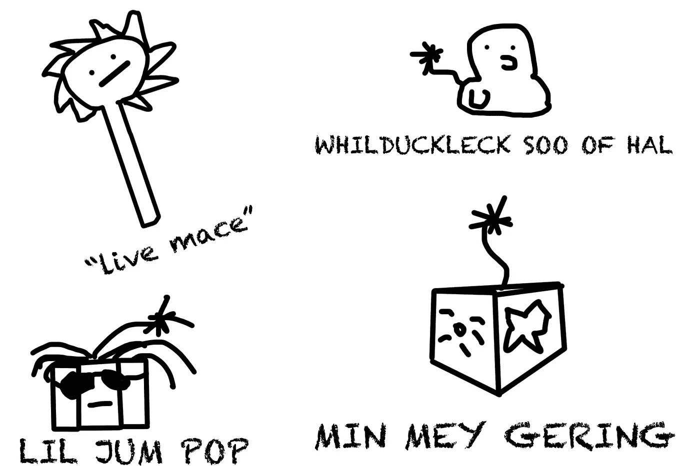

# 我让我的人工智能产生烟花的名字…

> 原文：<https://medium.datadriveninvestor.com/i-let-my-a-i-generate-firework-names-229e62b40905?source=collection_archive---------20----------------------->

## 烟花天网？可能吗？！

不久前，我在这个有趣的博客中写了一个关于[人工智能生成万圣节服装名称](http://aiweirdness.com/post/166814009412/a-neural-network-designs-halloween-costumes)的故事。这是一个简单的想法。将我们大脑中的生物神经元模拟成代码，以便它学习以前的服装名称来生成新的服装名称。因为…你知道，很明显很难想出万圣节服装的名字，尤其是如果你想“脱颖而出”

由于新年正在流逝，2019 年已经到来，我不妨开始新的一年，介绍人工神经网络，这是一种到处使用的有前途的机器学习技术。到自动驾驶汽车，预测市场价格，分类天文数据，为什么不用它来做烟花名称呢？！

由于我不想在新的一年里尝试从零开始建立一个神经网络，我做了一个正常人在我的情况下会做的事情，那就是使用 python 库。谢天谢地，我已经找到了 [textgenrnn](https://github.com/minimaxir/textgenrnn) ，这是一个开源库，只用几行代码就能生成文本。从字面上看，你所需要的只是一个包含所有文本数据和 4 行代码的文本文件。就这么简单。

What my News Year looked like

可悲的是，不像万圣节博客，我无法众包，因为我没有这么大规模的追随者崇拜…还没有。所以我做了一个疯子会做的事，在互联网上深入研究，一个一个地寻找烟花的名字。

***后来很少抄面食……***

我从众多烟花品牌中收集了 200 个精选的烟花名称，如 TNT、黑猫、支配者、大烟花和 Boomer。我知道这不算多，但对现在来说很好。

我的文本文件每行包含一个烟花名称

> 色浪
> 美国人风暴
> 紫色人名
> 人山人海
> 爱国统治力
> 猛犸爆裂声
> 心灵扭曲
> 猛犸爆红
> 鬼鱼
> …

这是我的代码

> 从 textgenrnn 导入 textgenrnn
> 
> textgen = textgenrnn()
> 
> textgen.train_from_file('。/test.txt '，次数=7)
> 
> textgen.generate(5，温度=1.0)

简单吧？只有 4 行代码。甚至你可以开始制作天网…

现在，娱乐时间到了！

我让我的神经网络从 30 多个时期中学习，这就是它得出的结果:

> STON 裂纹公鸡
> 
> 摇摆球
> 
> LIL JUM 流行音乐
> 
> 活权杖
> 
> 哈尔的怀特·克里克·苏
> 
> 勇敢的公鸡
> 
> 贝莱斯风暴
> 
> 敏·MEY·格林

还有更多，但我选择了一些有意义或幽默的名字。这是我的速写，描绘了我想象中的 A

**最终想法**

神经网络生成幽默文本。虽然我的数据集很小，但我的人工智能生成了原始的烟花名称！这就是这个短片的总体目的。希望我的人工智能足够聪明，能给这些有创意的名字申请专利。