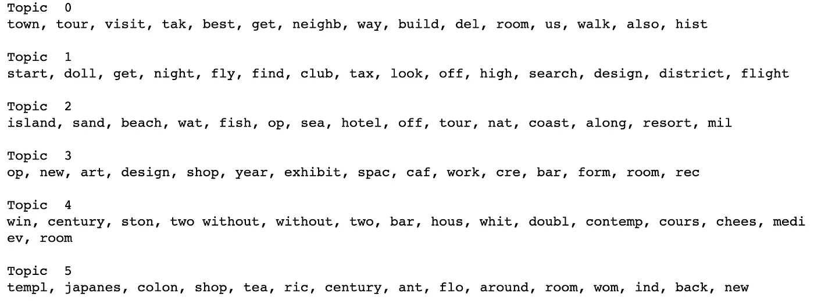
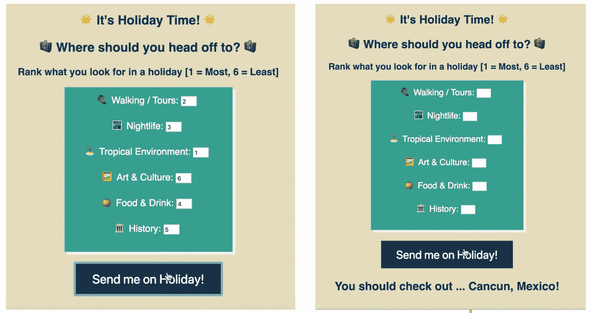

# 度假建议—使用 NLP 来建议度假目的地

> 原文：<https://medium.datadriveninvestor.com/i-need-a-vacation-but-where-should-i-go-b2ccdb0c8ebf?source=collection_archive---------6----------------------->

> 使用无监督学习和自然语言处理来基于个人兴趣建议个人应该去哪里度假。

在芝加哥熬过了第一个无情的冬天后，我觉得是时候开始考虑度假了！

All that’s missing is a cocktail in hand! 📍Fiji

# 你理想中的假期是什么样的？

每个人对这个问题的答案都不一样，因此我想建立一个推荐系统，根据你的个人兴趣来建议你去世界上的哪个地方。

*但是数据科学如何在这里帮助我们呢？*

我们在 Metis Bootcamp 的倒数第二个项目引入了无监督学习和自然语言处理的理念，我真的很想融入我的一个爱好——旅行。

 [## 算法诱人的商业逻辑——数据驱动的投资者

### 某些机器行为总是让我感到惊讶。我对他们从自己的成就中学习的能力感到惊讶…

www.datadriveninvestor.com](https://www.datadriveninvestor.com/2019/03/22/the-seductive-business-logic-of-algorithms/) 

## 寻找数据

如果你不熟悉《纽约时报》的[“36 小时内……”](https://www.nytimes.com/column/36-hours)专栏，当你在一个特定的地方只有*36 个小时时，这是一个寻找最佳去处的绝佳资源。我用硒和美丽的汤提取了全世界 180 多个地方的文章。这个专栏的伟大之处在于它总结了 place 的最佳属性，非常适合查找多种活动。*

*这一切都很好，但这对推荐去哪里有什么帮助呢——来吧，我需要休假！*

## *自然语言处理&主题建模拯救世界！*

*主题模型是一种统计模型，用于评估语义结构并在文档集合中导出“主题”。例如:“岛屿、沙滩、海滩、水、海洋、海岸、度假村”可以与主题“热带环境”相关。当深入主题建模时，有一些选项可以探索，例如 [LDA](http://blog.echen.me/2011/08/22/introduction-to-latent-dirichlet-allocation/) (潜在狄利克雷分配) [LSA](https://en.wikipedia.org/wiki/Latent_semantic_analysis) (潜在语义分析)或 [SVD](https://en.wikipedia.org/wiki/Singular_value_decomposition) (奇异值分解)——*是的，很多三个字母的缩写词！。**

*然而，这个项目使用了几个不同的缩写:*

***TF-IDF :** 词频—逆文档频& **NMF:** 非负矩阵分解。*

*TF-IDF 不涉及这种技术背后的复杂数学，而是根据每个词在文档中的重要性对其进行加权，NMF 则根据这些权重将这些词聚类成预定数量的主题。*

*在此过程之前，每个文档都需要大量的预处理，以优化模型的性能。这包括删除所有的数字和不常见的字符，删除几乎没有语义意义的单词(和，我，你，是等。)，并对单词进行词根处理(driving、drives、driven、driven 都还原为 drive)以捕捉它们的含义。这是一个令人精疲力尽的过程，需要大量的尝试和错误，用方法来判断每篇文章的最大意义。因为每篇文章都是以相似的格式编写的，所以我能够定义一个完整的清理函数，然后应用到每篇文章中。这对于处理文章中经常出现的不同语言的字符和单词尤其具有挑战性。我甚至不得不找出真正的本质，并删除在多个主题中出现的特定单词，但这些单词对分析没有帮助，例如，“欧元”和“城市”。*

*自然语言处理可能是主观的，这是由于其不受监督的性质。因此，在发现生成多少主题和决定这些主题是否有意义之间有一个很好的平衡。*

*我找到的最终话题都是从这些话中产生的:*

**

*Words associated mostly with each topic using TF-IDF and NMF*

*我给它们命名的主题如下:*

***徒步/旅游——夜生活——热带环境——艺术&文化——美食&饮料——历史***

**思想？**

## *推荐你的下一个假期*

*由此，我可以对每篇文章中每个主题的流行程度进行排名。NMF 为每篇文章的每个主题提供了一个“分数”。虽然分数本身是任意的，但是数字越高，这个话题就越流行。通过对每篇文章的分数进行标准化，我能够获得每个城市的主题排名！*

*这种方法非常有效，例如，意大利罗马将这些主题排列如下:*

1.  *食物和饮料*
2.  *步行/旅游*
3.  *历史*
4.  *艺术与文化*
5.  *夜生活*
6.  *热带的*

*我不觉得这离现实太远了！*

*通过对每个地方的主题进行排名，我现在能够将目的地与个人在寻找假期时更喜欢的个人排名相匹配！为了实现这一点，我使用 Flask 构建了一个应用程序，要求用户按照他们喜欢的顺序排列这 6 个主题，它将返回符合这些偏好的位置。*

*看看它给了我什么建议…*

**

*I’m a hot weather and outdoors type of person — off to Mexico I go!*

*这是迄今为止我在 Metis 训练营最喜欢的项目——这个项目的结束标志着我们激情项目的开始！我们现在已经有了完整的数据科学工具包来调查和设计一个完整的项目，没有任何限制，然后呈现给潜在的雇主——祝我好运吧！*

> *项目分析和 Flask 应用程序的完整 Jupyter 笔记本代码可以在[这里](https://github.com/laurenlagilson/project4_luther/tree/master/project4_fletcher)找到。*