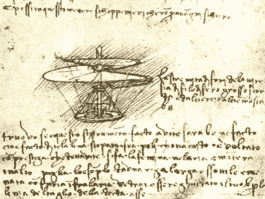
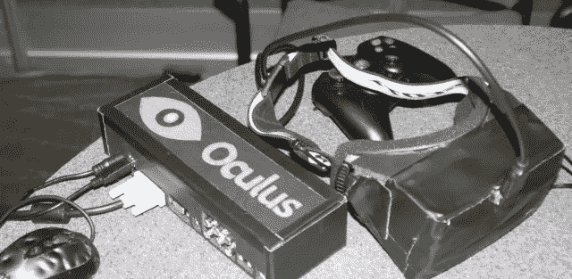

# 我应该先做一个原型

> 原文：<https://medium.datadriveninvestor.com/i-should-have-made-a-prototype-first-e74c6c7a480b?source=collection_archive---------53----------------------->

## 我从我的博士#1 中学到了什么

攻读博士学位是一段艰难、疲惫、有时甚至是令人痛苦的经历。但我相信，从任何好的或坏的企业中总会学到一些东西。博士相关的帖子几乎都会给你如何在学术研究中取得成功的建议。在这个简短的系列中，我更倾向于谈论一般的工作流程原则来创造更多的价值。虽然这些建议来自我在学术界的个人经历，但我相信它们也适用于其他情况。

作为一名博士生，我必须设计并实现一个复杂的基于代理的模型。目的是更好地了解植物可塑性(植物在不同条件下改变形态的能力)在不同情景下对群落动态的作用。在开发过程中，我犯了很多错误，第一个是:没有马上做一个原型。下面是你为什么要做一个原型:

# 完成比完美更好

*我开始通过想象复杂的适应机制、多种干扰过程(如霜冻、空气二氧化碳浓度变化或放牧和砍伐)来设计我的模型。我设计了一个复杂的结构，允许考虑所有这些过程，我实现了一些，甚至测试了一些功能。最后都没有以我的论文告终。为什么？光是植物对光和水的变化的适应，我就有足够多的东西来分析了。虽然我所有的想法都很酷，但没有一个能给最终产品增加价值。我甚至浪费了很多时间来开发它们，迫使我延长我的分析周期，并比计划晚完成项目。*

当我处于一种创造性和多产的状态时，我总是想象完美的图画、程序或文章。我也一直没能把这转化成一个完美的结果。我将进行归纳，并假设这种情况不只发生在我身上，但我是这样认为的:不管我们如何努力思考、准备和尝试，大多数时候我们都无法与这个完美的第一个想法相匹配，并且永远不会再碰它。这个项目烂掉了，没有完成，或者迷失在完美的想法中。这是因为**完美很难**。因为我们相信只有完美才是有价值的。我相信这个想法来自于我们对激励我们并创造我们眼中的完美的人的感知。因为我们把自己比作鼓舞人心的、有才华的、勤奋的和有经验的人，我们很少能做出像他们那样好的东西，因此我们不能创造完美。

好消息是:**值不在完美，而在完成的**中。大多数激励我们的人在他们的工作中看不到完美，而是完成并跳到另一个项目。问问你的任何一位偶像，他/她是否认为你最喜欢的作品是完美的？答案将是“不”，但他们仍会从中发现价值(就像你一样)。

既然你确信完成比完美更好，听我说，还有一个好消息:**完成比完美更容易**。但是什么时候结束呢？

# 原型制作即将完成

原型很少是成品，因为它不够完美，不容易生产和销售。但是原型制作已经完成了，因为...原型制作的第一步是定义产品需要完成的属性。虽然这似乎是显而易见的，但区分本质和次要并不总是容易的，尤其是当我们开始涉足一个领域时。任何对产品功能不重要的东西都应该放在一边。只有核心功能/属性是重要的。拥有这个最小的列表就是定义你的“完成”状态。

为了帮助你定义这个列表，试着问自己这个问题:

> “是什么赋予了你的想法价值？”

## 原型帮助你区分优先次序

*所以，我实现了一个模块来模拟我的模拟植物的选择性放牧。这很好，看起来不错，我已经在考虑一种抵抗机制，让植物对这种选择性做出反应。我无法实现(超级酷)功能，因为我的模拟植物没有以连贯的方式分配它们的有机物。时间又一次被浪费了。我必须纠正这一点才能继续，没有时间去探究放牧的影响。*

即使在这个阶段，甚至在你开始构建你的原型之前，你已经处于一个更好的成功位置。定义了你的产品的核心属性(希望包括你的创新，证明在项目上投入时间是合理的)**你可以优先考虑**。定义产品运行所需的属性(它们将首先被开发)。这一步可以导致测试的定义，这些测试可以用来衡量生产的原型是否成功。您可能应该考虑这些属性之间的依赖关系。事实上，虽然所有这些都是必要的，但是如果特性 A 不存在，您可能无法测试或实现特性 B。

您可以在以后定义想要包含的次要特征，以进一步增加价值。但是这些不会在原型中实现。

# 失败，但失败得很快

这次，我正在研究植物投资于叶或根的方式。我花时间开发了一种优化算法，以便同时有效地探索所有植物的不同策略。我忘记了这些策略通常取决于当前的策略。我的函数很快，但没有产生预期的结果。我重新开始，生产一些有用的东西，然后进行优化。

Leonardo Da Vinci’s Screwcopter. With the materials available at the time it could not have flown. Hopefully, nobody cut an entire forest to build hundreds of those.

## 测试这个想法

原型允许快速失败。你需要把你完美的想法从你幻想的云里取下来，砸到现实的坚硬地面上。如果它存活下来，你就有了一个非常好的想法，你可以自信地用它来做一个产品。如果没有，它会教你**为什么它打破了**，并告诉你是否必须坚持和改进这个想法或继续前进。

## 限制风险

快速原型不仅是了解产品可行性的好方法，也是降低风险的好方法。通过快速失败，你**限制了万一失败你可能损失的时间和金钱**，但仍然从过程中获得价值。

# 人们会看到你的原型，而不是你的想法

我和我的主管开了这个会。我想给他看结果，但其中一个变量远远超出了图表。我告诉他“没关系，它在这里不起任何作用。”这是真的，但是他不信任这个模型(或者我开发模型的能力)，我们不能谈论我最初的问题。我很沮丧，但现在我理解他。如果你想让人们在你的想法上投入时间、精力和/或金钱，你必须向他们展示你的想法是可行的。后来我带着一个工作模型和更好的结果回来了。

有东西展示对于有效地交流想法(你要去的方向，你的目标)和产品的当前状态是必不可少的。

Oculus Rift prototype. photo by [KYLE ORLAND](https://arstechnica.com/author/kyle-orland/) from [this article](https://arstechnica.com/gaming/2012/09/virtual-realitys-time-to-shine-hands-on-with-the-oculus-rift/)

# 原型比想法更有说服力

至于 Oculus Rift 的[成功故事，以及许多其他成功的众筹活动，原型的生产至关重要。原型让人信服。想法很少足以让人们站在你这边，尤其是当你向他们要钱，或者更宝贵的时间的时候。拥有一个功能性的产品，即使粗糙，**也证明了一个项目的可行性**。它允许**制造宣传和展示产品的能力**。甚至可以帮你造炒作，把人拉进来。](https://en.wikipedia.org/wiki/Oculus_Rift)

## 协作的有效工具

虽然作为你原型的一堆塑料、二极管、橡胶和/或代码可能会帮助你说服别人，但这也是让别人帮助你的机会。有了这个想法的具体表现，就可以**发现它的弱点**并让人们**一点一点地提供解决方案**。它既是评估项目的手段，也是建立项目的基础。群体的智慧总是比个人的更好，公众可以使用原型来指出特定的限制或现有的功能，专家可以对设计的特定方面做出贡献。

# 建筑价值

我在这个项目中工作了一年多。我有无数的想法来做一个更大的模型。我甚至有一些分析和模拟计划。在这次实验室会议上，我被要求介绍我的工作。所以我决定展示一些很酷的想法，因为这是我所有的想法。没有完全工作的模型，没有一致的结果，没有原型。一堆函数，一些图表，一堆方程式和图表写在纸上，但是没有价值。

## 80-20 法则

提高生产率的一个方法是 80-20 法则。对我来说，原型的制作就体现了这个概念。意大利经济学家维尔弗雷多·帕累托提出的 80-20 法则，或称[帕累托法则](https://en.wikipedia.org/wiki/Pareto_principle)，指出 80%的结果是由 20%的后果造成的。虽然它是在经济变量(豆荚产量)中观察到的，但它可以应用于日常生活或商业情况。在创意开发的背景下，它可以解释为 **80%的产品应该是你 20%的资源**(努力、时间和/或金钱)的结果。遵循这个原则，你可以用小资源开始大项目，然后用价值的 80%产生(通过说服人们入党)剩余的资源来打磨和生产产品。

## 保持势头

任何项目都需要能量。不断前进，接受挑战，解决问题，弥补错误。但是进展并不是一条平滑的曲线，而是一条阶梯曲线。台阶由踏板(水平部分)和竖板(垂直部分)组成。在项目管理过程中，每一步都是一个挑战，因为它对应于付出努力但价值没有上升的时期。当通过一个临界点:竖板时，该值最终突然增加。当在一个踏板上时，很难说出提升者什么时候会来，但是动力和能量(以及其他资源)被耗尽了。胎面越长，资源短缺和失败的几率就越高。保持步骤简短可以让**到** **逐步建立价值，并保持较高的激励水平，**以小而频繁的提升。这种进步模式通过减少失败的风险(因为动机经常被耗尽)和通过一点一点地建立价值来限制损失来降低风险。在这个项目的概念中，原型是一个巨大的台阶，有一个短的踏板和一个高的提升器，它给出了巨大的价值并激发了动力。

## 失败中的价值使它成为胜利

提升动力和限制风险对当前的项目有好处，对未来的项目也有好处。大的失败可能会打击士气，可能会导致挫败感的积累，阻止你开始一个计划好的项目。但是即使失败也有价值。失败的价值包含在你从想法、过程、发展过程中获得的技能、遇到的人等等中学到的东西中。通过改变你的视角，你可以将失败转化为成功。这样做你肯定会有额外的动力投入到下一个项目中。尽管我对自己的写作技巧不自信，但你认为我为什么要写这个？要么我写的足够好，这篇文章会帮助人们，要么不够好，我会从中吸取教训，下次会做得更好。

你应该有动力开始把你的想法变成产品(我现在有很多动力，与你分享)。但是在我结束之前最后说一句:

# 保持简单！

构建价值是伟大的，解决问题和设计功能也是如此，但你不应该陷入走得太远的陷阱(像我一样)。当你的产品完成时停止。你的原型什么时候完成？回到你的第一个清单，动力不是走得太远和建造超过需要的东西的借口。保持核心价值。延伸之前先打磨一下。

# 带回家的信息

制作原型就是定义成品。现在，它是一个产品，而不是一个项目，你有明确的目标，你可以优先考虑任务。完成这些任务会创造价值，增加动力。原型是真正产品的第一步，它允许测试想法，交流想法，吸引人们参与，同时限制风险。

> 你还在等什么？原型！

如果你想在原型开发期间休息一下，问问你的同事和朋友“你在做什么？”，我读博经历的又一课。

## 鼓舞人心的资源

很多人在网上讨论过这个话题，但是他们可能会接触到不同的人。这篇文章可能会被一些人阅读，但是这些人(你)可能没有见过曾经激励过我的人。请看[克里斯多](https://twitter.com/theChrisDo)的[视频](https://www.youtube.com/user/TheSkoolRocks/videos) ( [这一个](https://www.youtube.com/watch?v=8he7nM4W1vw)在原型上)。另外，[杰克·帕克](https://twitter.com/mrjakeparker)的[视频很好](https://www.youtube.com/user/jakeparker44/videos)，我喜欢[这个关于拥有产品的视频，而不是项目](https://www.youtube.com/watch?v=ZZLzI0CwhkA)，这就是为什么我在这篇博文中谈论*一个产品*而不是*一个项目*的原因。