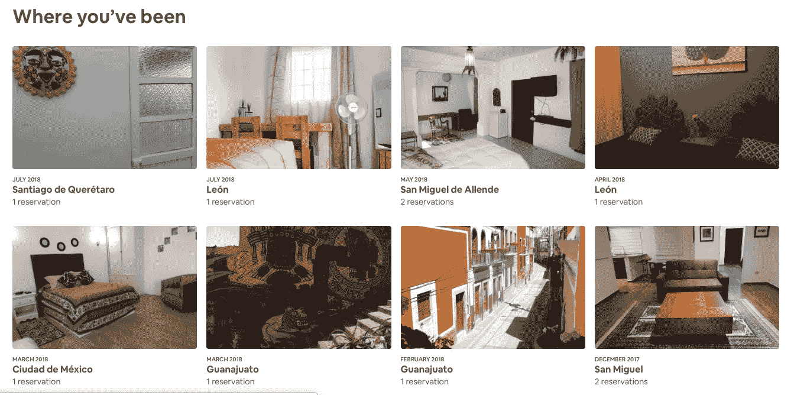
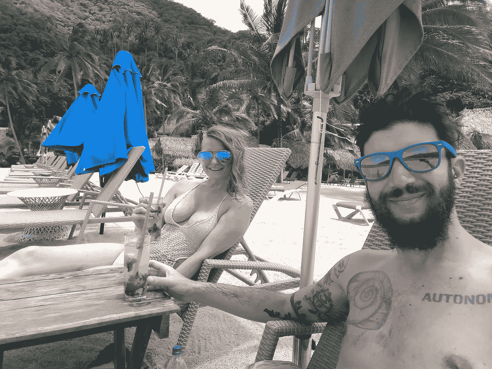
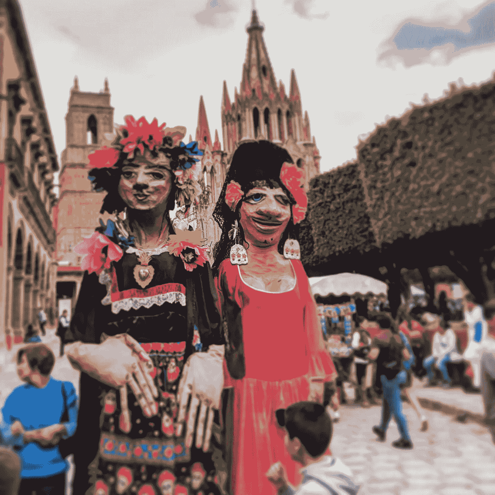
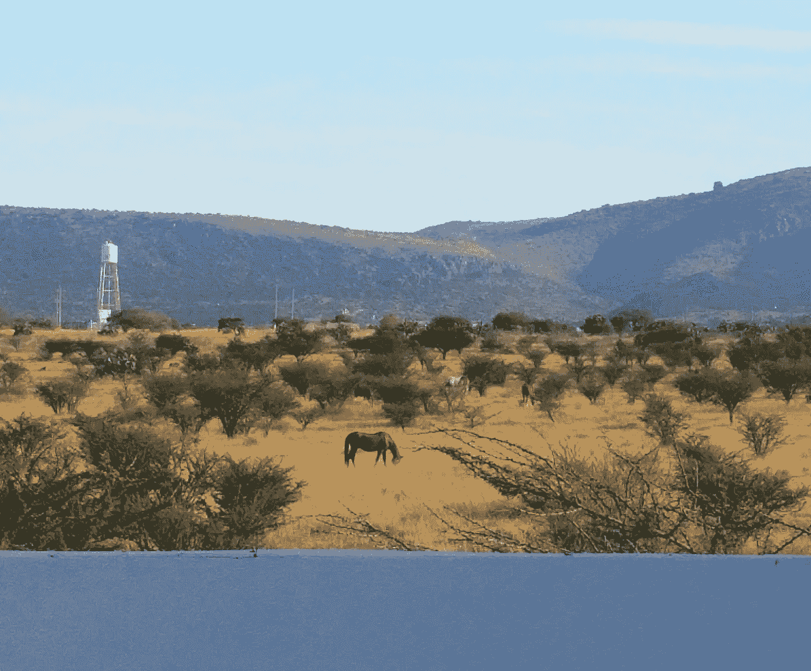
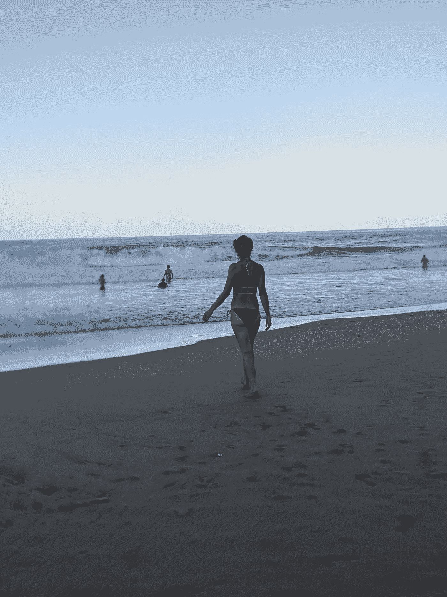

# 我在国外的 AirBnB 住了一年——太棒了，我再也不会这样了

> 原文：<https://medium.datadriveninvestor.com/i-spent-a-year-living-abroad-in-airbnbs-it-was-amazing-and-i-ll-never-do-it-again-fc942860df62?source=collection_archive---------3----------------------->

The first 6 months of AirBnB bookings last year!

# 一年多前，我和妻子开始了我们的巡回演出。

我得到了一份完全远程的工作，我在其他文章中已经讨论过了，她有一些网上的生意，我们去做了！

我们决定从墨西哥出发。不远，也不贵，我们都很喜欢在那里的几次旅行，其中包括我们在耶拉帕的蜜月，那是巴亚尔塔港附近太平洋海岸的一个小渔村。

Falling in Love with Central America on our honeymoon in Yelapa

**我们被激励着去实现我们的梦想。** *但是说真的，这么做有几件很可怕的事情:*

1.我们俩都不太会说西班牙语。在经历了最初的艰难寻找后，我放弃了我们在奥克兰的公寓。

对于第二件事，除了永不回头之外，没有别的办法了。(*我们还没有！*)

首先，我们决定从圣米格尔·德·阿连德开始，这是一个美丽的古镇，有大量的外籍人口和很多说英语的人。

Big weird amazing puppets in San Migues de Allende

**另一个主要压力是为我的工作找一个网速足够快的房子，这需要 20 MBPS 或更高的网速。**

**幸运的是，**[**AirBnB**](https://www.airbnb.com/c/awhite37?currency=USD)**让这部分变得相当简单！**

在与我们的主人来回交涉后，我确保她明白，如果我们到达时她没有 20 MBPS，我肯定会失去我的工作，*和最有可能在炎热的墨西哥太阳下的教区*，我们都准备好了。

我们租了一个地方 4 个月，有一个不错的月租，我们住了下来。我们每月支付 500 美元，为此，我们得到了一个我们做梦也想不到的地方。它很宽敞，有一个惊人的观点，包括马和山脉，一个现代化的厨房，一个巨大的步入式衣柜，和一个美丽的现代浴室！我们为奥克兰一半的空间支付了 4 倍的价格。太棒了。

View from our patio and kitchen. OMG, it was so wonderful.

在我们逗留了大约 3 个月后，我们去了一个叫瓜纳华托的小镇，并立刻坠入爱河。在我们离开之前，我们预订了另一家 AirBnB，为期两个月。我们兴奋地等待着搬到新家的时间。

这个地方大约 800 美元，稍微贵一点，但是它有更大的空间，更壮观的景色，更靠近市中心，是我们想要的城市。我们在那里住了两个月，然后一个惊人的机会出现了——我们可以管理别人的 3 居室 [AirBnB](https://www.airbnb.com/c/awhite37?currency=USD) 以换取在一个美丽的地方的低租金。

金蜜蜂是一个华丽的地方，由两位杰出的艺术家设计建造。它更偏僻，我们仍然每月支付 500 美元来负责整个地方——但它是如此值得。我们有一个很棒的花园，很快的网速，充足的空间，如果你相信的话，还有更壮观的景色。

**扮演** [**主持人**](http://www.airbnb.com/r/awhite37) **是一次很棒的经历，它让我们住在我们有过的最漂亮的居住空间里！**

我们整个夏天都在做这件事，那时我们已经准备好离开这个美丽、古雅的山城。在危地马拉短暂停留，在阿蒂特兰湖看望一位朋友后(我们回来了，我现在正在湖上写这篇文章)，我们在今年的最后几个月去了哥斯达黎加。

**哥斯达黎加的生活成本比墨西哥或危地马拉高很多**，我们知道我们需要降低我们的生活空间。我们在一家 AirBnB 酒店找到了不错的月租，这家酒店位于丛林中，离壮观的海滩只有几步之遥。

我们去了人迹罕至的东加勒比海岸，那里以冲浪、美丽的丛林和美味的加勒比食物而闻名。它远远超出了我们的预期。

这个房间本身就是一种生活方式的下降——基本上是一个水泥盒子。但是花园很壮观，有很大的户外空间可以消磨时间，而且每月只需 300 美元。我们在隔壁的停车场看到了一只*树懒妈妈和她的宝宝*，还有各种各样的青蛙、猴子和其他你想在哥斯达黎加看到的奇妙生物——就在我们的花园里！海洋真是不可思议。

It was all I could do to keep from putting 900 photos of Costa Rica in this article.

# 但是如果这真的很棒，为什么我不会再做一次呢？

基本上，因为现在我们能说一口流利的西班牙语，我们知道东西的价格，也知道没有它如何找到出租的房产。我们知道如何通过与互联网服务提供商交谈来提高网速，我们知道如何找到美丽的地方住宿，而且基本上我们自己就能以更低的成本做到这一点。

但我绝对会继续使用 AirBnB 进行短期住宿，或者在长期住宿的第一个月，给自己时间去找一个好地方。便利是无与伦比的。

很难用语言来表达使用 AirBnB 在中美洲旅行一年有多棒。从长远来看，这是居住场所的最佳解决方案吗？可能不会(除非钱对你来说不是问题)。但是，即使为平台的便利支付了额外的费用，我们仍然得到了令我们困惑的交易。很高兴得知现在我们已经在地面上站稳了脚跟，我们可以用传统的方式甚至更少的钱来做这件事！

**祝你旅途愉快！**

点击[此处](https://www.airbnb.com/c/awhite37?currency=USD)在我身上，75 美元或以上的家庭预订可享受 40 美元的优惠，50 美元或以上的体验可享受 15 美元的优惠！

*如果你对职业指导、生活指导或一对一的技术指导感兴趣，请直接给我发电子邮件，地址:*[alexwhite5d@gmail.com](mailto:alexwhite5d@gmail.com)

**想了解更多关于成为数字流浪者的信息吗？** 查看我的文章，关于[这些天我如何在世界任何地方谋生](https://medium.com/datadriveninvestor/know-web-development-become-a-digital-nomad-tomorrow-c137a4666e4d?source=your_stories_page---------------------------)，旅行时使用流行的支付应用 [Paypal 和 Venmo】以及作为数字流浪者使用谷歌手机服务](https://medium.com/datadriveninvestor/venmo-vs-paypal-which-is-better-for-digital-nomads-75e75ecd1cdc)[。](https://medium.com/datadriveninvestor/what-i-learned-from-a-year-using-googles-project-fi-mobile-service-as-a-digital-nomad-8b5dd97bbebe)

我还可以一对一地指导你如何成为一名数字流浪者。给我发电子邮件，地址是[alexwhite5d@gmail.com](mailto:alexwhite5d@gmail.com)。我还为那些想重新找回自己精神世界的人，以及那些想走出自己的路并开始实现梦想的人提供生活指导。

## 喜欢这篇文章吗？

查看我迄今为止最受欢迎的帖子，关于[用投资应用 Stash、Acorns 和 Robinhood 投资两年](https://medium.com/datadriveninvestor/i-used-acorns-robinhood-and-stash-for-2-years-this-is-what-i-learned-and-earned-21baf91dda0e)。

## 想了解我的旅行吗？

在 Instagram 上查看我