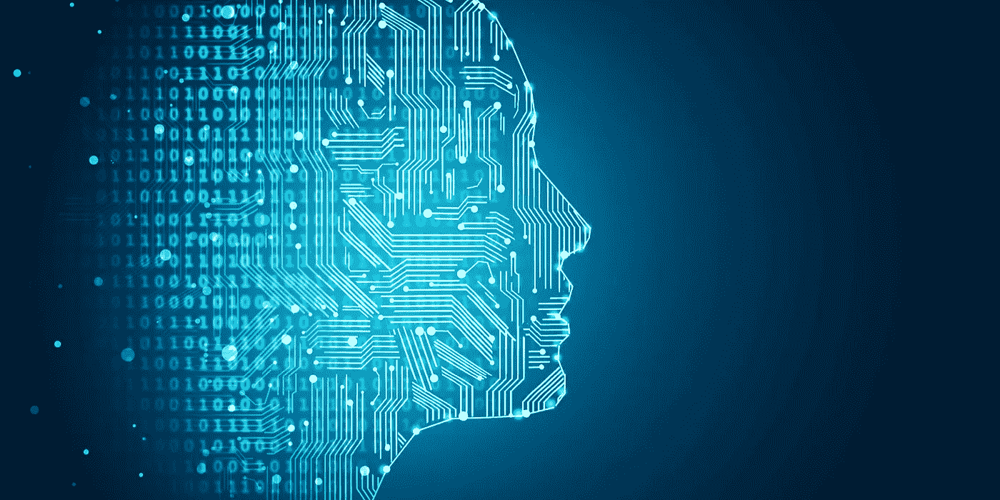

# “我思故我在”。还是我？

> 原文：<https://medium.datadriveninvestor.com/i-think-therefore-i-am-or-am-i-e81010ed0d19?source=collection_archive---------21----------------------->

总有一天，人类会发现如何将我们自己的生物智能与计算机巨大的处理能力结合起来。通过将人脑的并行处理和创造能力与计算机的速度和存储能力结合起来，这些脑机接口将开创一个意识和智能的新时代。

一旦解开使用非生物基质增加人脑能力的秘密，现在有两件事将成为可能。

我们将能够通过高清晰度扫描复制一个人的大脑，然后上传到电脑上——我们将真正能够摆脱我们自己的脑袋。

第二，我们将能够创造不受生物系统约束的人造智能。我们会创造出强大的人工智能。

这些可能性引发了一系列关于伦理和人类意识构成的问题。如果我们复制一个人的大脑，这是否意味着我们有同一个人的两个副本？或者这是一个全新的虚拟人，值得拥有自己的身份？这个复制品有意识吗？或者它仅仅是一台计算机完成了复制原始个体大脑的任务？我们怎么知道呢？

迄今为止，没有人能够成功地解释人类意识是什么，或者我们为什么会经历它背后的机制——但是我们可以做出一些明智的判断。

一个宗教人士可能会告诉你，意识的产生要归功于一个人的非物质部分，即所谓的精神。其他人会告诉你，这是人脑中尚未被发现的部分神奇地将意识灌输给我们的结果。然而，我所相信的是，意识是一个适当先进的处理机器(我们的大脑)的结果，它不断地接收和响应过多的外部刺激。在我们的例子中，我们可以得出结论，意识源于前额叶皮层，因为它在高级大脑功能中起着作用。正是这种复杂而持续的信息流以及相关的处理过程赋予了我们所谓的意识。

虽然它可能不会让你觉得我们有某种神灵赋予我们每个人的空灵，从而将人类从动物王国中分离出来，但这肯定是最简单的解释，当我们应用奥卡姆剃刀时，这似乎是最有可能的。

Rene Descartes

你可能会说，正如笛卡尔的名言，“我思故我在”。当然，你思考和凭自己的自由意志做决定的能力意味着你表现出的能力不仅仅是一台计算机的能力？很抱歉让你失望了，但情况可能不是这样。

最近的研究得出结论，当一个人面临必须做出决定时，大脑的潜意识部分会做出决定，然后在我们有意识地意识到已经做出决定之前，就开始向身体的相关部分发送信号！我们可能认为我们在控制，但我们所谓的意识实际上只是我们的大脑是高度先进的计算机的副产品，正是这种副产品帮助我们理解世界。

我们可以得出结论，上传到非生物基质上的人脑复制品实际上是有意识的，因为意识的存在取决于前额皮质的功能，而不是一个人的“精神”。

但是这种复制是新人吗？

在这一点上，我只能提供猜测，但我相信，是的，这是一个新的人。在复制完成的那一刻，它开始从一个不同于原始个体的视角来体验这个世界，这意味着它对通过感官(或我们此时已经想到的任何非生物等效物)从世界接收到的输入的解释与原始个体略有不同。这使得它开始与原来的人产生分歧，随着时间的推移，这导致进一步的分歧，因为两个大脑不再有完全相同的共享体验。这与为什么同卵双胞胎在一生中并不完全相同的想法非常相似。从第一天开始，他们每个人都有略微不同的视角，这使得他们的大脑能够彼此独立地发展——他们相似，但不相同。

另一种思考这个问题的方式是考虑你是否要复制你自己的大脑，上传它，然后立即停止存在。这个新副本还是你吗？显然不是，因为你们的意识体验已经结束，你们生命的数字副本作为一个独立的实体存在。所以不可能是你。

然而，复制我们自己的大脑仅仅是开始。通过将我们的生物智能与非生物计算机不断扩展的处理能力相结合，我们将能够以指数级的速度增加我们的智能。

这是因为我们新的机器增强智能将能够设计出更强大、更高效的计算机，然后我们可以将我们的大脑与之融合。这将允许我们创造更强大的计算机来合并等等。每一代人都比上一代人更有能力，指数趋势只会增加。

这不仅限于人类，然而，我们创造的人工智能生物也将受益于这种指数级增长的计算能力。

这种强 AI 会被认为是人类吗？或者至少是一个有生命的智慧生物？

确定这一点的困难归结于这样一个事实，即这些系统将被设计为复制人类的行为，而将真正的意识(或我们定义为意识的东西)与这种编程意识分开是一个有缺陷的过程。挑战在于，科学方法依赖于客观测量和观察，而意识是一种主观体验。我只能体验我自己的意识，只能假设我周围的每个人都在经历类似的事情，因为我没有办法证明这一点。

我们能做的唯一合乎逻辑的事情就是设计一种超越计算机说话能力的图灵测试。它需要让我们相信，它通过完成一些任务，如视觉识别物体、拥有幽默感、回答道德上模棱两可的问题、了解它的环境以及它如何融入世界等，拥有类似人类的体验。虽然并不完美，但这些测试将允许我们判断这个非生物大脑是否有意识。然而，即使它通过复制我们预期的结果来愚弄我们，让我们相信它是有意识的，这本身肯定是一个迹象，表明它能够展示足够水平的人类行为，并且它可以被归类为这样？

很难知道。

目前对生物学在意识中所扮演的角色缺乏理解，这也将是做出这种决定的一个重要因素。

Humans will one day be able to upload information directly to their brains.

想象一下人类用这样的智力将能完成什么。我们将能够做一些事情，比如把人类的全部共享知识上传到我们的大脑。这将看到世界各地人民的生活质量提高，并允许以惊人的速度发现和分享信息的全球共享意识。我们将解开宇宙的秘密，创造出远远超出我们目前所能理解的艺术，并最终保护人类。

随着人类技术进步不可避免地向前迈进，计算能力有一天将会强大到足以模拟人类大脑大约 100 万亿个神经元连接的功能。鉴于每美元的计算能力大约每四年增加十倍，有理由得出结论，我们将在 21 世纪 20 年代初的某个时候拥有制造这种机器的硬件。毫无疑问，该软件将在此后的某个时候推出。

这将标志着人类历史上的一个关键时刻，它将永远改变我们对意识和智力的看法。

科幻会变成科学事实。