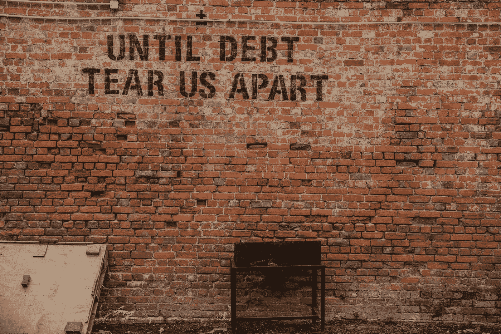
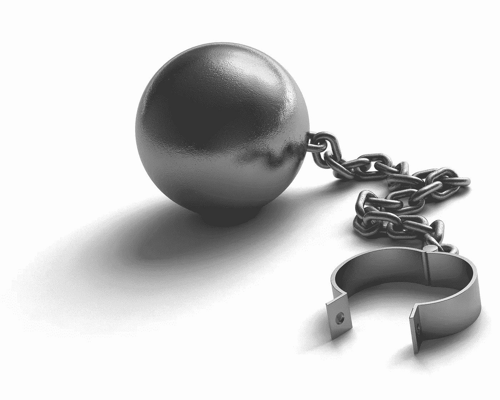

# 我仔细看了看我的财务状况

> 原文：<https://medium.datadriveninvestor.com/i-took-a-hard-look-at-my-financial-picture-1ac9d33e4643?source=collection_archive---------10----------------------->

Photo by [Alice Pasqual](https://unsplash.com/@stri_khedonia?utm_source=unsplash&utm_medium=referral&utm_content=creditCopyText) on [Unsplash](https://unsplash.com/search/photos/in-the-red-finances?utm_source=unsplash&utm_medium=referral&utm_content=creditCopyText)

而且不喜欢。

我看到了习惯。冲动。期望。跟上琼斯一家。缺乏纪律性。不存在的跟踪。我活着就是为了今天，并通过买彩票来等待奇迹。给孩子们我从未有过的东西——住在拉拉邦。

你的借口是什么？

 [## 更好地制定预算，打造更大的数据驱动型投资者

### 即使是专家也承认它们并不完美。从 1 到 10 的范围内，安东尼·科普曼和德尔…

www.datadriveninvestor.com](https://www.datadriveninvestor.com/2018/11/08/budget-better-to-build-bigger/) 

生活中总会有这样一个时刻，我们都需要长时间认真审视自己的财务状况。我的工作是在一次身体疾病后开始的，我们意识到没有我的收入，我们不得不动用我们的退休金。不过，看一眼并不意味着采取行动。恐惧来了，但没有改变。

我的第二次审视是在我被我工作中的管理行为弄得心烦意乱以至于想要辞职之后。还是那句话，一个眼神而不是改变。我开始寻找另一份工作。

我第三次有机会做一些事情是因为一个朋友说，

> 你有没有意识到，每次你把钱花在你不需要的东西上，你都在强迫自己留在那份工作上，那里的人对你非常不好。

这引起了我的注意。

我有几个理由想还清我的债务。直到有人向我解释了我的情况，我才终于听到了，这让我足够好奇，花时间记录我真正欠了什么，以及我需要多长时间才能摆脱债务。

*   什么会引起你的注意？

> “每天都是银行账户，时间就是我们的货币。没有富人，也没有穷人，我们每个人都有 24 小时。”—克里斯托弗·赖斯

*   当你买下那个“东西”的时候，你就多了一个小时和那些你认为让你发疯的人一起工作。
*   当你现在买了那个东西，把它放在信用卡上，并加上利息，这意味着你可能在不久的将来不能去旅行或拜访那个人。

> “如果你不想下一个十年像上一个十年一样，那么现在是时候做一些不同的事情了。”达伦·哈代

## 兴趣。

你有没有看看你每个月要付多少利息？如果你没有兴趣，想想你能多快还清债务或者把多余的存起来。想想你可以用现金购买什么。想想你能买到的东西的质量，而不是便宜的，我敢说你现在买的东西很便宜。

在一个先进的无纸化社会中，我认为我们忘记了时间的实际价值以及它如何转化为我们所购买的东西。如果你必须用工作时间换取一双可爱的凉鞋、耳环或巨无霸，你会吗？

我一直认为，如果我们能够决定如何使用我们的税款——如果我们能够从我们挣得税款的时间开始一美元一美元地追踪，直到它被用于项目、供应和浪费——政府将会被改变，因为人民不允许这样做。

对我的财务状况的了解让我思考这些事情，尤其是当我税后所剩无几的时候。

> "许愿和计划需要同样多的精力。"—埃莉诺·罗斯福

> 总有一天。我将买下湖边的小木屋。总有一天。我会去阿拉斯加旅行。总有一天。我会去挪威看峡湾。总有一天。我将站在我祖母成长的小镇的土地上。
> 
> 要是我有更多的时间参加家庭活动，去拜访那个人，去旅行就好了……但是我工作的单位并没有给我那么多假期，我也不能没有带薪休假。
> 
> 当我赢了彩票，我要…

# 你和我都是我们决定的囚徒，而我们似乎并不知道。

> “煮青蛙是一个寓言，描述一只青蛙被慢慢煮活。前提是，如果一只青蛙突然被放入沸水中，它会跳出来，但如果青蛙被放入温水中，然后慢慢煮沸，它不会察觉到危险，会被煮死。这个故事经常被用来比喻人们没有能力或不愿意对逐渐而不是突然出现的险恶威胁做出反应或意识到这一点。”[https://en.wikipedia.org/wiki/Boiling_frog](https://en.wikipedia.org/wiki/Boiling_frog)

## 支出超过收入最终会成为一种险恶的威胁。

# 我的生活感觉像是被奴役的生活，因为我有账单要付，所以不能辞职。

为什么我们要和我们不想在一起的人呆在一起？因为我们已经积累了足够的债务，所以我们没有自由，必须忍受那些我们以后都不会接受的事情。

# 习惯——我想要“它”，并且已经用现金或信用卡购买了它，忘记了这个选择会对我的未来产生什么影响。

Image by skeeze [https://pixabay.com/users/skeeze-272447/](https://pixabay.com/users/skeeze-272447/?utm_source=link-attribution&amp;utm_medium=referral&amp;utm_campaign=image&amp;utm_content=2624325)

# 我的朋友问我——“你为什么买那个生日礼物？他们可以自己购买。”想一想——我们的信念可能会成为我们的脚镣。

我的儿子们在六月过生日。我总是给他们买生日礼物。社会说我们大张旗鼓庆祝生日。我喜欢庆祝的场合。只工作不玩耍，聪明的孩子也变傻，对吗？

因此，我大幅削减了本该购买的东西，并认为我应该为自己的选择感到欣慰。我的朋友说:“给他们寄张卡片，告诉他们你爱他们，但是今年你将会把所有的钱都用来还债。他们会理解的。”

我不喜欢听到这些。

她继续说道。“有多少次，你只是为了给他们买东西而不是等着攒钱买他们真正喜欢的东西？”

# “你这么做是为了让自己感觉更好。”

上周末我去参加了一个研讨会。一个已经旅行了一段时间并且没有太多休息时间的演讲者说，“有时候我想要的只是一袋饼干和网飞。”在我们午休的时候，我出去给他和他的支持人员买了一袋饼干。他们需要吗？不。他们要求的吗？不。如果他们没有得到它，他们会受伤吗？不。我为什么要买它？因为为别人做点好事让我感觉很好。

朋友说:“所以你这么做是为了让自己好受一点。”我不得不考虑一下。我以为我这样做是为了鼓舞他们的精神。谁从中获益最大？可能是我。

该死的。为什么她总是对的？

现在我要考虑买什么，为什么买。我购买那个“东西”是否让我更接近我的目标，即在我想做的时候有做我想做的事情的自由？

我能推迟购买吗？

是需要还是想要？

这些都是要问我们自己的事情，如果我们感到停滞不前，如果我们想从我们的生活中得到更多，或者如果我们深陷债务和为“男人”工作。

> “不要告诉我你的优先事项在哪里。告诉我你把钱花在哪里，我就告诉你是什么。”詹姆斯·弗里克

达伦·哈迪是纪律、一致性和使用跟踪作为你的盟友的大师。我们都知道我们应该做什么，但我们大多数人不采取行动。

> "知识会使你充实，但只有行动才能把它变成财富。"达伦·哈代

写下所有“不必要”的账单，比如信用卡和贷款。

起草一份分期偿还计划——网上有很多免费的。

当你看到你每个月所花的利息时，你会恍然大悟，你开始明白还有多久才能还清。

没有踢自己的感觉。先拿出预算和还清最高利率的方案就行了。

这并不容易。你必须对自己严格要求。质疑你购物的动机。

收回你内心的平静。

只要你肯为自由做打算，自由就在眼前。