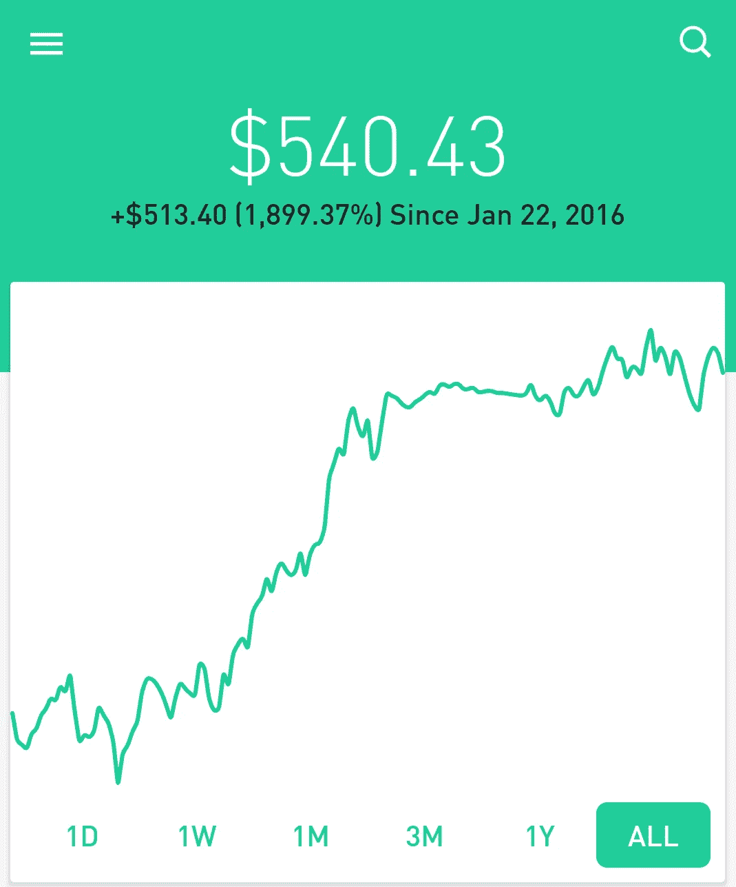
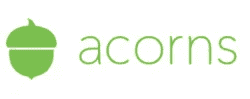
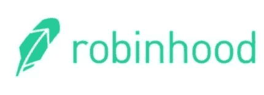
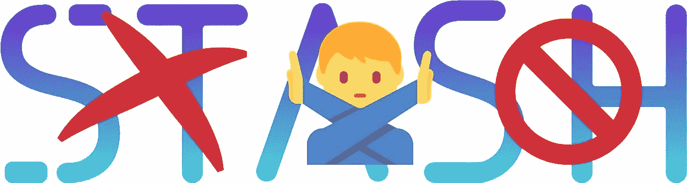

# 我用了橡子，罗宾汉，藏了两年。这是我学到的，赚到的。

> 原文：<https://medium.datadriveninvestor.com/i-used-acorns-robinhood-and-stash-for-2-years-this-is-what-i-learned-and-earned-21baf91dda0e?source=collection_archive---------0----------------------->

I picked some good ones on Robinhood! But this could have looked a lot differently…

在过去的两年里，我一直用 Stash，Acorns 和 Robinhood 来投资。我计划继续把这三者作为我储蓄策略的一部分。但是我发现每一种都有利弊，对某些人来说可能比其他人更好！我没有很多钱可以投资，但是我做我能做的。这些工具是一次很好的学习经历，真的不仅帮助我省钱，还让我在金钱和储蓄方面有了更好的心态。

这篇文章回顾了每个平台的优缺点，并解释了为什么我放弃了一个平台而选择了另外两个。在底部，你可以看到三个平台的对比，包括我自己在每个平台上的投资回报。

# 橡子

Acorns 是我开始使用的第一个应用程序。我喜欢“综述”的想法，即当你在与你的 Acorns 账户关联的借记卡上购物时，它会为你投资！它没有把多余的零钱存在罐子里，而是进入了一个有利息的账户。

除了 roundups，您还可以随时存款或取款，并安排定期自动存款。一旦我走上讲台，对这些综述的新鲜感就有点消失了。设立自动存款也无妨。但是，对于那些想存钱，但支票账户上并不总是有很多钱的人来说，这些综述是很棒的。

Acorns 将你的钱投资到一种特定的基金中。具体来说，您的投资通过其合作伙伴 Vanguard 分布在六个交易所交易基金中。使用这六个基金，你的投资分布在 7000 多只股票上。所以你可以确定你的投资是多样化和稳健的。

**app**本身就很美。它使用起来非常直观，我不记得有哪一次找不到我需要的东西。

**一句话:一款出色的应用，良好的投资回报。最适合想要省钱的初学者。写这篇文章两年后，Acorns 成了我最喜欢的三个。**

*注:Acorns 现在提供两项新服务，一项是为退休储蓄，名为 Acorns Later，另一项名为 Acorns Spend，这是一种与他们的其他服务集成在一起的借记卡。Thes:他的评论不包括这一点，但只有他们的核心产品，这是为更多的中期储蓄而设计的。*

使用我的邀请链接获得 5 美元:[https://acorns.com/invite/QMMYSU](https://acorns.com/invite/QMMYSU)

# 罗宾汉

Robinhood 与其他两个不同，因为它不处理多样化的投资组合，而是处理单个股票(以及最近的加密货币)。

这意味着更高的学习曲线、更高的风险和更高的潜在回报。通过使用 Robinhood，我学到了很多关于投资的知识，就我个人而言，我喜欢交易单只股票所需的额外关注。我通常只买科技公司的股票，因为这是我工作的领域，也是我最了解的领域。我也根据可靠来源的提示买了一些股票。

这是我唯一一个真正赚钱的平台，但也是唯一一个有希望获得超过一位数回报的平台。随之而来的是更大的风险。我选择了一些好的股票，做得很好，但是我也很容易失去大部分投资。

这项服务的一个好处是它是免费增值的，所以除了监管机构要求的费用之外没有其他费用！

**app**本身就很漂亮，很精致，很直观。

**一句话:如果你想要交易单只股票的刺激、风险和潜在回报，这是一个很棒的应用。这是最大的学习曲线，所以对于想要参与其中的人来说是最好的，而不是建立一些东西然后忘记它。**

加入罗宾汉，我们都将免费获得一只苹果、福特或脸书这样的股票。用我的链接报名:【invite.robinhood.com/katherw403 

# 隐藏—不要使用

编辑:不幸的是，在过去的一年半里，我在 Stash 上遇到了巨大的问题，无法再推荐他们的服务。事情是这样的。

一年多前，我关闭了与 Stash 关联的银行账户，并开设了另一个账户。从那以后，我就再也拿不到一分钱了。我试着开了两个银行账户，主要目的是用它来连接 Stash，这样我就可以取回资金。两者都产生了类似“对不起，这个路由号码不被接受”这样的神秘错误

当我抱怨停止客户服务时，几个月来，我在人与人之间传递，没有人能够或有兴趣帮助我。我想要的只是我存在银行里的钱，或者至少是一个解释，为什么我的银行账户不被接受。我想知道他们选择接受或不接受银行的标准，这样我就不会开第三个银行账户，也不会有第三个银行账户。

这些我都没有。

此外，我一再要求与经理联系，但都被忽视了。我不确定这是否合法。我通常被视为一个抱怨者和问题，而不是像一个客户投资了数千美元到他们的应用程序，并委托他们管理我的钱。

在我写这篇文章的时候，一年多的时间里，我收到了几十封电子邮件，但我仍然无法拿到我的钱。这无疑花了我几百美元，因为几个月前当经济强劲时，我本可以兑现，我真的可以使用这些现金。

这整件事让我觉得我的钱被一家公司扣为人质，而这家公司根本不在乎这件事对我生活的影响。

不要使用 STASH。

我将从这里删除我的推广代码，即使这意味着我可能会从使用它的人那里损失一些钱。凭良心说，我绝对不能建议任何人使用这项服务。

相比之下，Robinhood 和 Acorns 各自的客户服务都非常出色，我在使用我的资金时没有遇到任何问题，尽管我在使用这些应用时遇到了同样的情况，我不得不更换银行。

我将把旧的评论留在下面，这样人们仍然可以了解它与其他应用程序相比是如何工作的。

编辑:我最终确实取出了我的钱，不再使用这项服务。

以下是我对 Stash 的原创评论:

Stash 类似于 Acorns，因为它允许你轻松地投资于非常多样化的股票投资组合和公司管理的 ETF。最大的区别是，用户可以从越来越多的定制投资组合中进行选择，而不是像 Acorns 那样只有一种产品，这些投资组合是按行业和原因分组的。

我非常喜欢这种灵活性。你可以根据你认为可能会获得巨大收益的行业选择定制投资组合，比如“互联网巨头”或“数据卫士”，并投资那些支持你所关心的事业的公司，比如“碳减排”和“平等工作”。有些两者兼而有之，比如“公司大麻”

我相信用我的钱投票。当我意识到通过 Acorns 投资，我正在支持一些我在意识形态上不希望支持的公司，而通过 Stash，我实际上可以投资于我相信的东西时，我很难被吸引到后者。

这是一个权衡。Acorns 应用程序更简单，因为它把所有东西都投资到自己的投资组合中。Stash 需要多一点时间和精力来决定你想投资什么。正因如此，有可能基于糟糕的选股获得更差的回报，这是我经历过的事情！但由于付出了额外的努力，我还通过使用这个应用程序学到了比使用 Acorns 更多的投资知识，在 Acorns 上，学习曲线几乎不存在。

是的，我在过去的两年里损失了钱。然而，公平地说，Stash 是为长期“买入并持有”而设计的。长期来看，市场波动应该是均衡的，即使投资组合中最差的选择也会给你带来总体净收益。

**app**本身挺好的。它不像橡子那么完美，但是能够挑选你的投资组合增加了相当多的复杂性！这个应用程序中有很多内容，他们组织得非常好。

**一句话:一个伟大的应用程序，让你自由地最大化你的投资——或者像我一样通过做出糟糕的选择来最小化你的投资！最适合那些想学习如何在没有太多风险的情况下进行投资的人，或者那些想投资于那些在他们热衷的事业上做得不错的公司的人。**

*注:Stash 还涉足了退休储蓄业务，以及更传统的银行业务，包括一张正在筹备中的借记卡。这项审查只包括他们的首次公开募股，他们的投资服务。*

提醒:我在他们拿我的钱做人质之前写了上面的评论，并拒绝回答我的问题或让我与一位经理联系。作为客户，与这家公司打交道可能是我经历过的最糟糕的经历，我曾经是康卡斯特的客户，所以这很说明问题。远离这家公司。

# **并排对比**

## 如何投资:

Acorns:取整、存款、自动循环存款

存储:存款，自动循环存款

罗宾汉:从你的银行账户里存钱，并用余额购买股票。

## 您投资的内容:

橡子:ETF 由超过 7k 的股票组成

隐藏:挑选你自己的定制投资组合

罗宾汉:个股

## 最低初始存款:

橡子:5 美元，免费链接:[https://acorns.com/invite/QMMYSU](https://acorns.com/invite/QMMYSU)

藏匿:5 美元

Robinhood: $0，注册我的链接，获得免费股票:

[invite.robinhood.com/katherw403](https://invite.robinhood.com/katherw403)

## 我个人的投资回报，以及过去两年的市场和现金比较:

市场:3.66%

现金:5.4%

橡子:2.32%😊

Stash: -5.51%

Robinhood: 1,900.1%!!! 🤑

## My Rating for the App Itself:

Acorns: 10/10

Stash: 8/10

Robinhood: 10/10

## Other features:

Acorns: “Found money” feature where when you shop at certain retailers, those retailers will give you a discount and the difference gets invested in your Acorns account.

Stash: Same deal as above, just with a different name and different partners.

Robinhood: Some perks available to premium members. Also, Robinhood allows investment in Crypto, which is pretty cool. (Now is either the best time in a while to buy, or a terrible time depending on your perspective.)

# Summary

**Robinhood** 最适合那些想学习，想冒更大风险，希望更大回报的人。这是我个人最喜欢的，我想这将是我最喜欢的，即使我在这方面做得不太好。我真的很喜欢学习和交易单只股票。

橡子最适合那些只想建立一些东西来省钱，而不去想太多的人。

藏匿点位于两者之间。所有这些都是很棒的应用程序和省钱的好工具。如果我今天必须删除其中一个，我会删除 Stash，但我会很难过，因为我喜欢用我的美元投票，他们让这变得非常容易。但最终，它是表现最差的，这些是省钱的工具，而不是送钱！

**免责声明:**如果你点击这些链接并注册，我会受益匪浅。但除此之外，我与这些品牌没有任何关系。我个人从不推广任何我不使用和受益的东西。

**今天就开始用橡子投资吧！**使用我的邀请链接获得 5 美元:[https://acorns.com/invite/QMMYSU](https://acorns.com/invite/QMMYSU)

加入罗宾汉，我们都将免费获得一只苹果、福特或脸书的股票。用我的链接报名:[invite.robinhood.com/katherw403](https://invite.robinhood.com/katherw403)

嘿！我的名字是亚历克斯·怀特，我写关于自我转变和奇怪而有趣的话题！偶尔我会回顾一下我用过并喜欢的产品和服务。

**我的最新帖子回顾了我拥有过的最便宜也是最好的支票账户——尤其是作为一个喜欢旅行的人。查看** [**这里**](https://medium.com/@awhit012/cheap-n26-offers-mobile-banking-i-3ec5c237c020) **！**