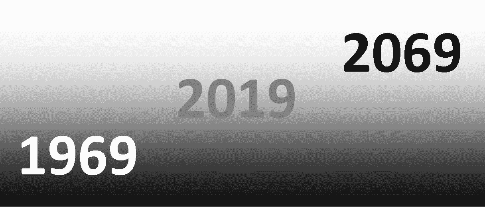

# 我清楚地记得 1969 年

> 原文：<https://medium.datadriveninvestor.com/i-vividly-remember-1969-8a6f68f098fb?source=collection_archive---------30----------------------->

***《未来有伟大的过去》****(***)**

*1969 年，我 18 岁，还在波兰格但斯克读高中。因为未来就在我面前，我清楚地记得对未来 20 年、30 年或 50 年的预测。这些预测大多没有实现。*

***健康***

*当展望 2069 年时，我很可能看不到了，让我注意到，在 1969 年，我活到 2069 年的可能性被预测为比今天大得多。第一例心脏移植是在 1967 年，尽管病人在 18 天后死亡，但人们乐观地认为这只是医学上许多革命性发展中的一个。据推测，在未来的 30 或 50 年内，医学将会发展到许多人可以活到 150 岁的程度，这被认为是生理极限。就在最近，我看到一个广告牌宣传退休储蓄计划，上面写着第一个能活到 150 岁的人已经出生了。我怀疑这个口号的作者想的是我这个年龄的人。但我在 1969 年左右就已经听说过了。*

*我当时很认真地对待它，并且在我生命的大部分时间里，过着相对健康的生活方式，给自己一个长寿的机会。我现在看到了它的好处，我感激先进的医学如何帮助我治疗 50 年前可能危及生命的疾病。但是，即使是我最乐观的医生也不会给我太多机会活过 100 岁，这也是前几代人的极限。但是那时，和今天一样，许多人死得更早，通常是因为缺乏健康的生活方式。有句话叫银行家借钱给已经有钱的人。它也适用于先进的医学，可以帮助一个人活得更长更健康，但主要是对那些已经照顾自己的人。1969 年是这样，现在也是这样，我怀疑 2069 年会有所不同。*

***技术***

*我上了一所技术高中，除了为大学做准备之外，它还为我成为一名广播电视修理工做了准备。我们是最后一年学习基于真空管的电子学基础；跟随我们的班级在晶体管上学习它。在走廊上，有一块板子，上面贴着学校从技术杂志上剪下的图片。我记得当我们读到每个月放入一个电子芯片的晶体管数量都在疯狂增加时，我们都很兴奋。很明显，有重要的事情要发生了。*

*人们普遍认为计算机会改变我们周围的一切。在对结果的众多猜测中，可能有声音预测了会发生什么，但我不记得有人预测过智能手机。例如，关于机器人扩张的猜测应验了，尽管事实上它们看起来与许多人预测的不同。我记得我的一位大学教授在 1973 年向我们概述了全球通信系统，也就是我们现在所知的互联网。我当时问，我们将如何相互联系。“通过电话线，”他回答。那时，我的家人已经为安装电话线等了六年；因此，我认为在其他地方可能是可能的，但在波兰不太可能。我家终于在 1987 年安装了电话。最重要的是，社会主义的统治在 1989 年崩溃了，正好赶上波兰加入互联网扩张，没有任何重大延误。*

*展望 2069 年，我们可以期待连接我们的设备将变得更小、更智能、更便宜。将会有许多难以预料的令人惊讶的变化，许多难以想象的新应用，但是它的概念将不会比现在有太大的不同。*

*1969 年 2 月，[波音 747](https://en.wikipedia.org/wiki/Boeing_747) 进行了它的第一次飞行；一个月后，超音速[协和式](https://en.wikipedia.org/wiki/Concorde)问世。难怪未来主义者会幻想 20 年、30 年或 50 年后的旅行会有多神奇。飞行汽车没有实现，但现在我们可能更接近拥有它们，至少到 2069 年。尽管有许多改进，我们大多数人仍然像 50 年前一样驾驶内燃机汽车。但最近的发展表明，到 2069 年，如果我们像现在这样使用汽车，我们大多数人都将驾驶电动汽车。*

*最后一架波音 747 仍在服役。协和式飞机只生产了 14 架商用飞机，因为美国政治家们确信飞机达到音速时产生的音爆对人是危险的。由于无法进入美国市场，协和式飞机于 2003 年退役。现在，当美国制造商正在研制他们自己的超音速飞机时，他们让政客们相信美国制造的飞机引起的噪音不会太糟糕；因此，我们可能很快就会有超音速旅行，可能在 2069 年之前。*

*苏联在 1957 年发射了第一颗[卫星](https://en.wikipedia.org/wiki/Sputnik_1)后，太空竞赛开始了。1969 年 7 月 21 日，美国人凭借[登月](https://en.wikipedia.org/wiki/Apollo_11)获得了该奖项。我记得我们在电视机前坐了几个小时，因为着陆被推迟了几次。顺便说一句，我们能看到它多亏了卫星电视传输，这在 1963 年首次成为可能。从那时起，数百颗通信卫星已经环绕地球运行，并且很可能在 2069 年也将如此。*

*登上月球后，显然可以期待太空探索会加速。人们可以几乎肯定地读到火星上的殖民地，如果不是 20 或 30 个，那么肯定是 50 年后。时至今日，仍有很多人在谈论它。但是，人类登陆火星的可能性现在更加现实了。2069 年我们可能会有一个殖民地。*

***生活方式***

*1969 年，着迷于技术进步的未来主义者预测，再过几十年，我们大多数人就只能做兼职，赚足够的钱来享受生活和探索我们的其他兴趣。我记得人们会在闲暇时学习拉小提琴并以此为乐。*

*这种预测没有考虑到人性。如果人们在接下来的 20 年或 30 年里接受 1969 年的生活水平，他们可能会有能力从事兼职工作，并有一个创造性的爱好。但是他们想要有空调的更大的房子，有不止一个浴室和不止一台电视。他们也想要最令人印象深刻的汽车。他们不太想做饭，喜欢外出就餐。因此，我们大多数人比 1969 年工作更努力，娱乐和爱好的时间更少了。随着大多数家庭变得越来越小，我们可能会面临这样一个时刻:我们中的大多数人可能会决定拥有理论上我们买不起的大房子，但大到足以满足基本舒适的需求。我们可能会根据自己的需求选择汽车，而不是为了给别人留下深刻印象。我看到了这种想法越来越流行的迹象；到 2069 年，这可能会成为主流趋势。*

*自 19 世纪工业革命以来，技术进步改变了人的典型寿命。过去，无论一个年轻人在年轻时学到什么，都足以让他一生成功。大约在 20 世纪 60 年代末，我们开始意识到，对于生活在发达国家的大多数人来说，技术进步的步伐需要不断的重大调整。我们需要改变职业，学习新技能，重新定位并适应我们周围快速变化的世界。*

*阿尔文·托夫勒于 1970 年出版的《未来的冲击》是当时最受欢迎的书。我在 1973 年读过它的波兰译本。令人惊讶的是，我并没有感到震惊。多年来，我的高中老师和大学教授一直在向我们灌输，无论我们在学校里学到什么样的技术应用，到我们毕业的那一天，都很可能会过时。我们的责任是学习基础知识，培养解决问题的技能。我们被告知，物理规则不会改变，抽象思维需要数学，有了逻辑分析面前问题的能力，我们就能做好准备应对未来可能带给我们的一切。*

*我修理了我们家的电视两次，但是没有一次修好。我相信我已经为生活在这个不断变化的世界做好了准备。但是，请不要认为这是半个世纪前在波兰长大的所有年轻人的普遍现象。为了被技术学校录取，我需要在数学方面比大多数人都强。简而言之，这对大多数人来说是一个障碍。多亏了我的父亲，他强迫我学好数学，我上了精英学校。*

*我详细阐述这个主题，因为当我们试图猜测 2069 年可能是什么样子时，这仍然是关键问题。无论我们做什么都是一样的。美国社会今天所经历的大部分问题都与美国人无法适应快速变化的技术、经济和社会环境有关。美国人试图回到过去的美好时光，而不是在工厂关闭、新建筑或缺乏建筑中寻找新的机会。与其害怕未来，美国人也许更明智的做法是接触“未来冲击”来塑造它。2069 年不会回到 20 世纪 50 年代。*

***政治***

*让我们回顾一下 1969 年，就能意识到猜测 2069 年之前可能发生的事情是多么冒险。但是知道发生了什么，我们可以推测一些可能性。*

*1969 年，波兰是一个社会主义国家，处于苏联的统治之下。在私下的交谈中，我经常听到许多对社会主义极为贬损的观点。偶尔，我听说社会主义本身并不坏，但它的苏联版本才是。显然，官方宣传告诉我们，我们生活在最好的政治体系中。1969 年，我被混杂的信息弄糊涂了，决定研究这个案件，弄清真相。我读了很多书，并报名参加了马列主义夜大学为期四个学期的哲学和社会学学习。第三学期结束时，恰逢 1970 年 12 月[格但斯克血腥的劳工暴动。1971 年 1 月重新开课时，我意识到这所夜大学的主要目的是对有志于担任中层管理职务的人进行强制性的政治灌输。大约一半的学生是来自格但斯克造船厂的年轻工程师，那里的工人刚刚在一次和平的政治示威中被杀害。10 年后，这家造船厂创办了“团结”号。](https://nvdatabase.swarthmore.edu/content/polish-shipyard-workers-initiate-regime-change-1970-71)*

*这些年轻的工程师不怕质问党的官员。我们进行了坦诚的辩论。正是在这些时刻，我意识到社会主义，无论其版本如何，在任何地方都行不通。我提出这个问题，是因为今天对世界各地的许多年轻人来说，社会主义再次成为一个有吸引力的命题。当问及未来几十年可能会发生什么，以及某个国家在 2069 年可能会如何收场时，我们必须问一问今天的政治温度。越倾向于社会主义，这个国家的经济实力和政治意义就越有可能减弱。*

*特别是在 20 世纪 70 年代，我密切观察了波兰不断加深的危机，并能够看到与苏联进程的一些相似之处。这使我得出结论，苏联的解体是不可避免的。1980 年，我写了一本书(只有波兰语版本),推测可能发生的情况以及波兰人应该如何应对。我的书的一些书评人直截了当地告诉我，我疯了；有些人只是翻了翻白眼。没有一个主要的政治科学家预见到苏联的解体。从他们的角度来看，我预见到了这一点，但在我最疯狂的想法中，我也没有想到它会发生得这么快。*

*大约 50 年前，我读过一本书，把中国描绘成一个沉睡的巨人。1969 年，没有人能预测 20 年后中国会醒来。中国领导人通过在形式上坚持社会主义的一些理念来处理这一问题，但他们应用了许多自由市场经济机制来振兴经济，并巧妙地参考了中国古代的孔子传统来支持这一转变。到目前为止，它一直在工作。我不敢推测这种惊人的增长能持续多久。中国成为领先的科技强国之一，并且很有可能在 2069 年保持其实力。*

*当今不稳定的政治让我们担心美国在 2069 年的地位。我们可能会认为，美国仍将是一个主要的经济和军事强国，但其压倒性的主导地位将不复存在。*

*最后，对于所有希望生活在 2069 年的人，请做好准备，它会比你想象的更快到来。*