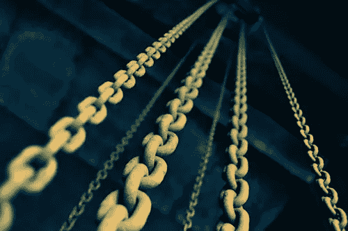

# 我想要一个秘密国家，你呢？

> 原文：<https://medium.datadriveninvestor.com/i-want-a-crypto-country-do-you-5a1adcfe6264?source=collection_archive---------44----------------------->

不变性和消除假新闻和谎言的能力。

利用区块链记录每一个政治动作、政策和话语将会彻底改变我们所知的政府。

By Fré Sonneveld

我研究了加密世界将近两年，学习了使用 Solidity 和 Java 编写代码，投资了 ico 和成熟的加密公司，我觉得我对加密和区块链有了一些了解。

我们需要区块链立即入侵各地的政治舞台！

整个演讲被记录为交易，立法者之间的互动被数字化地永久保存，协议被铭刻在永久的记忆中；这场革命可能会摧毁双重对话。

***对于一个公众代表来说，这个世界上有没有什么事情是应该是私人的，不应该被任何人永远看到的？【T6 号】地狱来了***

所有的投票都应该使用区块链协议来保留。抗议和计票问题将会消失。

那些油嘴滑舌的政客们否认他们说过或说过他们不知道的话，他们的荒唐言论很容易因为缺乏真实性而被嘲笑。标准可能会上升到前所未闻或前所未见的水平。

这可能是一个宏伟的愿景，近乎疯狂的乌托邦式的疯狂。当前的人类动物，政治中如此普遍的贪婪精神可能永远不会朝着如此沉重的责任迈出一步。

## 想象一个迈向真正正念的世界。

By Donald Giannatti

区块链可以铺平这条道路，我不得不相信它正在发生。

一个所有人都能接触到的现实。一个任何时候都有真实事实的现实。让这个世界从不可靠和腐败的报道中被清除。

我希望这种现实尽快实现。我现在就要。

我认为，加密货币是一个很好的起点，我们已经看到区块链已经开始记录投票，但它需要被普遍接受并成为强制性的。

***世界必须以更快的速度接受这种变化。***

我希望我所有的信用卡公司也采用区块链。现在，想想这对试图闯入你账户的黑客会造成多大的困难。

By rawpixel

最近有新闻报道称，大型信贷和银行公司正在朝这个方向发展，但我认为它们的速度太慢了。

旧的财富体系将不得不转向经济和信息信任的新视野，这是在扩大情报的集体战线上建立的一个新的视角，这是以前从未想到过的。

变革必须持续下去，新的先锋将会胜出，尽管旧势力将会抗争和抵制，同时不情愿地接受他们认为是暂时趋势的东西。

区块链正在成为所有金融事物的基础设施，然后有望成为政府以及无数其他事物的基础设施。

我希望民选代表、媒体和政府从小到大真正负起责任，区块链有能力也有一天会做到这一点。

## 我现在就要，我要我们所有人都要！