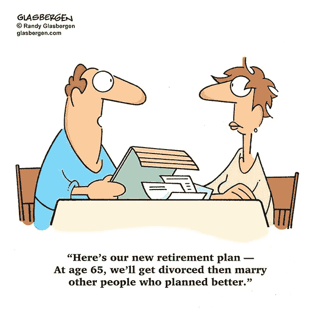

# “我希望我存的少一点”……从来没有人这么说过

> 原文：<https://medium.datadriveninvestor.com/i-wish-i-saved-less-said-no-one-ever-668cf1c8cb96?source=collection_archive---------0----------------------->

## 规划和储蓄将为你今天和退休做好准备

退休的前景可能是诱人的，也可能是令人恐惧的。这取决于人们对职业生涯后的生活规划得有多好——尤其是在年轻的时候。

[莱恩·马丁森](https://twitter.com/LaneMartinsen)和[克里斯·陈](https://twitter.com/financialtrivia)讨论了他们版本的退休 101:退休的最佳计划和储蓄技巧。来自全球信息服务公司 Experian 的专家也加入了他们的行列，提供数据和分析工具。

Martinsen 是 Martin sen Equity Group[的财务顾问和规划师、退休收入策略师以及 401(k)和 IRA 展期专家。陈是](https://www.martinsenequitygroup.com/)[Insight Financial strategies](http://insightfinancialstrategists.com/about-chris-chen-cfp/)的信托财富策略师。

经过几十年的工作，人们已经赢得了良好的退休生活和随之而来的内心平静。如果你不是 100%相信你会有一个好的退休生活，现在是开始存钱的时候了。

 [## 挑战扼杀你退休生活的神话

### 你百分之百确定你会有一个美好的退休生活吗？

medium.datadriveninvestor.com](/defy-the-myths-that-kill-your-retirement-340b6fe80170) 

“人力资本是工作和赚取收入的能力，”马丁森说。“在职业生涯的初期，你拥有大量人力资本。随着年龄的增长，我们的人力资本会减少。金融资本是为你工作的储蓄。

“我们都会达到不想工作的时候，”他说。“到那个时候，你需要积攒一些金融资本来维持生活。你越早开始为退休储蓄，就越容易积累一笔可观的储蓄。”

陈提醒说，工作的结束并不意味着收入的结束。

“退休就是你不再为生活而工作，”他说。“当这种情况发生时，你需要其他收入来源来生活。这就是退休规划的意义所在。

“许多人告诉我，他们永远不会停止工作，”他说。“不过，看看你周围。看看你爷爷奶奶，你爷爷奶奶那一代。当工作不再是一个可行的选择时，每个人都会有一个转折点。到那时，你将需要收入来过有尊严的生活。"

Ask Experian 博客强调了为什么退休储蓄对你的未来至关重要。

# 猜测费用

仅依靠社会保障的退休取决于你的花费。如果你几乎什么都不欠，你可以几乎什么都不欠地生活——但这不会很有趣。

马丁森说，社会保障“从来就不足以”退休。这只是补充。

“社会保障并没有支付很多，”陈说。"每月最高全额退休金为 2，788 美元。扣除 134 美元的医疗保险预提金后，每月还剩下 2654 美元。

“如果你每月领取 2788 美元的最高全额退休福利，而你每月的支出低于 2654 美元，那么你可以仅靠社会保障生活，”他说。

 [## 偿还债务的同时为退休储蓄

### 记住首要的指示:首先支付你自己

medium.com](https://medium.com/financial-strategy/save-for-retirement-as-you-pay-down-debt-3eb45580f148) 

这样的生活几乎是不现实的，因为即使这些可怕的数字也是最好的情况。

“大多数人会收集少于最高限额，”陈说。“平均社会保障福利金为每月 1，407 美元。如果你的花费更少，那么你可以只靠社会保障退休。

他说，“靠这种收入生活的前提是，你生活在这个国家的低成本地区，你的住房是有保障的，你没有太多的需求。”

益百利专家说，为退休储蓄时最好有几个不同的选择，比如罗斯个人退休帐户。Ask Experian 博客[解释了罗斯个人退休账户](https://www.experian.com/blogs/ask-experian/what-is-a-roth-ira/?pc=soe_exp_twitter&cc=soe_exp_twitter___20180725_1688699922_expn&ref=soe_)。

你应该什么时候开始为退休存钱？现在几点了？你浪费在开始上的时间越多，你损失的投资就越多。

马丁森说:“开始为退休储蓄的最佳时间是在你职业生涯的开始阶段。”“第二好的时机就是现在。

“越早开始，你就有越多的时间从复利的魔力中获益，”他说。“你的储蓄为你工作，如果你给它需要的时间，它会赚越来越多的钱。”

# 复合魔法

陈同意越早开始为退休储蓄越好。

“如果你开始得早，你会受益于复合增长的魔力，”他说。“随着时间的推移，早先存下的钱会越来越多。

“把它想象成秋天地里的一颗种子，直到春天才会显露出来，”陈说。"然后它在夏末长得很大."

Ask Experian 博客给出了省钱的五大障碍以及如何克服它们。

开始为退休存钱——强调开始——每月至少留出净工资的 2%。虽然不多，但能让你养成习惯。利用闲钱，在你公司的 401(k)、403(b)或储蓄账户中存入最多的钱。

 [## 现在是为你的退休存钱的时候了

### 等待会增加你损失的钱

medium.com](https://medium.com/financial-strategy/now-is-the-time-to-save-for-your-great-retirement-2d433a3bc51b) 

陈和马丁森建议自动提取到个人退休帐户，或者在工作时参加 401(k)计划。

Ask Experian 博客评论了[三种可能损害你退休储蓄的方式](https://www.experian.com/blogs/ask-experian/3-ways-youre-hurting-your-retirement-savings/?pc=soe_exp_twitter&cc=soe_exp_twitter___20180725_1688701196_expn&ref=soe_)。

网上各种各样的退休计算器会给你一个大概的概念，告诉你需要为退休存些什么。

马丁森说:“要准确回答你退休需要多少钱，取决于你个人情况的许多独特变量。”“两个关键变量是你的年龄和你未来期望的退休收入。

“消费者债务阻碍了许多人在 T4 为退休储蓄足够的钱，”他说。

陈给出了一个计算退休需求的四步法:

*   想清楚你想要怎样生活。
*   计算成本，持续的和定期的。
*   考虑到通货膨胀，对这些费用进行长期规划。
*   规划你的收入来源——社会保障、养老金和投资。

据益百利称，在决定为退休储蓄多少时，有许多事情需要考虑。Ask Experian 博客有助于[确定这些考虑事项](https://t.co/SZpG9xdqVD)。

# 免费提供

公司退休基金匹配是免费的钱。如果匹配度是 50 %,那么你的钱马上就有 50%的回报。是的，你将在提款时缴税，但最初 50%的回报远远抵消了未来几年的税收。

马丁森说:“匹配意味着公司给你免费的钱。”“要得到它，你所要做的就是首先贡献一部分你自己的钱。

“你应该总是利用任何匹配的贡献，但我不会超出匹配的贡献，”他说。“还有更好的选择。”

 [## 当你的存款不足时，你会去哪里？

### 美国人在短期和长期需求上都非常贫穷

medium.com](https://medium.com/financial-strategy/where-will-you-turn-when-your-savings-fall-short-16fb451323ea) 

Ask Experian 博客[有助于解释 401(k)s](https://www.experian.com/blogs/ask-experian/what-is-a-401k/?pc=soe_exp_twitter&cc=soe_exp_twitter___20180725_1688664176_expn&ref=soe_) 。

“当你把钱投入 401k 时，雇主匹配就是他们为你投入更多的钱，”陈说。“这有助于你的退休储蓄更快地增长。

“理财师会告诉你:拿火柴；不要把钱放在桌子上，”他说。“不要停留在比赛上。弄清楚你实际上需要保存什么。”

尽可能多地为退休储蓄。如果你能做到 15%，很好。不幸的是，美国人的储蓄率接近 3%——而且往往什么都没有。

马丁森说:“一般来说，把收入的 10%到 15%存起来，但如果你开始得晚，就需要更多。”

“未来的税率是一个未知的变量，而且存在着非常真实的上升风险，”他说。"现在以历史最低税率为你的部分贡献缴税是明智的."

# 退休优先权

陈建议人们尽可能多地存钱，他知道 10%到 20%是一个很难的要求。

“你知道自己退休后的需求吗？”他说。“如果你这样做了，那么你就可以算出要节省多少钱。真的，应该看退休志向。对大多数人来说，10%到 20%是一个区间。

“在满足基本生活需求的前提下，尽可能多地存钱，”陈说。"退休储蓄应该被视为一个优先事项."

 [## 今天的好投资会给你以后的生活带来快乐

### 崩溃的储蓄习惯必须在经济挫折后反弹

medium.com](https://medium.com/financial-strategy/good-investments-today-bring-you-a-welcome-life-in-later-years-8a5039cecb56) 

在传统的个人退休帐户和 401(k)计划中，提款时你可能要付 25%的税，罗斯个人退休帐户的存款已经被征税，而提款是免税的。你可以存多少钱是有年度限额的。

“这是一个被忽视的重要因素，”马丁森说。“你不想对你所有的退休资产延期纳税。这将导致你退休后的税收问题，并保证你的社会保障福利将被征税。

他说:“在延税账户和免税的罗斯账户中拥有最佳金额对于正确行事非常重要。”

# 今天还是以后

主要的选择是:你是想今天延期纳税，以后在不知道税收的情况下支付更多的税款，还是在已经付了税之后用钱来投资罗斯？陈权衡了这些选择。

“选择一个传统的计划将会减少你的税收:山姆大叔正在努力帮助你。让他，”陈说。“罗斯不是免税的；它被不同地征税。选择罗斯计划会减少你退休时的税收。很多人喜欢那样。”

 [## 好好教育你的孩子，让他们有一个美好的退休生活

### 关于金钱的教训跨越了几代人和文化

medium.com](https://medium.com/financial-strategy/teach-your-children-well-so-they-have-a-great-retirement-3b035d36d9fd) 

以下是他的优点和缺点:

*   如果你认为你的退休收入将等于或高于你目前的收入，选择一个罗斯。
*   如果你认为你的退休收入将等于或低于你目前的收入，选择一个传统的计划。
*   如果你不知道你的退休收入和你现在的收入相比会是什么样，那就去咨询一下你的注册财务规划师。

与财务顾问或注册会计师谈论退休规划的基本知识。你不是退休专家——尤其是在法律不断变化的情况下。与了解内情的人交谈。

“你不需要了解太多投资知识，但你需要一个值得信赖的顾问，他能确保你的投资组合很适合你和你的风险承受能力，”马丁森说。

# 知道内情的人

陈建议不要涉足别人更了解的投资领域。

“你可以通过注册一个兼容的博客或阅读一本书来开始学习基础知识，”他说。“你不需要太了解投资。除非你在这个领域工作，否则你永远不会成为专家。这就是为什么你有专家。

“你不是医学、牙科、税务、修车或法律方面的专家，”他说。“慢慢习惯吧。专注于你擅长的事情。以此为生。雇别人做你不知道怎么做的事。”

如果你发现自己无法实现退休储蓄目标，这并不是世界末日。

 [## 规划一条通往金融稳定回报的道路

### 采用智能提示来增加收入和省钱

medium.com](https://medium.com/financial-strategy/map-a-course-to-the-rewards-of-financial-stability-428265523712) 

情况变了。与其担心，不如停下来和财务顾问或注册会计师谈谈，看看你需要在哪里调整储蓄才能回到正轨。

“找一个好的退休规划者，”马丁森说。“规划师和经纪人之间的区别非常明显。全面的整体退休规划者更难找到，但他们可以创造一个不同的世界。”

陈喜欢只收费的理财规划师，他们可以一起制定计划。

他说:“规划师会找出减少开支和开始储蓄的方法，如何最大化储蓄的价值，并为投资做好计划。”“做计划永远不会太晚。没有计划就是计划失败。”

如果你还没有开始为退休存钱，或者只存了一点点，你最好的投资是和专家谈谈，而不是朋友或亲戚。找一个专业人士，一个以了解法律和该如何为你的利益服务而谋生的人。

马丁森说:“没有人到了退休年龄会说，‘我存了太多钱，我有太多钱了。’”"然而，许多人的说法恰恰相反."

陈最后的建议是，开始存钱越早越好。

“尽早尽可能多地存钱，”他说。“你会高兴的。从来没有人对我说，‘我希望我存的少一些。’"

**关于作者**

吉姆·卡扎曼是拉戈金融服务公司的经理，曾在空军和联邦政府的公共事务部门工作。你可以在[推特](https://twitter.com/JKatzaman)、[脸书](https://www.facebook.com/jim.katzaman)和[领英](https://www.linkedin.com/in/jim-katzaman-33641b21/)上和他联系。