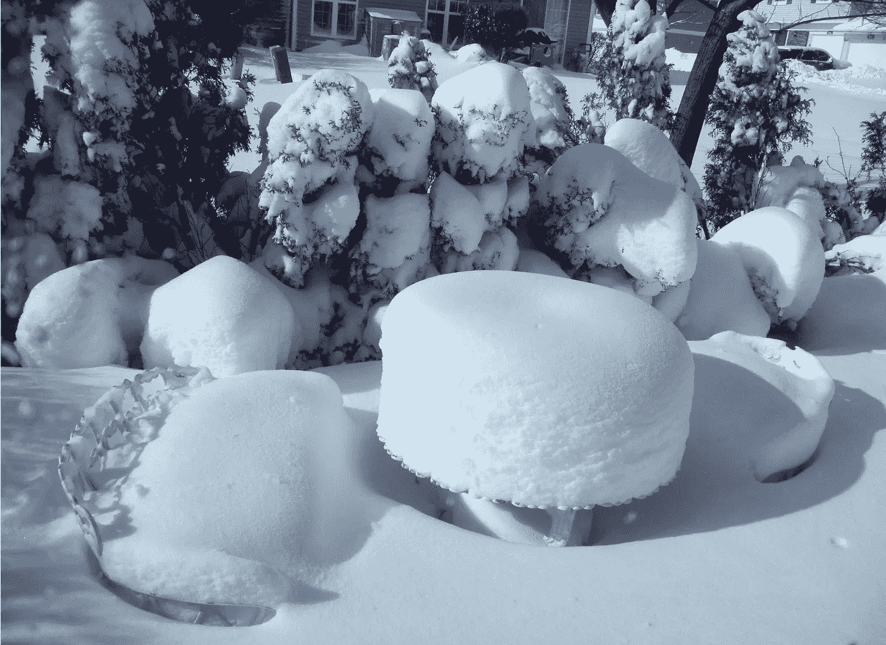

# 我希望我们所有的暴风雨家庭晚餐

> 原文：<https://medium.datadriveninvestor.com/i-wish-us-all-stormy-family-dinners-in-2019-1b77f093e3d?source=collection_archive---------7----------------------->

在感恩节和圣诞节期间，我们与家人和朋友重新联系。如果这只是一张卡片或一封电子邮件，它是安全的；如果我们需要坐在同一张餐桌旁，事情就变得棘手了。政治一直是家人或朋友聚会时讨论的热门话题。古老的格言说，宗教和政治不应该在上流社会讨论。但是，我们如何避免社交聚会变得沉闷而不讨论我们的想法，不谈论政治呢？

最近，我注意到政治成了一个禁忌。正如我最近听说的那样，为了节日期间的神圣和平，政治需要被搁置一旁。叫我怪人吧，但我很怀念。作为一名政治作家，我可能比其他人对政治更感兴趣，但通常情况下，当人们喝了几杯后变得更健谈时，我并不觉得事情会这样发展。甚至那些声称对政治不感兴趣的人也表达了他们的观点。当每个人都小心翼翼地回避政治的时候，讨论比现在更加喧闹和混乱。它们持续的时间往往比计划的要长，因为解决大问题会带来一些快乐和满足感。现在，随着声音平静下来，幽默四处传播，我们发现自己在考虑提前离开活动，这被认为是得体的做法。

 [## 保护主义、政治和经济动荡|数据驱动的投资者

### 美国股市昨日出现 400 多点的大幅反转，为未来的事情发出了警告信号。市场…

www.datadriveninvestor.com](https://www.datadriveninvestor.com/2018/06/28/protectionism-politics-economic-turmoil/) 

近年来，政治变得更加两极化，家庭聚餐也是如此。渐渐地，为了和平，政治被放到了一边。当我们能够与家人和朋友公开谈论政治时，我们发现即使在一个小型聚会上，我们也有代表各种政治观点的人。听到对手是我们所爱的人，或者至少是我们喜欢和尊重到足以与之交往的人，与听到对手是电视上的一个会说话的人，是不同的。在面对面的接触中，我们可以更好地看到我们不同意的人的论点中人性的一面。他们可以在我们的推理中看到同样的东西。然后，我们首先想到的是如何在不放弃我们的目标的情况下适应我们对手的目标。或者，我们需要做些什么来让他们的位置向我们靠拢。他们的想法是一样的。最重要的是，对我们大多数人来说，那些在餐桌上、厨房里或露台上的谈话，是与不同政治观点的人唯一的直接对话。在很多情况下，我学到了一些新的东西，指引我以后去寻找更多的信息。

现在，当国家的鸿沟已经延伸到各个家庭，我们不与其他持不同观点的人直接对话时，我们的对手不再是我们认识、热爱并愿意与之和平相处的人。我们的对手被人格化了。他们已经成为我们的敌人。当我在 Medium 上的一篇评论中，被我质疑观点的人回应道:“与你观点相同的人是我与之战斗的敌人，而不是我试图争取的人，这让我感到震惊。“我怀疑，如果我的理由是由一位挚爱的家人或密友在感恩节晚餐的一次随意交谈中当面提出的，我会得到同样的回应。

但是我们再也没有这样的对话了。“斗争”成了政客们最喜欢用的词。没有人专注于理解问题和寻求解决方案。华盛顿正在上演的马戏可以归结为政客们固步自封，互相争斗。我们可以批评他们，但我们必须承认，这是我们在感恩节或圣诞节禁止谈论政治话题的合乎逻辑的结果。

我希望我们所有人都能在 2019 年找到一种方法，在与家人和朋友聚会时经受住暴风雨般的政治讨论。关于如何做，我没有任何聪明的建议，但我知道我们必须这样做。我希望我们所有人都能在 2019 年感恩节之前准备好迎接暴风雨般的家庭聚餐，并且在第二天就能有成就感。