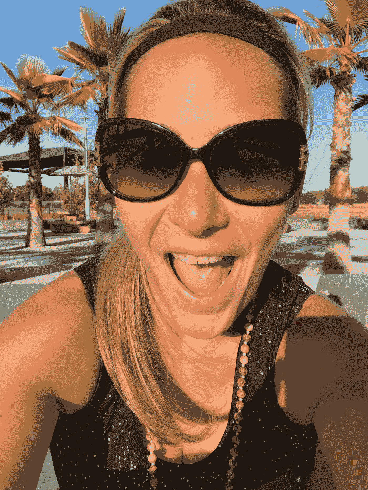
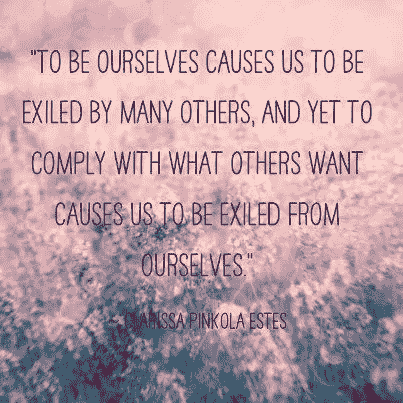
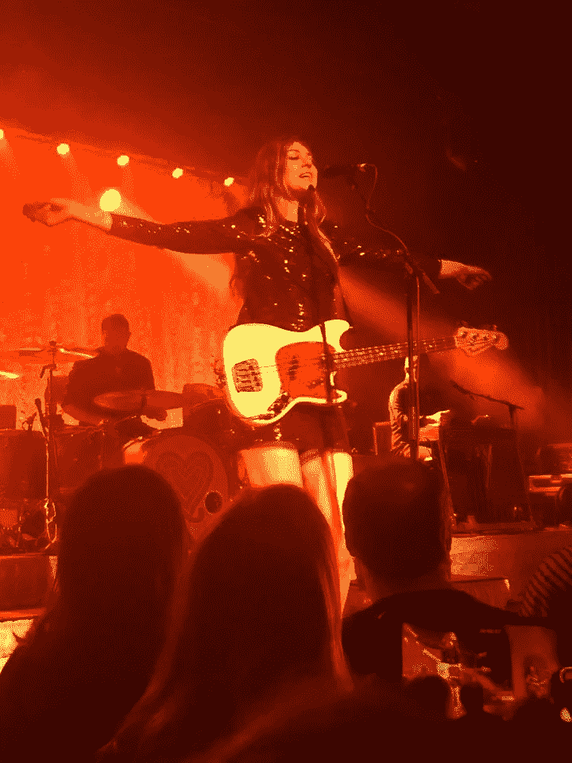
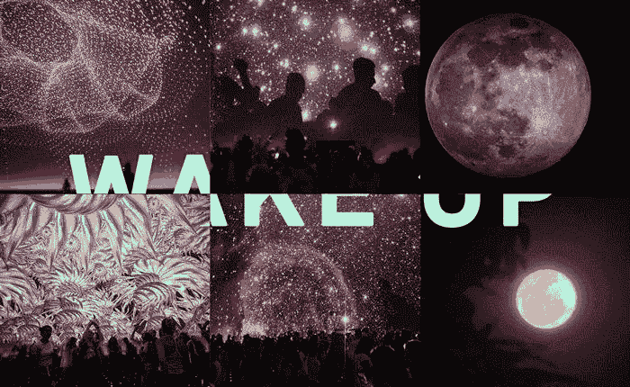

# “我不会走容易的路”…以及这将如何改变你对生活的整个看法。

> 原文：<https://medium.datadriveninvestor.com/i-wont-take-the-easy-road-and-how-this-can-shift-your-entire-perspective-on-life-55502c98d37a?source=collection_archive---------30----------------------->

今天是 10 月 1 日，在新的一个月里，我又一次感受到了能量的复苏。更不用说今天距离 2018 年底还有 90 天了。

而且从数字上来说，2018 年被称为“丰收年”。

也许你已经感觉到你内心深处有一个更深的召唤。

也许你没有。

但是这种上升不是来自富足，而是来自平衡内在的二元性。

> 努力成为一个人，同时又是集体的一部分。
> 
> 作为一个个体发光，但不加评判地被接受。

> 最重要的是，被倾听。

根据实用数字命理学家 Felicia Bender 的说法，数字命理中的宇宙年代表了一种全球性的能量，它将影响我们所有人。2018 年，在 11/2 宇宙年期间，世界将在个性和伙伴关系之间取得新的平衡。

也许你坐在这里想知道这一切是如何联系在一起的。

事实上，那是我的天才领域，所以将你的内心世界和外部世界联系起来是我神圣的快乐。

你内心燃烧的想法和感觉，以及你的反应如何对世界的集体意识产生连锁反应。

# 我每天都有很多快速的想法，很多时候我害怕把它们表达出来，因为我会产生误解和判断，并且不能用语言表达我的感受。

我担心不能一直在博客上深入表达你的心声。

但是在保持沉默的过程中，我保持这种野性的能量在内心被驯服。

*这些想法正在活生生地吞噬着我，*

*不管我冥想多久，*

*喝了安神茶，*

*吃了有机+全天然的食物，*

*遵循抗炎的生活方式，*

通过阅读我最伟大的精神导师狄巴克·乔布拉的教导，启迪了我的灵魂。

# 我发现最大的讽刺是，尽管世界在社交媒体和许多其他全球平台上变得更加紧密，但许多人仍在寻求“快速解决方案”。

尤其是考虑到富裕这个词，它已经成为一个和金钱一样常用的词。

事实上，它经常被误认为是钱。

不要误解我的意思，这篇文章并不是要激发人们认为富足或金钱是贪婪的想法。

事实上，恰恰相反。因为几年前我学到的一件事让我记忆犹新，那就是“金钱就是能量”。

从能量上来说，人们付钱是为了得到同等价值的东西。

你所重视的可能与我所重视的不同，但这并不意味着做出判断或指责是正确的。

我把这一切都和昨天发生在脸书的黑人肖像运动联系在一起，因为在分享我的观点时，有许多女性分享了这份爱。

还有其他人指责我的话。

他们误解了我的观点，因为他们可能因为分享了我对为什么不支持这场运动的看法而感到受到了人身攻击。

但是这难道不违背人类为之奋斗的一切吗？作为一个女人被看到、被听到和被重视的权利？

在 2018 年这个神奇的一年，我读了最有影响力的书，名为《与狼共舞的 T2 女人》，作者是克拉丽莎·平科拉·埃斯蒂斯，书中有 500 多则深刻而智慧的民间传说，有真实的生活存在，尤其是在女性、狂野女性的崛起方面。

老实说，我不确定其他任何一本书会像克拉丽莎那样如此美妙地触动我的心弦，但我真的认为这句话很有意义，

> 做我们自己会让我们被许多人放逐，然而顺从别人对我们的要求会让我们被自己放逐。克拉丽莎·平科拉·埃斯特斯

这就是成功的秘诀。

# 然而，在一种渴望快速解决问题的文化中，许多人寻求“走捷径”。

容易就是安全，合乎逻辑，这是我所知道的。

我妈妈曾经告诉我，“你认识的魔鬼比你不认识的魔鬼要好。”

然而，如果我不认识的魔鬼掌握着我渴望的一切的钥匙，而我却浪费了如此多的时间走上我认识的魔鬼的道路，以至于我永远也不会获得持久的成功，那该怎么办呢？

当然，钱来了，钱去了。

因此，我的人生格言是“*金钱就是能量”。*

能量来了，又去了。

就像生活中的任何事情一样，可以是无限的流动。

# 正如狄巴克·乔布拉多年前在我参加的一次演讲中深刻地说的，你是这个宇宙的 0 . 00000000001%。

我并不是说要把你在这个世界上的存在最小化，事实上，我被包括在这个措施中，这深深地赋予了我力量，让我知道这个宇宙的以太并不仅仅由我们所知道的组成。

剩下的 99.99999999%是你不知道的。

现在，在你放弃阅读这篇文章，认为这是一个精神困境，要认输，屈服于一个只有祈祷、冥想和深度仪式的生活之前，让我告诉你，我的观点完全相反。

# 我不会走容易的路，因为简单来说，任何容易的事都没有价值。

如果你听到了这首歌的歌词，我急救包的一线希望，你是对的。

我有幸看到华丽的二人组，克拉拉+约翰娜索德伯格在过去的周末，他们的反叛之心巡回演出在纳帕谷。

当我听着从他们的声音中散发出来的纯洁的心灵时，泪水顺着我的脸流下来，因为我受到启发，今天把这一切拼凑起来并与你们分享。

> 我不想再等了
> 
> 我厌倦了寻找答案
> 
> 带我去一个有音乐和欢笑的地方
> 
> 我不知道我是否害怕死亡
> 
> 但是我害怕生活得太快，太慢
> 
> 后悔，自责，等等，哦不，我得走了…

## 厌倦了等待，厌倦了寻找答案。

## 她要走了，她听到那个声音在呼唤…

## 但是她会回应自我意识的声音吗？

## 那个让我们安全，被困，寻找答案的人？

## 不，她不会走捷径的。合唱继续…

> 我听到一个声音在呼唤
> 
> 呼唤我
> 
> 我为了自由而制造的这些枷锁
> 
> 无论是因为原因，还是因为爱
> 
> 我不会走捷径

为了把这个美丽的蒙太奇总结成对你的现实生活有意义的建议，我重复我以前说过的话:

# 没有什么容易的事情是有价值的，因为从能量上来说，没有驱动力使它有价值。

这并不是说在精神上你可以展现吸引力法则来揭示你内心最深处的意图。

但背后一定有激情。

激情是情绪化的，而情绪化并不容易。

虽然许多精神领袖认为，徒步攀登喜马拉雅山和过深刻反思的生活体现了富足，但作为一个人，我深深地追随这一思想流派。

> 我们生活在人类世界。
> 
> 我们有人类的思想。
> 
> 我们感受到人类的恐惧。
> 
> 作为人类，我们并不完美。
> 
> 事实上，我们并不是这个宇宙的核心。

# 但是人类拥有的将我们与其他形式的创造区分开来的东西是自由意志。

选择简单道路的自由意志。

自由意志知道任何值得为之奋斗的事情都包含你的汗水。

不努力，但是聪明。

战略上，精神上。

# 连接，但屈服于 99.9999999%的暗物质，它比我们总是笨手笨脚地谈论的人类事务更有影响力。

虽然我为今天冗长的博客道歉，但我真的不感到抱歉。

我有很多话要说，我觉得我的话很有分量。

它们被植入我体内是有原因的，就像你每天所想的一样。

# **如果你从我的分享中吸取什么，那就是这个地球上的每个人都有神圣的使命来行使自由意志，*在一个非常关键的条件下。***

来自自由的能量欲望将有助于人类的状况。

你从你的人际网络开始，向外绽放光芒。

沉浸在你的努力中的自由向外流向和平和无条件的爱的全球使命。

因此，在这个丰富的 2018 年还剩 90 天的时候，我向你们发出挑战，思考你们将如何留下自己的印记。

当你回顾你在你的世界里所产生的集体影响时，无论是内在的还是外在的，你会渴望在新年前夜思考什么？

如果你被我话语的能量点燃，那么你，亲爱的，说我的语言。

# 你正是我想要成为我的[自由+心流集体](http://www.freedomandflow360.com)的一部分的那种类型的女人。

想象一个 16 周的经历，它可以改变你对生活的整个看法，以至于你可以从导致当今世界状况的故事中挣脱出来。

过着非常规的生活，以至于你不再选择容易的道路。

其他人都在做的事情很简单，但是你，你被召唤去做更深层次的事情。

尽一切能力去行使你神圣的自由使命，它别无选择，只能把你渴望已久但认为不可能的能量吸引回来。

要知道总有另一种方法。

***我不会走容易的路。我希望你能和我一起走上*** [***自由+流动***](http://www.freedomandflow360.com) ***的道路。***

非常爱你，

杰西卡·席勒·西尔弗曼