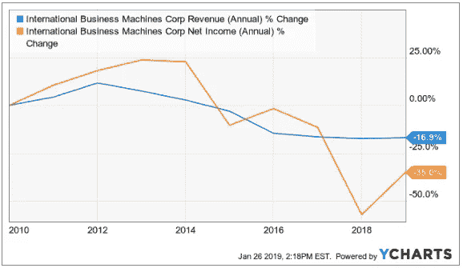
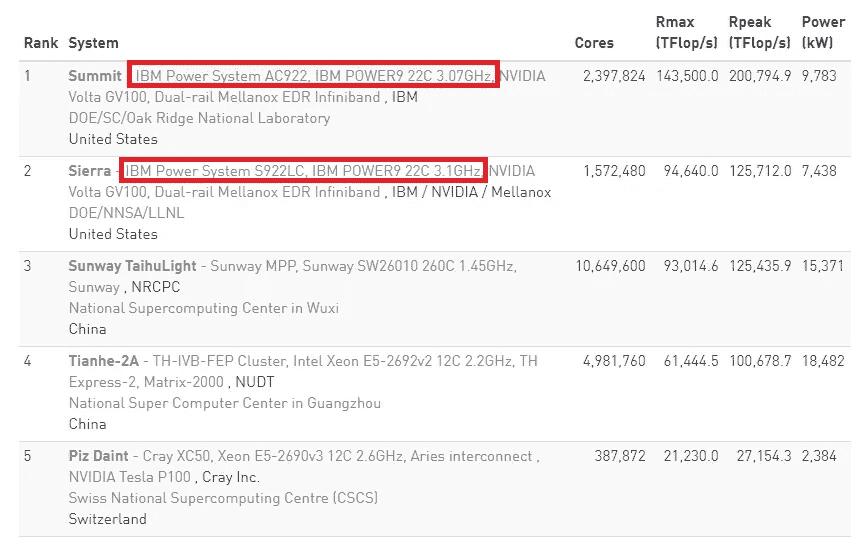
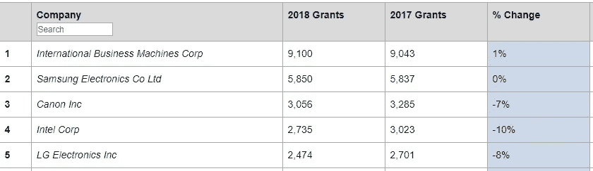

# IBM:成长中的提款机？

> 原文：<https://medium.datadriveninvestor.com/ibm-a-growing-cash-machine-910582333f7?source=collection_archive---------12----------------------->

## 在明显停滞的业务背后，IBM 是一台准备再次增长的提款机。

Photo: [skeeze](https://pixabay.com/en/users/skeeze-272447/) via [Pixabay](https://pixabay.com/en/supercomputer-mainframe-mira-1781372/)

IBM 的案例很吸引人。2018 年第四季度的收益和 2019 年的前景显示，这家拥有 108 年历史的公司正在努力保持收入持平。随着 IT 基础设施从内部部署向云的过渡，[大型机](https://www.ibm.com/it-infrastructure/z)被认为是一项正在衰落的业务。

更悲观的是，长期价值投资者沃伦·巴菲特在 2017 年和 2018 年决定[卖出](https://business.financialpost.com/investing/buffett-buys-a-further-75-million-apple-shares-cnbc-reports-1)他在 2011 年[买入](https://money.cnn.com/2011/11/14/news/companies/buffett_ibm/index.htm)的 6400 万股 IBM 股票。

回顾过去十年，收入和利润分别下降了 16.9%和 35%。

IBM revenue and net income evolution over the last 10 years

但是故事还有另一面。除了收入的稳定，IBM 准备再次增长。

## 故事的另一面

根据[Top500.org](https://www.top500.org/)的数据，下面的列表展示了世界上最强大的超级计算机的[最新排名](https://www.top500.org/list/2018/11/)。

Top500 ranking of supercomputers — November 2018

是的，你没看错。IBM 运行着世界上最强大的两台超级计算机。500 强名单并不详尽，因为它只包括“高端应用中常用的通用系统”。但该排名仍然是 IBM 在超级计算领域领先地位的一个重要指标。

还有更多。

IBM 连续第[26 年](https://www.research.ibm.com/patents/)在 2018 年获得美国专利授权最多的公司[榜单](https://www.ificlaims.com/rankings-top-50-2018.htm)中独占鳌头。

Ranking U.S. patents in 2018 by ificlaims.com

不仅 IBM 在榜单上遥遥领先。但该公司也扩大了对最接近竞争对手的领先优势。当然，这只是一个定量指标，并不能说明专利的价值。但这个排名是该公司潜力的另一个指标。

IBM 也在增长业务中记录了重要的交易。该公司最近签署了混合云领域的长期协议。2019 年的几笔交易包括与菲律宾群岛银行的 2.6 亿美元[协议](https://newsroom.ibm.com/2019-01-23-IBM-Services-Signs-a-USD-260M-Agreement-with-Bank-of-the-Philippine-Islands-to-Support-the-Banks-Digital-Transformation)，与沃达丰(纳斯达克代码:VOD)的新[合资企业](https://newsroom.ibm.com/2019-01-17-IBM-Vodafone-Business-Join-Forces-to-Drive-Innovation-in-Rapidly-Changing-World)5.5 亿美元，以及与瞻博(纽约证券交易所代码:JNPR)的另一项 3.25 亿美元[协议](https://newsroom.ibm.com/2019-01-16-IBM-Services-Strikes-Agreement-with-Juniper-Networks-to-Speed-its-Journey-to-the-Cloud)。

IBM 也在对区块链和量子计算技术进行长期投资。

## 那么，作为投资者，如何看待这种情况呢？

嗯，IBM 现在正处于一个转折点。2018 年，来自不断增长的业务的收入(由管理层在“战略要务”的营销标签下分组)达到约 400 亿美元。与 2017 年相比增长 9%，“战略要务”占总收入的 50%。衰落的传统业务代表了另外的 50%。

从现在开始,“战略需求”占据了大部分收入。与传统业务收入的差距将继续扩大。在 2019 年下半年，IBM 将整合 Red Hat(纽约证券交易所代码:RHT)，以加速其向混合云领域的过渡。在“战略需要”的范围内，这甚至是更多的收入。

因此，投资 IBM 是因为相信“战略需要”会抵消传统业务的衰落。但该公司甚至不需要成长就能成为一项有趣的投资。

考虑到自由现金流，甚至假设没有增长，只要股价保持在 159 美元以下，市场就会低估该公司的价值。IBM 在 2018 年产生了 120 亿美元的自由现金流，该指引表明 2019 年的自由现金流与此相同。给无增长价值的自由现金流分配 12 倍的倍数，IBM 为 12 * 12 = 1440 亿美元。9.052 亿股，我估计的公允价值约为每股 159 美元。

在撰写本文时，大约 134 美元的股价比我估计的公允价值低 15%。

## 外卖食品

IBM 正在通过投资增长业务来抵消传统业务的下滑。

与此同时，公司产生了大量的自由现金流。假设没有增长，我对 IBM 的估值为每股 159 美元。如果管理层成功转型，上升的潜力是很重要的。

*披露:我是龙 IBM*