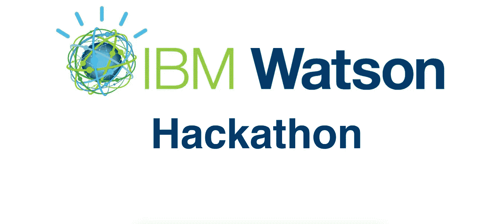
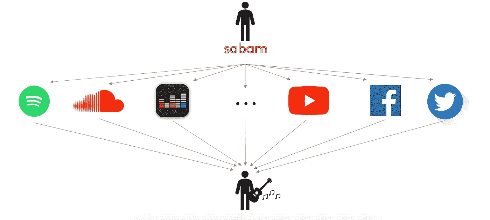
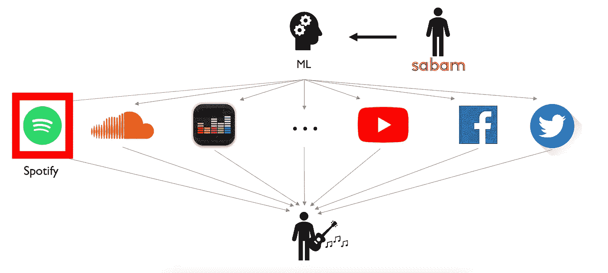
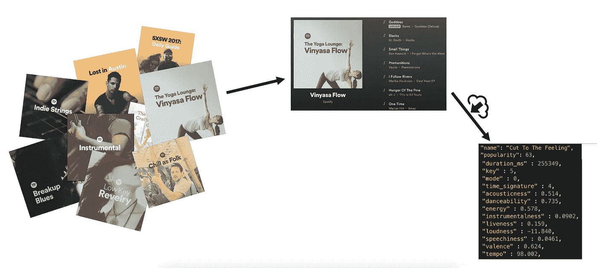
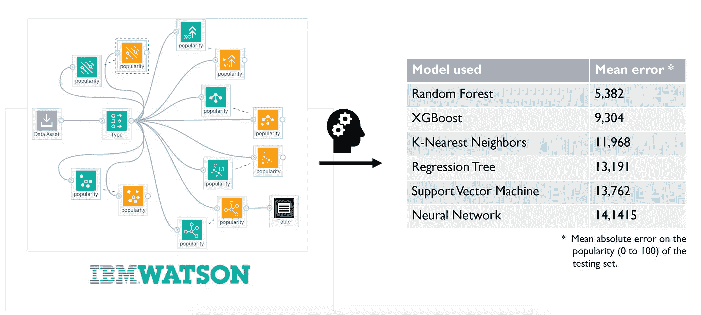
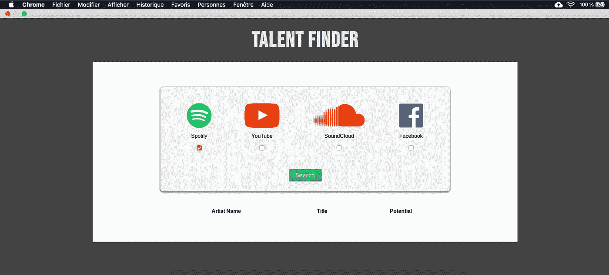

# IBM 黑客马拉松 2018

> 原文：<https://medium.datadriveninvestor.com/ibm-hackathon-2018-750ec343f9b4?source=collection_archive---------17----------------------->

2018 年 11 月 23 日和 24 日，在 IBM 布鲁塞尔总部举办了一场编码黑客马拉松。每个团队都必须利用 IBM 云服务来解决一个 IBM 客户的实际问题。比利时大学和大学学院的信息技术教授应邀派出四名有编程经验的学生组成的小组。目的是让不同的大学学院和大学的不同院系组成团队。

这篇文章简要解释了我们对给定问题的解决方案，这个方案让我们获得了这次黑客马拉松的第三名。

## 萨巴姆案——下一件大事是什么？

Sabam 是比利时作家、作曲家和出版商协会之一，一直在寻找新兴人才。新兴乐队并不总是意识到他们的权利，以及他们可以通过公开演出合法赚取的钱。作为 Sabam 使命的一部分，他们希望接触到这些乐队，并告诉他们关于作者的权利，他们的权利，出版交易的来龙去脉，以及一般的“对你有什么好处”。仍在主流媒体关注之下、但即将走红的作家是他们的主要目标。

我们的任务是预测比利时、法国或荷兰的音乐作家/乐队在雷达下蓬勃发展，谈论的是什么，嗡嗡声在哪里。

# 问题是

Sabam 的客户经理每天都在比利时、法国和荷兰寻找新的人才。为此，他使用 Spotify、YouTube 或脸书等几个在线平台来寻找他们。问题是，这项任务相当耗时，而且不是一件有趣的事情。此外，当我们在社交媒体上谈论一位新艺人时，往往已经太晚了，他可能已经被另一家公司联系上了。

具体来说，萨巴姆想要什么？它希望在别人之前发现新的潜在人才。

# 我们的解决方案

我们的解决方案包括使用一些机器学习算法，在 Sabam 员工日常使用的相同平台上，寻找可能成为热门新歌的一些迹象。给定一个新的发行，如果我们可以预测它会是一个热门，那么这个新兴的艺术家可能是 Sabam 想要加入的人。

关于这次黑客马拉松的时间问题，我们决定专注于 Spotify。为什么选择 Spotify？因为它有一个很棒的网络应用编程接口，可以让我们获得关于一首歌的非常精确的数据，比如它的速度，它的能量，它的音质或者它的可跳性。具体来说，我们对 Spotify 的想法是分析所有流派的大量歌曲的这些特征，并找到歌曲特征与其流行度之间的相关性。

我们如何定义一首歌的流行度？Spotify Web API 还为其所有歌曲提供了一个“流行度”功能，给出一个 0 到 100 之间的值(100 是一首歌曲的最大流行度)。该特征是歌曲在 Spotify 上的观看次数的函数，但是它也随着时间而减少，使得两年前的嗡嗡声比上周的嗡嗡声具有更低的流行度值。

## 第一步—收集数据

为了让我们的机器学习算法进行最好的训练，我们需要所有可能流派的大量曲目。语言重要吗？嗯，即使 Sabam 只从比荷卢和法国寻找新的人才，那里的大多数歌曲都是用法语和荷兰语演唱的，拥有其他语言也不会影响我们的模式。事实上，如果你喜欢一首西班牙歌曲，与其说是因为它的歌词，不如说是因为它的节奏或可舞性。因此，如果一首法国歌曲中出现了类似的节拍，你很可能也会喜欢它。

那么，发行年份有关系吗？当然有！Sabam 想知道根据目前的炒作，现在会有什么样的消息。问题是 Spotify API 不允许你选择特定年份的所有歌曲。但是考虑到流行特征随着时间的推移而降低，如果我们考虑我们的数据集中较老的歌曲，这并不是什么大问题，因为即使它们在过去曾经流行过，它们的流行值也会低于当前流行的流行值。

用 Spotify API 一次性获得大量歌曲并不像预期的那么容易。事实上，获得几首曲目的唯一方法是指定曲目名称、艺术家、专辑名称或播放列表名称。为了拥有最大的所有流派的曲目集，我们决定采用 Spotify 制作的官方播放列表，从经典到摇滚，我们从这些播放列表中提取了所有歌曲。最后，我们的数据由大约 2000 首歌曲的特征组成。

## 第二步—培训数据

这次黑客马拉松的目的是最好地使用 IBM Cloud 的给定工具。我们主要使用 IBM Watson Studio，它为数据科学家提供了工具，使他们能够协作并轻松地处理数据，以构建和训练大规模模型。它让我们有可能快速可视化数据并从中发现真知灼见。

我们在多个机器学习算法上训练我们的数据，并保留给我们最小平均绝对误差(MAE)的那个。随机森林算法给出了非常好的结果，MAE 大约为 5(满分为 100)，因此它成为我们用于模型的算法。

## 第三步——预测嗡嗡声

这个过程的最后一步是在新的赛道上测试我们的模型。Spotify API 允许我们获得新发布的列表。这些版本作为输入被传递到我们的算法中，以便分析它们的特性，并为它们中的每一个计算一个预测的流行分数。实际上，这个预测分数对应于一首歌曲成为热门歌曲的百分比。

在可能命中的输出列表中，必须通过艺术家进行过滤，以便只保留比利时、荷兰和法国的艺术家。不幸的是，Spotify API 无法进行这种过滤，因为它不提供任何关于艺术家国籍的功能。解决这个问题的方法是使用另一个名为“音乐故事”的网络应用编程接口，它可以收集超过 195 000 名艺术家的数据，包括他们的国籍。

请注意，Sabam 需要进行最后一次过滤，以便剔除已经加入的艺术家。

# 最终应用

最后，我们对 Sabam 问题的解决方案是一个具有用户友好界面的网络应用程序，用户只需选择他想要搜索新人才的不同平台——目前只有 Spotify 有效——然后点击搜索按钮。不到一分钟后，一份完整的未来 buzz 艺术家名单出现在他的屏幕上，让他选择联系他感兴趣的人。

