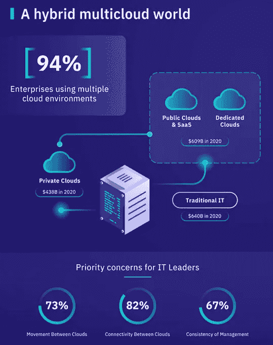

# IBM 混合和多重云:未来的赌注

> 原文：<https://medium.datadriveninvestor.com/ibm-hybrid-and-multi-cloud-the-betting-for-the-future-bde5a9748bb4?source=collection_archive---------2----------------------->

与数据和分析自动化竞赛中的任何其他主要参与者一样，IBM 有一个特定的战略来与数十亿美元的云市场中的其他大牌竞争。同时，AWS 的主要优势是客户体验的定制和灵活性，另一方面，Azure 具有易于使用和集成的服务工具，IBM 选择将其服务与其他服务区分开来，提供一个能够保持混合多云环境的平台，客户可以在公共云和私有云两者中部署服务和应用程序。

(Source: [cbssurfer](https://cbssurfer.tumblr.com/post/120954766088/heaven-on-earth-nicaragua), via [nikest](https://nikest.tumblr.com/post/186355024380))

但 IBM 在云市场的这种押注到底意味着什么？

为了避免在想法和细节的循环中迷失自己，首先我们应该在解释 IBM 战略之前定义一些概念:

 [## 信息图:云之旅|数据驱动的投资者

### 聪明的企业领导者了解利用云的价值。随着数据存储需求的增长，他们已经…

www.datadriveninvestor.com](https://www.datadriveninvestor.com/2018/09/22/infographic-journey-to-the-clouds/) 

公共云:被定义为一种计算环境，其中成员在按使用付费的基础上使用平台的服务。

私有云:定义为一种计算环境，其中只有成员才能有限地访问公司或组织的服务。

混合云:定义为一种计算环境，其中公司或组织同时在公共云和私有云上提供服务。

多重云:被定义为一种计算环境，其中服务的架构提供多种公共和私有资源。

IBM 向企业客户成功实施混合云的例子:

**国民健康服务:**公共云架构启用，使患者更容易获得心脏移植。

**American Airlines:** 构建并部署的预订应用程序连接到数据中心的公共云预订系统。

**埃克森美孚:**构建在公共云中的第三方支付应用。

**Bradesco** :巴西最大的银行之一，升级其能力，在连接到其大型机的私有云上构建应用程序。

因此，IBM 在云竞赛中赢得更多市场的优势基本上是提供了一个完整的平台，基于通过公共和私有交换多种云服务形式的想法。根据 IBM 最近的报告，公司正在将其架构基于不同的云提供商，导致一次集成和操作不同平台的困难。IBM 的混合云的目的正是如此:使不同云环境的可移植性和操作更容易。

建立真正的效用和优势以区别于竞争是困难的，主要是因为全球云市场的目标看起来是相同的:以尽可能低的成本获得服务中集成、安全性和速度的最大容量。在当前的云市场中，IBM 提供的主要优势和实用工具包括:

1.可扩展性:按需扩展公共云和私有云的服务级别

2.弹性:借助强大的网络安全平台，即时恢复关键应用和服务

3.软件即服务(SaaS):访问几个侧重于客户体验的业务应用程序和服务来源

4.灵活性:根据业务架构的需要在平台中进行开发和部署

5.全球:考虑到 IBM 服务的全球存在，对云数据中心的访问是有保证的

因此，与其最接近的竞争对手相比，IBM 扰乱全球云市场的战略看起来很清楚:成为主要的多云提供商，能够获得强大而合适的服务，如安全、基于开源的业务架构、高水平的集成和执行管理、通过多个地点的数据中心提供的全球技术支持，以及在 IT 服务方面的专业知识和数十年的经验。此外，应该注意的是，IBM 目前正在升级其云计算能力的大多数客户都是各自行业的企业和知名人士:众所周知，IBM 为非常精确的行业提供非常具体的服务，如银行、石油和天然气、航空公司、医院等。一个迫在眉睫的问题是，面对咄咄逼人、多方面的竞争对手，IBM 能否继续作为云竞赛中的主要参与者？我们中的许多人都这样认为，考虑到长期和经过验证的经验使 IBM 本身成为一个品牌，然而，我们处于一场赢家通吃的技术竞赛中，其竞争对手真正致力于提供同等的、有史以来最好的客户体验。如果 IBM 想再次成为一个颠覆性的竞争对手，就需要让它的服务更加灵活、易用:就像最接近的竞争对手现在所做的那样，全面关注客户体验。

顺便问一下，客户有什么要求？

根据 IBM 的报告，大约 10–20%的应用程序已经迁移到了云，另外 80%的 IT 服务仍然是模拟环境，而这些服务正是那些希望迁移到云的公司，但是迁移一定不仅仅代表简单的迁移，而是业务应用程序的完全转变。云计算服务不仅仅是有用的，而且是服务真正升级的必要条件。

多个行业的公司都在竞相优化从供应链到支付的各个环节，以提高日常运营的效率，管理 10 到 16 家不同云提供商的数据和工作流，实现流程的自动化和数字化。IBM 有机会使用从人工智能到区块链、分析和网络安全的所有强大工具来实现不同的解决方案。换句话说，客户希望在混合云环境中获得企业级安全性，简化和加快跨多个云计算环境的数据和应用程序的可移植性，并最终在同一个云计算环境中构建一致的云计算管理和自动化。

[【1】](#_ftnref1)根据咨询公司 Gartner 的数据，目前全球云业务的市值约为 2144 亿美元:[https://www . Gartner . com/en/news room/press-releases/2019-04-02-Gartner-forecasts-world wide-public-Cloud-revenue-to-g](https://www.gartner.com/en/newsroom/press-releases/2019-04-02-gartner-forecasts-worldwide-public-cloud-revenue-to-g)