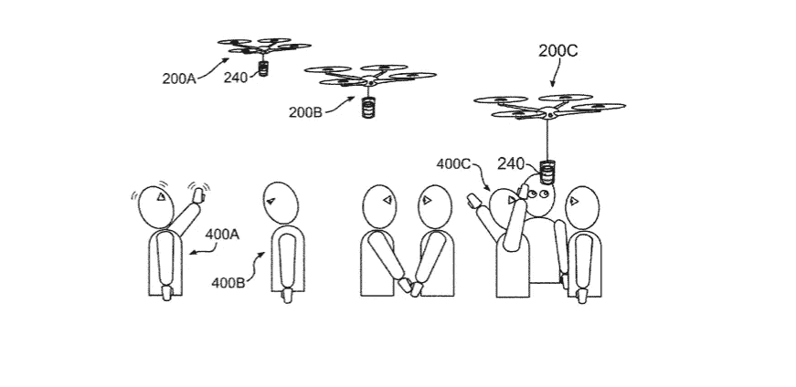

# IBM 刚刚申请了一项革命性无人机的新专利，这给我们敲响了警钟

> 原文：<https://medium.datadriveninvestor.com/ibm-just-filed-a-new-patent-for-a-revolutionary-drone-and-its-quite-the-wake-up-call-c6dfd7d8d512?source=collection_archive---------15----------------------->

这么说吧，你会从中获得咖啡因的刺激！

实际上，相当震惊，但我们并不感到惊讶。由于显而易见的原因，无人机技术目前处于技术趋势的前沿。无人机的概念适用于许多不同的垂直领域，现在 IBM 似乎已经以一种很大的方式跳上了这股潮流——通过申请一种新型无人机的专利。你能猜出它是什么吗？

# 试试送咖啡——没错，一架给你送咖啡的送货无人机

我们称之为有趣——如此有趣，以至于无人机的激进商标仅仅是为了在飞行中运送一些乔。字面上。有趣的是，这项专利描述了一种可以检测实际滞后的无人机——疲劳，如果你愿意的话！你没听错——当你需要一些咖啡因时，一架无人机可以感应到你的系统。

换句话说，不用担心——你不需要住在星巴克旁边。如果你正饱受困倦之苦，这是一架可以在空中巡逻的无人机，它可以扫描下面许多可能需要一两杯卡布奇诺的人。现在*正是*技术创新的最佳时期。

IBM 将其想象为一架无人驾驶直升机，通过连接到无人机的传感器进行扫描。通过预先确定的认知状态和传感器数据，你可以轻松地获得信息，从而产生旨在启动咖啡配送任务的机器学习算法。

此外，无人机将被设计成通过摄像头监控血压、瞳孔放大和各种面部表情。人们发信号的方式类似于示意出租车。通过旨在发现这些信号的传感器，一个简单的手部动作就可以让无人机带着卡布奇诺飞过来。当然，假设的递送细节包括简单地将咖啡倒入马克杯，或者更全面的密封袋装咖啡渣的方法。这里没有限制。

# 你不会相信 IBM 甚至在考虑另一种饮料…

酒精。啤酒。甚至可能是一两杯鸡尾酒。

你可能会认为 IBM 很疯狂，但从某种意义上来说，这是雄心勃勃且相当现实的。想想吧。一种可以逆向读取生物特征的无人机，可以检测不稳定和含糊不清的语言，以此来判断客户是否已经醉到可以完全切断联系。然而，这并不意味着专利将意味着 IBM 将开发这样的无人机，但这并不是不可能的。换句话说，有一天我们可能会在天空中拥有自己的无人机酒保。

你怎么想呢?好主意？还是有风险？你是法官！ [**现在就注册你自己的免费 VIGYAA 账户，说出你的想法！**](https://vigyaa.com/accounts/login/)

*最初发表于*[*【vigyaa.com】*](https://vigyaa.com/@pierre/ibm-just-filed-a-new-patent-for-a-revolutionary-drone-and-its-q-1332bf01/)*。*