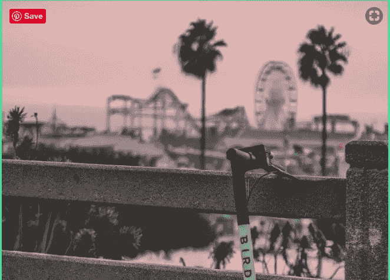

# 溜冰上班？？是的，请

> 原文：<https://medium.datadriveninvestor.com/ice-skate-to-work-yes-please-e4e634b9870b?source=collection_archive---------33----------------------->

# 不落俗套的通勤者将沉闷的通勤变成了娱乐

Photo by [Nadine Shaabana](https://unsplash.com/photos/C22cB1D1K-s?utm_source=unsplash&utm_medium=referral&utm_content=creditCopyText)

上个月，我被介绍到一个新世界——电动踏板车，现在在丹佛的人行道上随处可见。

我所要做的就是打开我的 Lyft 应用程序，点击可爱的滑板车图标，然后把我的手机放在滑板车的二维码前面。

前一秒我还是行人；下一分钟，我颤抖地进入了替代交通的新世界。对于 2 英里的路程，我支付不到 3 美元。

滑板车是 2010 年的 ZipCar，第一个滑板车车队于 2017 年 9 月在圣莫尼卡推出。但是滑板车比 ZipCar 或自行车共享有着指数级更高的采用率，因为任何人都可以不需要每月会员就可以上车。仅 1 年时间，100 多个城市的人总共乘坐[超过 2000 万次](https://www.theverge.com/2018/9/20/17878676/electric-scooter-bird-lime-uber-lyft)。许多过去常常开车旅行几英里的人现在转而骑着小型摩托车。

你可能会发现这种趋势——被称为微移动革命——令人讨厌，尤其是如果你是一名司机的话。请记住，这些“麻烦”实际上让你的通勤变得更好。骑踏板车的人比你在车流中等待的车少了一辆，因为大多数踏板车时间都是在街区，而不是在繁忙的街道上。少了一个偷你停车位的人。踏板车骑手不会像你的车那样让空气变得难闻或嘈杂，所以你可以开着窗户骑行，享受微风。

替代交通并不新鲜。汽车是 20 世纪早期可供选择的交通工具。在那之前，人们步行、滑冰、骑自行车、滑雪去上班和上学。

本杰明·大卫在德国保持着这一传统。他厌倦了在短距离的交通中等待，所以一年中有几个月，他游泳去上班。他说，这比开车快，也更有趣。穿上短裤或潜水服后，他把工作服、毛巾和笔记本电脑放进防水袋，走到伊萨尔河边。这是一次 1 英里的游泳，在一个 50 码的游泳池里游大约 33 圈。防水袋还可以充气，当他想休息时，可以充当一个漂亮的浮子。

本杰明不是唯一一个寻找更快更有趣的上班方式的人。几年前，瑞典法伦的大卫·阿兰森决定搬到一个大湖附近，这样他就可以在冬天滑冰去上班了。

他家和工作单位之间的距离是 3.5 公里，大约 2 英里。他带着长长的冰刀(更像越野滑雪板，而不是传统的溜冰鞋)，沿着湖边飞行。他花了半个小时，但那是因为他走的是风景优美的路线，大约 10 公里(6 英里)。

因此，他的家庭可以不用第二辆车，这在一个汽车和汽油价格是美国两倍的国家是一个巨大的经济实惠。

气温有时在零下 25 摄氏度左右，但像所有斯堪的纳维亚人一样，大卫知道没有坏天气，只有坏衣服。

他说，上下班时滑冰让他感觉更好，工作时也更专注。他是镇上为数不多的滑冰上班的人之一，他想让更多的人出去享受风景和健康福利。

 [## 溜冰上班的男人- BBC 卷轴

### 大卫·阿兰森搬进了瑞典法伦一个湖边的房子，这样他就可以每天在…

www.bbc.com](https://www.bbc.com/reel/video/p05xnntd/the-man-who-ice-skates-to-work) 

Ginna 在节俭风筝博客上写下了她通往更好生活和经济独立的道路。在 https://www.frugalkite.com[*订阅，每次她发帖都会收到一封邮件。*](https://www.frugalkite.com.)