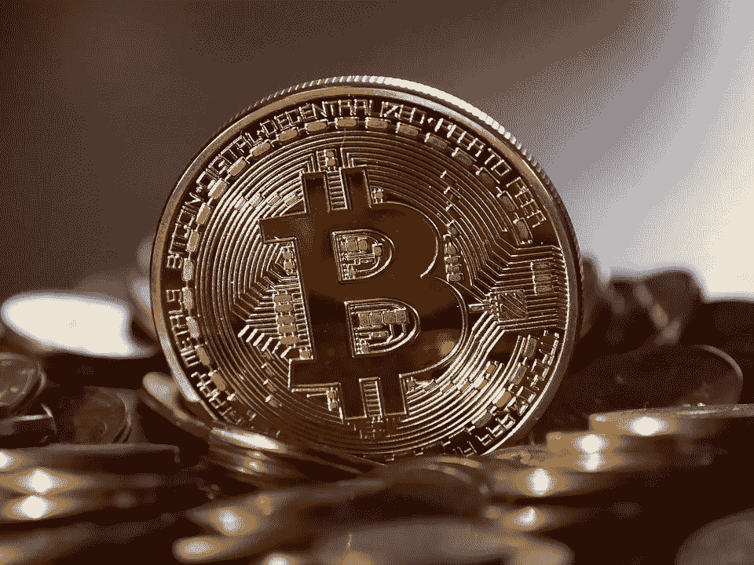
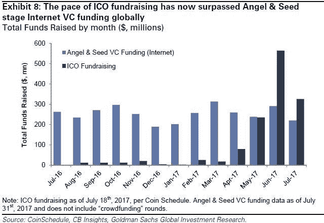
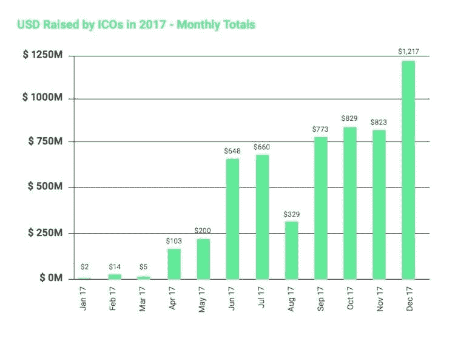

# ICO 还是 VC？3 大权衡

> 原文：<https://medium.datadriveninvestor.com/ico-or-vc-3-major-trade-offs-d2071f47fbb9?source=collection_archive---------6----------------------->

这在许多方面都是我在 2017 年 7 月发表的一篇文章“[首次发行硬币——买者自负](https://www.linkedin.com/pulse/initial-coin-offering-caveat-emptor-amit-garg/)”的延续。自那以后，这个世界一直在飞速发展。首先，尽管只有大约一半的 ico 获得了成功，但在早期阶段，ico 已经超过了风险投资。

不言而喻，拥有另一个创新资金来源可以为我们的社会做出巨大贡献。但是，如果您考虑 ico，则存在严重的取舍问题，以下是主要的几种:

**1)专业知识**——我认为风险投资最大的价值不是资本，而是他们带来的专业知识。我指的是治理、成为战略的思想伙伴、介绍优秀的候选人、帮助与其他公司或专家建立联系、为融资策略提供建议等等。有了 ICOs，你就什么都得不到了。因此，如果你是一家初创公司，仅仅把风险投资视为一种资金来源，那么你肯定会更好地转向包括 ico 在内的其他资本来源。

**2)时间与金钱**——我认为 ico 比风投快是一种错觉。风投通常会跟进几次会议，一次典型的融资需要 3-6 个月。ico 基本上需要一份白皮书和大量的营销，即也需要 3-6 个月。差异可以说是在融资金额上，因为初创公司 ico 目前的融资规模几乎比风投融资规模大一个数量级。筹集太多现金意味着初创公司可能会过于安逸，永远不会发展出战胜困难的内在适应力。此外，向投机性更强的人加注会产生一系列问题，我们将在下面讨论。

**3)为未来而建**——有了 ICO，你就拥有了 24/7 的流动性，这对投资者来说是好事，但对创业公司来说却极为不利。许多公司保持私有化的原因是，公开市场往往会扼杀看似有风险或长期项目的押注。有了 ICO，初创公司基本上就陷入了同样的节奏，成为一个受到高度审查的实体，而没有公司的稳定性。众所周知，单个创投资本家也会影响甚至直接要求一个企业家采纳某个特定的方向，但作为一个集体，你面对的是长期既得利益者。ico 可以帮助你更快地克服融资的激活能量，但与寻求公司生命周期全局优化的风投相比，它们将是局部优化的。

ico 是一个令人难以置信的令人兴奋的发展，这篇文章是一个警告，虽然任何人看它知道风险。仅仅因为其他人都在发行硬币，而你认为你也能在短期内发行硬币，这将导致长期灾难。

这些是专注于实践见解的短文(我称之为 GL；dr —良好的长度；确实读过)。如果它们能让人们对某个话题产生足够的兴趣，从而进行更深入的探索，我会感到非常兴奋。我在三星的创新部门 [*NEXT*](http://samsungnext.com/) *工作，专注于深度科技领域软件和服务的早期风险投资，这里表达的所有观点都是我自己的。*