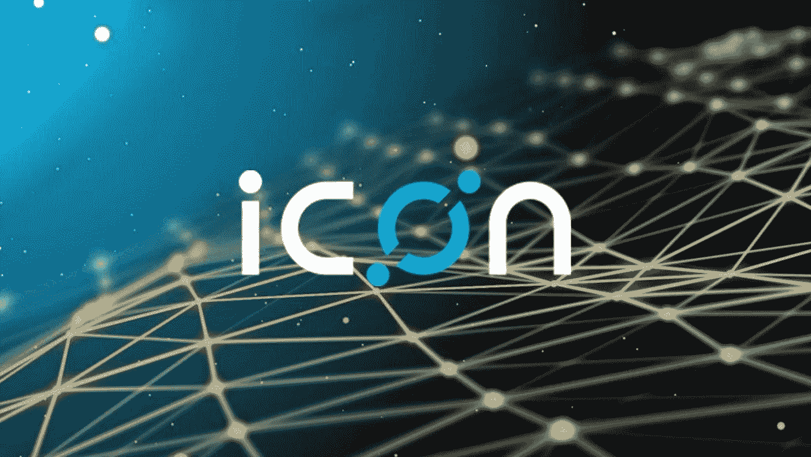
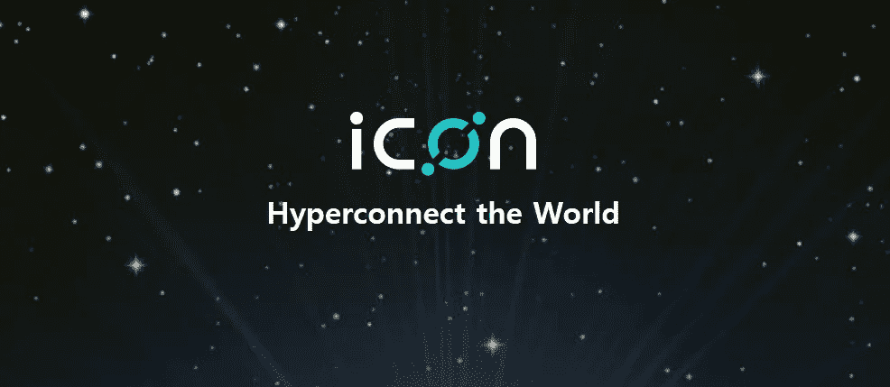
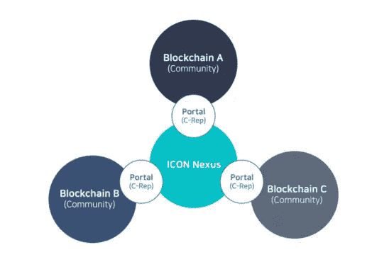
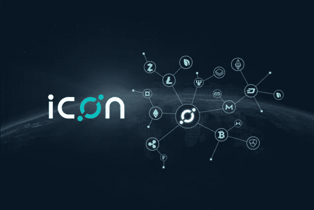

# 偶像:民主和自由市场的化身

> 原文：<https://medium.datadriveninvestor.com/icon-the-embodiment-of-democracy-and-the-free-market-167170046875?source=collection_archive---------5----------------------->

**Icon: The Democracy Of Cryptocurrency**

**民主:简要分析**

民主的概念始于几千年前，起源于古希腊和古印度，尤其是雅典。公民直接投票表决立法和行政法案，然而，雅典的民主远比我们当代的全球民主模式更原始。在雅典，大约 30%的人口可以投票，从我们今天所知道和理解的民主政治范式中吸取了平等和公平。妇女不能投票，外国人不能投票，奴隶也不能投票；你必须是雅典的男性公民才能获得投票立法的特权。民主存在于加纳拉杰亚王国，国王由人民选举，为人民服务；民主可以追溯到公元前 599 年，在古印度的 Vajji，Vaishali。瓦伊沙里不仅是第一个民主至上的地方，也是第 24 个提坦卡拉的所在地，提坦卡拉在耆那教中是救世主和正义之路的精神领袖，也被称为达摩！耆那教是一种独特的宗教，强调对所有生物的尊重；耆那教内部民主的标志，给予每个人和所有事物在我们的世界和宇宙中生活和存在的自由权利。在美国存在的第一个半世纪，我们的民主更多的是家长制贵族，而不是一个公平的共和国。1776 年的开国元勋们拒绝了“古典民主”的理念，即古希腊存在的民主范式，相反，他们强调政府的重点和目标是“自然贵族”，即只有地主贵族才有资格在国会中占有一席之地。随着时间的推移，当代社会的民主开始在美国形成。到 1920 年，随着第 19 修正案的提出，妇女被赋予了投票权，尽管非裔美国人仍然屈从于这种基本的自由缺失；参与政府立法和担任行政职务。1971 年，第 26 修正案赋予 18 岁以上的任何人投票权，因为修正案规定“年满 18 岁或 18 岁以上的人的投票权，不得被美国或任何州以年龄为由予以否认或剥夺。”民主和加密货币因命运而交织在一起，Icon 是这种被称为民主的政治理想的演变和革命的先驱！

**图标和加密货币:民主的下一步，作为意识形态的命运:图标共和国**

Hyperconnect The World: Icon Will Connect The Globe Through A Democratic Ideal

有个朋友曾经问我“你为什么爱加密货币？”我对这个非常简短但现实的问题的回答是“加密货币是民主进化的下一步，它作为一种意识形态的命运。”加密货币是民主在我们社会中变得无处不在的先驱；加密货币体现并促成了一个自由放任的资本主义金融包容性世界，在这个世界中，任何人都可以参与自由市场。加密货币预示着民主意识形态的命运将进入我们社会的金融领域，从而遍及整个世界。加密货币具有有效摧毁指令经济和排他性专制政府模式的力量和影响力！加密货币是分散的，这使得它不需要政府、中央银行或任何中央金融机构就可以存在；加密货币真正将权力还给人口众多的人，这是我们的社会变得越来越专制的必然，侵犯了公民的隐私、权利和整体经济自由。一种新的包容性将通过加密货币崛起，因此，剩下的 20 亿没有银行账户的人最终将能够参与自由的点对点市场。那么 Icon 在这幅图中处于什么位置呢？Icon 是民主的再生者，是金融包容性超连接世界的先驱，这一世界将通过 Icon 生态系统交织在一起。图标的目标是连接现有的私人和公共区块链，区块链是由私营企业，国家，公司和各种组织的构想。这些私人和公共区块链通过图标生态系统融合在一起！这些公立和私立区块链将共同存在于圣像共和国之下，圣像共和国内所有区块链的管理机构！想象一下图标共和国是美国政府，是其管辖范围内所有不同州/区块链的管理机构！Icon Republic 我们打个比方，Icon Republic 类似于美国政府，Nexus Protocol 是当今自由市场的同义词！

**Nexus 协议:资本主义民主自由市场在加密货币中的体现**

I Am Now Become Nexus, The Amalgamator Of Blockchains

Nexus 协议是自由市场的体现，因为它能够通过 C-Reps 将不同的区块链连接在一起，以通过自由市场点对点模式相互交换价值和信息。与美国等民主共和国一样，C-Rep 是从各自的区块链选出的官员，这些 C-Rep 运行 C-Rep 节点，这些节点是将他们的区块链连接到 Nexus 协议的门户！Nexus 协议是一种高性能的区块链，其中不同的私有和公共区块链可以利用 Icon 加密货币作为中介和交换媒介来彼此共享和交换信息和价值。Nexus 协议是自由市场的一个体现，它是一个点对点的范例，使任何现有的区块链能够相互交换价值！在 Icon 生态系统中，民主至上，首席代表通过民主模式任命；这就是为什么 Icon 将成为一个互联民主生态系统的先驱的根本原因之一，这个生态系统将无排斥地超级连接整个地球。任何创建自己的区块链的实体都可以连接到 Nexus 协议，体现资本主义的包容性自由市场。图标生态系统中的另一个促进自由贸易和跨链交易的实体是 DEX 交易所！DEX 交换是一种分散的交换，将存在于 Icon 生态系统中，并使区块链能够相互交换价值。DEX 交易所可以在任何与 Icon Republic 相连的区块链进行交易！在 Icon 生态系统中，很明显，他们的超连接范式与全球范围内的民主和金融包容性直接相关；图标生态系统是一个民主的演变，在我们当代全球化的世界中展现自己！让自由之声响彻图标！

**结论:偶像及其在民主演变中的作用**

The Incarnation Of Hyperconnectivity, A Destiny For Democracy And Inclusion

很明显，Icon 将实现其目标和愿景，提供一个平台，让金融、安全、保险、医疗保健、政府、教育和商业行业的实体可以在一个单一的网络中共存和交易，通过当选的官员(称为 C-Reps 和 Icon Republic)培育一个融合了民主原则的自由市场！图标生态系统是公平和公正的民主的体现，使任何私人或公共区块链交易和交易信息和价值彼此！随着互联网继续冲击我们的世界，民主作为一种意识形态必须适应这种勇敢的新创新，很明显，民主的明显表现可以通过图标生态系统看到！我永远不会对民主及其促进包容、金融自由和人口与国家之间权力平衡的独特能力失去信心，因此，我永远不会对图标生态系统的力量以及它如何体现民主和自由市场自由资本主义的整体失去信心。超连接世界，促进一个更美好的世界！愿我们理解的上帝促进圣像的成长，因为它体现了公平和透明！

*有兴趣了解加密货币和区块链技术吗？报名参加我在 Udemy 上的课程吧！*[*https://www . udemy . com/cryptocurrency-investment-a-初学者-指南/学习/v4/*](https://www.udemy.com/cryptocurrency-investment-a-beginners-guide/learn/v4/)

*免责声明:加密货币投资需要大量的风险，不要投资超过你能承受的损失！我不是金融顾问，也不对你的任何交易负责。我是 Icon Coin 的投资者，本文中的信息代表我自己的想法和观点。在投资任何东西之前，你都要做好自己的研究，这是义不容辞的责任！*

查看我关于数据驱动投资者的文章！[https://www . datadriveninvestor . com/2018/07/25/icon-the-embanization-of-democracy-and-the-free-market/](https://www.datadriveninvestor.com/2018/07/25/icon-the-embodiment-of-democracy-and-the-free-market/)

