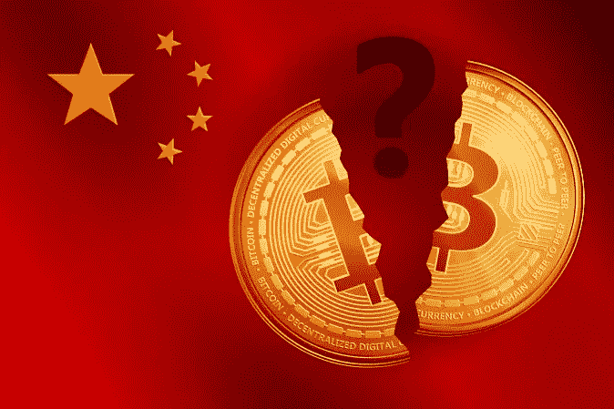
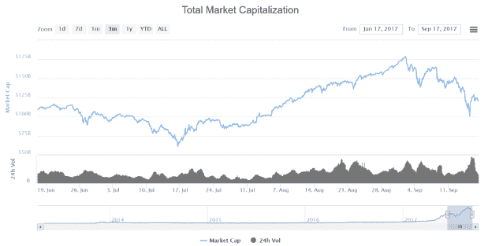
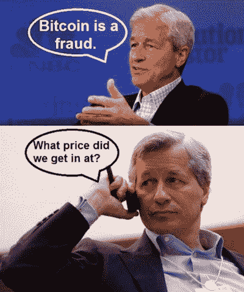
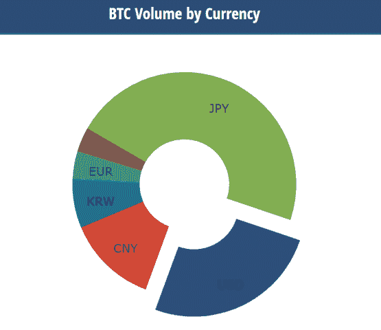

# ico 和加密货币——中国视角

> 原文：<https://medium.datadriveninvestor.com/icos-and-cryptocurrencies-the-chinese-perspective-e5e220b5c94a?source=collection_archive---------7----------------------->

9 月 11 日星期一，华尔街日报[报道](https://www.wsj.com/articles/china-to-shut-bitcoin-exchanges-sources-1505100862)中国政府打算关闭国内的比特币交易所，仅仅在七天前，当局宣布完全禁止通过 ico 集资，理由是它们“严重扰乱了经济和金融秩序”加密货币的价格随后急剧下跌，到本周末，数百亿美元从市场上抹去。

目前的情况是，在中国举办和参加国际奥委会都是被禁止的。在政府的指示下，比特币交易所现在也准备暂停服务，中国历史最悠久的比特币中国交易所(BTC China)于 9 月 15 日正式宣布，计划在本月底停止其中国客户的所有交易。 [OKCoin](https://www.okcoin.com/) 和 [Huobi](https://www.huobi.com/) 是中国最大的两家交易所，它们被给予了额外的活动余地，可以运营到 10 月 30 日，迄今为止它们还没有参与 ico。

**故事至此**

这一切似乎是在 8 月的最后一周开始的，当时当地媒体开始报道中国人民银行(PBOC)于 8 月 18 日召开的一次会议导致制定了打击国内 ico 的计划。9 月 4 日，包括 PBOC、中国证券监督管理委员会和中国银行业监督管理委员会在内的七个中国政府监管机构发布了一份官方联合声明，声明他们禁止所有组织和个人通过 ICO 筹集资金，所有银行和金融机构不得从事任何与 ICO 交易相关的业务。

一周后，中国的比特币和加密货币交易所收到了必须自愿关闭的命令，据报道，理由是它们在没有正式许可证的情况下在国内运营。从监管者到交易所的六步计划[也浮出水面](https://www.weibo.com/3487056872/FlW6D7Wde?type=comment#_rnd1505709422934)，要求他们拿出一个清算计划；组织用户资金存管；宣布停止所有虚拟货币的交易；确保股东、控制者、高管和核心财务/技术人员的合作；向地方当局报告发展情况，并保存所有用户交易和持有数据，以便提交给地方当局。

在中国禁令的支持下，市场在设法大幅逆转之前陷入混乱。9 月上半月，加密货币总市值减少了约 45%，最终达到自 8 月初以来的最高水平:

**为什么中国破坏了这个聚会？**

值得记住的是，中国的禁令是在近几周几乎每个主要经济管辖区的监管机构发表一波与 ICO 相关的、吸引头条新闻的断言之际出台的。他们很大程度上是为了应对越来越多的担忧，即监管机构在防止 ico 欺诈投资者方面无能为力。大多数国家都效仿了美国证券交易委员会的做法，包括新加坡、加拿大和最近的香港，它们都宣布了与美国同行大致相同的观点:*如果根据 ICO 发行的代币符合证券的定义，它们应该受到监管，参与举办这种活动的人必须获得许可和/或在当地监管机构注册。*

*但是中国的行动是迄今为止最全面的——似乎也是最有影响力的。同样，监管机构的动机似乎是受到日益增长的欺诈行为威胁，七大机构的联合声明保留了对“非法出售代币、非法发行证券和非法集资、金融欺诈、传销和其他犯罪活动”的特别谴责。声明还强调了“严格执法”的必要性，并明确要求通过 ico 筹集的资金应予以返还，以“保护投资者的利益，妥善处理风险”，否则将因不合规而面临处罚。*

*在某种程度上，中国在 ICO 生命周期的早期阶段(尽管如此，仍是爆炸性的阶段)停止诉讼是有道理的。[正如我们最近强调的](http://www.datadriveninvestor.com/2017/09/18/will-regulation-be-beneficial-for-icos/)，ico 的发展如此之快，以至于区块链初创企业筹集的资金现在已经超过了早期风险资本融资产生的资金。*

*此外，仅在 2017 年，全球 ico 筹集的所有资金中就有大约 85%发生在这里，这表明目前的增长率是多么惊人。国家互联网金融协会最近的一份[报告](http://www.nifa.org.cn/nifa/2955698/2955748/index.html)强调了中国对今年全球 ICO 激增的巨大贡献。在头六个月，总部位于中国的 ICOs 通过 65 场独立的销售活动筹集了 4 亿美元，吸引了超过 10 万名投资者。*

*因此，随着加密货币市场和 ico 的扩张越来越快，许多人认为该国最近的禁令只是一个临时解决方案，将使监管机构能够清除邪恶的一方，然后允许 ico 恢复适当的保护性监管。事实上，政府支持的金融与银行研究所的研究员胡兵最近也证实了这一点。在接受中国电视台采访时，冰解释说，的停赛只是暂时的；该框架旨在为投资者和发行者提供适当的帮助，政府打算在不久的将来恢复正常服务，*尽管*处于更受控制的环境中(可能以类似于纽约州金融服务局(NYSDF)目前实施的 [BitLicense 计划](http://www.dfs.ny.gov/legal/regulations/bitlicense_reg_framework_faq.htm)的方式)。*

*与此同时，加密货币社区中更愤世嫉俗的人表示，权力机构参与了一场“FUD”运动——这是一种常见的术语，用来描述向程序中灌输*“恐惧、不确定性和怀疑】*，最终目标是压低加密货币的天价，以培养一个购买机会。中国目前是否在参与 FUD 事务？这似乎有些牵强——尽管摩根大通有更充分的理由参与此类行为。*

**

*What seems less cynical, however, is the fact that we are now close to the commencement of the 19thNational Congress of the Communist Party of China. This once-every-5-years event is hugely significant for the current Chinese leadership, especially President Xi Jinping who must ensure that he secures his second five-year term in power. While many expect Xi to carry on in charge, it is by no means a foregone conclusion, which makes the National Congress being held on October 18thcrucially important. In the run-up to this event, therefore, the most politically expedient strategy for Xi would be to ensure that any potential economic and reputational risks are minimized, and that stability and harmony are maintained. This makes the suppression of the unpredictable ICO and cryptocurrency space all the more understandable.*

***The Implications for Cryptocurrency Markets***

*With Bitcoin exchanges in China due to go offline imminently, can cryptocurrency prices recover in China’s absence? Well it appears that Bitcoin et al. have already managed to shrug off much of the gloom, with the world’s most dominant digital currency rallying by $600 from friday’s low (September 15, 2017) and finishing around 12% higher after 24 hours. And now Bitcoin is hovering around the $4000-mark once again. The rally continued on with Bitcoin breaking its historical high on Thursday, October 11, to the levels of $5500–5700.*

*In its eight years or existence, nothing has managed to keep Bitcoin down for any significant length of time. Given the decentralized, globally inclusive nature of cryptocurrencies, it is unlikely that China’s bans will have any lasting impact either. As recently [observed](https://twitter.com/SimonDixonTwitt) by noted FinTech investor Simon Dixon, “They tried to copy it, fork it, ban it, clone it, ridicule it, launch at it, discredit it and kill it and yet #Bitcoin is still sound money.” It’s a brave person who bets against Bitcoin continuing to scale new highs in the near future, with or without China’s input.*

*当然，中国在全球主要加密货币交易国中的巨大影响力不应被低估。丰富的廉价能源，加上该国电子产品和硬件的低价格，使得硬币开采——即验证新交易和将新区块添加到区块链的过程——蓬勃发展。事实上，[估计表明](https://www.yicaiglobal.com/news/china-mines-70-bitcoins-survey-says)中国控制了比特币全球 70%的开采权。在过去的几年里，政府对人民币的控制也无意中帮助推动了大量比特币的诞生。事实上，T2 的经济政策很大程度上依赖于严格的资本控制，这或许也是最近禁止交易所的最有力的解释之一。由于加密货币提供了一种简单、安全且具有成本效益的方式在全球范围内传送价值，中国公民对加密货币交易的贪得无厌——交易规模高达数十亿美元——似乎很有可能构成一个非常现实的威胁，即过量的法定货币可能会离开中国。*

*但如今，中国不再像过去那样是一家独大的加密货币交易强国；事实上，它的影响力已经大大减弱。几年前，中国几乎占全球比特币交易的 90%。如今，这一比例仅为 10%左右，而且在禁令颁布后的未来几周内，这一比例似乎还会下降。在此期间，日本、美国和韩国等其它国家也加强了自己的存在；事实上，日本控制着全球近一半的比特币交易量。*

**

*[Source](https://www.cryptocompare.com/coins/btc/analysis/USD)*

*此外，随着中国内地交易量的萎缩，香港、日本和韩国的交易量继续上升，也就不足为奇了。如前所述，香港迄今采取了相对宽松的“美国式”监管方式，而不是跟随中国更严厉的脚步；反过来，随着中国的比特币业务被赶出内地，流向邻国，这对香港特区以及日本和韩国应该是一件好事。这似乎肯定是行业中坚分子的观点，比如 BitFury 的副主席 George Kikvadze，他预计中国的销量将完全消失。类似的扩散也可能发生在中国的 ICO 活动上，香港比特币协会(Bitcoin Association of Hong Kong)主席 Leonhard Weese 最近指出，“*中国人在营销这些活动时会更加小心，很多营销活动将以会议和社区的形式来到香港。”**

***结论***

*全世界密码爱好者口中的 6400 万美元的问题是，中国的禁令是暂时的还是永久的。如果它们像胡兵等人认为的那样是暂时的，那么中国经历这种权宜之计最终可能会对全球 ICO 生态系统产生积极影响。这将使当局能够掌握如何最好地区分合法和非法活动。一旦这一点可以确信无疑，ico 就只能更有把握地与成熟、合法和永久联系在一起——这些品质是空间自身发展以及吸引“聪明钱”所迫切需要的。*

*此外，不管禁令的期限有多长，应该强调的是，近期的行动不应妨碍中国继续成为区块链研究的全球领导者。正如 PBOC 研究所所长孙国峰最近所说的，*“区块链本身是一项很好的技术，ICO 并不是人们对其进行研究的唯一途径。”*此外，最近的监管行动并没有阻止中国继续其开发自己的国家加密货币的计划[，这是它已经研究了一段时间的事情。](https://www.bloomberg.com/news/articles/2017-02-23/pboc-is-going-digital-as-mobile-payments-boom-transforms-economy)*

*但随着比特币价格反弹至 5000 美元以上，或许从最近几周的事件中最大的收获是承认加密货币令人钦佩的弹性。它拒绝被中央集权的政府影响所吓倒。虽然利润机会可能会在短期内推动这种弹性，但一种对去中心化世界的新兴信念可能会在长期内维持这种弹性。看起来，我们的数字经济未来正日益光明。*

# *评论*

*评论*

**原载于 2017 年 10 月 15 日*[*【www.datadriveninvestor.com】*](http://www.datadriveninvestor.com/2017/10/15/icos-and-cryptocurrencies-the-chinese-perspective/)*。**