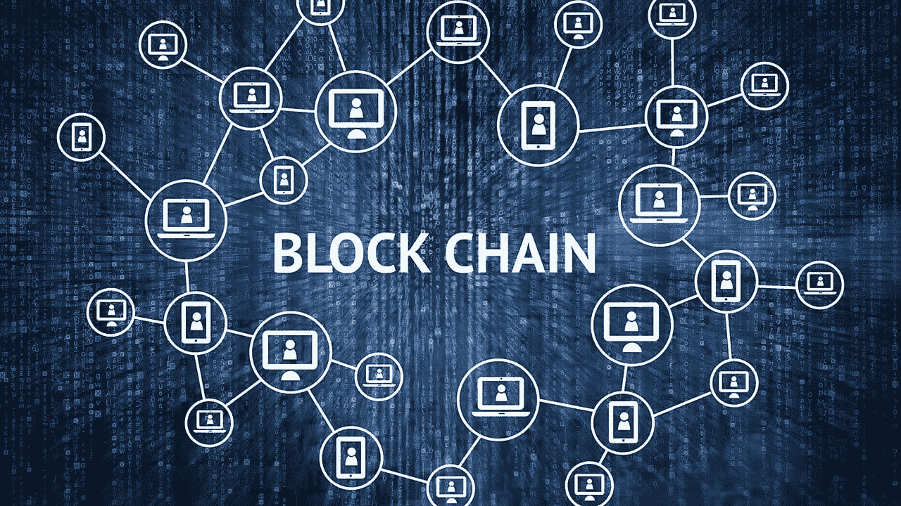
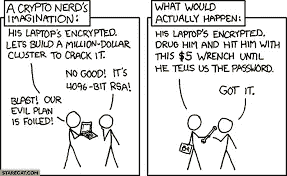
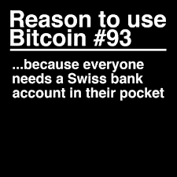
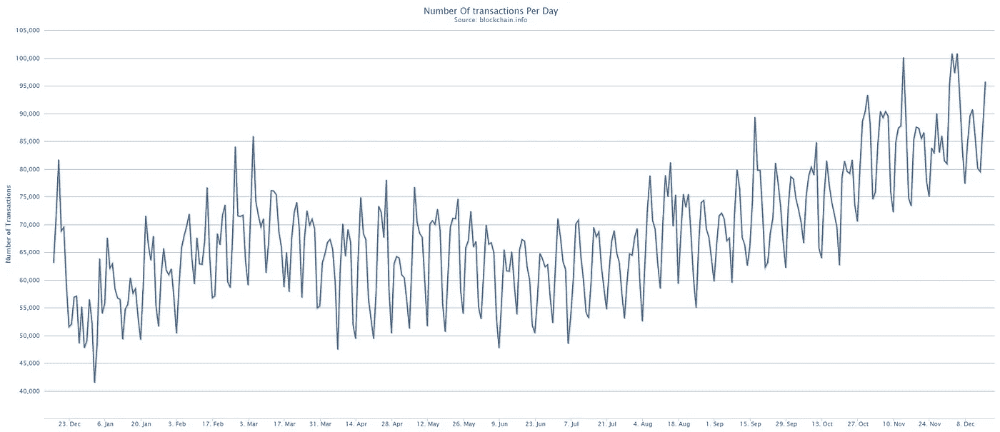
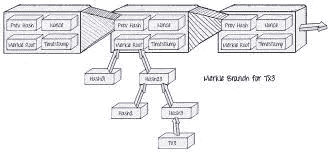
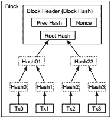
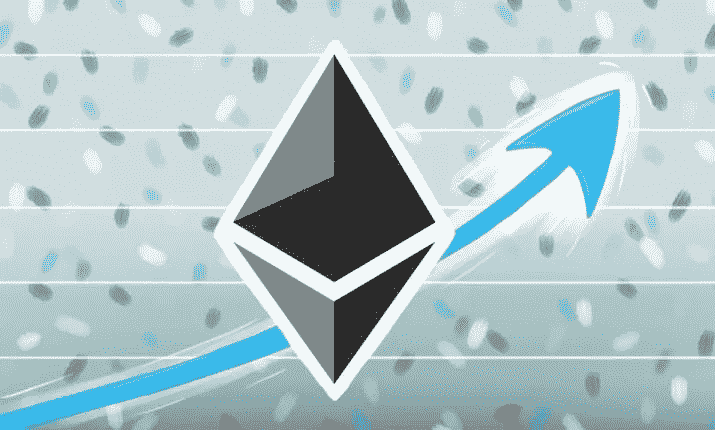

# ICOs、区块链技术和加密货币讲解(摘要)

> 原文：<https://medium.datadriveninvestor.com/icos-blockchain-technology-and-cryptocurrency-explained-summary-d82b0bda629c?source=collection_archive---------2----------------------->

这一切都始于密码学，就在不久前，有人想到用算法和计算来表示交易，而这些交易就是信息的供应和传递。分散术语，与所有传统原则相反，被引入应用于技术和交易领域。这只不过是又一次引入民主，事实上，人们是真诚地非常喜欢民主的。

另一个人引入了“分片”这个术语。这个术语解释为，“在一个地方将来自不同来源的加密信息相加，然后解密，得到整个有组织的信息”。等等，那不是信息的“集中”吗？我只是问问。

然而，人们并不认为一开始它就有自己独特的解决数学问题的方法，而且这样做的回报是巨大的。人们普遍认为，他们不太合群，也不太快乐，他们在自己周围筑起了四堵墙，他们也不想跨越这些界限。对这类人的普通称呼是“书呆子”。

(photo source : starecat.com)

然而，这个想法在“比特币白皮书”中得到了很好的解释。除了“书呆子”之外，很少有人对这些解释感兴趣。他们不愿意接受革命正在敲门的事实。很快,“书呆子”社区被“不那么书呆子”所追随，这个想法最终变得越来越大。

每当进行国际交易时，这个世界就被额外的费用和大量的手续所负担。它变得如此简单，以至于在地球上进行任何交易都只需要一台电脑和互联网连接。尽管如此，这个想法和概念并没有在世界范围内被接受。“书呆子社区”从未失望过，默默地等待着。

有一天，人们开始对这种独特性着迷，起初他们对此持怀疑态度。“比特币”的概念和想法开始得到应有的普及。从这一点上，价格开始变得越来越高，在不到十年的时间跨度，它是最昂贵的货币，虽然在世界各地都受欢迎。

这个概念是关于不同的节点，参与一个团体，被称为“区块链”。这些节点，即计算机，将它们的计算能力用于解决数学问题，并且当一个节点解决问题时,“工作证明”必须由参与区块链的所有其他节点验证，或者至少由参与区块链的大多数节点验证，即超过 50%的节点验证。使用的数据很多，为了解决这个问题，引入了“Merkle Tree”的概念，通过这个概念，验证的事务用于创建“Merkle Tree”结构，并在删除后通过形成“key”来删除，key 用于表示它们。

对于每一组交易，都会形成一个“区块”，为了保持系统的运行，每个区块都会获得“比特币”的奖励。每隔四年，每个区块的奖励就会减半。至于现在，形成的每块是 12.5 比特币。在接下来的几个月里，它将再次减半。

比特币成功后，另一个年轻得多的“书呆子”在区块链提出了“智能合约”的想法。这些智能合约是程序和简单的“if then else”命令，添加到“区块链”中，需要遵循一定的规范，是“以太坊区块链”的一部分。这些规范和标准被称为“ERC20”。仅仅通过确保对代币的适当管理以及代币在账户中的存在，就是这种“ERC20”模式的主要动机，这是一种强制要求。

与比特币区块链不同，以太坊区块链提供了一个肝脏，在那里你可以开始一个全新的区块链。无差别地创建一个新系统，并可以遵循 ERC20 的规范，开始在该区块链上创建以太坊。引入了“代币”一词，随后又引入了“众筹”和“首次发行硬币”。这类似于首次公开募股，但又有很大的不同。这些代币是参与任何新项目或小型新兴企业的代币。无论人们是否喜欢这个商业理念，当他们必须投资时，他们可以得到代币，随着代币上市，价格上涨，每个人都受益。企业获得资金，人们最终获得利润。

小型和新兴企业的 ICO 最近成为一个热门趋势，特别是在 2017 年。据预测，在 2018 年，它会变得更大，因为除了以太坊和比特币，像 EOS 这样的系统也会有新的引入。人们依赖于“每秒更多的交易”这一基本原则，这被认为是区块链的效率，即每秒可以交付多少交易。

信息的分散化使得权力和权限被分配给许多参与的每个人，因此在区块链的情况下欺诈活动很少发生。它现在不再仅仅与钱有关了。代币现在已经被分为两类，“实用代币和安全代币”，它们不仅满足金钱，也满足关于解决方案的社会问题。社会和大众福利解决方案、银行和交易相关解决方案、大众技术使用解决方案以及技术人员的日常使用已经通过最近引入的几个令牌而得到简化。