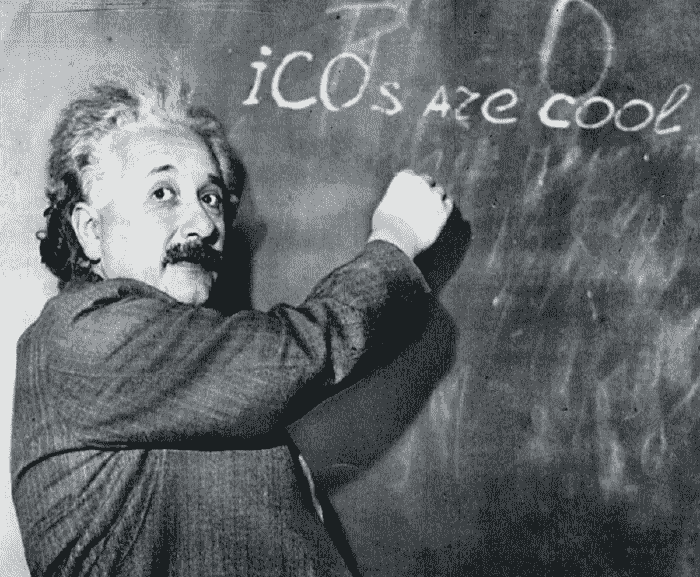
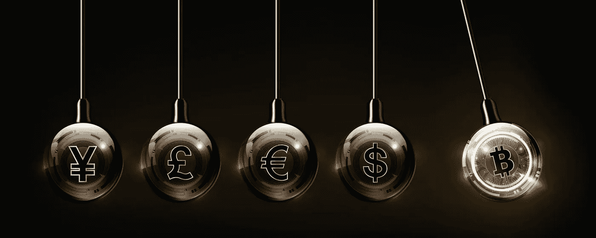

# ICOs、STOs、ETOs 和所有这些爵士乐…

> 原文：<https://medium.datadriveninvestor.com/icos-stos-etos-and-all-that-jazz-e7f85919945e?source=collection_archive---------18----------------------->

www.healthbank.coop

瑞士健康银行即将推出 2018/2019 年度评级最高的 ico 之一。但是什么是 ICO 呢？ICO、STO 和 ETO 之间有什么区别？是什么让一个比另一个更好？

**我渴望事情变得更简单的时候……**

从历史上看，企业基本上要么是利润驱动的企业，要么是百分比驱动的企业。

**那么什么是利润驱动的业务呢？** 利润驱动的生意相当简单。你生产一种产品，它的生产成本是特定的。你以不同的价格出售。一个减去另一个叫做**毛利润**，然后你减去运营公司的费用，那就是**净利润率**。咄！！！这基本上是一个相对简单的过程。你生产和销售的产品越多，你赚的钱就越多。然后你可以进行神奇的首次公开募股(IPO ),将你的企业上市。耶！！！大获成功！！！

**还有百分比驱动的业务？百分比驱动的业务是指你向尽可能多的人销售低利润的产品。一个百分比驱动的企业要想真正成功，你的目标应该是触及你所针对的全球市场的 3%。超过 3%,你就会成为该领域其他公司的威胁，他们要么不得不收购你(神奇的合并),要么不得不放弃越来越多的市场份额。**从历史上看，世界上最大的企业都是触及 100%人口的百分比企业。像吉列(每个人都刮胡子)或高露洁(每个人(除了我听说的法国人)每天至少刷两次牙)或可口可乐这样的公司。我不相信世界上有一个人不知道可口可乐这个品牌。我甚至打赌，任何阅读这篇文章的人都可以闭上眼睛，立即想象出可口可乐标志的红色和草书字体。百分比驱动业务的优势在于，你不仅能从销售产品中赚钱，还能建立一个特别强大的品牌形象，帮助你在未来销售其他产品。****

在过去的几年里，出现了大量令人眼花缭乱的新金融工具，让外行人对金融感到困惑。在一个真正需要理解基础知识的世界里，金融术语和首字母缩略词被肆无忌惮地四处传播。那么这些术语实际上是什么意思呢？一个 **ICO** 、 **STO** 和 **ETO** 有什么区别？它们都是打开永恒财富之门的神奇金钥匙吗？

> ***生活真的很简单，但是我们坚持要把它变得复杂。***
> 孔子

**那么什么是 ICO 呢？** ICO 代表**首次公开募股**，基本上是一种更简单、更不复杂的 IPO 方式(首次公开募股(当你将公司上市时))。ICO 相当于加密货币领域在主流投资领域的首次公开募股。公司利用 ico 来筹集资金。寻求创造新硬币、新应用或新服务的公司推出 ICO。接下来，感兴趣的投资者购买该产品，要么使用固定货币，要么使用以太网或比特币等现有的数字代币。作为支持的交换，投资者将获得一个新的专用于 ICO 的加密货币令牌。投资者希望这种代币在未来会表现出色，为他们提供可观的投资回报。持有 ICO 的公司将投资者资金作为推进其目标、推出其产品或启动其数字货币的手段。ico 被初创公司用来绕过风险资本家或银行要求的严格和受监管的融资流程。

**还有一个 STO？** STO 代表**证券代币发售**。因为存在大量完全愚蠢和高风险的 ico，而且 ico 基本上是为了绕过 IPO 附带的严格法律法规以使投资更容易而设计的，ico 使用了一种叫做“实用令牌”的东西。但公用事业代币从根本上来说是有缺陷的，因为它们是为了规避证券法而设计的，不可能长期存在。正因为如此，ICO 现在正慢慢被 STO(证券代币发行)所取代，在这种情况下，投资者的权利受到比 ICO 更强有力的保护。有一些伟大的 ico 正在使用公用令牌，但好的 ico 很容易与轴区分开来，因为它们与 IPO 建立在相同的价值建议上，只是使用了加密货币。

**还有一个 ETO？** ETO 代表**股权代币发行**。股权代币发行是这些新一代融资的最新版本，允许任何类型的公司在区块链上公开或私募发行股权代币。股票代币为投资者和发行者保证了重要的类似股票的权利。股权代币发行将两个世界结合在一起，确保各方的实际利益。投资者和公司都同样受到激励。区块链技术的透明性所提供的信息对称性使各方更容易取得成功。

**还有一个 UWE？** 其实，Uwe 只是我的名字，没有任何意义……只是想看看你会不会把这看完。

在过去的两年里，我们看到了日本猫、T2 圣诞硬币和 T4 耶稣硬币的 ico。有一种**罐币**被设计为大麻产业提供一个分散的银行基础设施。汉堡王俄罗斯公司宣布了**巨无霸积分**计划(顾客每消费一卢布可获得一个巨无霸积分，累积 1700 个巨无霸积分的顾客可获得一个免费汉堡)。做数学…

> ***赞美克苏鲁，伟大的洛夫克拉夫特宇宙海兽……***

**克苏鲁供品**可能是当今最奇怪的加密货币，似乎是基于一只传说中的巨型章鱼的 ICO，硬币是祭祀仪式的一部分。 **Sex Coin** 和 **Tit Coin** 都是为色情网站上的产品购买和交易而设计的，而 **SpankChain** 为构建安全、匿名的色情应用提供了一个令人愉快的区块链基础设施平台。世界是一个美丽的地方…

事实上，有几个简单的要点可以区分一个伟大的 ICO 和一个骗局。但是最重要的一点经常被忽视，那就是,**ICO 实际上代表什么。它想达到什么目的？**当然，有所有标准的分析工具可供参考，如团队、时间表、媒体、代码样本、法规、发行、白皮书、全球潜力和流通供应，但最常被忽视的方面是**目的**。

你真的只需要问问自己“我会买吗？”

一个真正有价值的 ICO，应该在以上所有矩阵上得分很高，但也应该有一个使命，一个让世界变得更美好的使命，而这样的 ICO 就是 healthbank。

点击了解健康银行 ICO