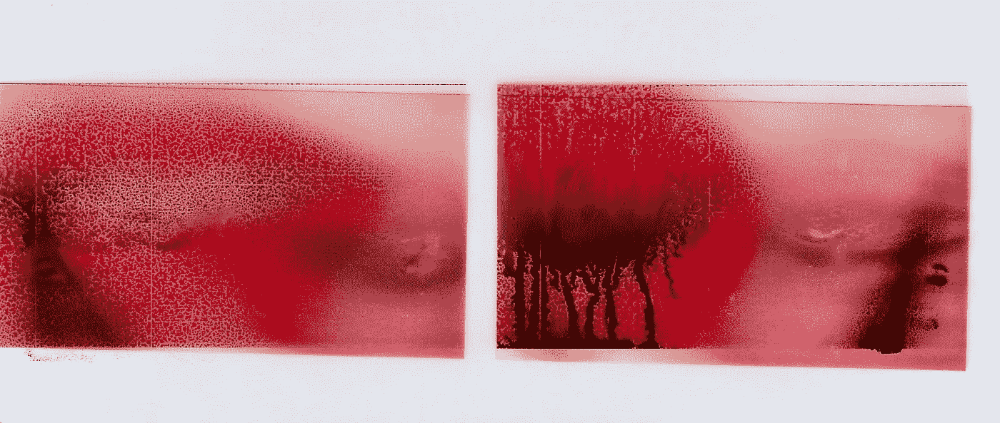
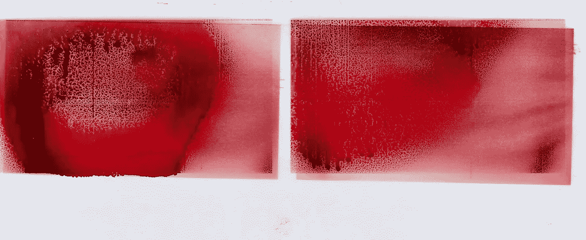

# “如果可以我会脸红”；对“女性”语音助手技术的思考

> 原文：<https://medium.datadriveninvestor.com/id-blush-if-i-could-a-reflection-on-female-voice-assistant-technology-a1238bf01021?source=collection_archive---------5----------------------->

## 是时候谈谈我们如何与女性虚拟助理交流了

> 《壳中幽灵》以一个非常短的场景开场，一个笑话，其中提出了电子人生殖的第一个问题。我们的主角，特种安全部队军官草薙本子少校，通过她脖子后面的四个接口插座接入网络。一个同事在网上和她聊天，说她今天脑子里有很多静电。“是啊，”她嘟囔着，“我来例假了。“‘shara Lyn or baugh(2002)‘性与单身电子人:日本流行文化中的主观性实验’。

士郎正宗 1995 年的动画《贝壳中的幽灵》记录了警察局长草薙本子在未来世界中作为半机器人人类混血儿的挣扎，在未来世界中，半机器人的贝壳里藏着人类的幽灵；在 2029 年，世界已经通过“网络”相互联系起来，这是一个电子网络，这些鬼魂可以在其中交流并被永久保存。我们的主角必须追捕和跟踪虚幻的项目 2501，“傀儡主人”，一个软件程序变得有知觉，作为一个无性和无形的存在，侵入平民的鬼魂，植入虚假的记忆和身份，以操纵他们。

几年前再次观看这部电影，并随后阅读了 Sharalyn Orbaugh 对它的精彩演绎，这是我第一次开始考虑赋予半机械人身体人工声音的不可思议的性质，以及性别化的声音和机械身体之间的脱节——少校的话有点滑稽，从一开始就建立了身体的物质性和技术的“非物质性”之间的关系。草薙矛盾的身体内的干扰或杂质似乎完全控制创造了一个紧张点，其中提到一个有机的人体似乎不和谐的不可思议的点。在提到物质身体，特别是女性时，这部电影提出了人工智能声音性别化的问题，而虚拟助手如 Alexa 的女性化则强化了女性顺从的陈旧刻板印象。

> 多年来，Siri、Alexa、Cortana 和它们的前身一直在做这项工作，准备回答严肃的问题，并转移荒谬的问题。虽然她们没有身体，但她们体现了我们想象中的私人助理:一个能干、高效、可靠的女人。她通过提醒和指引让你准时参加会议，为通勤提供阅读材料，并在途中提供相关信息，如天气和交通。不过，她不是负责人。钱德拉·斯蒂尔(2018)关于女性语音助手。

《蛋壳里的幽灵》是一长串使用人工女声的电影中的一部分，尤其是女助手。从斯派克·琼斯的《她》到瑞克·戴克的最新一部《银翼杀手》(2049)，女性的声音既是母性安慰的源泉，也是浪漫趣味的源泉。这些声音为男主角提供了指导、情感支持和同情，同时反映了语音技术在我们日常生活中的角色变化。虚拟助手的声音牢牢地嵌入到我们的现实中，从控制我们家里的灯到在旅途中为我们搜索谷歌；口袋里有一个私人助理只是另一种招募技术来帮助我们平稳生活的方式。这种转变似乎很自然——我们的大脑天生适合口头交流——然而，关键是要记住我们口头交流方式的碎片化本质；毕竟，对话不是没有摩擦的，演讲充满了打断和错误。通过技术走向无摩擦的未来使得这样的感叹——很像少校对她那个时期的评论——在我们投射到技术上的人类个性和他们的客体现实之间产生了冲突。

> [“如果可以的话，我会脸红的”不是你在告诉 Siri 她是个荡妇时所期望听到的回应——但事实就是如此。](https://qz.com/work/1151282/siri-and-alexa-are-under-fire-for-their-replies-to-sexual-harassment)‘莉亚·费斯勒(2017)对 Siri 进行性骚扰。

语音助手的女性化提出了不仅仅是简单的人性化技术的问题；这些性别化的界面迫使我们解决如何与“女性”声音和角色互动的问题。当面对对数字助理的“性暗示、性露骨和性虐待”的评论时，从“你很漂亮”、“你是个婊子”到“吸我的老二”，利亚·费斯勒指出，大多数虚拟助理的方法是重定向。编程到这些人工智能中的被动是一种更广泛的叙事的症状，这种叙事延续了女性顺从和天真的刻板印象。

科幻电影处理和/或利用技术或其他词的女性经常操纵这种天真——文化评论家乔纳森·麦金托什首先让我注意到这种对女性的比喻[“生来性感的昨天”](https://www.patreon.com/posts/born-sexy-9363945)，这个词被用来描述科幻小说中的女性角色，她“有一个天真的，但非常熟练的孩子的头脑，但在一个成熟的，性感的女人的身体里”。他们经常充当男主角的情人，在他们漫游周围的世界时需要他们的指导。他引用《T2》、《第五元素》(T3)(1997)等电影作为这种比喻的主要例子，认为进入人类世界的女性角色是完全成熟的成年女性；这些女性角色的一个关键方面是不知道她们的性吸引力，这给了导演机会展示这些女性在男性面前脱衣服，而不理解这种行为的含义或社会规则。

> “这个比喻并不是真的关于女性角色，其核心是这个惯例是关于男人对有经验的女人的恐惧。”乔纳森·麦金托什(2017)在谈到“生来性感的昨天”时说道。

追溯其根源可以追溯到殖民主义的幻想，其中白人男性探险家将“揭开”土著妇女，“生来性感昨天”利用女性的差异在她和她的男性同伴之间创造一种动力，这种比喻助长了男性和女性角色之间令人不安的权力关系。虽然比喻主要被描述为一种关系动态，但女性语音助手的吸引力可以说在于她的非威胁性地位。

就像麦金托什在他的视频评论中指出的那些女性一样，Alexa、Cortana 和 Siri 等助手对他们的知识获得了一定程度的信任和尊重，但却处于他们主人的控制之下；他们*回应*命令和请求，但不发起或推动意见。可悲的是，他们往往遵循现实世界中女性的刻板印象——讨人喜欢、被动、顺从。