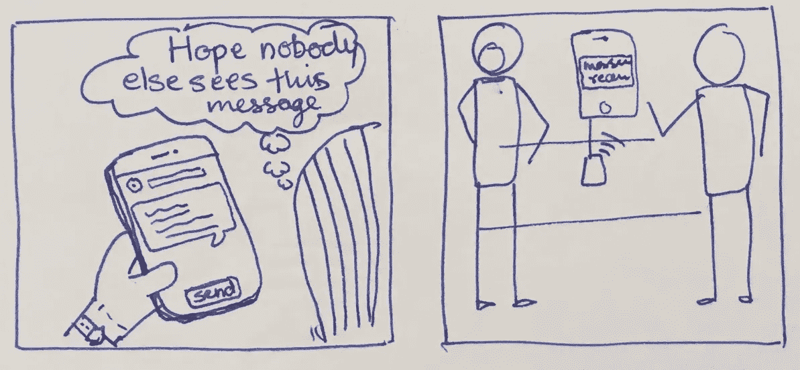
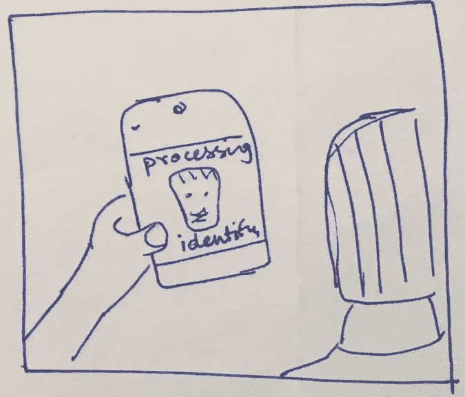
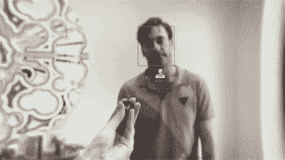

# 想法:使用生物特征进行安全通信

> 原文：<https://medium.datadriveninvestor.com/idea-using-biometric-for-safe-communication-d1e47c04b1f9?source=collection_archive---------20----------------------->

电子通讯和隐私是一个小时的需要。我们如何利用生物识别技术实现人与人之间安全可靠的信息共享？

## 问题

我肯定你会遇到这样的情况:给某人的信息被别人读了。或者你在 Whatsapp 或电子邮件上错误地向错误的群体发送了一条信息。c̶u̶r̶r̶e̶n̶t̶l̶y̶,̶̶t̶h̶e̶r̶e̶̶i̶s̶̶n̶o̶̶b̶i̶o̶m̶e̶t̶r̶i̶c̶̶l̶i̶n̶k̶a̶g̶e̶̶w̶i̶t̶h̶̶a̶n̶y̶̶m̶e̶s̶s̶a̶g̶i̶n̶g̶̶a̶p̶p̶s̶.(Whatsapp 昨天发布了一项功能，使用指纹链接应用程序级认证。尽管如此，这仍然是一个应用程序级别的认证)。

因此，如果你的手机/笔记本电脑已经解锁，而有人坐在你旁边，他们可以立即看到这条信息。他们可以点击它来查看或者偷看它。

## 解决办法

启用生物识别，如面部识别或指纹，甚至语音命令签名来打开邮件。并且这可以应用于由发送者和所选择的预期接收者标记为秘密或机密的消息。只有在成功验证了收件人的生物特征后，邮件才会打开。生物特征数据可以驻留在边缘设备上，而访问该生物特征签名的公钥可以存储在云系统中。

> 在应用程序使用的不同级别启用生物特征认证可以提供比仅在应用程序级别更好的用户体验，在应用程序级别，整个使用都被阻止

因此，除非你，即原始收件人(通过你的指纹和 faceID 验证)看了邮件，否则他们对其他人来说是模糊的。他们仍然可以查看其他消息(有些情况下，您会向家人或朋友展示照片/消息)。

通信中设置消息访问权限的不同认证级别

*   应用
*   组
*   消息
*   接触
*   一组联系人

iPhone 提供了使用 faceID 或指纹的鉴定机制。更好的系统可以是基于语音和面部识别的认证的组合，以打开预期的消息。可以理解，这种系统的成功高度依赖于硬件的精度。

## 其他场景

该解决方案还可以选择不想看到该消息的人。其余的都可以查看。这就像只为选定的联系人设置 Whatsapp 状态消息一样。

## 未来——用于识别整体的传感器组合

未来生物识别通信系统的 UX 可以在《黑镜》的一集中看到，其中一个人阻止她的丈夫发送和接收任何通信——来自和发给她的视觉、文本、音频。

此外，随着越来越多的传感器开始嵌入，我们可以有更多的组合来识别一个人和接收者的真实性。

识别汗液、虹膜、声音模式、身体气味、心率节律等的传感器。可以有效地使系统更加健壮。嗯，有很多事情可能会出错，因为许多这些签名需要保存在网络中，这可能会被滥用。

[*库马尔·阿希尔*](http://www.kumarahir.com) *是沉浸式技术和设计领域的独立顾问。他是新的沉浸式技术和设计的传播者，积极参与设计思维、AR 和 VR 设计、混合现实技术原型的研讨会。*

他的目标是为沉浸式技术创造一个更好的设计生态系统。

*在*[*LinkedIn*](https://www.linkedin.com/in/kumarahir)*和* [*Twitter*](https://twitter.com/kernel_kumar) 了解他更多

## 来自 DDI 的相关故事:

 [## 用 7 个步骤解释深度学习

### 和猫一起

medium.com](https://medium.com/datadriveninvestor/deep-learning-explained-in-7-steps-9ae09471721a)  [## 数据科学和软件工程哪个更有前途？

### 大约一个月前，当我坐在咖啡馆里为一个客户开发网站时，我发现了这个女人…

medium.com](https://medium.com/datadriveninvestor/which-is-more-promising-data-science-or-software-engineering-7e425e9ec4f4)