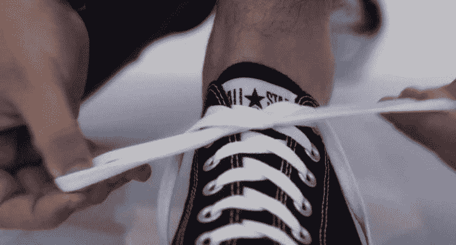

# 关于咨询和鞋带系紧机的思考

> 原文：<https://medium.datadriveninvestor.com/ideas-about-consulting-and-the-shoelace-tying-machine-6944271993ce?source=collection_archive---------24----------------------->

要解释做顾问意味着什么有点难。或者也许困难的部分是让另一边的人理解。每当我想解释成为一名沟通者意味着什么时，同样的事情也会发生在我身上。在某些时候，有些事情失败了，理解不太可能发生。因此，运用我在这两个领域所学到的知识和经验，我将试图解释成为一名顾问意味着什么，*如果一切顺利*，也许我还可以在字里行间阐明成为一名沟通者意味着什么。

作为一名沟通者，我相信**类比**是传递思想的优秀工具。为了理解什么是咨询，一个很好的类比是把它看作是设计和制造一台可以系鞋带的机器的必要过程:**一台**鞋带系结机。好吧，这样说，听起来很简单，因为这是我们每天都在做的事情，但我们已经将这个 ***纳入*** (字面意思是*在我们体内*)并自动化了，所以实际上很难将系鞋带的过程分解和原子化到足以将这个过程整理成一个清晰、简洁和可操作的描述，以便任何人都可以阅读它并执行它，而不需要任何先前的知识。尽管如此，在写这篇文章之前的研究阶段，我发现有很多人试图解释如何做到这一点。

人工智能领域有一个概念，叫做 [**莫拉维克悖论**](https://en.wikipedia.org/wiki/Moravec%27s_paradox) 。这种想法是，某些对人类来说很难的任务(如 98，723，958，723，985 乘以 53，975，298，370)由计算机非常容易地执行。另一方面，某些对人类来说非常简单的任务(如叠衣服或系鞋带)对计算机来说却超级复杂。

为了让你明白这是为什么，以凯利和扎克·韦纳史密斯在他们非常棒的书[**soon ish**](https://hivemill.com/collections/smbc/products/soonish)(*我不能强烈推荐*)中给出的极好的例子为例，它是这样的:考虑以下哪些任务你更愿意向一台没有人类直觉的机器解释:

1.将两个数相乘:983，791，732，905712，937 乘以 8，189，237，519，273，597

2.指出哪一面是画的上面

即使你不知道如何解释它，你可能会意识到，为了向计算机解释选项 1，你应该能够写几个简单的步骤:“取第一个数字的第一位，然后乘以第二个数字的每一位，从左到右”，等等。这不会特别有趣，但是你可以通过编写一套有效的规则来解决这个问题。第二种选择乍一看似乎很简单，直到你试图解释它。例如，当你看到一张人脸图像时，你知道“向上”意味着眼睛在嘴的上方。这是一个很好的规则。除非人是倒挂的。但是，我们如何确定一个人是倒挂着的呢？也许通过看地平线，或者因为我们看到他们的头发垂着。但是等等，你怎么向电脑解释头发是什么？你如何解释背景中的线是地平线，但它需要与墙壁或其他类型的线区分开来？

尽管问题 2 几乎总是有明确的答案，但是人类用来确定答案的规则数量是巨大的。我们通过看图像进行数万小时的训练，所以我们可以很容易地做到这一点。但是向机器解释要复杂得多。

***那是为什么呢？***

因为我们用来处理正在发生的事情的那套规则不仅庞大，*而且是潜意识的*。当我们学习新的东西时，我们会自动操作它们，直到它们成为我们的第二天性，我们会在我们的良知之外执行它们。我们自动化的这些简单任务，比如系鞋带，已经复杂到难以解释了:想象一下，当你试图解释更复杂的任务时会发生什么，这些任务本身是几个其他复杂和复杂任务的结果，这些复杂和复杂任务相互关联，并且你已经自动化了。例如，想一想我们为了确定某样东西是便宜还是贵做了什么，我们如何为一份工作面试某人，或者我们如何为一家公司建立战略性商业计划。

做咨询师和推荐无关，一切和了解有关。一个推荐的顾问是一个算命师的失败尝试，对未来的事件打赌，希望运气好并抓住它。顾问还有另一个角色:她必须是一个提供清晰信息的代理人，她希望深入客户的业务，对贯穿其中的问题有深刻的理解，并能够对可行的选项提供清晰可行的观点。在我们的例子中，顾问的角色是问啊问，直到她详细了解客户如何系鞋带，他们是左撇子还是右撇子，他们的鞋带是用布、皮革、尼龙还是其他材料制成的，以及在这个过程中手和手指的每一个动作。只有当她在过程中理解了所有这些方面，顾问才能够提出有助于改进的选择或替代方案。

制造鞋带系紧机是小菜一碟。整个交易的复杂部分是理解，在系鞋带的每一个必要步骤上达到一定程度的清晰，将所有不同的现有方法与尚未发明的方法交织在一起，考虑到优点和局限性等。

**简单的事情是相当复杂的事情**。为了建立真正简化任务的东西(也就是说，从现在开始让它变得非常非常简单*)一个人必须经历复杂、艰巨和困难的过程，深入分析令人心碎的细节，直到我们理解我们试图简化的任务的每个方面。几乎没有人这样做。几乎没有人费心去经历简化事物的巨大复杂麻烦。这就是为什么，到目前为止，我们一直用手系鞋带。*