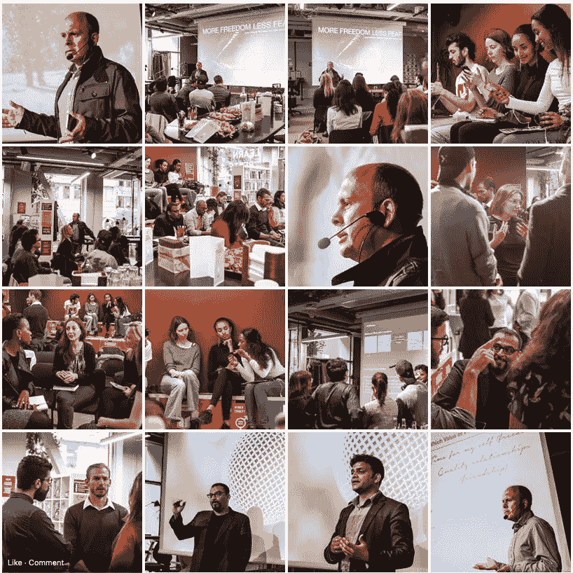

# 在 3 周内识别并战胜你的恐惧

> 原文：<https://medium.datadriveninvestor.com/identify-and-defeat-your-fear-in-3-weeks-a882be154ce9?source=collection_archive---------3----------------------->

你相信变得无所畏惧是可能的吗？我相信无畏是一个过程而不是目的地，就像成功的概念一样:*如果你今天找不到它，你很可能以后也看不到它*。

Can you express the best expression of your art when you feel that something is missing?

阻力是影响我们体验成功能力的最关键因素之一，我知道这听起来很简单，但事实并非如此。我们抵制使用许多策略，通常，我们并不完全知道我们抵制什么，也不知道为什么。让我和你们分享一些抵抗的例子:

1.  努力做到正确。也可能是害怕犯错。
2.  在受到一些批评后试图找到一个快速的答案。可能是害怕不如别人或比别人差。
3.  试图归咎于环境或他人。可能是害怕被判有罪。
4.  拒绝花时间去深入寻找问题的根源。可能是害怕发现不愉快的情绪。

 [## 跑步摆脱疯狂:锻炼如何提高你的生产力——数据驱动型投资者

### 没有比锻炼更好的方式来开始一天的工作了。我试着一周至少做四天，在…

www.datadriveninvestor.com](https://www.datadriveninvestor.com/2018/10/23/running-to-get-rid-of-the-crazy-how-working-out-increases-your-productivity/) 

通过我与[恐惧&失败](https://www.fearandfail.com)的合作，我发现**的三个步骤**可以帮助你通过讲故事来确定你的恐惧(阻力)，创造或确定你的目标，并设计一个考虑到它并承认你的恐惧的行动计划。所有这些都是为了让你在成长中少一些恐惧，体验更多的自由，并养成打破任何自我强加的限制的习惯。

**免责声明** : *请注意，本文内容仅与商业、企业家精神、职业和个人发展、组织文化等领域相关*。

如果你真的有兴趣在三周内识别并战胜你的恐惧，遵循下面的建议。在接下来的三周里，你会有足够的时间去反思，获得更多的洞察力，甚至可能包括其他人来支持你的过程。

# 第一周

想一个涉及失败的重要经历。它可能是一个失败的企业，一个从未见过光的产品，甚至是一个从未打过的简单电话。建立一个描述经历的故事，包括你的学习和结论。

在你的故事准备好之后，问问你自己:为了避免失败，我还能做得更好吗？有没有可能我没看到发生了什么？我是不是一直在抗拒什么？我能找到恐惧作为反抗的原因吗？

有了这些答案，用 5 个步骤重新编写你的故事，想象为一次公开演讲制作 5 张幻灯片，并将原来的故事与新的故事进行比较。

如果你在这个过程中发现了一些模式、恐惧或不舒服的时刻，记下它们，试着定义它们，试着回忆你第一次有这种感觉是什么时候。

# 第二周

当我发现我们对未来的憧憬、我们都想实现的梦想和我们现在的行动之间的联系就是我们的价值观时，我感觉就像发现了印刷机一样。道德价值是暂时的；你可以在没有先决条件的情况下活出自己的价值观，你越是这样做，你的行为就会产生越大的影响。

问题是当你不清楚什么是你目前用来生活的价值观时。你喜欢的价值观和你使用的价值观之间有着巨大的差异。

为了确定你的价值观，我建议你从想象 70 岁时理想的一天开始，甚至可能是你的生日。你需要呆在一个安静的地方，至少 30 分钟不被打扰。为了帮助你的想象力，让我分享几个你在想象理想的一天时应该保持的问题:你住在哪里？你为什么住在那里？谁和你在一起？你住的地方怎么样？那天你会欢迎朋友吗？如果是的话:你会用它们做什么？他们从哪里来？你和他们每个人是什么关系？你能看到你实践的任何爱好的证据吗？是什么让这一天对你来说如此独特？

有了所有的信息和细节，请做笔记，并努力挖掘对你来说最重要的东西。试着列出一天中最重要的五件事。你可以下载一个名为 [Vision of Present Canvas](https://www.visionofpresent.com/post/183357100894/what-is-vision-of-present) 的工具来帮助你格式化你的笔记。

问问你自己，什么样的道德价值或原则能最好地描述你最重要的五件事？例如:“我邀请了我以前工作的所有朋友，亲密的家庭成员和最亲爱的邻居，”我想到了友谊，但我更在乎“高质量的关系。”

你可能会发现相同的价值观重复出现，或者你可能会发现其他一些你认为重要的价值观对你来说并不重要。

你能把这些价值观和你的生活方式联系起来吗？你每天能做些什么来与你最关心的价值观保持一致呢？你的日常和一致的行动如何让你更接近于体验 70 岁时想象的理想日子？

既然你已经很清楚了，试着把你如何生活、你打算如何生活的想法联系起来，并问自己:在我的生活经历中始终存在的一个因素、特征是什么？

这里有一个例子:“我发现在我的一生中，当我让别人笑的时候，我总是感觉很好，我喜欢看到人们开心，今天我是一名软件开发人员，我希望在我的日常工作中包含更多这样的内容。”这个人的目的可能是“成为他人快乐或幸福的源泉”

# 第三周

成就的敌人是拖延，纪律是解决办法。我不太喜欢纪律这个词，因为它让我觉得被限制在有限的空间里，所以我称之为“灵活的纪律”

现在你开始定义你的一些恐惧，你确定了你的核心价值观和你的目标的第一个版本；你需要创建一个行动计划，你的灵活的纪律。

要回答的主要问题是:**我每天需要做什么才能达到我的目的，尊重我的价值观，克服我的恐惧？**

实现一种新的生活方式需要足够的精力，我想分享一些对我有帮助的想法:

> "如果我需要提高我的能量水平，首先我需要身体上的疲劳."
> 
> "娱乐让我分心，很少给我精力去做其他事情."
> 
> "当有人试图操纵我时，不管后果如何，我都会说不。"

建立灵活的纪律从对自己负责开始:你的成长，你的价值观，你的目标。你周围的人和依赖你的人会从你的结盟中受益。

1.  创建一个包含一天 24 小时的文档，用你当前的活动感受这一天:睡觉、个人卫生、营养、工作、通勤、娱乐等。
2.  评估这些活动是否符合你的价值观和目标，并确定你的日常事务是否妨碍你在生活中实施改变。
    为了让你的活动符合你的价值观、目标、愿景和个人成长，你需要做出哪些改变？
3.  创建一个一周的日历，包括支持调整的活动，例如，少一些娱乐，多一些锻炼，多一些独处的时间，多一些和家人在一起的时间。
4.  把那个周历作为一个挑战，尊重它三个星期，设计一个改进的新的周历。你也可以使用目前的[视觉可用的工具。](https://www.visionofpresent.com/post/183357100894/what-is-vision-of-present)

# 结论

第一周的重点是学习如何识别恐惧、抗拒和自我施加的限制，换句话说，这是打破所谓舒适区的一种方式。第二周和第三周将会给你一些工具来有效地改变你的生活，从而创造更多的机会来体验恐惧的影响。这是一个良性循环，能够给你的生活带来不断的成长、扩展和成就感。

# 邀请

如果你认为你可以从更多的指导和支持中受益，请查看[极限打破者策划挑战](https://www.fearandfail.com/post/185496746021/limit-breakers-mastermind-challenge)、[超越策划小组](https://www.fearandfail.com/post/185659403161/beyond-mastermind-groups)，或者联系我进行[一对一咨询](https://www.fearandfail.com/post/185515815841/one-on-one-consultation)。

These are some photos from a recent event in Sweden where I presented the concepts shared in this article. I enjoyed the cooperation with the [Impact Hub Stockholm](https://www.facebook.com/pg/ImpactHubStockholm/photos/?tab=album&album_id=2343939732334225&ref=page_internal).