# 使用深度学习和快速人工智能的自然语言处理来识别与灾难相关的推文

> 原文：<https://medium.datadriveninvestor.com/identifying-disaster-related-tweets-using-deep-learning-and-natural-language-processing-with-fast-e0dfb790b57a?source=collection_archive---------1----------------------->


我仍在学习快速人工智能课程，无法停止思考如何轻松地用几行代码创建一个有效的深度学习模型。我一直在学习 Fast Ai 库的文本模块，它包含了创建方便的数据集和不同自然语言处理(NLP)任务的模型所需的所有功能。

NLP 一直是我关注的领域。NLP 中最受欢迎的用例之一是识别电影评论是正面还是负面，这个问题被称为**情感分析**。

所以，我想用这个工具可以做些什么，为社会公益事业做出贡献。我想到的第一件事是分析推文，特别是与灾难相关的东西。

[](https://www.datadriveninvestor.com/2019/02/07/8-skills-you-need-to-become-a-data-scientist/) [## 成为数据科学家所需的 8 项技能——数据驱动型投资者

### 数字吓不倒你？没有什么比一张漂亮的 excel 表更令人满意的了？你会说几种语言…

www.datadriveninvestor.com](https://www.datadriveninvestor.com/2019/02/07/8-skills-you-need-to-become-a-data-scientist/) 

我将创建一个情绪分析模型，但它不会在积极和中立之间进行分类，而是将推文分类，并判断它们是否与灾难相关。这可能是改进灾难响应的一个很好的策略，并保留这些信息以提取优先的位置和事件，并为它们节省时间和资源。

下图显示了情绪分析模型的工作原理:

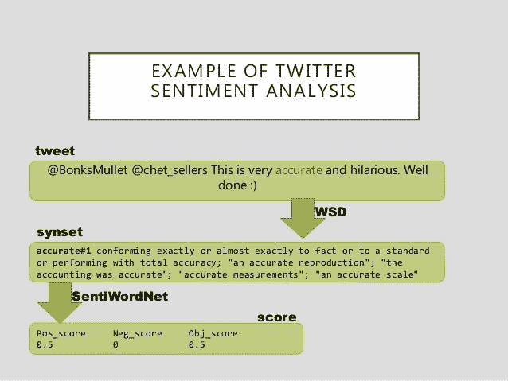

对于这个项目，我将重点关注的主要步骤是:

1.  下载并探索**“社交媒体上的灾难”**数据集
2.  为建模准备好数据
3.  微调语言模型
4.  构建分类器来检测推文中是否有灾难话题

我修改了数据集，只保留了两列用于实验:情绪**和文本**。****

**首先，让我们导入这个实验所需的快速 ai 模块:**

```
from fastai.text import
```

**现在，我将定义数据集所在的路径:**

```
path = '/content/'
path
```

# **探索“社交媒体上的灾难”数据集**

**让我们检查数据集的前几行，看看我们将使用什么:**

```
df = pd.read_csv(path + 'disaster_tweets.csv')
df.head()
```

**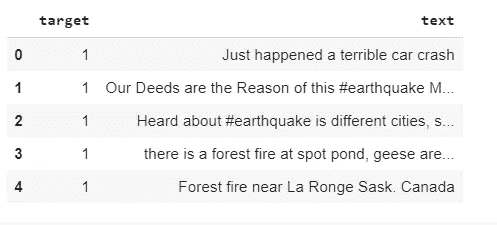**

```
df.info()
```

**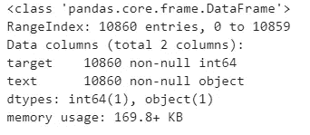**

**正如您所看到的，它包含两列，**“目标”**，这是情绪和**“文本”**，推文本身。**

```
df[‘target’].value_counts()
```

**该数据集共有 18860 条推文，6187 条与灾难相关，4673 条不相关。**

**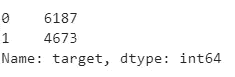**

```
df['target'].value_counts().plot(kind='bar')
```

**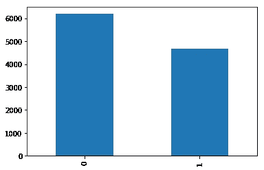**

****“0”**表示常规推文，**“1”**表示灾害相关推文。常规一班多了几条推文。**

**让我们先睹为快，看看与灾难相关的推文:**

```
df[df['target']== 1][['text','target']]
```

**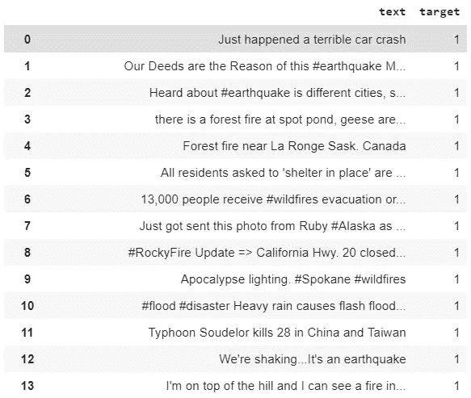**

**现在，常规的:**

```
df[df['target']== 0][['text','target']]
```

**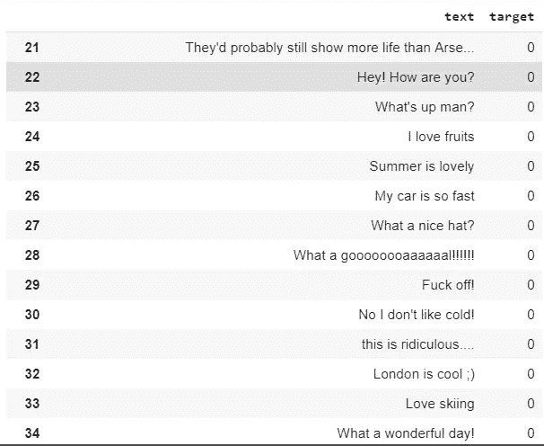**

# **为建模准备好数据**

**需要对数据进行预处理，以便提供给 NLP 模型。在计算机视觉模型中，我们需要将这些图像转换成简单的数字阵列。处理文本数据与此略有不同。这个过程从我们将原始文本转换为一系列单词或标记开始，这被称为**“标记化”**，最后，将这些标记转换为数字，这是一个被称为**“数字化”**的过程。这些数字被传递给嵌入层，嵌入层在将它们输入模型之前将它们转换成浮点数组。**

****

**image processing for computer vision models**

**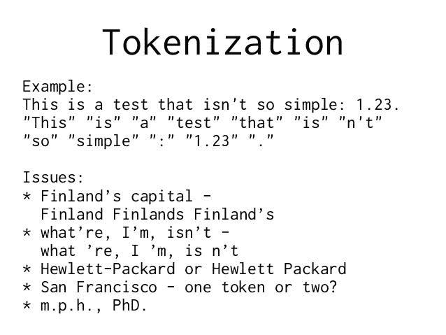**

**Text processing (Tokenization)**

## **TextLMDataBunch 和 TextClassDataBunch**

**我需要两个来自 _csv 的**方法，原因如下:为语言模型 **(TextLMDataBunch)** 准备好数据，为文本分类器 **(TextClassDataBunch)** 准备好数据。****

**下面几行完成了预处理数据的所有必要工作。对于分类器，我也传递了我想要使用的词汇。在词汇表中，我给单词分配 id。因此 **data_class** 将使用与 **data_lm** 相同的字典。**

```
# Language model data
data_lm = TextLMDataBunch.from_csv(path, 'disaster_tweets.csv')
# Classifier model data
data_clas = TextClasDataBunch.from_csv(path, 'disaster_tweets.csv', vocab=data_lm.train_ds.vocab, bs=32)
```

**让我们保存结果，以便在接下来的几行中使用:**

```
data_lm.save('data_lm_export.pkl')
data_clas.save('data_clas_export.pkl')
```

**现在，我可以重新加载这些结果:**

```
data_lm = load_data(path, 'data_lm_export.pkl')
data_clas = load_data(path, 'data_clas_export.pkl', bs=16)
```

# **微调语言模型**

**我们对计算机视觉任务使用预训练的模型，因为它们是在大图像数据集上训练的，所以我们将它们用于新的任务，这就是我们想要分类的图像类型。例子: **ResNet，DenseNet VGG16** 等。这就叫**“迁移学习”**。**

**文本模型在尝试对文本进行分类时会遇到困难。我们能把迁移学习用于 NLP 任务吗？是的，我们可以。Jeremy 和他来自 Fast Ai 的朋友 Stephen Merity 宣布开发了 **AWS LSTM** 语言模型，这是对以前的 ***语言建模方法的巨大改进。*****

**语言模型是学习预测句子中下一个单词的 NLP 模型。例如，如果你的手机键盘猜测你下一步想输入什么单词，那么它使用的是一个语言模型。这很重要的原因是，对于一个真正擅长猜测你接下来会说什么的语言模型来说，它需要大量的数据。**

****例如:****

****“我吃了一个辣”→“狗”，“天很热”→“天气”)****

**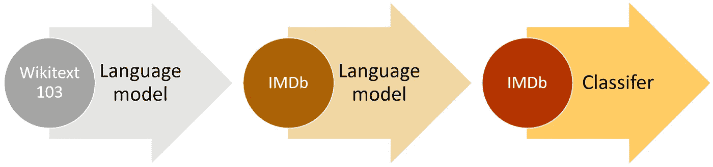**

**High-level ULMFiT approach (IMDb example)**

**我将使用这个预训练的模型，并对我的分类模型进行微调，这个快速的人工智能有一个英语模型，具有我们将在本例中使用的 AWD-LSTM 体系结构。**

**我将创建一个学习者对象，该对象将直接创建一个模型，下载预先训练好的权重，并准备好进行微调:**

```
learn = language_model_learner(data_lm, AWD_LSTM, drop_mult=0.5)
learn.fit_one_cycle(1, 1e-2)
```

**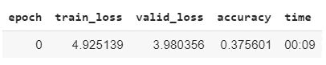**

**现在，是时候做一些预测了:**

```
learn.predict("there is", n_words=10)
```

**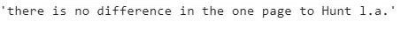**

**关于预测下一个单词的第一个任务成功了！**

**现在，让我们保存这个编码器，以便能够将其用于分类模型:**

```
learn.save_encoder('ft_enc')
```

# **构建分类器检测推文中的灾害话题**

**我将使用前面创建的 data_class 对象来构建带有微调编码器的分类模型。可以使用下一行创建学习者对象:**

```
learn = text_classifier_learner(data_clas, AWD_LSTM, drop_mult=0.5)
learn.load_encoder('ft_enc')
```

**让我们来看一小批数据集:**

```
data_clas.show_batch()
```

**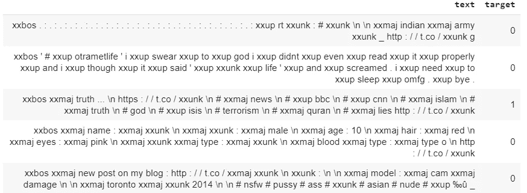**

**该训练模型了！**

```
learn.fit_one_cycle(1, 1e-2)
```

**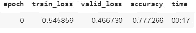**

**我可以解冻模型并对其进行微调:**

```
learn.freeze_to(-2)
learn.fit_one_cycle(1, slice(5e-3/2., 5e-3))
```

**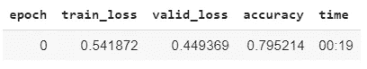**

```
learn.unfreeze()
learn.fit_one_cycle(1, slice(2e-3/100, 2e-3))
```

**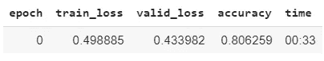**

**哇！ **80%的准确率，**让我们看看结果吧！**

**使用了一些与 2017 年墨西哥地震有关的推文进行预测，以及一些常规推文:**

```
learn.predict("**Assistance from across Canada and as far away as Mexico have joined #ForestFire fighting efforts in the #Northeast Region. Mexican fire crews arrived at Sudbury July 20, and are deployed to fires around the region. #Ontario**")
```

****(范畴 1，张量(1)，张量([0.0767，0.9233])****

```
learn.predict**(‘Interpreters needed to support rescue efforts in México. #EarthquakeMexico’)**
```

****(范畴 1，张量(1)，张量([0.2381，0.7619])****

```
learn.predict**('Oaxaca, Mexico: A new 6.1-magnitude quake has shaken southern Mexico #EarthquakeMexico #Oaxaca \\ Circa \\')**
```

****(类别 1，张量(1)，张量([0.3290，0.6710])****

```
learn.predict**(‘the best thing I’ve ever done, my greatest role in this life #HappyMothersDay’)**
```

****(类别 0，张量(0)，张量([0.9648，0.0352])****

```
learn.predict**('Can you please help me share this message for my mom ? Thanks a lot 🙏')**
```

****(类别 0，张量(0)，张量([0.9165，0.0835])****

```
learn.predict**("I'm just trying to take care of her, do my job and be the best Jet I can be.** [**@RetireMoms**](http://twitter.com/RetireMoms) **| #HappyMothersDay")**
```

****(类别 0，张量(0)，张量([0.9160，0.0840])****

**我对这些结果很满意。试试自己的分类模型，分享一下！**

# **参考**

## **文本模型、数据和培训**

**[](https://docs.fast.ai/text.html) [## 文| fastai

### 应用于 NLP，包括 ULMFiT 微调

docs.fast.ai](https://docs.fast.ai/text.html) 

## 社交媒体数据集上的灾难

[](https://www.kaggle.com/jannesklaas/disasters-on-social-media) [## 社交媒体上的灾难

### 哪些推文是相关新闻，哪些只是戏谑？

www.kaggle.com](https://www.kaggle.com/jannesklaas/disasters-on-social-media) 

## 使用通用语言模型介绍最新的文本分类技术

[](http://nlp.fast.ai/) [## fast.ai NLP 实用 NLP

### 迁移学习极大地影响了计算机视觉，但现有的方法在自然语言处理仍然需要特定的任务…

nlp.fast](http://nlp.fast.ai/) 

*原载于 2019 年 5 月 15 日*[*https://www.datadriveninvestor.com*](https://www.datadriveninvestor.com/2019/05/15/identifying-disaster-related-tweets-using-nlp/)*。***