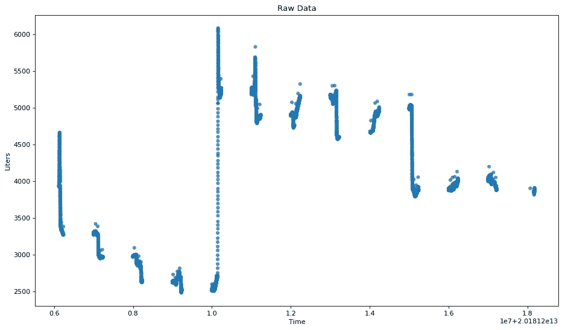
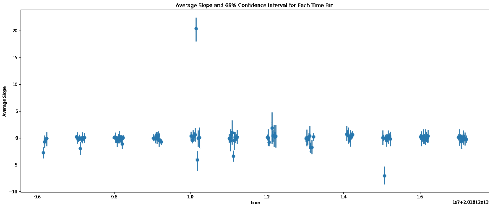
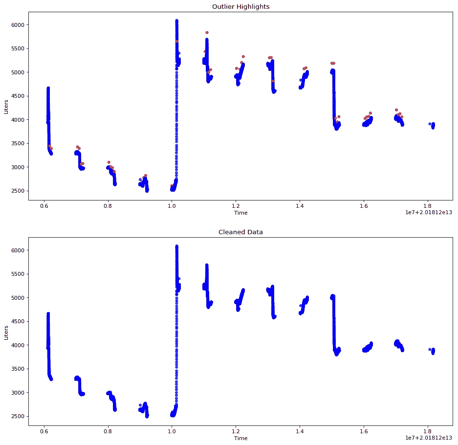

# 识别远程物联网中的异常值

> 原文：<https://medium.datadriveninvestor.com/identifying-outliers-from-a-remote-iot-12777d485215?source=collection_archive---------2----------------------->

[](http://www.track.datadriveninvestor.com/1B9E)

远程设备很棒，具有机器学习预测和连续模型反馈循环的远程监控网络甚至更好。


Volcan Mocho Choshuenco, Chile — Author: descubrelosrios.cl

然而，这些复杂且超前的系统只有在准确有效地提供设计服务时才具有经济可行性。不幸的是，测量世界的电子/机械硬件并不总是符合数据科学家的原始数据幻想。离群值是不可避免的，无论是来自环境因素还是需要处理的传输错误，或者它们使整个系统面临因噪声而降级的风险。

以下是从远程物联网接收的数据的异常值检测和移除的示例案例。这个特殊的装置正在测量智利南部一个独立的储水箱中的水量。水箱本身充当发电机的“电池组”,这意味着水箱内水位变化的速度/频率指示了发电机的健康状况。



Raw Data Received — Author: Kerri Rapes

y 轴上是报告的数量，x 轴上是从 2018 年 12 月 6 日开始到 2018 年 12 月 18 日结束的日期时间。通过目测，似乎有几个数据点是异常的。当与它们左右最近的邻居比较时，这些点通过值的尖峰或快速变化来识别。我们从物理上知道，水的体积不可能波动得那么快，所以重点一定是噪音。如果我们可以识别快速的值变化或异常的δy(也称为斜率)，我们就可以精确定位异常值。

首先，我们计算每个点到它的前一个点的斜率。第一个点将始终导致 *NaN* 因为它没有前任。

```
import pandas as pddf = pd.DataFrame(data={‘liter’: data[‘liter’],
                        ‘time’: data[‘time’]})
df[‘slope’] = df.liter.diff()
```


接下来，我们将日期时间谱分成 100 个相等的箱，并将数据存储到相应的容器中。从那里，我们可以计算该库的平均斜率(见下图中的中心点)以及置信区间(由图中每个点周围的线条表示)。

```
import seaborn as sns

sns.regplot(x='time', y='slope', data=df.reset_index(),        x_bins=100, ci=68, fit_reg=False)
```



如果发现一个数据点超出其箱的置信区间，则可以认为*异常*。在视觉实验中，seaborn 在创建箱和计算置信区间方面做得很好，但在实践中，我们使用了以下脚本。

箱中的分解日期时间谱:

```
df['bin'] = pd.cut(df.time, bins=numB, labels=False)
```

聚合数据并计算间隔:

```
bins = df.groupby(['bin'])['slope'].agg(['mean', 'count', 'std', 'sum'])
bins['bin'] = df.bin.unique()ci_hi = []
ci_lo = []
for i in bins.index:
    m, c, s, summ, binn = bins.loc[i]
    ci_hi.append(m + threshold*s/math.sqrt(c))
    ci_lo.append(m - threshold*s/math.sqrt(c))

bins['ci_hi'] = ci_hi
bins['ci_lo'] = ci_lo
```

这种将数据分成时间块并计算“*局部置信区间*的方法优于一个区间服务于整个数据集的全局视图。它允许系统适应真正快速变化的区域，同时仍然保持对异常δy 的高灵敏度。

用现实世界的术语来说，在 2018 年 12 月 10 日(在图表的 x 轴上被视为 1.0)，水箱经历了一次快速补给。如果这些数字包含在全局区间的计算中，则整个补给将被视为异常值并被移除。结果将对物联网的总体目标——发电机健康——不利，因为工程师们想要的充电信息将被删除。

既然计划已经就绪，剩下唯一要做的就是执行它。要标记数据，我们需要:

1)设置一个置信度阈值，在我们的例子中是 *100.0* 。一开始，这个数字最好用手调。随后，可以用基于规则的或 ML 引擎来计算它。

2)遍历数据集的每个点，并从逻辑上推断它是在区间内还是区间外。

```
import numpy as npdef identify_outliers(df, numB=100,threshold=100.0): # Breakup datetime spectrum in bins
    df['bin'] = pd.cut(df.time, bins=numB, labels=False) # Aggregate data to calculate interval
    bins = df.groupby(['bin'])['slope'].agg(['mean', 'count', 'std', 'sum'])
    bins['bin'] = df.bin.unique() # Calculate interval
    ci_hi = []
    ci_lo = []
    for i in bins.index:
        m, c, s, summ, binn = bins.loc[i]
        ci_hi.append(m + threshold*s/math.sqrt(c))
        ci_lo.append(m - threshold*s/math.sqrt(c))

    bins['ci_hi'] = ci_hi
    bins['ci_lo'] = ci_lo

    labels = []
    color =[]
    previous_bin = -1 # Label data as inside (normal) or outside (outlier) interval
    try:
        for i, row  in df.iterrows():
            slope = row.slope
            if not np.isnan(slope):
                binn = row.bin
                if binn != previous_bin:
                    ci_hi = bins[bins['bin'] == binn].ci_hi.values[0]
                    ci_lo = bins[bins['bin'] == binn].ci_lo.values[0]
                    previous_bin = binn

                if slope >= ci_lo and slope <= ci_hi:
                    labels.append("normal")
                    color.append('b')

                else:
                    labels.append("outlier")
                    color.append('r')

            else:
                labels.append(np.nan)
                color.append('r')
    except Exception as e:
        print(i)
        raise(e)

    df['label'] = labels
    df['color'] = color

    return df, bins

df, bins = identify_outliers(df)
```

一旦数据被标记，我们可以直观地检查它，并删除离群值。

```
import matplotlib.pyplot as pltplt.scatter(list(df.time), list(df.liter), alpha=0.8, c=list(df['color']), edgecolors='none', s=30)# Remove outliers
df = df[df['label'] != 'outlier']
df.reset_index()

plt.scatter(list(df.time), list(df.liter), alpha=0.8, c=list(df['color']), edgecolors='none', s=30)

plt.show()
```



完成，物联网数据现已准备好供系统的其余部分使用:)

要查看完整的实现，AWS 无服务器服务和解释 Jupyter 笔记本都可以在 https://github.com/krapes/Iot-Monitoring 的[获得](https://github.com/krapes/Iot-Monitoring)