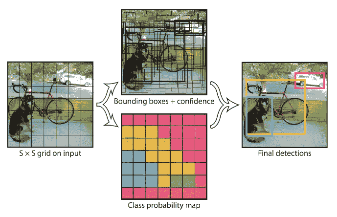
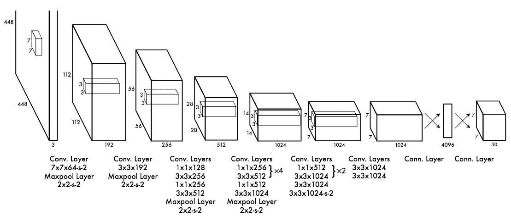
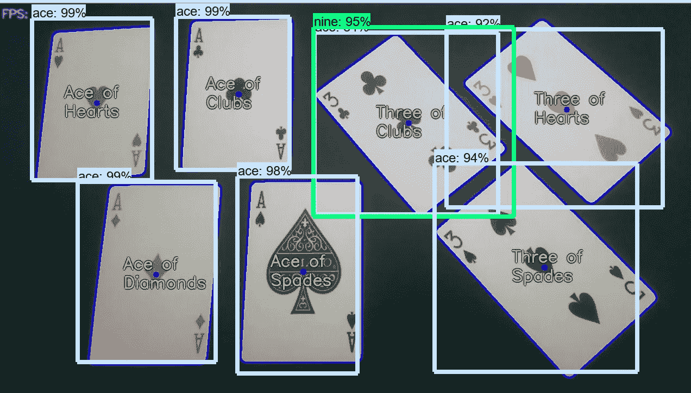

# 使用对象检测分类器识别扑克牌的类型

> 原文：<https://medium.datadriveninvestor.com/identifying-types-of-playing-cards-using-an-object-detection-classifier-fdd1bae02251?source=collection_archive---------1----------------------->

在探索**机器学习**和卷积神经网络的话题时，我偶然发现了**图像分类**。除了简单的图像分类，还有许多令人着迷的问题**计算机视觉**可以解决，包括**物体检测**。**物体检测主要与自动驾驶汽车相关**，在自动驾驶汽车中，系统融合了多种技术来生成道路的多维显示。另一方面，对象检测用于视频监控，特别是用于人群监控以防止恐怖袭击，或者只是为了进行一般统计而计数。

# 物体检测到底是什么？

好吧，所以你一定想知道，到底什么是物体检测？为了找到这个问题的答案，让我们先来看看图像分类。

在上图中，我们得到了一个图像，我们想把它分配到某个类别，可以是一只狗，一只猫，或者一个人。很大程度上，我们想弄清楚图片中的**是什么。在弄清楚图像中有什么之后，我们试图完成一个更难的新任务。我们现在必须做一些更困难的事情，尝试在图像中定位我们的对象(也就是猫)。试图定位物体的行为被称为**物体定位。**现在我们知道图像中有什么，物体在哪里。恭喜你！然而，这在现实生活中并不真正有用。在现实生活中，如果我们可以定位多个对象，那就更合适了。例如，在自动驾驶汽车中，视频流必须找到其他手推车、交通灯、标志和人的位置。坦率地说，这是一个很好的应用对象检测的例子。对象检测程序找到图像中的所有对象，并在它们周围绘制“边界框”。在某些情况下，我们希望找到对象的精确边界，这被称为**实例分割**。尽管这个过程很酷，但 YOLO 算法采用了完全不同的方法。**

# YOLO 算法

YOLO 模型预测单个网络和评估中的边界框和类概率，因此得名“你只看一次”。这使得 YOLO 模型在实时预测中是有效的。

最初，该模型将图像作为输入，并将其划分到 SxS 网格中。每个网格单元预测 *B* 边界框和这些框的置信度得分。这些置信度显示了它认为盒子预测的准确程度。

每个包围盒由 5 个预测组成: *x，y，w，h* 和置信度。( *x，y)* 坐标表示相对于网格单元边界的盒子中心。预测整个图像的宽度和高度。并且置信度预测表示预测框和任何基本事实框之间的 IOU。

每个网格还预测了一些被称为条件类概率的东西。这些概率取决于包含对象的网格单元。该算法仅预测每个单元的一类概率。

Source: [J. Redmon and al. (2016)](https://arxiv.org/pdf/1506.02640.pdf)

上图展示了 YOLO 算法的一个应用。输入图像被分成一个 SxS 网格。然后预测 *B* 边界框(回归),并且在 C 个类别中预测一个类别(分类)超过最有把握的类别。

然后，我们将这个模型实现为 CNN(卷积神经网络)。CNN 的第一层从图像中提取特征，而完全连接的层预测输出的概率和坐标。更快的 YOLO 模型仅包括 9 层和更少数量的过滤器。

YOLO Architecture: Made up of 24 convolutional layers and two fully-connected layers. Source: [J. Redmon and al. (2016)](https://arxiv.org/pdf/1506.02640.pdf)

在其他和以前的模型中，边界框内通常包含一个对象。然而，YOLO 模型预测了大量的边界框，这就是为什么有许多没有任何对象的边界框。**非最大抑制**方法应用于网络的末端，它包括将同一对象的高度重叠的边界框合并成一个单一的边界框。所以耶！这差不多是你理解我的项目实际运作所需要的全部信息。

# R-CNN 的

Fast R-CNN

玩笑归玩笑，我为这个模型使用的算法是更快的 R-CNN Inception v2。在 R-CNN 算法中，我们将输入图像馈送给 CNN，以生成卷积特征图。从卷积特征图中，我们确定建议的区域，并将其扭曲成正方形，通过使用 RoI 池层，我们将它们重塑为真实大小，这将允许它进入真实层。然后，我们使用 softmax 图层来预测给定区域的类别。

# 对象检测分类器！

这是你们期待已久的时刻。扑克脸毁灭者 101。不是开玩笑，这个物体检测分类器不能被愚弄。如果这可以在一些智能眼镜中实现，它可能会造成一些严重的损害。就像想象你住在 Bellagio 酒店，你戴上你的物体探测智能眼镜，去赌场准备消灭每一个挡你路的人。这是成为百万富翁的一个非常简单的方法。撇开所有的笑话不谈，我差不多做了一个对象检测分类器，可以识别六种不同类型的扑克牌:9，10，杰克，皇后，国王，最后但并非最不重要的，王牌。巧妙之处在于，它可以通过网络摄像头、图像或视频来检测这些扑克牌。如果你在看十一罗汉的时候运行这个程序，它会检测电影中的卡片。多酷啊。

在训练了这个坏男孩大约一个小时后，我成功地让它识别了扑克牌和它们的花色。

The Object Detection Classifier was able to successfully and accurately detect the value of the card (3 or Ace), and also the suit of the card (Diamond, Spades, Clubs, or Heart).

就像我之前说的，每个图像都有一个包围它的边界框，并且在它的每个预测旁边都有一个百分比。百分比表示模型在分析整个图像时对自身的准确程度或确定程度。例如，几乎所有的预测都超过了 95%,这意味着这个模型是相当自大的！部分百分比较低的原因可能是因为缺乏针对那些特定类型卡的培训时间。这就是为什么对于未来的人工智能程序员来说，**确保你训练你的程序有足够长的时间，以便它是最精确的。**

总的来说，完成并完成这个项目是令人惊讶的。我觉得我从中学到了很多，计算机视觉可以融入到实际的迷人应用中。当然，他的只是计算机视觉的一个简单例子，因为计算机视觉可以做得更多。

另外，顺便说一句，我几乎完成了我已经做了一段时间的另一个项目(提示提示，它涉及视频游戏)。敬请关注！

如何联系我:

电子邮件:nakaleem2003@gmail.com

领英:【https://www.linkedin.com/in/noumaan-kaleem-a13948159/ 

一定要给这篇文章一些掌声！👏 👏

当然，我自己无法做到这一点。外面的聪明人有惊人的关于 https://arxiv.org/pdf/1506.02640.pdf 的 YOLO 算法的研究论文

# DDI 特色数据科学课程:

*   [**用于数据科学的 Python**](http://go.datadriveninvestor.com/intro-python/mb)
*   [**深度学习**](http://go.datadriveninvestor.com/deeplearningpython/mb)
*   [**数据可视化**](http://go.datadriveninvestor.com/datavisualization/mb)

**DDI 可能会从这些链接中收取会员佣金。我们感谢你一直以来的支持。*