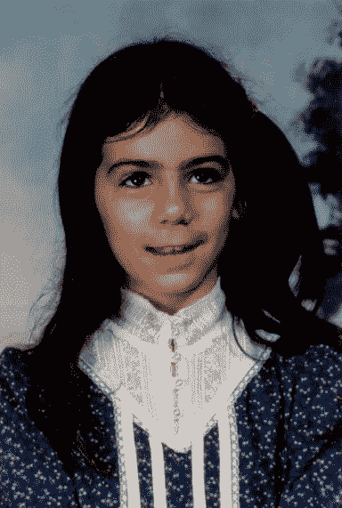

# 身份和 DNA 惊喜

> 原文：<https://medium.datadriveninvestor.com/identity-and-dna-surprises-4bbd312da0f?source=collection_archive---------1----------------------->

一年前，我发现自己是 NPE 人。当人们问我 NPE 代表什么，我告诉他们“不是父母期望的”，然后补充说，“这很复杂”，因为它是。我出生在西雅图，母亲是单身。我父亲在短暂戒毒后，又重新吸食了海洛因，并在婚后两个月离开了我母亲。我不到一岁他们就离婚了。我妈妈的父母在我四岁的时候被谋杀了——但那是另一个故事了。所以，在我成长的过程中，几乎只有妈妈和我。

当我大约七岁的时候，我妈妈想暂时离开单亲家庭，去旧金山拜访一个朋友。她告诉我我会和祖父母住在一起。我不知道她指的是谁。你爸爸的父母她说，“爸爸和伊娃。”然后，她提着一个大红色行李箱把我送上了贝尔维尤的一辆公共汽车，并让我在西雅图市中心一家花店前下车，这家花店就在一家名为“The Bon”的大型百货商店的街对面。现在，她也告诉了司机这些指示。我要去找一个开着红色汽车的大个子黑人。

对我来说，这是一次可怕的经历。这是我第一次了解我家庭的另一面。我和祖父母住在一起的第一周是一个很大的调整。每个人说话都不一样，吃的食物也很奇怪。他们很吵，而且经常互相取笑。我从字面上理解一切。最终，我学会了模仿我所在的任何团体的说话方式和肢体语言。但是在前进的道路上有一些坎坷，就像那次我妈妈让我写“我不会说不是”1000 遍。

 [## 流氓基因组编辑扭曲 DNA 伦理-数据驱动的投资者

### 基因组编辑是科学的前沿。这在道德上也是有问题的，在许多方面可能是非法的…

www.datadriveninvestor.com](https://www.datadriveninvestor.com/2019/02/18/rogue-genome-editing-twists-dna-ethics/) 

有一件事是真的，无论我去哪里，我都必须努力适应。我妈妈的家人不太高兴她嫁给了一个黑人。爸爸曾经告诉我，黑人必须接受任何有一点黑人血统的人，因为白人不会，所以这就是为什么这个家庭接受了我。但是你看，他们真的没有。我的堂兄妹曾经用伊娃的面部化妆品把我涂成黑色，这样我看起来就像他们一样。我出了一个星期的疹子。虽然伊娃很善良，但她对我的态度确实不同于她的其他孙子孙女。Pop 说，这是因为我看起来是白人，她不喜欢白人，因为她年轻时在俄克拉荷马州有过种族主义的濒死经历。对一个小孩来说，为什么并不重要。被挑出来区别对待的痛苦一直都在。

五年级时，我和妈妈从贝尔维尤搬到西雅图，她把我的种族改成了“黑人”那时你必须在那些表格上只选择一个种族。她觉得身为黑人可能会给我带来更多好处。第一周，学校的秘书把我叫到办公室，看了我一眼，告诉我她要把我变回白色。我告诉她最好不要，我的叔叔(是的，我爸爸的哥哥)是学校董事会的主席，她可能要对他负责。她留给我的是黑色。

我为自己的双种族血统感到自豪。当人们问我的种族时，我会让他们猜。他们通常认为我是希腊人、中东人或西班牙人。当我告诉他们我是半个黑人时，他们表示怀疑，他们通常会回答“不可能”。然后他们会停下来，好笑地看着我说，“哦，我希望我从来没有说过任何冒犯的话。”我会想，“呃，你刚刚做了。”有时我不得不给他们看我父亲的照片，让他们相信我。即使在那时，我仍然可以看到他们脸上的疑惑。有趣的是，这是我从来没有分享过的疑问。很难看到别人这么公开质疑你是谁。

我还会收到比我肤色更黑的人的评论。他们会告诉我，我永远无法真正理解作为黑人意味着什么，因为我的肤色意味着我可以像其他人一样享受生活。但是我是听着我的家庭在整个集体历史中经历的种族歧视故事长大的。关于因为我祖母的肤色而拒绝取暖的故事，关于警察无缘无故拦住我表妹的故事。我听说当我父亲带着我的金发蓝眼的孩子们去购物中心时，人们会怎样阻止他，这样我就可以有片刻的安静。这些故事编织成了我。

虽然我不得不与各种肤色的人一起努力捍卫我的双种族身份，但我也面临着我们社会中普遍存在的种族歧视。要么是因为有人知道我是半个黑人，要么是因为我的肤色有点黑。有一次一个五年级的女生问我是不是黑人。我说:“是的”，然后她扇了我一巴掌。我惊呆了，反应不过来。我被叫做“奥利奥”和“斑马”被吐口水了。还有一些人们每天说的无关痛痒的话，但就像蚊子叮咬一样，只是稍微刺痛一下。

家庭和遗产对我来说一直很重要。也许是因为我从未拥有过我渴望的大家庭或社区。我内心深处有一种无法解释的渴望。我想这就是我对家谱着迷的原因。我是我妈妈家家谱的保管人，在互联网出现之前，善良的人们就已经存在了，我爸爸家的研究表明他们是三个奴隶兄弟的后代，他们在德克萨斯被卖了。我一直想知道它们来自非洲的哪里。因此，去年圣诞节，我为我父亲和我自己购买了 DNA 试剂盒，这样我们就可以发现我们的非洲根源。

就在一月份我 44 岁生日的前两天，我收到了我的成绩。当我看到我的测试结果准备好了的链接时，我太激动了。但是我立刻知道出事了。很难向从未经历过这种事情的人描述这种感觉。我想如果你收到了其他改变生活的消息，你会有想法的。对我来说，我的世界停止了旋转。我觉得胃不舒服。我认为对于一个 NPE 来说，这是一个你总是知道当你发现时你在何时何地的事件。就像航天飞机爆炸或肯尼迪遇刺时一样。

我，我刚刚醒来，在床上检查我的电子邮件。我点开链接，看了我的民族构成。它说我没有任何非洲人的 DNA。连 1%都没有。相反，它说我是 50%的德系犹太人。妈妈不是犹太人？？？我以为。她不认识任何犹太人。(现在我知道她做到了，至少有一瞬间)。我爸爸当然不是犹太人。我想这怎么可能呢？我突然想到，只有一个办法。

我确信一定是弄错了，但是我们都知道 DNA 不会说谎。我打电话给我妈妈，我很感激她没有说这是不可能的，因为我知道许多母亲在面对这个问题时都会这样做。她说的是她也很惊讶。她告诉我，在我父亲离开她之后，她确实和一个在奥罗拉的酒吧里认识的男人发生了一夜情。但她真的从没想过会怀孕。几周后，爸爸回来拿他剩下的东西；他们喝了最后一杯，那时她以为我被创造了。她总是告诉我我生得早来解释时间线。

现在我知道我爸爸很快就会得到他的 DNA 结果，我不想让他从电脑上得知这个消息。所以我亲自去告诉他。我父亲最终在我十几岁的时候戒掉了海洛因。在我快 30 岁的时候，我们努力建立关系。到了三十多岁，我觉得叫他爸爸很舒服。告诉他他不是我的生父是我经历过的最艰难的对话之一。他拥抱了我，告诉我这并没有改变什么。他告诉我，我有权知道我的生父是谁，我的基因和文化历史是什么。我同意他的观点。我相信知道自己的生物历史是人类的权利。

所以我在网上散布我的 DNA 试图找到我的生父。虽然我有大约 12000 个表亲匹配，欢迎成为犹太人，但没有一个足够接近，让我能猜出他可能是谁。我总是想哭。我的基础被颠覆了。我是在双种族环境中长大的，但转眼间，我就不是了——这是我不可或缺的一部分。突然对自己的一半一无所知是令人难以置信和麻木的。每次我照镜子的时候，我都会问自己是谁。我想知道我遗传了哪些特征。我看起来像他吗？我会一天多次查看 DNA 网站。我在这个地狱般的地狱边缘生活了四个月。

幸运的是，一个可能的第二代堂兄弟匹配出现在晚春。我立即联系他，但他没有回应。作为一个不喜欢等待的女孩，我决定为他建一个家谱。我知道我们至少有相同的曾祖父母，可能还有祖父母。经过几周的研究家谱文件，阅读讣告，打电话给可能的亲属，我找到了一个符合时间表的人，当我在网上看到他的照片时，我就知道了。我的意思是，我看起来就像他，这是一个非常奇怪的经历，对于一个除了她母亲之外从来没有看起来像任何亲戚的人来说。

我联系了这个男人，给他寄了一封普通邮件，暗示他可能是我的生父，他在父亲节的第二天给我回了电话。他告诉我他病得很重，而且正在失去记忆，无法帮助我。在与更多的家庭成员交谈后，又出现了一些 DNA 匹配，我能够找出我的生父是谁。

生病的那个人是我同父异母的兄弟。不幸的是，他是独生子。我无法用语言来解释他不愿意分享病史和家族史的原因。我们分享的相似之处，至少我在网上能找到的是惊人的。没有家族病史让我和我的孩子对可能的问题一无所知。“第二代表亲”的匹配让我知道了我的生父是谁，原来是远房表亲；他的家人也不希望和我联系。

我的生父是萨姆·鲁宾斯坦。他是一名商人和慈善家，于 2007 年去世。我永远也不会知道我的生父是谁。我想因为他太突出了，很少有人愿意和我谈论他。根据我从报纸文章和认识他的人那里了解到的情况，我相信我的创业精神、强烈的个人动力和弹性来自于他(尽管我认为我从双方那里继承了后者)。有人告诉我，我的眼睛也是。关于我的生父，我有太多的疑问，可能永远得不到解答。有多高？(我很矮但是我的男孩很高)。他会唱歌吗(我不会)？他需要大量睡眠吗(我不需要)？

我给妈妈看了一张萨姆的照片，但她还是什么都不记得了。我提到她在奥罗拉的一个酒吧遇到这个男人是多么奇怪，她说，“哦，那是一家餐馆的酒吧。我当时 18 岁，只有餐馆里的酒吧会为我提供酒。我在坎利斯餐厅。它离我的公寓很近。”萨姆的公寓也在坎利斯附近。现在我的故事有了一个起点。

我不得不经常提醒自己我的新身份。我发展了一套凯特尼斯·伊夫狄恩风格的咒语。学舌鸟中的一名医生告诉她，当她所知道的一切都消失时，可以使用这项技术。她会从她认为正确的最简单的事情开始，然后朝着更复杂的方向努力。Katniss 以她的名字开始，我认为这也是我开始的完美地方。“我是卡拉·乔安妮·鲁宾斯坦·戴耶林。我的父亲是鲑鱼王，我的姑姑是罗斯·雅各布斯。我有一个同父异母的兄弟。我有一半犹太血统。”我发现自己每天至少重复一次，让自己在新的现实中立足。

虽然我还没有像凯妮丝一样躲在隧道里，但我仍然有艰难的日子。当你所知道的你的一部分被拿走的时候，这是超现实的。我继续与身份的概念和我现在是谁作斗争，并接受不是双种族的事实。最近，我不得不再次填写其中一张表格，询问我的种族。我做不到。我不能勾选一个简单的方框。我只是觉得不应该选“白色”如果我说自己是“混血”或“黑人”，那我就是在撒谎，是个骗子我们的身份是由我们成长过程中经历的故事、家庭传统和经历形成的。正是这些东西构成了我们的本质，而现在我所知道的一切都建立在谎言的基础上。

自从我的发现，一个常见的反应是，“我就知道你不是半个黑人！”这个天真的回答让我想起过去我为了证明自己的身份付出了多少。每次我听到它，它都会重新点燃我对失去一半自我的悲伤。当我告诉人们山姆·鲁宾斯坦是我的生父时，我现在发现自己必须证明我是鲁宾斯坦的事实。我希望有一天我不再需要捍卫我的遗产。

为了重建我的故事，我在匹兹堡枪击案后第一次去了寺庙。有一件事让我震惊，我看起来像房间里的许多人。这对我来说是第一次。我一生中的大部分时间都想走进一个房间，感觉自己有归属感。那天晚上，我第一次感受到了这一点。

有人说成为 NPE 人不会改变什么，你还是老样子，但他们没有抓住重点。像这样的发现永远改变了你对自己的看法——它不能不。它粉碎了你的身份，虽然你可以捡起碎片，但不可能以同样的方式将它们重新组合在一起。所以没错，我还是我，只是一个不同的我。