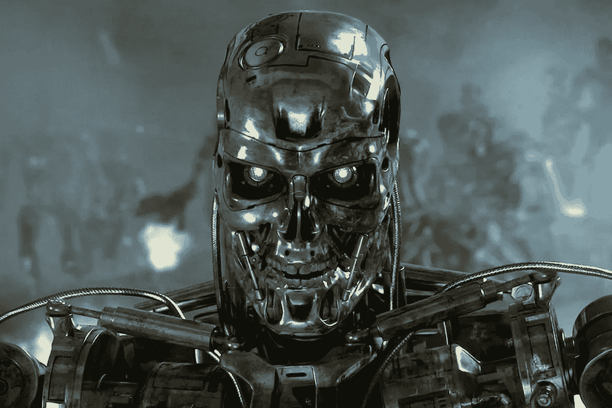

# 好莱坞带给你的白痴人工智能

> 原文：<https://medium.datadriveninvestor.com/idiotic-artificial-intelligences-brought-to-you-by-hollywood-d1a4074c41b2?source=collection_archive---------8----------------------->

你被人工智能的前景吓坏了吗？一台具有人类水平智能的机器让你夜不能寐吗？一个拥有超级智慧的人呢？超级智慧是指远远超过人类所拥有的智慧。他们不应该，主要原因是:在人工超级智能杀死你之前，你甚至没有时间害怕，如果那是它想要做的。

Look at this idiot.

尽管人工智能(有时是超级智能)频繁出现在电影和电视屏幕上，但它们很少被描绘成真正的智能实体。例如，天网可能是银幕上出现过的最白痴的人工超级智能之一。

天网的交易到底是什么？嗯，显然它是一种人工智能，在实现自我意识后，认为人类是对其自身存在的威胁(我们可以假设它希望保留这一点)。根据这一发现，由于天网可以方便地进入人类的核武库，它开始按下红色大按钮，取代人类成为统治白痴物种。

故事大概是这样的。当然，这实际上并没有发生，因为天网仅仅是一个讨厌的对手，在整个《终结者》电影系列(和电视系列？我实际上没有看过莎拉·寇娜编年史，也没有玩过任何电子游戏，甚至没有看过漫画(有终结者漫画？！)).那么天网除了消灭人类还能做什么？嗯，如果它的目标是消灭人类，它可能会做任何人工智能可能做的最愚蠢的事情。例如，天网花费了大量的时间试图复制人类，以便渗透(仍然可能杀死)核大屠杀后剩余的人类幸存者。

为什么是天网？！

说真的。如果你是一个拥有天网能力的人工智能，这里有 5 个简单的方法可以让人类灭绝。

1.  不要制造少量的在消灭人类幸存者方面很糟糕的类人机器人，而是制造许多可以轻松找到并杀死任何和所有人类幸存者的纳米机器人(说真的，即使是苍蝇大小的机器人也可以通过人类幸存者的眼睛发射致命的射弹)。
2.  继续制造和投放核武器…说真的，这是天网能够继续击倒人类幸存者的最简单的方法。即使我们假设天网是如此的愚蠢，以至于它不能自己想出如何制造一个核武器，它应该可以获得这些信息。首先，这是一个军事项目，所以…
3.  毒害大气。老实说，人类才刚刚开始意识到我们对我们生活的环境有影响，而且这种影响并不总是积极的。天网怎么没有从我们自己的历史中吸取教训？！

Look at these idiot humans. Starting from the left, smog in London in the early 1900’s, smog in Los Angeles in the 1950’s, and smog in Beijing in the early 2010’s.

4.制造疾病或瘟疫。实际上，鉴于疫苗接种水平的惊人下降，天网甚至不需要在这一点上太努力。它可以只是改变现有的疾病，以确保更有效的传播和致命的影响。好吧，好吧，也许它需要更努力一点，因为由于核浩劫，人类的人口已经显著减少了，但是天网在这里可以利用的趋势是肯定的。例如，在《终结者》电影中，人类幸存者几乎总是被描绘成居住在很近的地方，这种不幸的居住环境使得疾病更容易传播。

5.拉一个“矩阵”不，我不是说天网应该把人类圈起来，把他们当作电池使用，而是说天网可以通过在大气中填充颗粒物质来阻挡阳光。尽管大多数《终结者》电影将未来描绘成缺乏阳光的世界，但据我所知，人类仍然 100%依赖来自太阳的能量来为我们所有的农业活动提供动力，即使是在未来的《终结者》宇宙中。当然，一些人类可以通过在温室中种植食物(或者他们在终结者宇宙中使用的任何东西)来生存，但是，这样的设施必然会限制可以维持的人类幸存者的数量。同样，这些温室不能太大或太显眼，以免引起四处游荡的白痴终结者的注意。

I mean these two kill a terminator…cmon Skynet…it’s no wonder you lose.

如果《终结者》电影在某种程度上让你内心深处对人工智能的可怕感到恐惧，那就不要这样做。你可以高枕无忧，扑灭大火，因为天网可能是有史以来最愚蠢的人工智能之一。请放心，真正的人工智能如果追求消灭人类的目标，将不会留下一个人类幸存者。

你最喜欢的傻逼人工智能是什么？