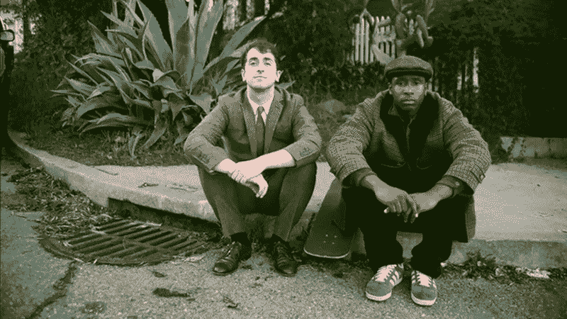

# 如果一个算法是一个菜谱，你的厨艺有多好？

> 原文：<https://medium.datadriveninvestor.com/if-an-algorithm-is-a-recipe-how-good-is-your-cooking-29609481ad0f?source=collection_archive---------8----------------------->

(Photo cred: [Clem Onojeghuo](https://www.pexels.com/@conojeghuo))

如果你曾经发现自己点击了“推荐给你”的回音室，那么你要么通过一生的在线滚动完善了你的个人算法，要么你接受了只了解你真实身份的一个简单部分的角色的消费。

人是复杂的，有各种各样的兴趣和不断变化的品味和观点。超个人分析试图衡量每个使用互联网的人的个人特质、价值观和态度，以创建一种(有望)准确预测行为的算法。

当我们还没有完全了解我们自己的时候，我们对创造一种真正理解我们个人身份的算法的信念是令人担忧的。期待这些专家算法为我们定义自己也有严重的后果。

对你的数据进行深入分析能得出多少意义？

算法允许偏见和刻板印象，基于理解数据的假设和限制，来定义和延续我们的在线行为。在 2016 年的一篇[未来主义文章](https://futurism.com/scientists-have-created-an-ai-that-judges-you-by-your-looks/)中，作者庆祝了一个——显然是一个人类团队——教会机器学习算法如何仅根据外表判断一个人的成功。来自圣母大学的 Mel McCurrie 创造了一种算法来读取人脸，并测试他们认为的积极特征——控制力和可信度。实验的目的是鼓励那些不符合算法标准的人改变他们的外表和行为。令人惊讶的是，最初被用来教授算法偏见的 6300 人没有采取任何行动——这显然是判断性的。

最近，COMPAS(替代制裁的矫正罪犯管理概况)算法因其在预测罪犯及其随后的判决中表现出种族偏见而受到抨击。在一项分析算法有效性的[研究](https://www.propublica.org/article/machine-bias-risk-assessments-in-criminal-sentencing)中，发现“该公式特别可能错误地将黑人被告标记为未来的罪犯，错误地将他们标记为白人被告的比率几乎是白人被告的两倍。白人被告比黑人被告更容易被误贴上低风险的标签。”

(Photo cred: *The Last Black Man in San Francisco* )

如果主观性是人类的特性，人类创造了算法的规则，那么分析在定义我们是谁以及我们真正想要/需要什么方面有多准确？只有当创造者自己解释人们的行为时，算法才会理解他们的行为。在我们能够将它传递给算法来加强我们的反应之前，我们需要首先实现我们自己的中立。

“算法交易”导致了 2008 年的金融危机。金融市场相信软件驱动的算法，这些算法由所谓的杰出定量分析师设计，创造了价值数万亿美元的神话财富。类似于不可预测的市场，人是不理性的。如果我们从不质疑我们的选择，并不断进入技术遗忘，算法有能力使我们成为理性的存在。但是，生活在一个没有选择或偏差的世界里，将我们置于一个由我们“过去”自我的算法所创造的模拟中，并要求我们放弃我们人性的重要部分——现实。

**我们在教算法，教我们保持不变**

想想我们花在数字社交平台上的时间。我们的算法能够收集以下数据:我们在每个平台上花费的时间和我们正在观察的东西，我们参与的活动和不喜欢或喜欢的东西，我们网络中我们快速回复或喜欢/评论他们帖子的人，并将这些与我们过去的在线流量结合起来。虽然有时候我们会寻找一些特定的东西，但不幸的是，我们在网上为算法提供信息的大量时间都是出于无聊而花费的。我们给这个通用的配方提供的信息越多，这个算法在返回给我们的内容方面就变得越通用。

Photo cred: Pixabay

一旦我们有了一个我们相信的概念或意识形态，我们就会搜索并变得对能够验证我们论点的类似内容更感兴趣。当我们与内容接触时，算法——假设这个搜索是我的全部，并将永远是——创造了一个论点的反馈循环。它促使我与观点相似的人交往，我找到了自己的社交圈子，但代价是不接受任何不同的观点。我们允许我们的身份局限在我们生活的一个领域，而没有实现推动社会进步的必要改变。

现实世界的互动以我们尚未完全理解的方式塑造了我们和我们的内部对话。即使有语音识别和从我们的设备中收集的窃听声音字节，未说出口的细微差别的深度仍然是神秘的，难以定义。现实对每个人来说都是真实的，每个人对现实的理解都不一样。最伟大的人试图理解人类的意识，但都放弃了。对于一个真正了解我们的算法来说，它需要有意识的代码来围绕我们对现实的独特感知收集不合逻辑的数据。

随着我们花在网上的时间越来越多，我们的算法定义了我们的心理。但应该是反过来。我们需要收回我们的选择权，从本质上混淆算法和它们的创造者。混乱的算法不太可能推荐类似的内容，并将我们困在一个盒子里，在那里我们所拥有的只是我们一成不变的声音。有了这种力量，也就有了带着目的和战略意图使用互联网的责任。通过只接触有价值和信息丰富的内容，我们重新设置了网上传播的全部内容和我们自己的算法。

或者，如果意识不是你的东西，尽一切手段继续滚动…