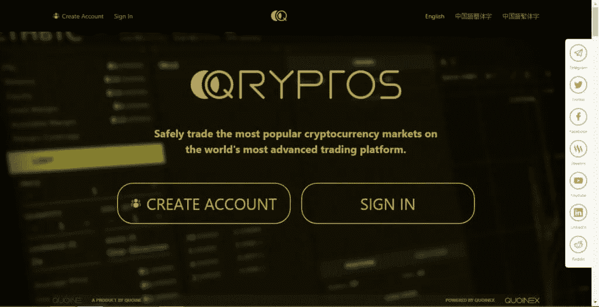
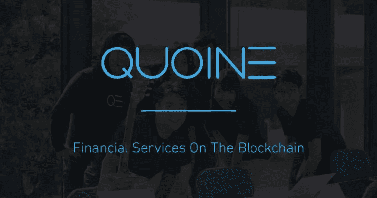
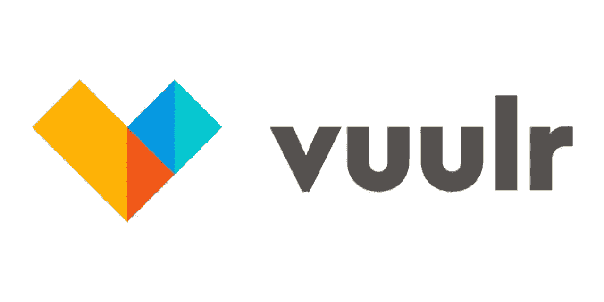

# QUOINE 公司 ICO 任务控制简介

> 原文：<https://medium.datadriveninvestor.com/if-by-this-time-you-have-not-heard-of-an-ico-or-seen-any-ico-ads-then-you-must-be-living-off-the-2f3d33ccc7f3?source=collection_archive---------7----------------------->

如果此时你还没有听说过 ICO，或者看到过任何 ICO 广告，那么你一定是生活在一个完全不同的星球上。进行 ico 是众筹的最新方法，许多公司，尤其是那些使用区块链技术的公司都在这么做。许多 ico 都达到了他们为活动设定的目标。这吸引了更多的区块链公司走上同样的道路。然而，许多人发现这并不容易，有时只有运气才能拯救你的项目。

ico 的规划涉及很多内容，这使得这项工作非常繁琐，而且你永远无法确定是否能达到目标。由于影响 ico 的某些因素，代币发行者和代币购买者通常都要冒很大的风险。

# ***进行一次 ICO 涉及到很多规划。***

1.  您需要遵守不同国家的各种监管机构制定的所有法规。
2.  有些法规很简单，有些法规最终会因为某些国家的法规而将 ico 踢出这些国家。
3.  还有广告的问题。如果你需要让你的产品全球化，向世界其他地方推销你的想法是很重要的，每个潜在客户都需要不断地被提醒关于你的产品。

# ***没那么伟大的 ICOs***

首先，我们必须承认这样一个事实，即有许多基于区块链的平台正在提出现实世界的解决方案，甚至可能是利用技术解决现实世界问题的最佳方式。事实上，所有的初创企业，甚至是正在扩张的公司，都需要一些流动性来启动或开展业务。

有不同的程序，必须遵循，可能并不完全知道一个新的公司试图有自己的 ICO。对于那些知道在程序上应该做什么的人来说，他们可能不知道如何在技术上为 ico 做准备。检查所有的准备框，但遗漏技术和管理问题可能会导致公司整个项目的崩溃。

据估计，2017 年推出的所有 ico 中，超过 40%都失败了，这还不包括那些超时没有响应的 ico。运行这些项目并不容易，这就是为什么有些人可能会在最轻微的挫折时放弃。有些人失败是因为不可救药的原因，比如糟糕的项目，但有些人失败是因为如果他们有一些好的指导，他们从一开始就可以阻止的事情。

# ***烂苹果***

以 Dao 为例，它有一个很好的项目，但它没有把基础做好。必须坚如磐石的最基本的项目之一是安全性，这不仅仅是在 ICOs 中，而是在所有在线完成的事情中。道遭受了一次黑客攻击，使他们陷入了一个无法逆转的恶性循环。他们在 ICO 期间运行良好，筹集了 1100 多万 ETH。这对他们的项目来说已经足够好了。然而，他们遭受了一次可怕的黑客攻击，导致 360 万瑞士法郎的损失。如果对平台采取更好的安全措施，这本来是可以避免的。道是代币发行者和购买者都受害的一个例子。另一个很好的例子是 Enigma，由于安全设置失败，甚至首席执行官的帐户也被黑客入侵。

对于代币的投资者或购买者来说，一些 ico 通过诈骗代币大赚了一笔。一枚硬币就是一个很好的例子。

*   它执行得很差，有很多表面和技术上的错误，从一开始就尖叫骗局。
*   投资者在没有产品或服务交付的情况下被骗走了数百万美元。
*   这个 ICO 甚至涉及警察突袭他们的会议，甚至逮捕一些官员。

这种 ico 可以让你记忆犹新，因为它提醒公众在投资或购买代币之前应该进行尽职调查。但有时，作为一个投资者，你可能会做你的尽职调查，并确定 ICO 确实是可信的，只是被骗了。

# ***引入 ICO 任务控制***

需要一种方法，通过该方法，ICO 的利益相关者可以确信他们将参与的计划将是安全的、可靠的、透明的并且以快速的方式完成。许多 ico 面临的问题之一是需要解决的可扩展性。于 [QRYPTOS](https://bit.ly/2GrTNpF) 发布的 ICO Mission Control 将是前瞻性的解决方案。

ICO Mission Control 在 [QUOINE](https://bit.ly/2rQmd7t) 下，在 [QRYPTOS](https://bit.ly/2GrTNpF) 上发射，QRYPTOS 去年成功进行了 ICO，但并非没有挑战。 [QUOINE](https://bit.ly/2rQmd7t) 决定开发一个平台，使代币发行者能够更安全、更方便地通过该平台安全、可靠地执行其 ico，并为投资者创造一个安全参与 ico 的场所。

现在密码世界需要的是来自 QUOINE 的 ICO 任务控制。这么多好的 ico 因为过去坏 ico 的罪恶，参与度越来越少。*一朝被蛇咬，十年怕井绳*，这基本上是一些投资者的操作方式。不管你的服务有多好，人们可能会因为过去的经历而退缩。一些像普罗迪姆这样的 ico 通过他们明目张胆的行动让事情变得更糟。然而，通过 ICO 任务控制中心，这些日子都将成为过去。

# ***现有平台***

QUOINE 已经有许多平台在它的生态系统中为不同的目的服务。他们的服务包括:

1.  通过区块链技术进行交易、交换和其他金融服务。
2.  [QUOINEX](https://bit.ly/2rJmqdF) 是 [QUOINE](https://bit.ly/2rQmd7t) 下的加密平台。它将成为 ICO 任务控制中心的重要资产。
3.  QUOINE 也有一个名为 [QRYPTOS](https://bit.ly/2GrTNpF) 的纯加密交换平台，它也将在 ICO 任务控制中发挥重要作用。

ICO 任务控制项目在 [QRYPTOS](https://bit.ly/2GrTNpF) 平台上启动。它提供了一个端到端的解决方案，允许 ico 以清晰、灵活的方式托管在这个平台上，并有严格的 KYC 和反洗钱规则。这两种形式的重要性不容忽视，因为它们是将参与者与他们在平台上进行的交易联系起来的关键。QUOINE 也将在便利性方面展示其平台的辉煌。根据监管机构或需要信息的公司的需求，KYC 和反洗钱表格可能有不同的要求。

对于投资者来说，他们可能会发现为他们想要参与的每一个 ICO 填写 KYC 表格和反洗钱表是很乏味的。不得不一遍又一遍地写几乎相同的东西，这既费时又令人沮丧。QUOINE 将有一个通用的 KYC 和反洗钱表单，可以在所有希望在其空间上托管 ICO 的平台上使用。投资者会发现，在他们对 [QUOINE](https://bit.ly/2rQmd7t) 服务的整个订阅中，只需填写一份 KYC 和反洗钱表格，并且只需在需要时更新表格，这很方便。

# ***变换 ICO 空间***

ico 相对较新，它们的繁荣导致了 IPO 的减少，而 IPO 最初是任何需要一些流动性的人的最爱。这些挑战已经凸显出来，包括资金的泄漏和损失，这促使人们需要这种创新。QUOINE 将通过其 ICO 任务控制项目改变 ICO 空间。

代币发行者要承受巨大的负担:

*   他们必须为潜在客户提供令人兴奋的服务和产品。
*   他们还必须开发托管这些服务和产品的平台。广告、营销和所有其他计划也必须由代币发行者来完成。
*   总之，这需要他们付出相当大的代价，这就是为什么在一些 ico 中可能会出现一些基本错误。ICO Mission control 计划让代币发行者及其未来客户的工作变得更容易。

# ***ICO***[***QRYPTOS***](https://bit.ly/2GrTNpF)

QUOINE 正在开发的平台将拥有任何 ICO 所需的所有必要特性。它将满足监管标准的要求。由于 QUOINE 在各自的服务中已经有了很好的追随者和大量的客户( [QRYPTOS](https://bit.ly/2GrTNpF) 和 [QUOINEX](https://bit.ly/2rJmqdF) )，决定使用 QUOINE 的代币发行者将通过 QUOINE 平台获得更大的市场份额。通过提供此类服务，QUOINE 将通过其 ICO Mission Control 承担一部分繁重的工作，这些工作通常会耗尽代币发行者的创造力，让他们只负责开发和改进他们的平台、产品和服务。

为了配合 ICO 领域的转型， [QUOINE](https://bit.ly/2rQmd7t) 还将通过其交易平台解决 ICO 的流动性问题。到 2018 年年中:

1.  [QUOINE](https://bit.ly/2rQmd7t) 计划将其[的 QRYPTOS](https://bit.ly/2GrTNpF) 平台与 LIQUID 合并，后者也在他们的金融服务旗下。这是一个非常超前的想法，甚至在密码世界里也是必不可少的。交易所和 ico 无法充分获得它们所需的资金池。
2.  QUOINE 将通过其已经建立的交易平台提供这种访问，该平台将与 LIQUID 合并，从而提供一个更强大的交易平台，该平台拥有准备好流动的客户，他们将向这些 ico 注入现金。

# ***ICO 任务控制的必要性***

2017 年加密货币取得非凡成功后的 ICO 热潮不会很快消亡，事实上，如果有什么变化的话，它只会增加或至少在目前的位置保持稳定。区块链产品有巨大的市场空间，这为区块链平台的发展创造了机会。对现有平台的改进正在进行，因为其他人创建了全新的平台，提供与现有平台相同的服务，但具有更安全的选项和更大的灵活性。只要 ICO 数量持续上升甚至趋于平稳，就需要 ICO 任务控制。

并不是每个人都有行政规划的天赋，许多平台都有支付他们提供的服务所需的资金，因此 ICO mission control 将成为这些平台的救星。ICO 飞行任务控制对于确保筹集的资金也很重要。每年在 ICOs 中收集的数据中，有超过 10%会被黑客和其他恶意实体窃取；这是根据欧内斯特和杨在 2017 年进行的一项报告。

ICO 任务控制将有助于减少这一数字，从而鼓励这些公司的增长。由于平均每月从不同的 ico 筹集约 10 亿美元，黑客们寻找轻松赚钱的机会，攻击不太可能停止。

# ***ICO 任务控制=美观便利***

大多数 ico 允许使用加密货币购买代币。他们可以通过加密货币筹集大量资金，但如果没有一个好的地方来交换这些加密货币，他们可能永远不会实现他们的计划。他们通常需要流动现金，ICO Mission Control 可以通过他们的交换提供帮助。ico 在筹资后需要的服务涉及大量现金。他们需要运营资金来开发他们的平台，并让平台顺利到位。

从投资者的角度来看，ICO 任务控制将改善整个 ICO 体验。

1.  这肯定会减少投资正在进行的 ICO 所需的时间，因为 QUOINE 将通过用户友好的用户界面运行这项服务。
2.  投资者所要做的就是选择他们想要参与的托管在 ICO Mission Control 平台上的 ICO，选择他们想要购买的代币数量并安全交易。
3.  他们最初的 KYC 和反洗钱表格将用于他们参与的每个 ICO。对于大多数投资者来说，仅此一项就足以让他们松一口气。

# ***拉近成功***

选择一个好的 ICO 进行投资，并不是一件容易的事情。投资者可能没有时间充分研究他们想要参与的 ico。ICO Mission Control 将使他们的投资更容易。ICO Mission Control 宣传自己是一种安全可靠的 ICO 投资方式。因此，投资者会发现更容易信任由平台托管的 ico，因为他们知道它们将经历某种形式的监管。

他们可能需要做的只是研究这些 ico 提供的产品，但在安全性方面，他们可以冷静地投资，因为他们知道他们投入的资金将直接用于广告宣传的事业。

总的来说，对于每个新平台来说，进行 ico 都变得越来越困难。

*   每天都有更多的规则被添加进来，试图筛选出骗子，只让真正的产品和服务提供商留在市场上。
*   然而，这也可能导致好的 ico 被列入黑名单，可能是因为一些错误或一些轻微的要求，他们无法满足。

ICO 任务控制中心就是为他们的客户做艰苦的工作。他们的平台将满足任何 ICO 的要求标准，从而确保将在那里托管的所有 ICO 都符合推荐标准。

# ***正在进行的 ICO 任务控制项目***

ICO 任务控制中心目前正在举办它的第一次 ICO。VUULR ICO 于 2018 年 5 月 9 日在 ICO 任务控制平台启动。他们的伙伴关系将有利于双方的平台和他们的参与者。购买者在 [QRYPTOS](https://bit.ly/2GrTNpF) 平台上不需要创建其他账户，因为他们已经通过了验证。

他们将购买代币，代币销售完成后，代币将通过 [QRYPTOS](https://bit.ly/2GrTNpF) 存入他们的账户。代币出售后，VUU 代币将在加密系统上市，这将使其成为可交易的，因此可以兑换成法定货币或加密货币。这基本上就是即将到来的 ICOs 和 [QUOINE](https://bit.ly/2rQmd7t) 平台通过 [QRYPTOS](https://bit.ly/2GrTNpF) 的合作方式。

# ***结论***

QUOINE 是第一个从日本金融厅获得官方运营许可的加密平台。对该公司来说，这是一项不便宜的壮举，它显示了监管机构对这个平台的信心。如果它的服务获得如此好评，那么 ICO 任务控制中心的表现将会比预期的更好。VLUUR ICO 将根据其 ICO 的表现和他们的经验来决定该平台的采用率。

该平台的成功可能会导致其他 ICO 任务控制平台的开发，这将是密码行业的一大进步。诸如此类的创新将通过它带来的节约以及它在投资者和代币发行者中创造的信心来促进该行业的增长和发展。ICO Mission control 是一项一体化服务，通过解决 ICO 面临的几乎所有痛点，必将改变 ICO 领域。

如果你觉得这篇文章有用，并且想看我的其他作品，请点击[这里](https://medium.com/@salmanmiah)关注我！😎