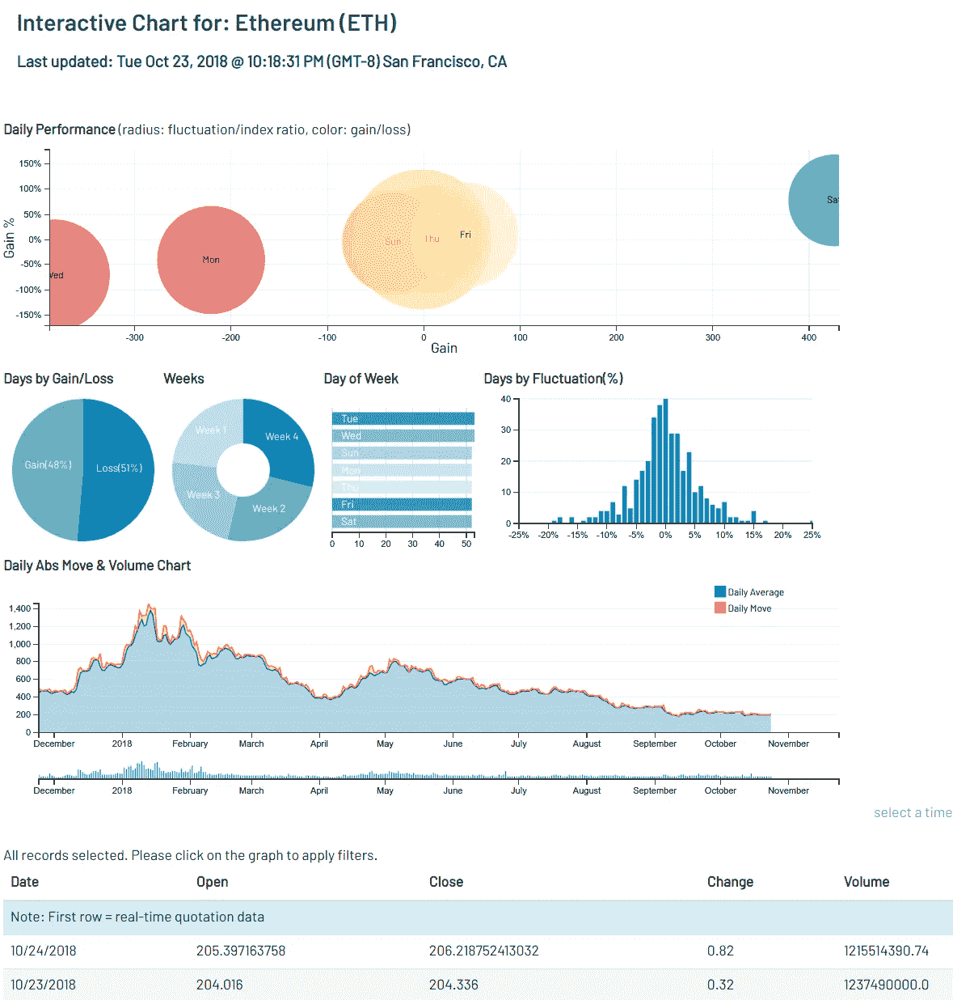

# 周五还是周一是 ETH 投资者最赚钱的一天？

> 原文：<https://medium.datadriveninvestor.com/if-i-am-going-to-gamble-whether-eth-will-gain-or-lose-tomorrow-what-is-my-chance-67969df7c2b7?source=collection_archive---------42----------------------->

下面的 ETH 交互式图表提供了 ETH 交易模式的独特视角。该图表旨在提出一些有趣的问题。如果我要赌 ETH 明天会赢还是输，我的机会有多大？对投资者来说，周五或周一是最赚钱的一天，还是有一个更好的长期投资的日子？春天比冬天更适合投资吗？你能找出异常值吗？异常值是什么时候出现的？

ETH 互动图表的链接[ [位于此处](https://vectorspace.ai/recommend/vectorspace-charts/vectorspace-chart-ETH.html)，截图如下:

当定位进场点或快速交易时，使用图表和指标会很有效。在这两种情况下，有一天你可能会想学习如何做空其他密码，同时长期持有 ETH。快乐的交易伙伴们！

声明:我的基金目前持有 ETH、 [QNT](https://www.quant.network/our-vision/) 、 [VXV](https://vectorspace.ai) 、 [COV](https://covesting.io/) 、 [ADA](https://www.cardano.org/en/home/) 和 [XMR](https://src.getmonero.org/)