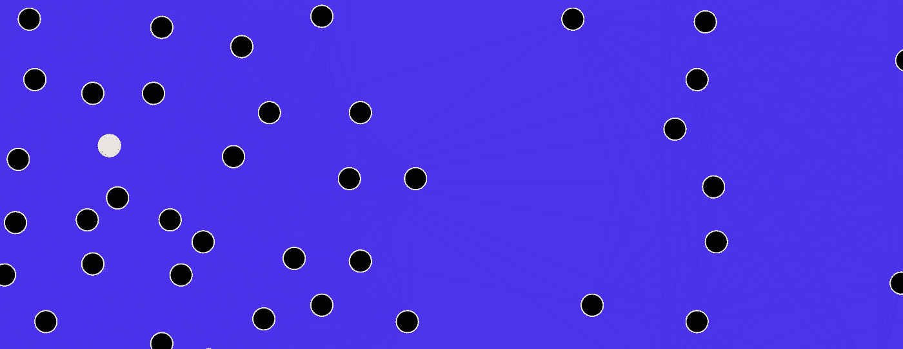

# 如果个人代理正在衰落，我们的民主会怎样？

> 原文：<https://medium.datadriveninvestor.com/if-individual-agency-is-on-the-wane-what-of-our-democracy-a65c44d23265?source=collection_archive---------11----------------------->

DarwinPeacock, Maklaan — [CC by 3.0](https://creativecommons.org/licenses/by/3.0/)

今天早上，我读了乔治·戴森的新年文章《童年的终结》，这篇文章探讨了他对数字计算机在我们的 DNA、神经元和邻居中超越模拟“计算机”的观察。他的文章对过去十年中我们一直在努力解决的问题和许多人讨论的问题提出了惊人的观点:

> “现在的代码比以往任何时候都多，但越来越难找到任何一个掌握方向盘的人。个人代理正在衰落。大多数时候，我们大多数人都在遵循计算机传递给我们的指令，而不是相反。”

戴森的一个关键区别是数字计算和模拟计算。数字计算是计算机代码驱动行为的领域，而模拟计算——或者用戴森的话说，“机器之间真正的智能、自主和控制”——是由生物驱动的。

普通美国人每天花在手机上的时间超过 3.5 小时( [eMarketer，2018](https://www.emarketer.com/content/mobile-time-spent-2018) )。移动设备上的很多时间都是在跟进数字通知，而不是相反。换句话说，移动设备中的应用和代码通常会告诉用户什么时候应该注意发光的屏幕，而不是让用户决定花 30 分钟在应用之间切换。

从一种奇特的意义上来说，数字计算机仍然需要程序员通过编写和编译的代码来告诉它们做什么——但越来越多的我们与数字屏幕的交互在任何真正的意义上都不局限于特定程序员的意图或代码的输出。在一个典型的人类与数字屏幕交互的方向盘旁，真的有程序员吗？是否有一大群程序员在指挥这些交互？

现代人几乎不可能认识到，我们每分钟处理的各种形式的计算和复杂数据，在多大程度上推动了哪怕是一天的决策和活动。

戴森写道，一个至关重要的问题是，由数字技术构建的最初近似且简单有用的数字服务、模型和资源——如搜索引擎、GPS 系统和社交网络——已经成为它们原本打算支持和/或在很大程度上控制它们最初增强和建模的模拟知识、行为和关系的实际事物。戴森文章中的三个例子:

> “搜索引擎不再是人类知识的模型，它*是*人类知识。”
> 
> “如果有足够多的司机订阅了实时地图，交通就得到控制，除了交通本身，没有任何中心模型。”
> 
> “成功的社交网络不再是社交图的模型，而是社交图。”

当我们想到我们的民主时，这场正在进行的革命推动模拟知识和现实世界决策的程度是一个令人信服的视角和轨迹。我主要关心的是:

**与数字部落主义相比，我们的模拟社会结构继续失去动力**:作为人类，我们经历了数十万年的进化，必须引导我们建立个人联系，重视面对面的关系，并拥有基于共同需求和价值观的社区意识。随着这些模拟关系越来越不受重视，更多的时间出现在屏幕上，我们的政治话语的质量和信任度将继续下降。从现在开始，更多的是红队对蓝队，但无处不在，包括[文化](https://www.usatoday.com/story/sports/ncaaf/2018/10/04/how-fans-reacted-college-sports-nike-colin-kaepernick-ad/1498729002/)和[经济](https://www.axios.com/partisan-split-stock-market-fe4f658d-a4bb-4919-b670-ad1ea015b11a.html)。

**我们进行模拟错误检查的能力在与 dis/misinformation、hacking 和深度伪造的斗争中变得更差** : [我们的大脑不一定擅长区分事实和虚构](http://www.pewinternet.org/2017/10/19/the-future-of-truth-and-misinformation-online/)，尤其是当信息与我们先入为主的观念发生冲突时。这在数字屏幕上加剧了，因为我们习惯于看到越来越多我们同意或支持我们信念的内容——谢谢你过滤气泡。正如过去十年俄罗斯在美国、乌克兰和其他地方开展的数字优先积极措施活动所显示的那样，也有坏人在对我们日常接触到的信息进行错误检查的能力构成的巨大威胁上浇油。我们首先要核实的地方可能是谷歌搜索…我不认为 Snopes 或维基百科会解决这些更大的问题。

戴森认为我们的下一步是创造不受程序控制的机器。我不清楚这看起来到底是什么样子，但也许这就是埃隆·马斯克建议我们在未来十年做的事情:将人类与人工智能融合。

我担心这会产生更多无法预料的问题和更深的文化、经济和部落分歧——以及民主混乱。

话说回来，也许艾萨克·阿西莫夫是对的，我们只是在寻找我们时间线的哈里·谢顿，为未来的漫长道路重新断言模拟控制系统(尝试谷歌“心理史学”)。