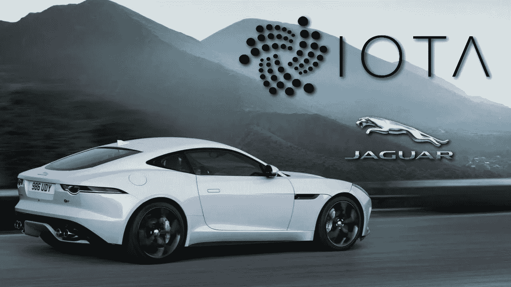
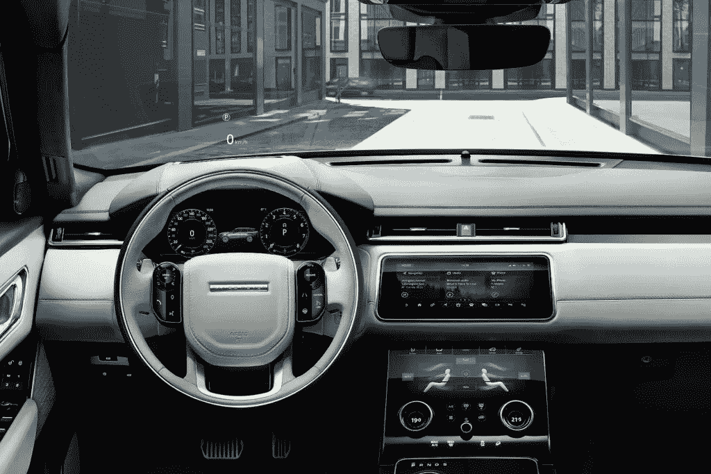
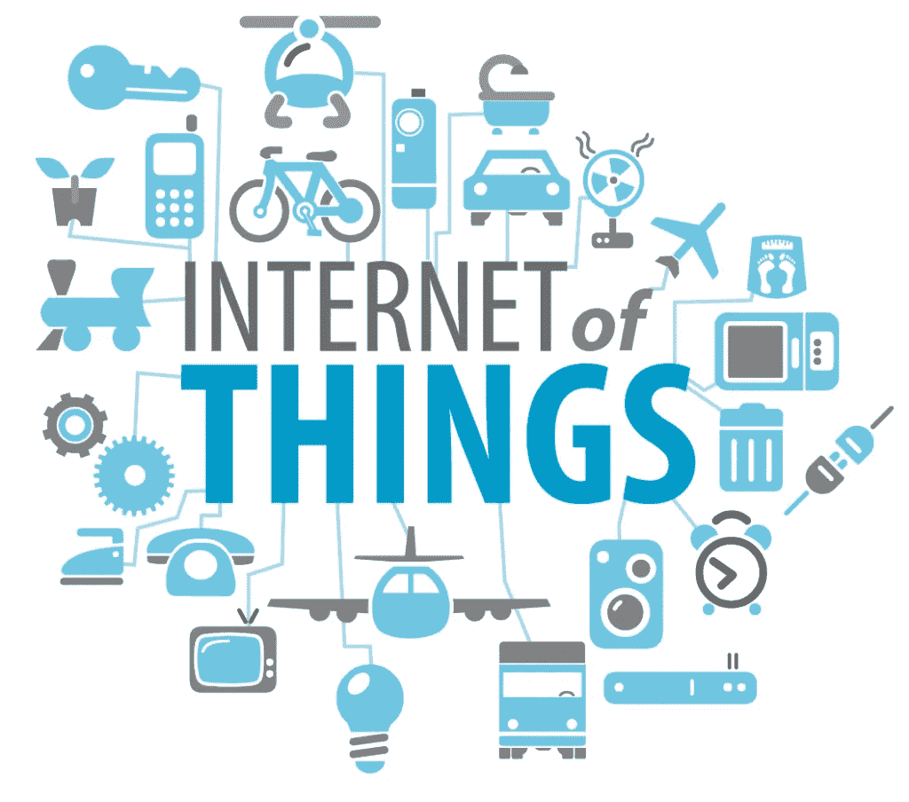

# 如果不是外国的，就是 Borin 的:捷豹路虎和 IOTA

> 原文：<https://medium.datadriveninvestor.com/if-it-aint-foreign-it-s-borin-jaguar-land-rover-and-iota-43ba39b65c20?source=collection_archive---------0----------------------->

K

自动驾驶汽车的出现让我们离汽车“自己驾驶并参与交易”的时代越来越近。你或你所在社区的汽车可以设置为拼车模式，在你打瞌睡观看你最喜欢的节目时收集加密货币。我在我的书里提到了一个非常类似的想法，[为笨蛋准备的比特币](http://www.bitcoinforblockheads.com)。当时，我相当有信心这将在未来 5-10 年内实现，但我从未想到计划会在**一**年内制定出来。

最近[宣布**捷豹路虎**和 **IOTA** 之间的](https://www.investing.com/news/stock-market-news/jaguar-land-rover-planning-to-allow-helpful-car-drivers-to-earn-cryptocurrency-1848861)合作关系让这一现实更加接近。

 [## 股票市场投资的机器学习——数据驱动的投资者

### 当你的一个朋友在脸书上传你的新海滩照，平台建议给你的脸加上标签，这是…

www.datadriveninvestor.com](https://www.datadriveninvestor.com/2019/01/30/machine-learning-for-stock-market-investing/) 

IOTA 是一种加密货币，其特点是:

> *“…*愿景是通过验证真实性和交易[原文如此]结算来支持所有连接的设备，从而激励设备实时提供其属性和数据。”

…别担心，我说流行语很流利。

IOTA 希望“[物联网](https://en.wikipedia.org/wiki/Internet_of_things)”在其专用的区块链之上运行。他们计划通过将智能设备连接到他们的分布式账本来创建一个不可信的经济。问题是，添加这些支持互联网的对象*会呈指数级*增加带宽使用量，而宽带速度只会呈线性*增加*。IOTA 相信他们的网络将通过允许出现*“雾”或“薄雾”计算*——物理世界中分散云计算的技术术语——来解决这个问题。

Investing.com 的文章谈到了最近的合作关系和对未来的愿景，捷豹路虎的汽车可以通过交换“有价值的数据”来赚取加密货币

> 这将奖励捷豹汽车司机 IOTA 硬币，以奖励他们让车辆自动向导航提供商或地方当局报告有用数据的行为，如交通拥堵或路面坑洼。

一定有更多的原因，*对吗？*

几乎可以肯定。

这些汽车可能会传输比这篇新闻稿中提到的平凡指标更多的数据。他们需要竞争优势；你的汽车上传的任何信息都必须是“稀缺的”，才能变得“有价值”，也就是说，它必须比你可以从谷歌地图 API 获得的信息更有味道。

这种合作关系将使他们的汽车拥有自己专用的 IOTA 智能钱包。然后，汽车将使用这个获得的密码来支付通行费和其他与车辆相关的服务。我想象洗车，机械师，充电站等。随着该技术的进一步采用，将被添加到列表中。目前，捷豹路虎工程师正致力于将该产品集成到他们的汽车中，并报告称捷豹 F-PACE 和揽胜 Velar 配备了智能钱包。考虑到共享的操作系统，它可能也适用于未来的型号。

# 物联网已经是现实。

智能手机是第一步，然后是可穿戴设备(如 Apple Watch 和 Fitbit)的加入，以及 Google Home/ Alexa 是最近的一步。你家冰箱在线会怎么样？当你的冰箱可以确定夏天即将来临，并且根据你的购物习惯，它知道你停止购买手工 IPAs 并开始购买手工酸奶时，会发生什么？你的冰箱就是那个很酷的家伙(…明白了吗？我知道，我也讨厌我自己)，已经点了你最喜欢的酸奶。这只是物联网如火如荼的时候，众多可能性中的一种。

我不能透露我在和谁说话，也不能透露他们为哪家公司工作，但我最近和一位在一家不知名的保险公司工作的女士交谈过。她告诉我，她的公司正在考虑*向*用户支付使用可穿戴设备的费用。这将提供访问用户的生物特征以及你的身体状况的信息。也就是说，如果你遭遇车祸，你的可穿戴设备会准确地知道你开得有多快，你的精神状态是否良好等等。这同样适用于健康保险。忘记“先前存在的状况”，你的健康保险公司可能会鼓励你佩戴可穿戴设备，但在这个过程中，它会知道你由于高压力的工作而保持着高血压水平，现在你必须支付更高的保费。另一方面，同样的技术可以为许多“健康”的人节省很多钱，同时降低健康风险。

如同任何技术一样，总是有积极和消极的应用。我很高兴看到还有哪些公司冒险与 IOTA 合作。他们的平台没有提供个性化的令牌，因此为了实现他们的崇高愿景，他们需要更多的合作伙伴。