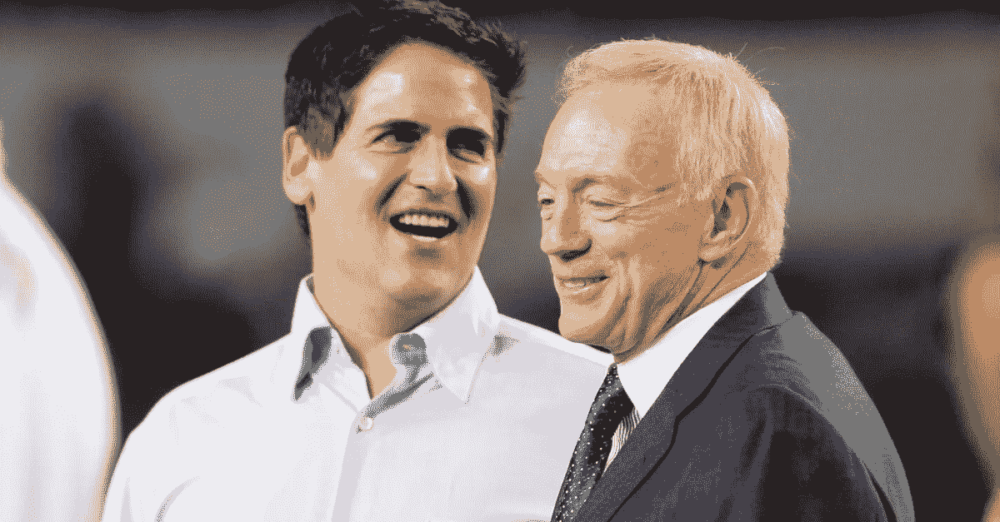
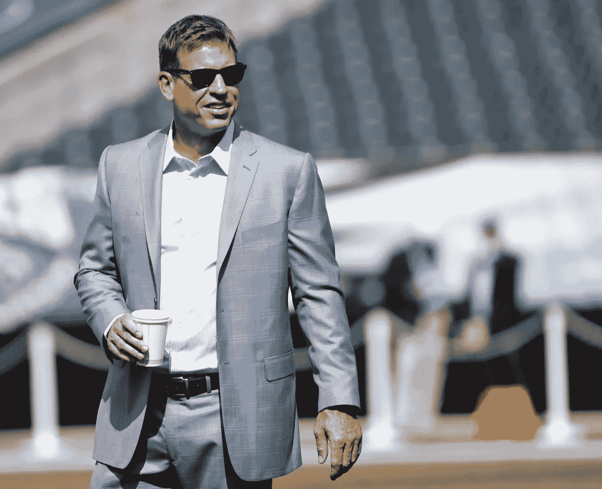
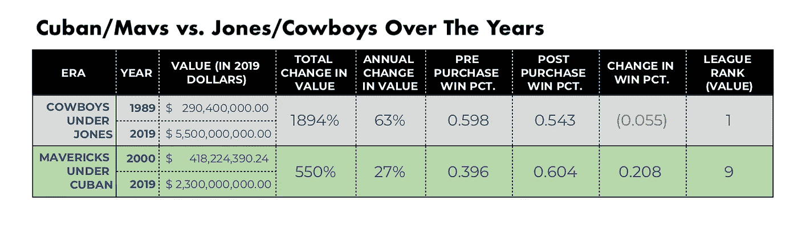
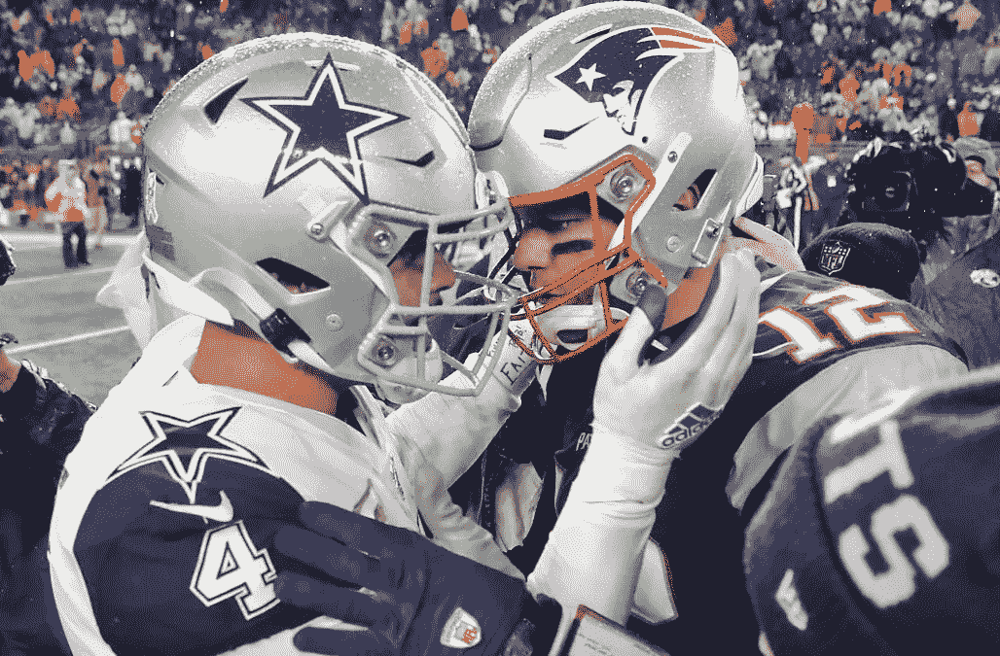
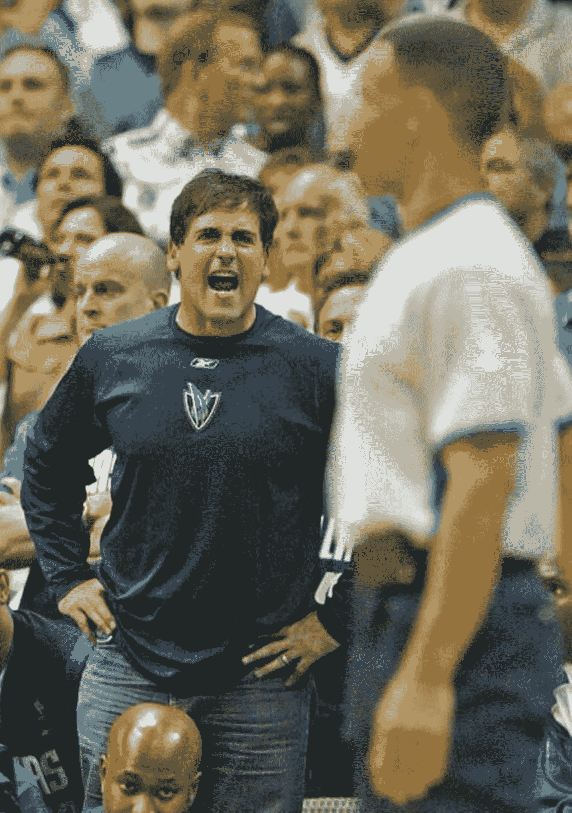
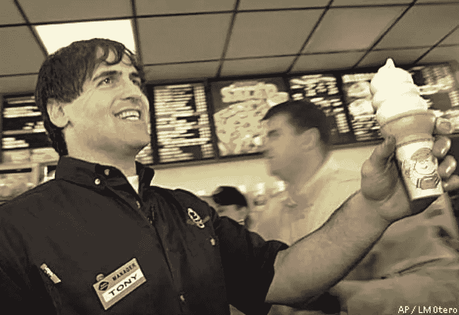
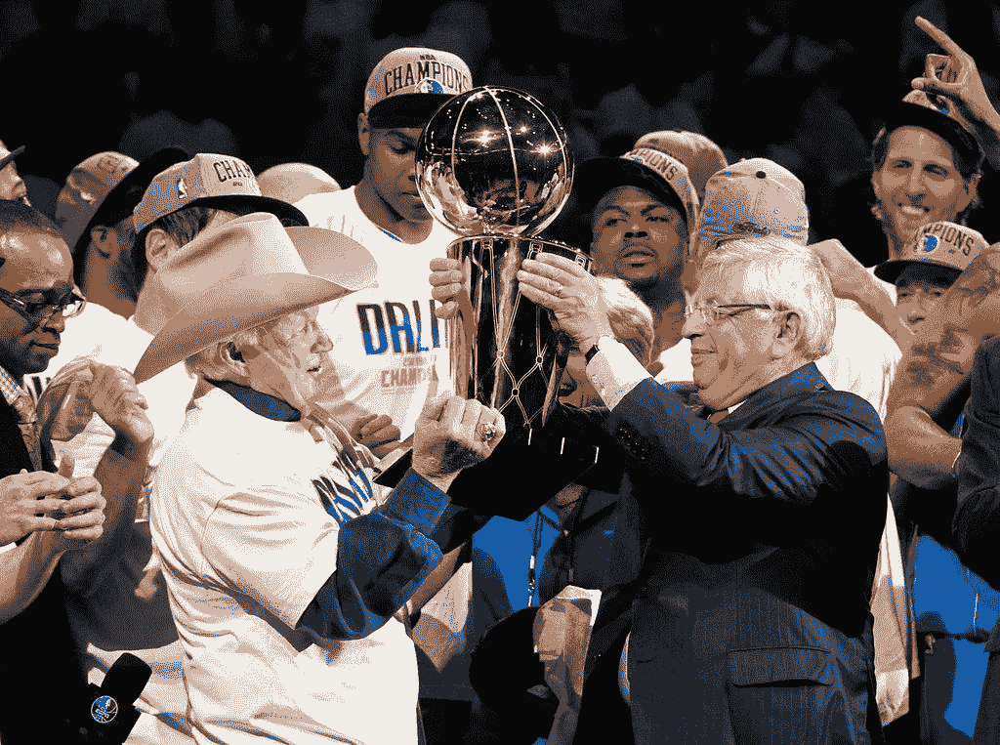

# 如果琼斯先生想让牛仔们再次成为大明星，他会打电话给马克·库班…

> 原文：<https://medium.datadriveninvestor.com/if-mr-jones-wants-cowboys-to-be-big-stars-again-hell-call-mark-cuban-f7c3dec54201?source=collection_archive---------5----------------------->

Dallas Mavericks owner Mark Cuban (left) has [said he wants to “emulate”](https://www.yardbarker.com/nba/articles/mark_cuban_wants_to_emulate_jerry_jones/s1_12680_24243157) Jerry Jones (right). Today Jerry needs to emulate Cuban. [Source: FanBuzz](https://fanbuzz.com/nfl/jerry-jones-tornado-donation/).

## 对琼斯来说看似不可能的任务，对库班来说却毫不费力

从 1993 年开始，已经有超过一代人的时间了，当时达拉斯牛仔队的粉丝和摇滚乐队“数乌鸦”都说，“琼斯先生和我，我们会成为大明星。”

达拉斯牛仔队(Dallas Cowboys)的老板兼总经理琼斯(Jerry Jones)曾经是一个大明星，现在却成了一个黑洞。他的挫折感证明了他的倦怠，这种挫折感在最近对媒体的评论中爆发出来。这种喋喋不休大部分是由于对他的球队未能获得分区冠军的不满。琼斯还发出威胁，暗示他三十年来的第八次主教练变动可能即将来临。

这些明显错误的评论甚至引起了该系列最引人注目的校友之一特洛伊·艾克曼的意外反应。据《华盛顿邮报》报道，[名人堂四分卫兼福克斯体育分析师表示，琼斯本人应对牛仔队的失利负责。](https://www.washingtonpost.com/sports/2019/12/04/troy-aikman-says-dallas-cowboys-struggles-begin-top/)

Aikman, who lived in the Cowboys system for well over a decade, said Jerry is the problem. [Source: SportsNaut.](https://sportsnaut.com/2019/12/troy-aikman-blasts-jerry-jones-for-cowboys-struggles/)

另一方面，NBA 达拉斯小牛队(Dallas Mavericks)是另一家*、*最近取得成功的当地特许经营公司之一的所有者，可能掌握着牛仔们似乎找不到的秘诀。当然，他们是另外三个本地职业体育俱乐部之一，自从牛仔队上次夺冠(超级碗 XXX)以来，他们每个俱乐部都两次争夺冠军。在买下这支球队时，他们现在的老板马克·库班承认，他是“坐在廉价座位上的家伙”中的一员，他不能“支付超过 10 美元来观看一场比赛”

与艾克曼不同，前小牛队前锋德克·诺维茨基在他未来的名人堂生涯中称赞他的老板不断将球队置于胜利的位置。根据 2017 年 NBA.com 的一篇文章，小牛老板马克·库班“是少有的不仅面对音乐，而且作曲和演奏音乐的老板，而且经常以震耳欲聋的音量。”

琼斯和库班现在已经统治了他们各自球队的一半以上(库班 20/40 赛季，琼斯 30/60 赛季)，这意味着大量的统计数据存在。这些统计数据证明了艾克曼是正确的！

## 杰瑞·琼斯的内爆

琼斯先生的诋毁性公开评论，与感恩节晚餐一起端上来，对牛仔队球迷来说，标志着灾难性的沸点。那天输给比尔的比赛促使许多球迷想知道，是贫血的牛仔队进攻还是摄入了所有的色氨酸(或两者都有)，在他们 26-15 死亡的后半段催化了异常强烈、强烈的小睡。

如果你醒来，你可能会想起一次赛后采访，琼斯说，对蔻驰·杰森·加勒特来说，这是“超级碗或破产”，他的牛仔队今年是 7-8。

 [## 2020 年最佳短期投资选择精选资源|数据驱动型投资者

### 投资是增加你净财富的一个好方法。如果你通过遵循一个严格的…

www.datadriveninvestor.com](https://www.datadriveninvestor.com/2020/03/28/handpicked-resources-for-the-best-short-term-investment-options-of-2020/) 

最后通牒是可以理解的，琼斯的功劳是，这是许多领导人经常使用的工具，并被证明是成功的。在这种情况下，警告之后通常是耐心和沉默，让处于困境的人有时间证明自己。

艾克曼知道，这不是杰里的风格——并在 12 月 3 日表达了这一点。

“这已经持续了 20 年，在某种程度上，有些球员开始觉得，‘哦，好吧。(琼斯)是发号施令的人，”艾克曼说。

此前一周，达拉斯在客场以 13 比 9 的比分输给了卫冕世界冠军新英格兰爱国者队。

在那次令人心碎的事件后，琼斯告诉 FM 105.3，“球迷”说，有争议的“山羊”，汤姆·布拉迪，“让球队远离伤害，让其他因素为他赢得了比赛。”

Cowboys QB Dak Prescott congratulates Tom Brady following the loss to the Pats. [Source: AOL.](https://www.aol.com/article/news/2019/11/25/cowboys-patriots-was-the-most-watched-regular-season-nfl-game-in-over-a-decade/23867644/)

具有讽刺意味的是，这句话本身就是琼斯先生对他称赞布雷迪避免的确切行动的示范。在新英格兰如此紧张的防守战之后，球迷和球队仍然共同希望更深入的季后赛，或者可能是超级碗。他们为什么不应该？如果仅仅输给帕特还不够，那就想想上个赛季…

2018 年，在 3-5 的开局后，华盛顿邮报[建议](https://www.washingtonpost.com/sports/2018/11/06/cowboys-were-win-now-mode-with-amari-cooper-trade-theyre-not-winning-now/)加勒特，或防守大师斯科特·莱恩汉可能会在赛季结束时被解雇，因为他输给了田纳西泰坦队。这种情绪随着最后八场比赛中的七场胜利而烟消云散。达拉斯进入了季后赛的分区赛，然后以 30 比 22 输给了即将成为 NFC 冠军的公羊队。

今年的牛仔没有像去年那样回应。他们的回应是连续两个周四晚上的亏损，对比尔和*然后*对空头。

在风城失利后不到 24 小时，琼斯先生在同一定期广播节目的[12 月 6 日第](https://nypost.com/2019/12/06/jerry-jones-cowboys-frustrations-boil-over-in-curse-filled-radio-call/)集播出。虽然许多粉丝认为琼斯说出布雷迪的评论并发出最后通牒是一个傻瓜，但在这个节目中，他再次开口消除了所有疑问。

当 105.3 的主持人问及该团队是否“放弃了杰森·加勒特”时，琼斯先生拒绝评论球员的表现。然而，他为自己解释道，酸溜溜地说，“有一大堆时间……我得把你打得屁滚尿流。”出于审查的目的，制片人短暂地打断了他。然后，琼斯先生的声音又出现了，问了一个问题，“你们知道什么是胡说，对吗，伙计们？”

这位前球队四分卫最近的评论、失误和公开谴责表明，琼斯不仅致命地改变了他们球队的前景，也改变了他们的头号生命线:他们的客户——球迷。

当然，库班先生是最近一位向 DFW 运送重要硬件的业主，他曾经说过:

> “对待你的客户就像他们拥有你一样——因为他们拥有你。”

## 坐在便宜座位上的家伙

在琼斯买下牛仔队的七年前，库班就进入了 DFW 大都会区队。不像琼斯先生从阿肯色州移民过来，库班首先是一个球迷，当然不是为了买一个运动队，也没有钱。

自从 1982 年来到大 D，库班缓慢而有条不紊地编译刚刚好。库班成为“杰出明星”的原因是他做过酒保、销售人员、日间交易员、软件经销商，最后还是 Broadcast.com 的创始人。后者，他卖给了雅虎！在 1998 年购买了 57 亿美元的股票。

库班准确地预测了被称为“网络泡沫”的现象，他迅速对冲了自己的股票，因为出售条款规定他不能立即出售。

对冲使他得以带着 13 亿美元的收益提前出局，尽管雅虎的股票。股票内爆了 90%。然后，他将投资分散到媒体、通信、技术、消费品和众多初创公司和风险企业，最终投资了小牛队。

Cuban was known for improving NBA officiating. [Source: Ft. Worth Star-Telegram.](https://www.star-telegram.com/sports/nba/dallas-mavericks/article5394174.html)

作为 NBA 最不成功的俱乐部之一的老板，库班因被联盟委员处以巨额罚款而闻名全国。然而，事后证明，这是一项智力投资，为库班和小牛队赢得了两项重要资产:

1.  **球迷们首先到场观看**古巴队，然后是之前因输掉*而闻名的球队*，因此，达拉斯的 NHL 球队(当年的斯坦利杯冠军)在这片农场池塘很少结冰超过一英寸的土地上变得更受欢迎。
2.  **尊敬。库班不顾自己的钱包，全力支持自己的球队，这是他应得的。他曾经在一家奶品皇后工作，证明他可以支持他对媒体的评论，即 NBA 主裁判埃德·拉什没有资格担任这个角色。*(一个* [*丑闻几年后*](https://www.newsday.com/sports/basketball/tim-donaghy-nba-official-betting-scandal-inside-game-1.38105133) *证明了库班的正确。)***

Cuban working at Dairy Queen. [Source: SF Gate.](https://www.sfgate.com/sports/article/OPEN-SEASON-A-man-of-his-confections-2882885.php)

艾克曼还指出，牛仔队在过去的 25 个赛季中只赢得了三场季后赛，以支持他的论点，即琼斯，而不是加勒特，是问题所在。

这一年也标志着库班和琼斯在各自组织生涯的一半时间里拥有了各自的团队。库班和琼斯都成功扭转了苦苦挣扎的专营权。讽刺的是，琼斯买了王朝，赢了三个冠军，再也赢不了了。库班买了一个全骰子，不能输。

当这位匹兹堡人在 2000 年 1 月 14 日为小牛队签下支票时，球队的历史战绩是 615-946，在 1999-2000 赛季的将近一半时间里，战绩是 11-26(胜率分别为. 394%和. 314%)。交换之后，99/00 小牛队取得了 29 胜 16 负。他们以不可思议的 40 胜 42 负的战绩结束了这个赛季。

Don Carter accepts the trophy in 2011, Cuban, a life-long fan, humbly let the founder accept their first title trophy, on his behalf. [Source: Dallas Morning News.](https://www.dallasnews.com/sports/mavericks/2018/02/26/breaking-down-the-worst-week-in-mavericks-history/)

今天，他们处于“卢卡·东契奇时代”，达拉斯顶级篮球的第二代。他们今年 20-10 岁。库班时代之前的平均记录是 32-50，此后翻了过来，变成了每赛季平均 50-32。虽然牛仔队只赢得了三场季后赛，但古巴拥有的小牛队(在琼斯上次超级碗后不到四年开始)赢得了 12 场七场季后赛系列赛，两次 NBA 西部联盟冠军和一次世界冠军。

当有人说出“达拉斯小牛队”这个词时，体育迷或商业大师大多会想到“古巴人”毫无疑问，这同样适用于梅雷迪思、多塞特、斯陶巴赫、莉莉、兰德里、艾克曼、史密斯、欧文以及除琼斯之外的任何人。此外，像 1994 年的琼斯一样，库班不需要解雇一名教练并雇佣另一名教练来证明自己的观点。

琼斯的“荣誉”只有在他能够通过专注于他的客户——全球粉丝群——找到 1989 年的自己，并从团队中抽身出来时才会到来。如果琼斯能在一家奶品店工作，得到任何教练或球员的支持，那就更好了。

然而，在那一天到来之前，华盛顿、纽约和费城的对手将会因喜悦而脸红，而牛仔队的球迷将会继续恳求…“递给我一瓶，琼斯先生。”