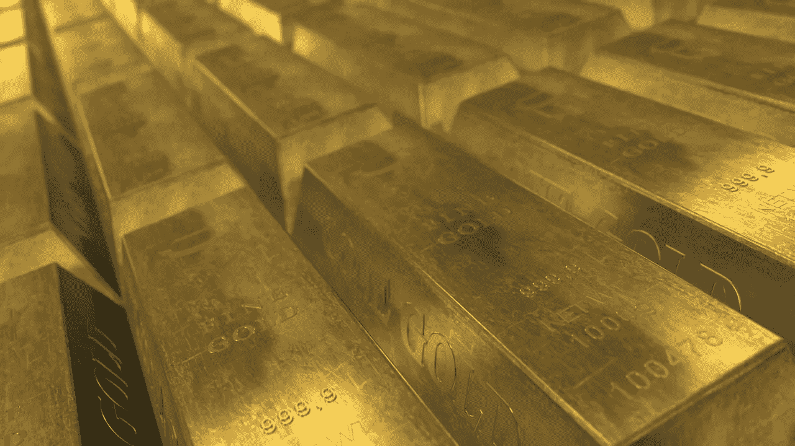
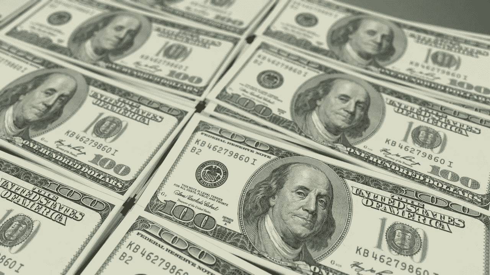
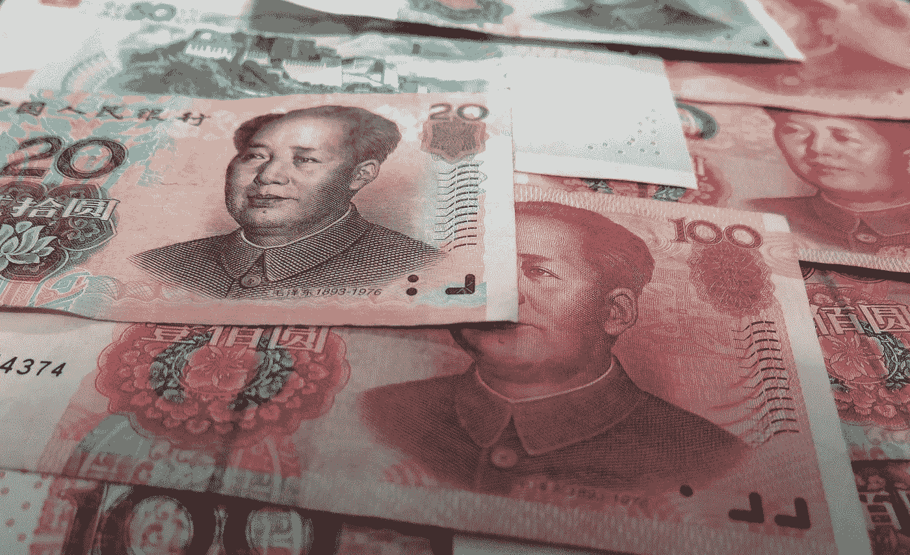

# 如果美元走软，比特币比黄金更有吸引力

> 原文：<https://medium.datadriveninvestor.com/if-the-dollar-weakens-bitcoin-beckons-brighter-than-gold-391c8bf8ce2c?source=collection_archive---------0----------------------->

## 从历史上看，面对美元疲软，黄金表现良好。但是，吸引投资者购买这种闪亮金属的特质在它的数字表亲比特币中得到了增强。

No ATMs out here. (Image by [dksecord](https://pixabay.com/users/dksecord-6216226/?utm_source=link-attribution&utm_medium=referral&utm_campaign=image&utm_content=3493210) from [Pixabay](https://pixabay.com/?utm_source=link-attribution&utm_medium=referral&utm_campaign=image&utm_content=3493210))

在北达科他州的一个偏远地区，蒂莫西·安德鲁斯和其他十个人正在启动柴油发电机。当他们拉动电线启动发电机时，一缕烟雾透过原本清爽的秋天空气散发出来，油亮的当啷声划破了外面的宁静。

安德鲁斯和其他 10 人是被称为“世界末日准备者”小组的一员。

来自不同背景和各行各业的银行家、工程师、教师、社会工作者和这个团体，将在北达科他州的荒野中度过一周，作为训练计划的一部分，希望能让他们为“后时代”做好准备

“后时代”的原因可能是美国和朝鲜、俄罗斯或中国之间的核冲突，也可能是任何其他形式的全球灾难，这些灾难将把世界变成介于好莱坞和迈克尔·克莱顿小说之间的后世界末日景象。

在“后时代”的反乌托邦世界中，世界末日的准备者相信民族国家将会因核冲突而被消灭，人类的残余将会在分散在可居住世界剩余部分的小协作细胞中维持生存——显然柴油仍然可以用于发电机(但我跑题了)。

在一周的时间里，安德鲁斯和他的团队将练习基本的生存技能，学习如何狩猎、觅食、建造避难所和寻找食物——所有这些都是以世界末日后 5000 美元的价格进行的。

 [## 总部位于瑞士的 ETP 进入密码交易市场|数据驱动型投资者

### 虽然在金融市场上几乎没有沉闷的时刻，特别是在引入…

www.datadriveninvestor.com](https://www.datadriveninvestor.com/2019/03/10/swiss-based-etp-enters-the-crypto-trading-market/) 

该培训包的创建者认为在“后时代”中必不可少的技能之一是管理和使用比特币的能力——许多末日准备者认为，当国家最终移交时，比特币将成为普遍接受的交换和价值存储媒介——因此安德鲁斯和他的团队都获得了比特币硬件钱包，并学习了数字货币的使用和管理。

然而，在更接近当代的情况下，每当主要国家货币受到威胁时，大多数投资者都会转向比特币的实物近亲——黄金。

## 就像世界各地的黄金一样好

在很多方面，黄金臭虫总是让我有点偏执，也许程度不像一个世界末日预报员，但也不远了。

因为你必须真的相信天要塌下来，以便在数字时代聚集物理酒吧。

然而，尽管有这种末日式的心态，一些投资者和央行行长实际上是在吹捧这种闪亮的金属。

在最近的一篇文章中，荷兰央行认为，如果有一次重大的货币重置，“黄金储备可以作为基础”来重建全球货币体系，

> “黄金增强了人们对央行资产负债表稳定性的信心，并创造了一种安全感。”

在国际金融研究所最近组织的一次会议上，对冲基金亿万富翁雷伊·达里奥提到了出于对美国财政状况的担忧而转向黄金的可能性，这吓坏了与会者。

Non-mobile money. (Image by [PublicDomainPictures](https://pixabay.com/users/PublicDomainPictures-14/?utm_source=link-attribution&utm_medium=referral&utm_campaign=image&utm_content=163519) from [Pixabay](https://pixabay.com/?utm_source=link-attribution&utm_medium=referral&utm_campaign=image&utm_content=163519))

诚然，对美国财政健康的担忧并不是什么新鲜话题。

早在 2016 年，摩根大通首席执行官杰米·戴蒙(Jamie Dimon)和对冲基金巨头斯坦利·德鲁肯米勒(Stanley Druckenmiller)就已经指出，没有资金支持的养老金和医疗保健福利是美国经济即将面临的财政海啸。

隔夜“回购”贷款市场最近的瘫痪被市场中一些更具阴谋性的部分认为是美国以外的投资者越来越不愿意为联邦赤字融资的表现。

但戴利奥对美国挥霍无度的担忧更进一步，他得出结论说，即将到来的福利危机意味着美国美联储别无选择，只能无限期地膨胀自己的资产负债表，在可预见的未来保持低利率(甚至负利率)，只是为了继续支付账单。

虽然这一举措必然会使美元贬值，但至少在短期内，美元对一篮子其他货币保持坚挺。

这并不一定意味着美元是不可战胜的，它只是意味着其他国家和货币的情况更糟。

但如果美元开始贬值，历史上有足够的例子说明接下来会发生什么。

## 美元占据主导地位，直到它不再占据主导地位

以前的货币贬值实验没有好结果。

三世纪晚期的罗马、两次世界大战期间的德国魏玛共和国和津巴布韦，只是一个国家(或帝国)决定让本国货币贬值时会发生什么的一些例子。

戴利奥认为，最终，没有人会想持有美国债券或美元，投资者会转向其他资产寻求安全，

> “问题是还有什么？我认为这就是我们将要面对的环境。”
> 
> “有一种说法是，黄金是你唯一可以拥有的资产，而不是别人的负债。”

当然，戴利奥可能已经忘记了黄金的数字表亲——比特币。

因为比特币在算法上是通缩的，也因为它不代表对世界上任何一方的债务，所以比特币完全是一种资产的数字等价物，而不是“任何其他人的负债”。

Spending them faster than they can be printed. (Image by [3D Animation Production Company](https://pixabay.com/users/QuinceMedia-1031690/?utm_source=link-attribution&utm_medium=referral&utm_campaign=image&utm_content=2874026) from [Pixabay](https://pixabay.com/?utm_source=link-attribution&utm_medium=referral&utm_campaign=image&utm_content=2874026))

仅仅因为世界正在从一个物理划界的世界转变为一个数字主导的世界，就意味着旧秩序的许多参与者将很难理解，更不用说接受比特币可能代表价值的未来——这是唯一一种不依赖于民族国家概念的远程全球货币。

虽然美元迄今为止被全球接受为美国治下的和平，但在过去几十年里，美元背后的保障已经被削弱，这既是因为美国的挥霍，也是因为最近美国对支持全球和平的枪支的削弱。

金融分析师 Luke Gromen 是 Forest For The Trees LLC 的创始人，他阐述了美国权利海啸背后的数学逻辑。

在最近的一份时事通讯中，Gromen 计算出美国每年的应享权利付款，他定义为包括医疗保险、医疗补助和社会保障，加上国防支出和联邦债务利息，总计为美国联邦税收的 112%——这一水平仅在 15 个月前为 103%。

美国的福利债务以惊人的速度超过了收入。就在两年前，津贴只占税收的 95%。

鉴于美国总统唐纳德·特朗普(Donald Trump)执政初期的减税政策，政府收入大幅下降，加速了无准备金债务的增加。

但这些特朗普式的减税措施不仅帮助了富人和公司，还助长了股票和房地产方面不稳定的资产价格通胀，以至于美国已经“完全依赖资产价格通胀来获得税收收入”，Gromen 说。

Who’s got two thumbs and is giving himself a tax cut? (Photo by [History in HD](https://unsplash.com/@historyhd?utm_source=unsplash&utm_medium=referral&utm_content=creditCopyText) on [Unsplash](https://unsplash.com/s/photos/trump?utm_source=unsplash&utm_medium=referral&utm_content=creditCopyText))

Gromen 认为，展望未来，美国支付其年度账单的唯一方式要么是资产价格继续有机上涨，要么是美联储“印刷足够的货币来推动资产价格上涨”。

尽管唐纳德·特朗普(Donald Trump)总统一再努力敦促美联储保持流动性水龙头的畅通，但这种破坏美联储独立性的公开呼吁无助于美联储做它本来会做的事情——这是政治上的权宜之计。

无论是美国还是世界其他国家都无法承受美国国债名义上的违约——就目前而言。

## 树真的长到天上去了

银行界有一句话，“如果你欠银行钱，那是你的问题，如果你欠所有人钱，那是所有人的问题。”

这句话用在美国再恰当不过了。

因为世界其他地方持有美国债务，如果美国违约，这将是一个真正的全球性问题，而不是一个明显的美国问题。

这意味着，至少在目前，股票和其他资产价格将继续上涨，就像涨潮能浮起所有的船一样。

由于唐纳德·特朗普总统以股市价值衡量他的成功，2020 年底前的另一轮减税很可能会发生。

但从长远来看，金融工程化的增长最终肯定会削弱人们对美元的信心——尤其是在美国和中国走向不同方向的时候。

中国是世界上最大的自然资源消费国之一。与拥有丰富且似乎无穷无尽的能源资源的美国不同，中国依赖石油进口，作为世界上最大的天然气买家，中国正寻求开始用人民币为天然气和其他基本商品定价。

Beijing ballers be all about the paper. (Image by [moerschy](https://pixabay.com/users/moerschy-127417/?utm_source=link-attribution&utm_medium=referral&utm_campaign=image&utm_content=938269) from [Pixabay](https://pixabay.com/?utm_source=link-attribution&utm_medium=referral&utm_campaign=image&utm_content=938269))

这就是中国拟议中的央行发行的数字货币可能对全球大宗商品业务的本质产生深远影响的地方。

中国央行(PBoC)推出自己的数字货币的工作已进入最后阶段，它可能会推动交易对手在国际贸易结算中使用其数字货币，从而大幅减少跨境贸易中固有的文书工作、摩擦和延迟。

随着中国人民银行的数字货币证明了其在全球贸易中的效率和认可度，它可以为其他国家提供足够的激励，让它们采用中国人民银行的数字货币来结算彼此之间的合同，从而损害美元。

北京几乎不关心人民币是否被用来支持威权政权或逃避制裁，这只会增加其作为国际结算货币的吸引力。

中国也不再发行以美元计价的债券，而是选择更多地以欧元进行交易，试图将欧洲包围在自己横跨“世界之岛”的经济轨道中。

最近，中国发行了逾 15 年来首支欧元计价债券。

中国也早已不再用美元购买石油，而是用其他货币从伊朗和俄罗斯等受到美国制裁的国家购买石油。

“世界岛”的去美元化将为戴利奥的观点提供证据，即世界正在脱离美元作为储备资产的地位——但正如戴利奥自己承认的那样，

> “问题是，还有什么？”

## 在盲人的世界里，独眼龙是国王

虽然欧洲的自由民主国家只会乐于让中国用欧元结算账单，但不能保证他们会同意接受中国央行的数字货币。

因此，长期以来对加密货币持开放态度的现任欧洲央行行长克里斯蒂娜·拉加德(Christine Lagarde)建议欧洲必须带头发行自己的数字货币，这并非巧合。

因为虽然不乏非常乐意与中国做生意的国家，但它们仍然欣赏美国提供的安全保护伞，并对北京的意图保持警惕。

在这种背景下，即使美元走弱，债权人对美国偿还债务的能力失去信心，市场仍可能在此后一段时间内继续走高。

但随着去全球化的全面展开，历史一再证明，当这种情况发生时，通常会引发与旧世界秩序相关的国家的资产价格崩溃。

而当资产潮退去，有些资产自然会比其他资产表现更好，这也是黄金 bug 比比皆是的原因。

然而，出于黄金爱好者执着于黄金的同样原因，这种闪亮金属的相同特征在黄金的数字、也可以说是更现代的表亲——比特币中得到了强调。