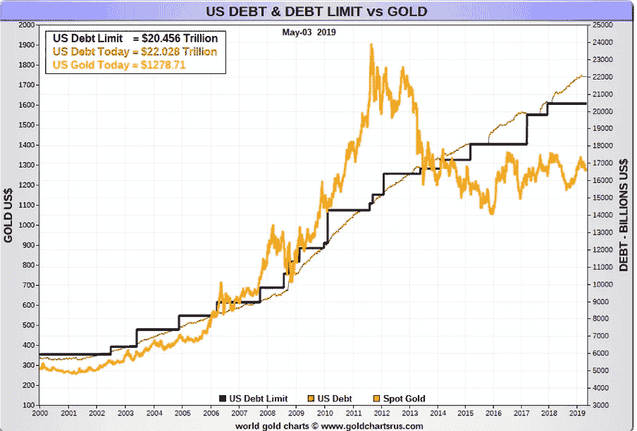

# 如果你和一个白痴争论，你创造了两个白痴…..

> 原文：<https://medium.datadriveninvestor.com/if-you-argue-with-an-idiot-you-create-two-idiots-df0df43df909?source=collection_archive---------5----------------------->

我相信我们都发现自己处于这样一种情况，有人说了一些让我们下巴撞到地板的话。评论如此荒谬，你不知道从何说起。

如果你幸运的话，你可以优雅地退出，把这种情况留给别人。不幸的是，情况并非总是如此。

 [## 算法交易的机器学习-数据驱动的投资者

### 当你的一个朋友在脸书上传你的新海滩照，平台建议给你的脸加上标签，这是…

www.datadriveninvestor.com](https://www.datadriveninvestor.com/2019/01/30/machine-learning-for-stock-market-investing/) 

如果你和他们在一起，情况会很快恶化。

因为如果你和一个白痴争论，你自己也会很快变成一个白痴。你发现自己没有上升，而是跌到了他们的水平。

如果有人认为你们两个都是白痴，那也情有可原。

你可能想知道我要说什么。

让我解释一下。

每一个行动都有一个结果。

有些可能迫在眉睫——试着站在一辆公共汽车前面。其他的则需要更长的时间才能显现出来——如果你减少了退休储蓄——它在一段时间内不会对你产生影响，可能会持续很长时间。但是会的。

在某些时候，任何先前的行为都会产生后果。

现在，世界上发生了很多事情。与中国的贸易战以及迅速增加的债务——仅举两例。

这两者都会有后果。也许不是明天。但是当鸡回家休息而你什么也没做的时候，你会觉得自己有点像个白痴。

这就是问题所在。

因为目前什么都没发生。许多人，事实上是大多数人，认为什么都不会发生。

你没做错什么。但是你什么都没做。这就是问题所在。

想想不断攀升的债务。就个人而言，你可以增加抵押贷款，获得一些信用卡，并采取透支。但在某些时候，你会无路可走。

公司大同小异。

但是国家可以做得更久。尤其是如果他们可以自己印钱的话。“罐子”在路上不断被踢开。这是一条更长的路。但是所有的路都有尽头。

看一下这个图表。

来源:Goldchartsrus

每次美国债务上限提高(黑线)。罐子被踢了。

最终会有一个后果。

与中国的贸易战将对我们所有人产生巨大影响。但是因为影响可能要几个月以后，所以现在还不是问题。

但是会的，所以准备是有意义的。

总之，回到我们的白痴。

因为因果之间的时滞，没人在意(包括我们的“傻逼”)。但是他们应该。

如果你就此事展开讨论，你可能会对漠不关心的程度感到惊讶——政府会处理的。

有意思。

政府想要你的投票。但这就是他们想要的。

你只有一个(和我们的“傻逼”一样)。

我的观点很简单。不管你准备与否，你都有一票。

对任何政府来说，你都一样。

让我们按下快进键。

当我们最终跑出路的时候，绝大多数都会措手不及。你认为政客们会站在哪一边？不要指望任何帮助。

你只能靠自己了。

但是你可以准备。即使你选择去保护你所获得的一小部分，做点什么也是有意义的。

否则，你可能会觉得自己有点白痴——你会让自己被拖到那个水平——认为不会有什么后果。

但你知道会有的。

请去看看我的网站，了解更多关于 www.brookvillecapital.com 的信息