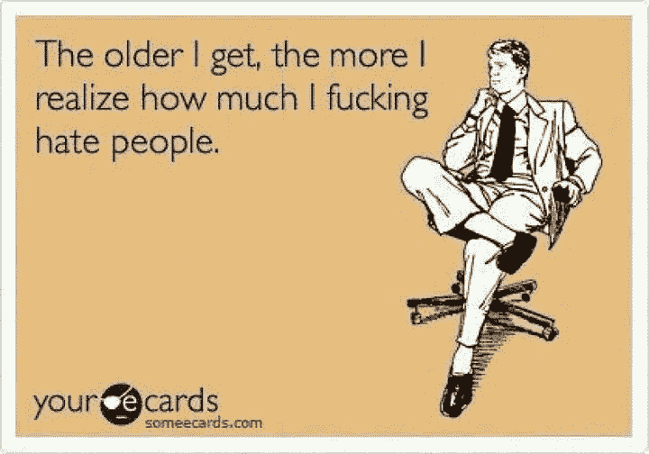
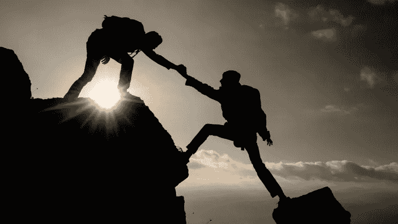

# 我们现在比以往任何时候都更需要领导者

> 原文：<https://medium.datadriveninvestor.com/if-you-can-do-this-then-you-have-a-leg-up-on-99-of-people-29d12bc3c943?source=collection_archive---------58----------------------->

真正重要的是。

现在，我的同事正在 Youtube 上听 Tony Robbins 和 Gary Vaynerchuck 的励志视频，他正在打包箱子准备运出仓库。

他每天从上午 10:00 到下午 3:00 以最大音量听这些音乐。

当任何人打开分隔我们办公室和仓库的门时，一股激励人心的声音就会穿过我们的小隔间。

他比我小几岁，来自一个连简单的生活费用都难以支付的家庭。他梦想有一天拥有自己的房子，目前每周工作 7 天，从事三份不同的工作。

我们的接待员是一个寡妇。当她休息的时候，她会看看 Pinterest。

她永远都在引用爱情、生活、幸福以及介于两者之间的一切。她甚至会把这些打印出来，放在覆盖她樱桃木办公桌的玻璃下面。

我渴望通过创造力获得财务自由。我梦想还清我的学生贷款，同时通过我的创造性努力或我的许多商业想法中的一个来舒适地独立支持自己。

背景音乐是伊丽莎白·吉尔伯特的播客，接下来是玛丽·弗里奥的播客。这些女人激励着我。他们似乎知道自己是谁，想要什么。最重要的是，他们非常成功。

它们让我感觉很好。

它们给我带来希望、灵感，激发我内心的决心，而这种决心通常会被我朝八晚五的工作所挫伤。

他们让我觉得，我也可以成就伟业。就像我的梦是有形的，而不仅仅是扔进喷泉的硬币。

它们让我觉得，随着岁月的飞逝，我不仅仅是在工作上浪费时间。它们让我觉得我脑子里所有这些疯狂的想法在现实生活中都是可以实现的。

他们给我提供了一些我自己无法提供的东西；自信、安心和乐观。

我不是每天都听这些播客。大多数时候，我可以挖掘自己辛苦培养的积极来源，但在我因恐惧而沉默、缺乏勇气或感到不安全的日子里——这些由我钦佩的人创作的播客提醒我要有勇气面对恐惧，不安全会带来进步。

当人们情绪低落时，能够鼓舞他们，帮助他们相信他们有能力释放自己独特的潜力，让他们在一个似乎努力成为对立面的世界中感到快乐，这是当今世界上最强大的东西。

即使世界上有所有的自助资源，美国人口的抑郁、自我怀疑、自卑、肥胖、精神疾病等问题仍处于历史最高水平。

每天我们都在把自己和那些似乎比我们富有的人进行比较，因为他们就是这样被描绘的——不管真实与否。

我们中的许多人都觉得自己在生活中被误解了，因为在社会中没有自我意识和对他人的理解。

见鬼，我见过很多利用我们对人类同胞的仇恨的点击诱饵文章:

虽然我知道这些模因和文章是为了给我们的生活注入幽默，但也有“我知道对吗？!"支持这些观点的人。

事实是，我们都很害怕。我们不知道接下来会发生什么。我们中的一些人不知道我们的下一顿饭将来自哪里。我们中的一些人被其他人严重虐待，在一个我们只知道消极和不正常的家庭中长大。我们中的一些人感到极度焦虑，以至于我们从早上睁开眼睛的那一刻起就麻痹了。

我们很多人都觉得自己是受害者，被剥夺了改变自己生活的权力。

加里·维纳查克、托尼·罗宾斯、玛丽·弗里奥——把你的力量还给你。

在一个很难不感到自己渺小、宝贵和不安全的时代，他们给了别人力量。

因为这对我们自己来说并不容易，因为我们不能简单地从商店的货架上购买，给予授权的礼物已经成为一种无价的商品。

力量是运动的开始。功率是实现最高性能的因素。权力是推动创新的动力。

培养你的力量并与他人分享，这是让你成为领导者的原因。

这个世界将永远是少数领导者和众多追随者之一，因为培养你的力量并学会如何将这种能量注入他人的生活需要时间。

但是一旦你做到了——一旦你发现了如何成为一个领导者，被授权和授权给别人，你将会是大海捞针，并会获得成功。

这只是时间问题。