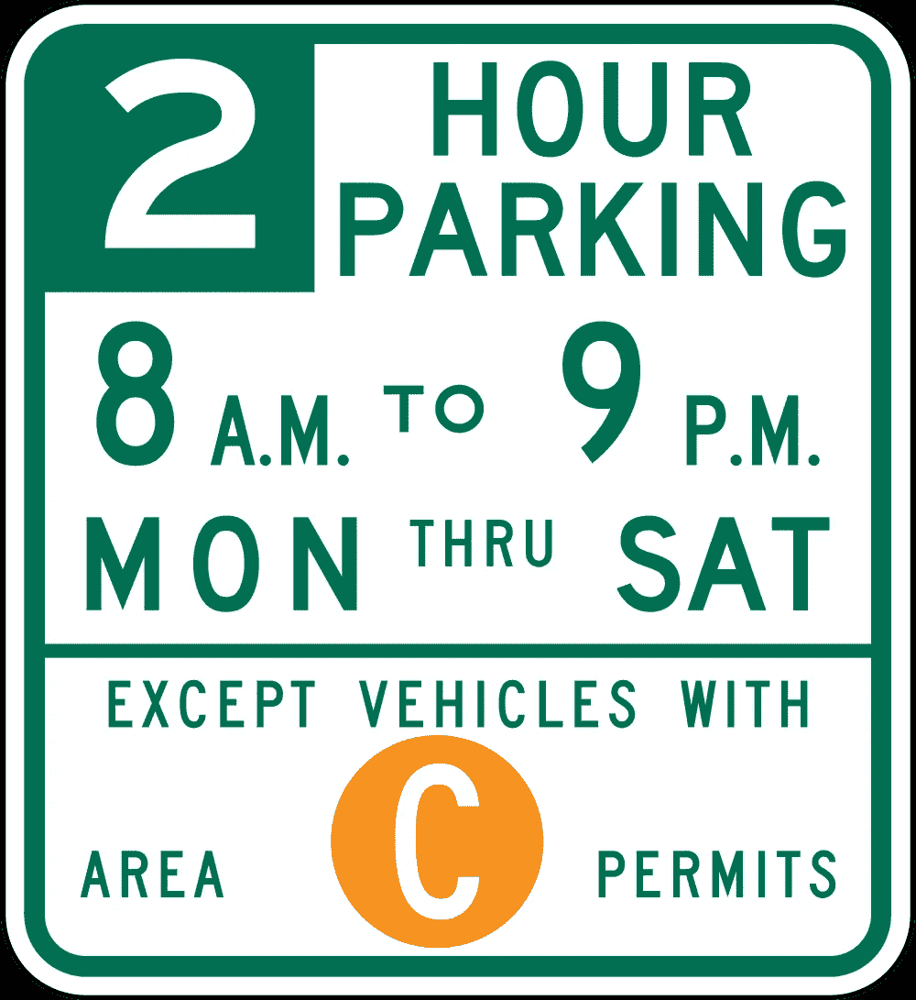
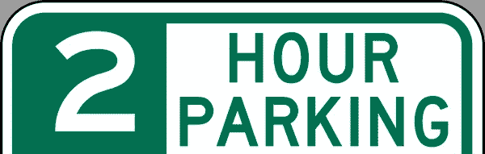
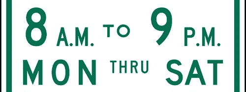
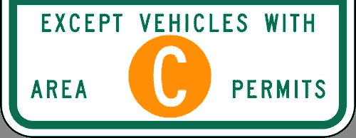
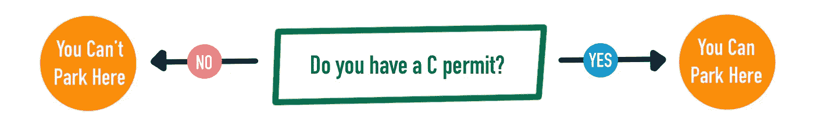
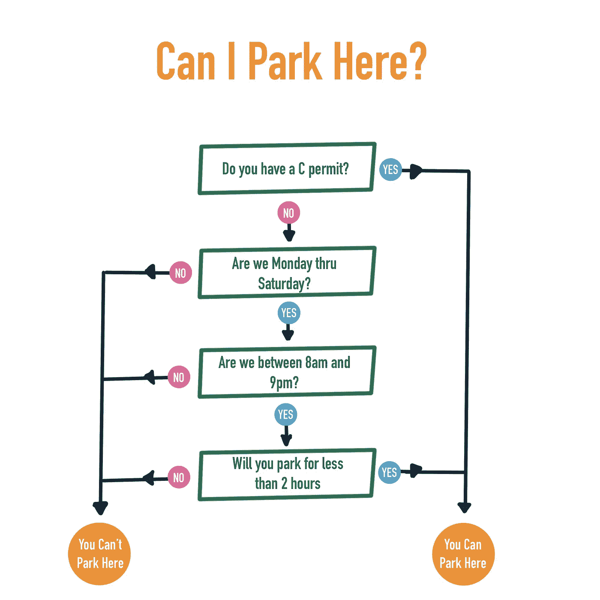
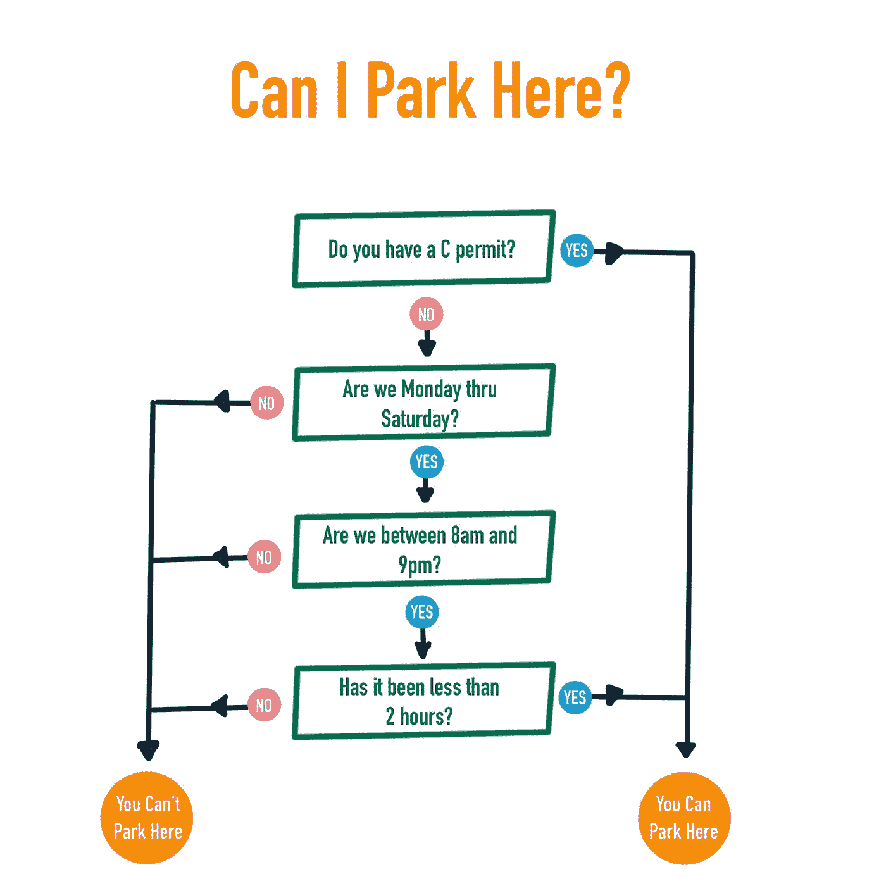

# 如果你能读懂停车标志，那么我可以教你编码

> 原文：<https://medium.datadriveninvestor.com/if-you-can-read-parking-signs-then-i-can-teach-you-to-code-a14dd41d8003?source=collection_archive---------3----------------------->

[](http://www.track.datadriveninvestor.com/1B9E)

Can you read this? Then you can code

对于一个局外人来说，学习编码看起来很陌生也很吓人，但实际上这是一项非常容易学会的技能。事实上，这里有一些好消息，如果你能读懂停车标志，那么你已经知道如何编码，你只是没有意识到你的惊人天赋。如果你看不懂这些标志，那么这篇文章至少会阻止你拿到新的停车罚单。

# 了解停车标志

在我们开始之前，让我们确保我们确实理解了停车标志。这个符号比它应该的要复杂，所以让我们把它分成三个简单易懂的部分。

[](https://www.datadriveninvestor.com/2019/02/21/best-coding-languages-to-learn-in-2019/) [## 2019 年最值得学习的编码语言——数据驱动的投资者

### 在我读大学的那几年，我跳过了很多次夜游去学习 Java，希望有一天它能帮助我在…

www.datadriveninvestor.com](https://www.datadriveninvestor.com/2019/02/21/best-coding-languages-to-learn-in-2019/) 

## 顶部区块—最大停车时间



最上面的街区告诉我们，我们最多可以在这里停车 2 个小时。

## 中间街区—停车时间表



中间部分是我们的时间表。你只能在周一到周六上午 8 点到晚上 9 点之间在这里停车。

## 底部模块—例外



这个例外是告诉你，如果你有“C”许可证，你可以随时停在这里。

# 预期的结果

当我们看到停车标志时，我们实际上想做的是回答一个非常简单的问题，“我可以在这里停车吗？”答案要么是**是**要么是**否**。当然有时间限制和其他约束要记住，但最终目标是知道你是否可以停车。这是个好消息，因为计算机真的很擅长用**是**或**否**来回应。

如果我们重温上面的三个模块，我们可以将它们中的每一个都变成可以用**是**或**否**来回答的问题:

1.  我会在这里停车少于 2 小时吗？

2a。我们是周一到周六吗？

2b。我们是在早上 8 点到晚上 9 点之间吗？

3.我有 C 许可证吗？

# 找出问题所在

我们现在有了一个停车标志，它被分解成可以用明确的**是**或**否**来回答的问题。我们的下一步是创建一个流程图。

## 什么是流程图？

流程图是一个简单的图表，向你展示一个问题所有可能的结果。这是将每个问题及其答案的后果形象化的好方法。

流程图不仅仅是为了编码，只要有明确的答案，它们可以帮助你解决任何类型的问题。



要阅读这篇文章，首先回答问题“你有 C 许可证吗？”

如果答案是**是**，那么你就顺着**是**箭头的流程走，否则，你就顺着**否**流程走。

现在，让我们使用上面定义的块来布置停车标志的整个流程。



从最上面的第一个问题开始读。用**是**或**否**回答问题，然后跟随答案进入下一个模块。继续这样做，直到你到达一个橙色的圆圈。

当你处理一个编码问题时，流程图是一个很好的工具，可以帮助你把问题分解成更小的、更容易解决的任务。重要的是要记住，每条路都必须通向明确的结果——没有灰色地带。

# 为什么问题的顺序不一样？

眼尖的会注意到，从原来的停车标志到流程图过渡，有两件事发生了变化。时间和小时被分成两个问题，以便于阅读和回答。尽可能分解你的问题，重要的是保持事情简单。

我做的第二件事是我重新排列了一些问题。如果有人有“C”许可证，他们应该可以立即停车，而不必回答任何其他问题。你应该尽快得到答案，就像你一得到答案就停止看标志一样。

我也把 2 小时的限制挪到了最后。如果你不能在这里停车，就没有必要知道时间限制。

# 编码基础

现在我们有了流程图，剩下的唯一问题是我们实际上不知道如何编码。没关系，那只是个小细节。

早些时候，我们改变了我们的问题，所以他们有**是**或**否**的答案。这些类型的答案在计算机术语中有特殊的含义。

# 布尔运算

通俗地说，布尔值是计算机对**是**或**否**的表示。更具体地说，计算机让你知道某事是**真(是)**还是**假(否)。**

```
I can park here = true
I can park here = false
```

让我们再看一下我们最初的流程图


在英语中，这可以理解为:

```
**If** I have a C permit, **then** I can park here, **otherwise**, I can’t.
```

我们如何用代码来表示呢？令人惊讶的是，几乎和我刚才用一个 **if** 语句写的一样。

# If 语句

一个 **if** 语句是检查一个语句是**真**还是**假**的最常见方式。不同语言的语法不同，但思想总是相同的。你检查一个语句是否**为真**，然后你沿着正确的路径前进，否则这个语句必定**为假**，所以你沿着错误的路径前进。在编码行话中，**或**路径几乎总是被称为**或**。

**如果**、 **else** 和**则**被称为关键字。这些是有特殊含义的保留词。大多数编程语言，尤其是基于“C”编程语言(编程的拉丁语)的编程语言，使用相同(或非常相似)的关键字。

我们在日常生活中无时无刻不在使用 if 语句。

```
**If** it’s raining, take your umbrella ☂️ **else** wear your sunglasses 😎**If** you have C permit, park here, **else** don’t park here
```

## 关于格式

现代编程语言不是很冗长，这是一件好事。我们不需要写很长的段落或不必要的单词，相反，我们专注于简短、易读的行。我们每行放一个动作，我们可以用空格把事情说清楚。

```
if you have a c permit,
  park here.
else,
  don't park here.
```

之前我们了解到 i **f** 和 **else** 是关键字，但它们也是英语单词，它们也可能出现在 **if** 语句中( **if** i 表示使用的单词 **if** ..”).就像语言中的标点符号一样，编程语言也有自己的方式来使事情更容易阅读、理解和防止误解。一种常见的做法是将您正在测试的条件用括号括起来，如下所示:

```
**if** (person has c permit)
  person can park
**else**
  person cannot park
```

完美！我们已经伪代码化了我们的第一个 **if / else** 语句。

## 关于伪代码

伪代码并不是真正的代码，而是你试图编码的东西的简单的英文表达，它是语言不可知的。为了简单起见，在这个练习中还不需要关注实际的编程语言。

# 变量

在编码中，**变量**可以保存一小段信息，如数字、字母、布尔值等。把它想象成一个口袋。存储在变量中的信息被称为**值**(一支笔、一部电话、一个钱包)。变量必须有一个名字，这样你就可以识别和引用它(右边的夹克口袋)。一个变量一次只能保存一个值。通过使用等号(=)给变量赋值，可以向变量添加一个值

这里有一些例子

```
a = 4right jacket pocket = phoneperson has c permit = true
```

很像我们上面的 **if** 语句，变量也有自己的规则。通常，在命名变量时，它们必须是字母数字(仅包含真正的字母和数字)，没有空格或特殊字符(没有表情符号，对不起)，区分大小写，并且必须包含一个字母。一些语言在命名变量时允许使用下划线(_)来表示空格。一个变量不能与一个关键字同名(所以没有名为" **if** ")的变量)

```
person has c permit = truebecomesperson_has_c_permit = true
```

如果我们将这个命名约定应用于我们的 **if** 语句，那么我们现在有

```
if (person_has_c_permit)
  person_can_park = true
else
  person_can_park = false
```

以上是实际有效的 javascript(最常用的编程语言之一)，恭喜！

这很好，但是我们在这里只处理一个 **if** 语句。让我们把它扩展到所有 4 个，看看是否可行。

```
if (person_has_c_permit)
  person_can_park = true
else
  person_can_park = falseif (are_we_monday_thru_saturday)
  person_can_park = true
else
  person_can_park = falseif (time_is_between_8am_and_9pm)
  person_can_park = true
else
  person_can_park = falseif (has_it_been_less_than_2_hours)
  person_can_park = true
else
  person_can_park = false
```

虽然乍一看这似乎是正确的，但这与我们的流程图不符。在我们的流程图中，如果这个人有 C 许可证，我们不会继续到其他街区，我们会停下来。现在，让我们使用假关键字 **stop** 来表明我们已经完成了代码的运行。

第二个问题是，在流程图中，你只知道你是否能停在最后，而我们一直在改变变量的值。让我们看看是否可以修改它来匹配流程图。

```
if (person_has_c_permit)
  person_can_park = true
  stopif (are_we_monday_thru_saturday)
  ??
else
  person_can_park = false
  stop
```

哦哦。我们很早就被困在这里了。如果星期一和星期六之间是**而不是**，那就是我们需要停止的时候。有多种方法可以解决这个问题。

不太好的方法是将一个 **if** 语句嵌套在另一个完全可以接受的 **if** 语句中。

```
if (are_we_monday_thru_saturday)
  if (time_is_between_8am_and_9pm)
    etc etc etc
else
  person_can_park = false
  stop
```

你可以想象，这将很难快速阅读。相反，我们可以检查相反的情况。

```
if (are_we_monday_thru_saturday is false )
  person_can_park = false
  stop
```

或者更好的是，因为你只能在周日停车，我们可以这样做:

```
if (are_we_sunday)
  person_can_park = false
  stop
```

# 条件运算符

条件运算符是比较两个值的一种方式。到目前为止，我们一直在这样做:

```
if (person_has_c_permit)
```

这实际上是这个的简写

```
if (person_has_c_permit is true)
```

但是如果我们想检查它是假的而不是真的呢？或者，如果您想检查我们现在是上午 8 点以后呢？

这就是条件操作符派上用场的地方。条件运算符的结果总是布尔值**真**或**假**

以下是最常见的几种:

```
Equals **==**
**if (3 == 2)**
Answer: Is 3 the same as 2? The result is **false**Not Equal to **!=**
**if (3 != 2)**
Answer: Is 3 not the same as 2? The result is **true**Greater than
**if (3 > 2)**
Answer: Is 3 greater than 2, The result is **true**Less than
**if (3 < 2)**
Answer: Is 3 less than 2, The result is **false**Greater than or equal to
**if (3 >= 2)**
Answer: Is 3 greater than or equal to 2, The result is **false**Less than or equal to
**if (3 <= 3)**
Answer: Is 3 less than or equal to 3, The result is **true**
```

如你所见，这很简单。需要注意的一点是，equals 的写法是**=**，而不仅仅是 **=。**这是因为单个等号( **=)** 用于给变量赋值。需要有一种方法来区分给一个变量赋值和检查两个值是否相同。

```
This will assign the value 1 to the variable **amount**
**amount** = 1This will check to see if the value of **amount** is 1
**amount** == 1
```

## 更改变量的值

关于变量有一点要注意。顾名思义，变量的值可以变化。您可以随时更改该值。

```
amount = 1
amount = 2
if (amount == 2)
  dothis
else 
  dothat
```

在上例中，值 1 被分配给**金额**。然后将值 2 加到**金额**上，这意味着该金额现在等于 2。if 语句将运行这个块

## 数学

你甚至可以用变量做数学

```
amount = 1amount = amount + 1
```

**金额**现在等于 2

常见的数学运算符有

```
**+** (addition)**-** (subtraction)/ (division)* (multiplication)
```

# 快速回顾

我知道我们还没有完成，但让我们快速回顾一下我们到目前为止学到的东西，因为已经有很多了。

变量是存储少量信息的一种方式

```
amount = 6
```

你也可以对变量进行数学运算

```
a = 4 - 2 (the value of a is now 2)
b = 4 - a (the value of b is 4 - a, so 4 - 2\. b is now 2)
```

一个 **if** 语句将检查某个东西是**真**还是**假**，否则称为**布尔**检查。

如果语句包含在括号中，则在**中检查的值。**

```
**if** (canIPark)
```

如果 if 语句为假，那么 **else** 就是您的代码将采用的路径

```
**if** (can_i_park)
  park
**else** 
  don't park
```

您可以使用条件运算符来检查各种条件

```
if (can_i_park **==** true)if (amount **>** 4)
```

因为一个， **if** 语句总是检查一个值是否为真，所有下面的语句做完全相同的事情

```
if (can_i_park)
if (can_i_park == true)
if (can_i_park != false)
```

# 解决我们的停车标志

我们现在有足够的信息一劳永逸地解决我们的停车标志。



首先，让我们分配所有我们需要的变量。我们需要知道这个人是否有 C 许可证。我们需要知道当前的日期和时间。我们需要知道这个人打算停车多久。我们还想知道这个人是否可以停车。

```
can_i_park
has_c_permit
current_day
current_time
parking_duration
```

**让我们创建一个场景，现在是周一下午 2 点，我们想停车 20 分钟。我们没有 C 许可证。**

```
can_i_park = true (we're assuming that you can park by default)
has_c_permit = false
current_day = "monday"
current_time = 14
parking_duration = 20
```

这里的变量名无关紧要，只要您遵循您所使用的编码语言中变量的命名约定。

```
current_day = "monday"
```

我们将手动将日期设置为“星期一”。双引号用于指定这是单词 monday，而不是名为 monday 的变量。

```
current_time = 14
```

数字不需要引号，因为变量名称中需要包含一个字母(这是大多数语言的命名约定，许多语言要求变量名的第一个字符是字母)。我们使用 24 小时制来使事情变得更简单，而不必处理上午和下午的情况。所以 14 = 14 点，也就是下午两点。

```
parking_duration = 20
```

停车时间以分钟为单位，20 表示我们要在这里停 20 分钟。

# 完成我们的 if 语句

现在是时候写下我们所有的 **if** 语句了。

```
if (has_c_permit) 
  can_i_park = true
  stop
```

接下来，我们将检查我们是周一到周六。或者更好的是，让我们检查我们是否是星期天，然后我们知道我们不能停车。在编码中，一切都是区分大小写的，所以如果你给你的变量赋值“sunday ”,那么你需要测试“Sunday”而不是“Sunday”。另外，提醒一下，双引号表示我们在寻找单词 sunday，而不是名为 sunday 的变量。

```
if (current_day == "sunday")
  can_i_park = false
  stop
```

如果现在时间不到 8 点，我们不能在这里停车。

```
if (current_time < 8)  
  can_i_park = false
  stop
```

如果过了 21 点(晚上 9 点)，我们也不能停车。

```
if (current_time > 21)
  can_i_park = false
  stop
```

## 和/或

在上面的例子中，如果时间小于 8 或大于 21，我们做完全相同的事情。由于结果总是相同的，我们不喜欢重复自己，我们通过使用符号 **||** 表示的“或”来组合 **if** 语句。

```
if (current_time < 8 **||** current_time > 21)
```

如果当前时间小于 8 或当前时间大于 21 ，则显示为“

*或者，我们也可以执行“与”(用 **& &** 表示)来连接两个 if 语句*

```
*if (a == b **&&** b == 2)*
```

*这读作“*如果 a 等于 b，b 等于 2* ”。*

*我们现在需要看的是这个人停车的时间是否超过了 20 分钟。因为我们使用分钟，所以我们需要将 2 小时转换成分钟。*

```
*if (parking_duration > 60 * 2)
  can_i_park = false
  stop*
```

*这是最终的结果*

```
*can_i_park = true
has_c_permit = false
current_day = "monday"
current_time = 14
parking_duration = 20if (has_c_permit) 
  can_i_park = true
  stopif (current_day == "sunday")
  can_i_park = false
  stopif (current_time < 9 || current_time > 21)  
  can_i_park = false
  stopif (parking_duration > 60 * 2)
  can_i_park = false
  stop*
```

*就是这样！这是你如何编码停车标志。*

# *最终演练*

*在我们最初的场景中，我们说:*

*让我们创建一个场景，现在是周一下午 2 点，我们想停车 20 分钟。我们没有 C 许可证。*

*如果你看到停车标志，那么是的，我们可以在这里停车。如果你遵循代码，你也会得到同样的结果。*

*在第一个 **if** 语句中，我们没有 c 许可证，所以我们从不进入那个流。*

*今天也不是星期天，所以我们不会进入第二个 **if** 语句。*

*当前时间是 14(下午 2 点),不小于 9 点，也不大于 21 点，所以我们也不进入 if 语句。*

*我们只停车 20 分钟，所以我们的停车时间不超过 120 (60 * 2)。*

*因为我们从未遇到**停止**，can_i_park 中的值保持**真**。*

*在几个不同的场景中尝试一下，看看是否可行。如果是星期天呢？有 C 证怎么办？如果我超过停车时间怎么办？你会注意到每个场景都会给你相同的预期结果。*

# *结论*

*在本文中，您学习了如何将复杂的停车标志分解成更小、更容易解决的问题。然后，您学习了流程图，以及它们如何帮助您可视化每一种可能的结果。您学习了变量和 if 语句，以及如何一起使用它们。您学习了如何对变量执行数学运算，以及如何检查它们的值。*

*可能感觉你只知道如何解决这一个问题，但实际上，编码可以归结为我在本文中提到的几个简单的原则。你还需要学习一些其他的东西，比如循环、函数、对象和读取输入。我将在接下来的文章中解决这些问题，因此如果您有兴趣了解更多信息，请在 Medium 上关注我。*

# *最后一件事*

*在整篇文章中，我不想过多关注我们正在使用的实际编程语言，而是关注编码的基本原则。这是伪代码，实际上不会按原样工作。相反，无论您决定使用哪种语言，您都需要应用该逻辑并重新编写它。这在 Javascript 中是这样的。*

```
*var can_i_park = true;
var has_c_permit = false;
var current_day = "monday";
var current_time = 14;
var parking_duration = 20;function parkingTest() {if (has_c_permit) {
        can_i_park = true;
        alert(can_i_park);
        return;
    }if (current_day == "sunday") {
        can_i_park = false;        
        alert(can_i_park);
        return;
    }if (current_time < 9 || current_time > 21) {
        can_i_park = false;
        alert(can_i_park);
        return;
    }if (parking_duration > 60 * 2) {
        can_i_park = false;
        alert(can_i_park);
        return;
    }
    return alert(can_i_park);
}
parkingTest();*
```

*这不是最好的解决方案，但很有效。你可以在这里看到它的动作[。你会得到一个提示说“真的”。更改变量的值，然后单击 run 来测试所有不同的情况。](https://jsfiddle.net/fk4znh6m/)*

*这个解决方案远非理想，但它是一个伟大的第一步。我们可以通过从电脑或手机中自动获取日期和时间来进一步改进它。我们还可以用更有意义的内容来替换警告，并删除多余的代码。在下一课中，我们将更进一步。最终，我们可以把它变成一个有趣的小程序。*

*感谢阅读！*