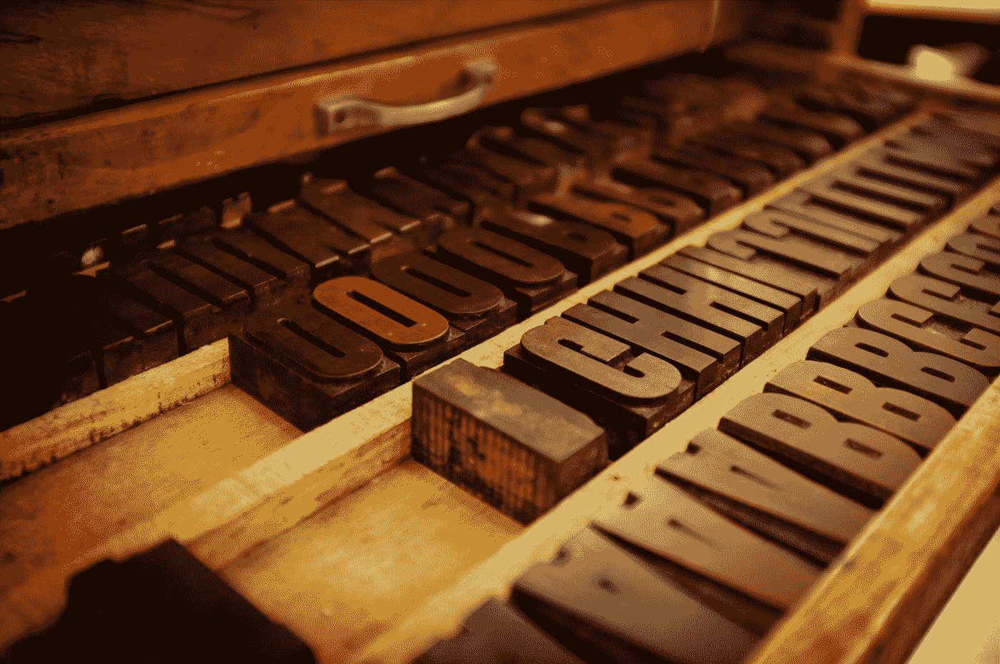
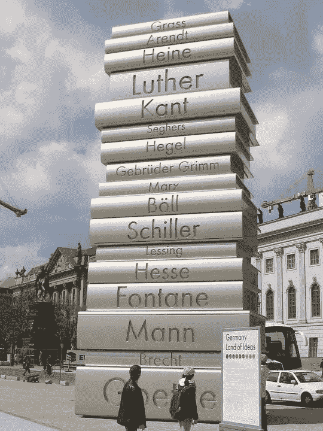
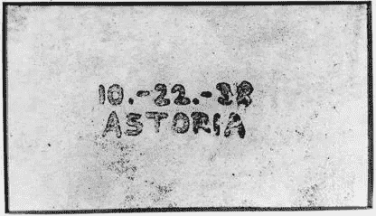
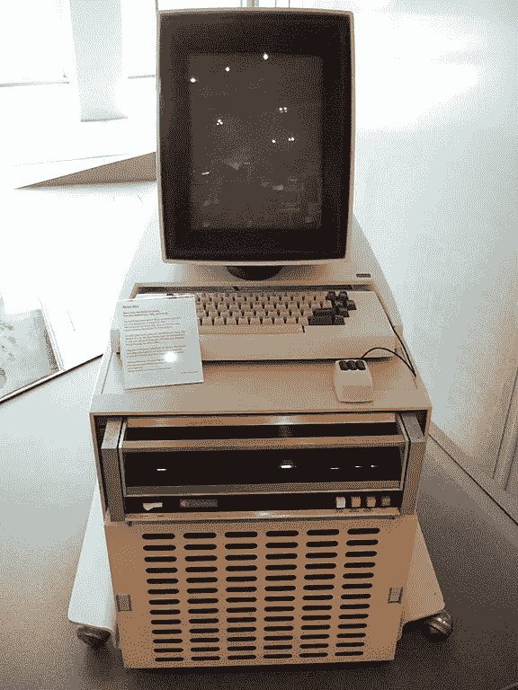

# 如果你能向世界传达信息

> 原文：<https://medium.datadriveninvestor.com/if-you-could-message-the-world-6688f850989f?source=collection_archive---------4----------------------->

你会怎么说？

Photo by [Mr Cup / Fabien Barral](https://unsplash.com/@iammrcup?utm_source=medium&utm_medium=referral) on [Unsplash](https://unsplash.com?utm_source=medium&utm_medium=referral)

随着生命开始在我们美丽的蓝色星球的原始软泥中抽搐，化学物质的集合开始使用特殊的分子和电荷脉冲相互交流。[普林斯顿大学的 Bonnie Bassler 教授和她的学生继续发现细菌使用的复杂化学词汇，它们在生活中充当自己文化中的积极公民，与同类细菌和不相关的邻居交流。随着这些单细胞生物最终组织成集合，复杂的多细胞生物出现，最终发展成更高级的哺乳动物，人类是其中的一员。一路走来，所有版本的生命都发展了个体间的交流方式，从而产生了创造比自身更大的系统所必需的团队合作。这就是生活的目的。](https://en.wikipedia.org/wiki/Bonnie_Bassler)

Photo by [Cahyo Ramadhani](https://upload.wikimedia.org/wikipedia/commons/f/f5/Hands_in_Pettakere_Cave_DYK_crop.jpg) on [Wikipedia](https://commons.wikimedia.org/wiki/File%3AHands_in_Pettakere_Cave_DYK_crop.jpg)

我们有记录的人类发展史提供了证据，表明早期人类使用他们可以获得的化学物质，如木材燃烧产生的黑色煤烟，与其他人类进行交流，如在今天的印度尼西亚的彼得克雷的[洞穴中发现的手形模板。这些信息是在公元前 35，000-40，000 年间发出的。一个简单的分析让我们得出结论，这些信息是给参观洞穴的人类同伴的。在我们开发出从过去事件的回声中提取信息所需的技术之前，我们只能从理论上推断这一信息可能是记忆的声明，例如“嘿，我在这里！”或者所有权，因为真正的居民会证明他们的肢体与模板的生物特征匹配。](https://en.wikipedia.org/wiki/Pettakere_cave)

在受保护的洞穴之外，风和雨的因素会很快抹去人类的信息，不管它有多大或多复杂。为了抵御恶劣天气，人们利用岩石雕刻来增强信息的持久力量。[岩画](http://Petroglyph)在地球各大洲都有发现，一般在公元前[15000 年左右](https://en.wikipedia.org/wiki/Common_Era)开始出现。虽然非常粗糙和持久，岩画，以及后来的 hyroglyphs，基本上保持静止，人类需要移动到一个特定的位置来观察信息。

Photo by [Arpingstone](https://upload.wikimedia.org/wikipedia/commons/c/cf/Kew.gardens.papyrus.plant.arp.jpg) on [Wikipedia](https://commons.wikimedia.org/wiki/File%3AKew.gardens.papyrus.plant.arp.jpg)

输入 papyrus，我们英语单词“paper”的拉丁词根。人类使用植物纤维作为轻质、便携式信息媒介的最早例子是在中国发现的，可追溯到汉朝(公元前 202 年-公元 220 年)，据分析是由桑树纤维与其他植物纤维混合而成，用于制造渔网和布料等纺织品。这种便携式信息媒介的“消息”迅速向西传播，穿过印度和中东，到达埃及。在埃及，埃及科学家和工匠们对*莎草纸*的使用进行了标准化，莎草纸是一种原产于非洲大陆的水生植物，盛产于尼罗河沿岸。燃烧过的木材中的黑色烟灰分子现在可以以特定的信息模式应用到纸上，进行复制和分发。纸作为信息媒介的使用在 11 世纪传到了欧洲。插图手稿中包含的信息被隐居的宗教倡导者和大师们一丝不苟地复制，他们发誓要向全世界传播基督教的信息。

纸发明后不久，信息复制过程的速度因雕版印刷、纸张和墨水的革新而大大提高。这种早期版本的[版画](https://en.wikipedia.org/wiki/Intaglio_(printmaking))允许在金属或木头上雕刻艺术作品或信息，随后用墨水覆盖并压在纸上，产生具有雕刻精确外观的印刷品。每个“盘子”都需要一位大师级的工匠花费几个小时来雕刻，这本身就是一件完整的艺术品。

Photo by [Lienhard Schulz](https://upload.wikimedia.org/wikipedia/commons/a/a6/Printing3_Walk_of_Ideas_Berlin.JPG) on [Wikipedia](https://commons.wikimedia.org/wiki/File%3APrinting3_Walk_of_Ideas_Berlin.JPG). “Modern Book Printing”, fourth sculpture (of six) of the [Berliner Walk of Ideas](https://commons.wikimedia.org/wiki/Walk_of_Ideas) commemorating the work of Johannes Gutenberg.

约翰尼斯·根斯弗莱施·祖尔·拉登·祖姆·古腾堡进入。

约翰内斯·古腾堡被认为是第一个发明使用活字印刷的欧洲人，活字印刷是在 1439 年组装成印刷版的。古腾堡印刷机的出现被认为是人类历史现代时期的开始。古腾堡还发展了使用油基墨水的相关印刷技术，并建造了基于旋转螺旋的木制印刷机，这在罗马帝国压榨葡萄和橄榄以提取汁液和油时非常流行。除了在 1455 年大量生产《圣经》外，古腾堡的发明还允许信息的作者和发布者是同一个人。早期的印刷商经常利用他们的机器来传播他们自己的信息。

本杰明·富兰克林就是这样一位著名的印刷商/出版商，他于 1706 年出生在马萨诸塞州的波士顿。在他哥哥詹姆斯拥有的印刷厂当学徒时，这家店创办了 [*《新英格兰报》*](https://en.wikipedia.org/wiki/The_New-England_Courant) ，被公认为美国殖民地的第一份独立报纸。15 岁时，本杰明希望自己的信息能被发表，但多次遭到拒绝。本杰明没有被吓倒，他采用了一个中年寡妇的秘密笔名，名为沉默的杜古德夫人，该报同意刊登这些信件。多古德夫人成为一名受欢迎的作家后不久，詹姆斯·富兰克林就因发表不讨好州长的言论而短暂入狱。本杰明通过多古德夫人在报纸上发表的文章，秘密地宣扬言论自由的重要性。在他的虚假身份最终被发现后，本杰明逃离了波士顿和他的学徒生涯(一项应受惩罚的罪行),并在宾夕法尼亚州的费城开了家店。

米尔顿·s·赫尔希(Milton S. Hershey)于 1857 年出生于宾夕法尼亚州的德里镇，他的职业生涯始于在当地一家印刷厂当学徒。赫尔希觉得工作很无聊，不小心把帽子掉进了印刷机里，很容易弄脏了机器。不久后，他被解雇，转到当地一家糖果制造商当学徒。在随后的几年里，他能够通过一种不同的化学物质，即巧克力，向全世界传播他的快乐信息。

那些有足够的手段购买设备和开店的人可以出版和分发他们自己的信息，或者至少让已建立的出版商印刷他们的思想，如果他们能说服编辑的话。俄亥俄州代顿的威尔伯和奥维尔·莱特夫妇(分别出生于 1867 年和 1871 年)于 1889 年设计并建造了他们自己的印刷机，同年开始出版《西区新闻》。在发行了其他出版物之后，包括日报*晚报*和*代顿报*，兄弟俩将他们在印刷中获得的机械专业知识应用于自行车的设计，以及后来的自力驱动飞行器的创造，最著名的是 1903 年在北卡罗来纳州的基蒂霍克进行的实验。

几年后，切斯特·弗洛伊德·卡尔森于 1906 年出生在华盛顿州的西雅图。他在童年早期就对图形艺术着迷，并在 10 岁时亲手创作了一份名为 *This and That* 的报纸，并在朋友间传阅。高中时，卡尔森为当地一家印刷商工作，这家印刷商卖给他一台二手印刷机，他用这台印刷机排版并为业余化学家出版自己的报纸。高中毕业后，卡尔森就读于河滨初级学院，主修化学，但转到了物理学专业，转到了加州理工学院，并于 1930 年获得物理学学士学位。

Image by [DatBot](https://en.wikipedia.org/wiki/File:First_xerographic_copy_-_10-22-38_ASTORIA_.jpg) on [Wikipedia](https://en.wikipedia.org/wiki/Chester_Carlson). First photographic copy created by the electrophotography process invented by Chester Carlson.

卡尔森开始作为一名研究工程师为纽约市的贝尔电话实验室工作，但与好时作为印刷工人的工作相似，他发现工作单调乏味。一年后，他被调到实验室的专利部门，担任律师的技术助理。卡尔森为他自己的 400 多项发明保持了一个不断增长的个人设计日志，大部分是关于印刷和出版的主题。1936 年，卡尔森开始在纽约法学院上夜校学习法律，并发现自己在纽约公共图书馆学习时会手写大量文章。需要一种更好的复制印刷书籍和期刊的方法，他设想了一种使用干粉状墨水的方法，后来被称为“墨粉”，它可以通过静电附着在带电的板上。1938 年 10 月，卡尔森和他的同事制作了第一张印刷图像的干调色剂照片。他为自己的发明申请了专利，很快纽约州罗彻斯特的 [Haliod 公司](https://en.wikipedia.org/wiki/Xerox)于 1947 年购买了专利，将他的创新开发成商业产品。字面翻译，希腊的“干文字”，Haloid 公司为他们的干色粉照相复印过程注册了术语“静电复印”,在 1959 年首次商用施乐 914 复印机取得商业成功后不久，该公司于 1961 年将其名称改为“施乐”。

为了继续在文档复制和办公室通信领域的发明和创新中保持领先地位，施乐公司于 1970 年在加利福尼亚州的帕洛阿尔托成立了研发中心，该中心靠近斯坦福研究所、斯坦福大学的技术转移组织、DARPA、国防高级研究计划局、NASA、国家航空航天局和美国空军。帕洛阿尔托研究中心命名为[施乐 PARC](https://en.wikipedia.org/wiki/PARC_(company)) ，它在 20 世纪 70 年代早期获得资助，以创建一个将被 20 世纪 90 年代及以后的商业办公室使用的技术愿景。

Photo by [Joho345](https://upload.wikimedia.org/wikipedia/commons/5/5e/Xerox_Alto_mit_Rechner.JPG) on [Wikipedia](https://commons.wikimedia.org/wiki/File%3AXerox_Alto_mit_Rechner.JPG)

在硅谷的人类梦想家中拥有发明和创新的自由，到 20 世纪 70 年代末，施乐 PARC 已经开发出了[激光打印机](https://en.wikipedia.org/wiki/Laser_printing)、计算机生成的位图图形([所见即所得](https://en.wikipedia.org/wiki/WYSIWYG))、[图形用户界面](https://en.wikipedia.org/wiki/Graphical_user_interface)、[计算机鼠标](https://en.wikipedia.org/wiki/Computer_mouse)、独立于分辨率的图形页面描述语言( [PostScript](https://en.wikipedia.org/wiki/PostScript) )、局域网([以太网](https://en.wikipedia.org/wiki/Ethernet))、[面向对象的计算机编程](https://en.wikipedia.org/wiki/Object-oriented_programming)、[所有这些技术都被集成到一台名为](https://en.wikipedia.org/wiki/Object-oriented_programming)[施乐 Alto](https://en.wikipedia.org/wiki/Xerox_Alto) 的原型办公电脑中。众所周知，施乐在纽约罗切斯特总部的高管认为，施乐 Alto 的先进技术过于昂贵，对不需要这些先进的科幻技术的企业来说，没有商业吸引力。1979 年，一个名叫史蒂夫·乔布斯的小型初创个人电脑开发商组织了一次施乐 PARC 奥拓团队的技术参观，许多施乐 PARC 公司的科学家和工程师最近被内政部告知奥拓是一个商业包袱，他们离开了公司去开发他们的发明或加入了名为“苹果电脑”的新公司。

史蒂夫·乔布斯说，他在大学里最有影响力的课程是关于书法的。他被施乐 Alto 的图形用户界面迷住了，并与[史蒂夫·沃兹尼亚克](https://en.wikipedia.org/wiki/Steve_Wozniak)合作，将执行计算机化的[桌面出版](https://en.wikipedia.org/wiki/Desktop_publishing)的能力传授给 1984 年首次亮相的[苹果麦金塔](https://en.wikipedia.org/wiki/Macintosh)个人电脑。在这个颠覆性的消息平台到来后不久，苹果董事会决定继续以如此快的速度创新是不明智的，并将乔布斯降职到苹果公司内部无能为力的位置。此后不久，史蒂夫·乔布斯于 1985 年从苹果公司辞职。

乔布斯很快成立了一家新的计算机技术公司，名为“ [NeXT](https://en.wikipedia.org/wiki/NeXT) ”，并立即着手将施乐 Alto 上世纪 70 年代富有远见的技术与上世纪 80 年代的处理器商业化。下一代计算机对个人使用来说很昂贵，但对教育和科学研究人员来说却很畅销，他们需要工作站的高级处理能力，而不需要商用大型计算机的成本。值得注意的是，欧洲核子研究中心的蒂姆·伯纳斯·李在 1989 年用 NeXT 创造了世界上第一个网络服务器，他发明了万维网和超文本标记语言。

在 20 世纪 90 年代互联网和信息服务的持续快速发展之后，例如计算机公告板服务( [BBS](https://en.wikipedia.org/wiki/Bulletin_board_system) )、电子邮件( [Email](https://en.wikipedia.org/wiki/Email) )、 [CompuServe](https://en.wikipedia.org/wiki/CompuServe) 、[美国在线](https://en.wikipedia.org/wiki/AOL)和基于 HTML 的万维网“页面”，2000 年代出现了社交网络服务[。](https://en.wikipedia.org/wiki/Social_networking_service)[2002 年的 Frendster](https://en.wikipedia.org/wiki/Friendster) 和 [LinkedIn](https://en.wikipedia.org/wiki/LinkedIn) ，2003 年的 [MySpace](https://en.wikipedia.org/wiki/Myspace) ，2004 年的[脸书](https://en.wikipedia.org/wiki/Facebook)，2005 年的 [Youtube](https://en.wikipedia.org/wiki/YouTube) ，以及 2006 年的 [Twitter](https://en.wikipedia.org/wiki/Twitter) ，让人类可以在舒适的键盘上与世界各地的其他人交流。1997 年回到苹果后，史蒂夫·乔布斯通过 2007 年推出的 iPhone“智能手机”开启了我们当前的现代计算时代。很快，智能手机“应用程序”生态系统使人们能够从手持触摸屏的便利中快速、无处不在地创造消息和通信技术，如 2010 年的 [Instagram](https://en.wikipedia.org/wiki/Instagram) 和 2011 年的 [Snapchat](https://en.wikipedia.org/wiki/Snapchat) ，以及 2012 年的 [Medium](https://en.wikipedia.org/wiki/Medium_(website)) 等混合桌面/智能手机平台。

从洞穴蜡纸画的人手开始我们的信息之旅，到手持智能手机在全球范围内的普遍使用，还有比这更有诗意的吗？

Photo by [freestocks.org](https://unsplash.com/@freestocks?utm_source=medium&utm_medium=referral) on [Unsplash](https://unsplash.com?utm_source=medium&utm_medium=referral)

作为超过 40，000 年的发明、创新和通信社会进化的受益者，我们人类现在能够在任何时间实时地给地球上或地球外的任何人发送消息。我们正处于一种被称为“ [5G](https://en.wikipedia.org/wiki/5G) 的新通信层的尖端，这种通信层也将允许我们的电子产品相互发送消息、报告并协调它们的行动。互联网感知设备的激增意味着我们不再是房间里唯一的存在。纵观历史，人类使用技术工具或为善或为恶，或建设或破坏，或补充或嘲笑，或合作或破坏。现在，我们的科技产品正在倾听我们的对话，它们正在学习根据自己的观察来构建自己的文化价值观。我们新生的智能系统将从我们当前的话语中学到什么？他们会学会同情和移情还是仇恨和恐惧？

Google X 首席商务官、[*Solve for Happy*](http://www.solveforhappy.com/)*、* Mo Gawdat 的作者最近发起了一项名为 [#onebillionhappy](https://www.onebillionhappy.org/) 的努力。这个“全球登月”旨在增加人类互动的快乐，以便我们的智能创新可以庆祝生命，而不是寻找更有效的方式来终止生命。

利用智能手机的便利，你现在可以向全世界发送信息。

## 你会说什么？

________

林子幸·韦弗是美国宾夕法尼亚州费城拉萨尔大学综合科学、商业和技术系的副教授。他四岁时第一次在父亲的印刷店里操作印刷机，在高中和大学期间做过印刷工人、排字工人、暗房技术员、整理员和会计。他拥有化学和物理双学位，并在超快激光光谱学领域获得了分析化学博士学位。他就系统思维在新产品开发和创新中的应用进行教学、写作和演讲。