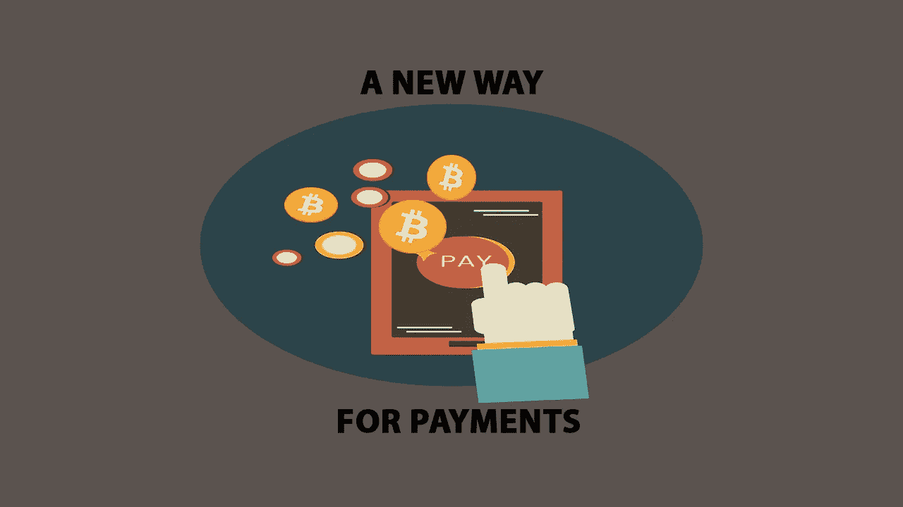

# 如果你没有钱包，也开始考虑放弃你的银行账户

> 原文：<https://medium.datadriveninvestor.com/if-you-dont-own-a-wallet-start-to-consider-ditching-your-bank-account-too-f3fffb9d803f?source=collection_archive---------22----------------------->

纵观历史，我们支付商品和服务的方式发展得相当缓慢。从物物交换系统，到硬币，到纸币，到卡，再到移动支付。现在存在的是加密货币，它们提供了另一种进化，一种将留下最大影响的进化。这是因为每个行业都有一个最大的趋势:数字化。随着信用卡/借记卡的出现，在大多数情况下，在钱包里放纸币，尤其是硬币变得没有必要了。然后有了 Apple Pay 这样的移动支付，人们已经选择完全抛弃口袋钱包。甚至礼品卡也可以转移到手机钱包。在加密货币和区块链科技的帮助下，“一切数字化”的趋势，人们可能也会选择抛弃他们的银行。

# 告别纸币？

这个数字时代的中心是千禧一代，根据最近的一项调查这一代人是否有兴趣放弃美元，转而使用加密货币，这一比例接近 50%。我怀疑，一旦人们对这种新技术及其好处有了更多的了解，就会有更多的人愿意使用加密货币而不是美元。此外，当零售商、餐馆等。开始接受加密货币，肯定会有很大一部分千禧一代准备在他们的设备上添加加密钱包，作为移动支付选项。这一代人，甚至是他们以外的人，可以说是最愿意尝试新事物和跟随潮流的人。当他们发现使用加密货币有多快、多安全、多便宜时，他们就会一头扎进去(这些特性正在不断增强)。PayPal、Square、Venmo 等支付和转账应用的大规模采用，以及多种移动钱包服务，表明了加密货币将会多么成功。

# 告别传统银行账户？

虽然使用实物美元的趋势继续减少，加密货币的采用增加，但下一步将是**放弃银行账户**。你的加密资产存放在加密钱包里比存放在银行里的法定货币更安全。硬件钱包，如 Nano Ledger 和纸质钱包可以作为你的储蓄账户，你不会经常提取。对于快速取款支付(如果零售商提供)和转账，像 Jaxx、比特币基地和凯西这样的软件钱包可以存储、发送和接收密码。当一个地方接受加密货币时，就像扫描零售商的公钥二维码一样简单，你的密码就会被发送出去。

# 告别高额刷卡费

毫无疑问，公众和零售商对加密货币的看法将会发生转变。美国领先的连锁超市 Kroger 禁止在某些地方使用 Visa 卡，并计划扩大禁令范围，因为与该信贷公司相关的费用很高。[摘自《今日美国》文章:](https://www.usatoday.com/story/money/2018/08/01/kroger-ban-visa-credit-card/881228002/)

> *“像克罗格这样的商家只是认为这些刷卡费——可能在 1%到 3%之间——太高了……(这)基本上是一种试图迫使 Visa 降低这些费用的权力举动……关于刷卡费的斗争已经酝酿了一段时间，克罗格的这一举动表明它即将升级……****。据彭博称，零售商每年支付约 900 亿美元的刷卡费*** *，克罗格担心 Visa 的费率和费用是最高的。克罗格此举之前，沃尔玛在未能就条款达成协议后，于上周决定终止与 Synchrony Financial 的信用卡协议。*

费用高得离谱，更多的零售商肯定会跟进，因为他们知道如果加密货币作为支付手段受到欢迎，他们可以节省多少钱。

# 加密货币支付是一种选择，而不是替代

美元将继续保持其主导地位。比特币或另一种加密货币不会很快取代美元。然而，在许多情况下，加密是更好的选择。**了解加密货币在某些行业和日常生活中增加的价值，对于将其纳入主流至关重要**。就像移动支付应用如何取代了对实体钱包的需求一样，区块链技术和加密货币可以取代对美元和银行的需求。在我们今天生活的金融遗产体系中，这是一个不太可能的场景。虽然，加密货币支付和区块链技术作为信用卡和银行的替代选择存在的可能性很大，而且非常需要。