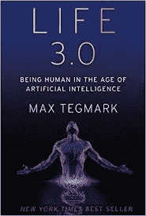

# 如果你对人工智能有三个愿望

> 原文：<https://medium.datadriveninvestor.com/if-you-had-three-wishes-for-an-ai-d120cede92b9?source=collection_archive---------43----------------------->

“robot playing piano” by [Franck V.](https://unsplash.com/@franckinjapan?utm_source=medium&utm_medium=referral) on [Unsplash](https://unsplash.com?utm_source=medium&utm_medium=referral)

**为您的企业缩小人工智能范围**

人工智能正在捕捉我与之交谈的每个人的想象力。我们大多数人都很担心。不管你是光谱的哪一部分，(从天网到乌托邦)它都会影响你的商业模式。你可以从考虑狭义 AI 如何改善你的商业模式开始。更具存在性的是广义人工智能。

**生活 3.0**

《生活 3.0:人工智能时代的人类》是一本“技术想要什么”类型的书。关于人工智能将如何发展以及这意味着什么的有趣问题。带着对智力、意识和生命本身的定义的疑问。

**情报**

在他看来，智力=完成复杂目标的能力。最后，这是关于目标的定义。行善或作恶。我们可以治愈癌症，但我们也可以将人工智能应用于网络钓鱼和黑客攻击你的银行账户。唐·沃森作为五大家族的首领。想象一下有人工智能的卡利卡特尔。

**灯里的精灵**

目标的定义就像灯里的精灵有三个愿望。小心你的要求或愿望。因为一切皆有可能。

**机器人裁判**

例如，考虑机器人法官(我将在 10 月份的伦敦法律会议上发言，所以这是我特别感兴趣的)。

原则上，机器人法官可以确保历史上第一次法律面前人人真正平等:他们可以被编程为完全相同，平等对待每个人，以真正公正的方式透明地适用法律。

**少数派报告**

此外，最近的研究表明，如果你用大量的囚犯数据训练一个深度神经学习系统，它可以比人类法官更好地预测谁可能重新犯罪(因此应该被拒绝假释)。

**人工智能测谎仪**

机器学习技术在分析 fMRI 扫描仪的大脑数据方面变得更好，以确定一个人在想什么，特别是他们是在说实话还是撒谎。如果人工智能辅助大脑扫描技术在法庭上变得司空见惯，那么目前建立案件事实的繁琐过程可能会大大简化和加快，从而实现更快的审判和更公平的判决。

如果人工智能辅助大脑扫描技术在法庭上变得司空见惯，那么目前建立案件事实的繁琐过程可能会大大简化和加快，从而实现更快的审判和更公平的判决。

**囚禁一个 AI**

但如何判断堂·沃森的行动呢？能把一个 AI 送进监狱吗？很多问题。

**不在场证明**

一旦人工智能能够生成你犯罪的完全真实的假视频，你会投票支持一个政府随时跟踪每个人的行踪并在需要时为你提供铁证如山的不在场证明的系统吗？

**黑暗或光明**

它可以很快天黑，人工智能驱动的杀手无人机，人工智能恐怖主义，人工智能网络攻击，还有人工智能治愈癌症，人工智能在太空中，人工智能制造，人工智能通信，人工智能管理能源，人工智能运行交通等。AI 为好。

**我们需要通过**来思考这些事情

*   谁将为自动驾驶汽车投保？如果允许汽车等机器持有自己的保险单，它们是否也应该能够拥有金钱和财产？如果是这样的话，没有什么法律可以阻止智能电脑在股票市场上赚钱，并用它来购买在线服务。
*   如果人工智能系统最终在投资方面比人类做得更好(他们已经在一些领域做到了)，这可能会导致我们的大部分经济由机器拥有和控制的局面。这将导致机器运行我们的 GDP。为什么不让 AI 来管理我们的幸福指数呢？这让我想起了《指环王》中的一个场景，精灵女王得到了戒指，可能创造了一个非常美丽的生物。
*   如果你同意授予机器拥有财产的权利，那么给它们投票权怎么样？
*   你希望有超级智能吗？你希望人类仍然存在，被取代，被半机器人化和/或被上传/模拟吗？你希望人类还是机器来控制？你希望人工智能有意识吗？你是想最大化积极的体验，最小化痛苦，还是让这一切自行解决？你希望生命扩展到宇宙吗？你想要一个你同情的、朝着更高目标努力的文明，还是你可以接受未来的生命形式，即使你认为他们的目标毫无意义且平庸。
*   你想要僵尸人工智能(没有情感)，仁慈的独裁者，人工智能看门人(阻止太多人工智能漫游世界)，动物园管理员(照看人)，人工智能神，戴森球体，黑洞发电厂，类星体，球体或通用量子计算机？

**瓶子里的精灵出来了**

因为有它要去的地方。妖怪从瓶子里出来了。弄清楚如何让超级智能人工智能的目标与我们的目标保持一致不仅至关重要，而且非常困难。

小心你的愿望

人类如此轻松地完成这一任务，以至于很容易忘记这项任务对计算机来说有多难，也很容易误解。如果你要求一辆未来的自动驾驶汽车尽快带你去机场，它真的会带你去，你会被直升机追着去，浑身是呕吐物。

同样的主题在许多著名的故事中反复出现。在古希腊传说中，迈达斯国王要求他触摸到的所有东西都变成金子，但当他感到失望时，他吃不下东西，更失望的是，他无意中把他的女儿变成了金子。

所有这些例子表明，要弄清楚人们真正想要什么，你不能仅仅根据他们所说的去做。你还需要一个世界的详细模型，包括许多我们倾向于不说出来的共同偏好，因为我们认为它们是显而易见的，比如我们不喜欢呕吐或吃黄金。

**指数 AI**

这里有一个问题，你可以将你的目标加载到人工智能中的时间窗口可能很短:在它太笨而不能得到你和太聪明而不能让你得到你之间的短暂时间。

**我们需要人工智能的道德指南针**

我们正面临着给人文道德指南针或哲学下定义的最后期限。在人工智能为我们做出决定之前。也许你应该从你自己和你公司的道德指南针开始。

让我们开始一场自下而上的运动，以确保我们得到我们应得的人工智能。