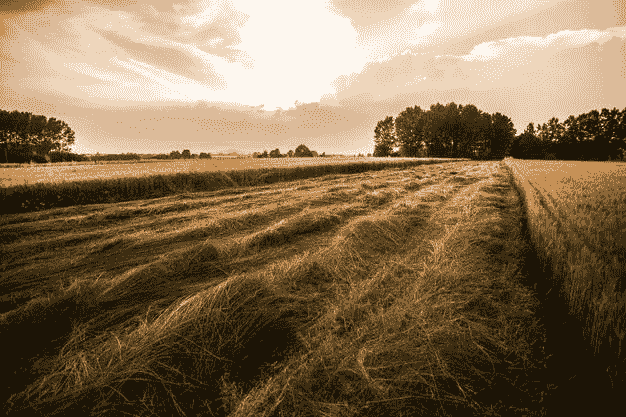
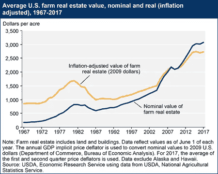

# 如果你有一百万美元，投资在这上面

> 原文：<https://medium.datadriveninvestor.com/if-you-have-a-million-dollars-invest-in-this-835f5c3b2e3c?source=collection_archive---------0----------------------->

如果你是一个有很多钱的投资者，你可能会想知道不同类型的投资。为了赚更多的钱，有一种投资选择值得仔细研究。

那投资就是农田。

我明白，我在购买农田的论点上有很大的偏见，但是数据支持它。投资农田的最大卖点之一是，它提供了两种不同的财富增长途径。通过将农田出租给未来的当地农民，你可以获得可观的剩余收入。除了通过出租土地获得被动收入，你还可以看到长期投资的增值。

关于农田和其他类型土地的一件事。他们不再生产了。土地是有限的资源，随着我们的人口超过 70 亿，对增加农业产量和资源生成的需求将持续增长。

在过去的几十年里，农田的价格稳步上升，通过下图，你可以看到每英亩农田的价值是如何在这些年里呈现上涨趋势的。

资料来源:美国农业部

购买农田时需要考虑的另一个重要因素是购买地的土壤质量以及玉米、大豆和小麦等商品的市场。在美国的一些地区，由于高质量的土壤含量，农民看到了异常的产量，每英亩土地的价格可以超过 12，000 美元。

现在你可能会想，为什么我要花这么多钱在一项前期成本很高的投资上呢？

就像我之前说的，当你购买农田的时候，你正在从两种不同的投资中赚钱。考虑下面的例子。

**我在爱荷华州以每英亩 5000 美元的价格购买了 250 英亩农田。(总成本为 125 万美元)**

**我签订了一份协议，以每英亩 250 美元的价格(爱荷华州的平均租金)将这 250 英亩土地出租给当地农民**

**第 1 年:250 英亩 x 每英亩 250 美元= 62，500 美元收入**

**房产税税率(全国平均)为 1.9%**

**应交税费=收入* 1.19% = 62500 美元* 1.19% = 1188 美元**

**第一年:净收入:62，500 美元—1，188 美元= 61，312 美元**

同样重要的是要考虑到，如果你在许多年中持续向农民收取同样的费用(250 美元/英亩)，你将在大约 20 年的时间内收回你的原始投资(125 万美元)。

要考虑的其他重要因素是，随着商品和土地价格的逐年上涨，人们出租土地的费用也可能会增加。

就像我之前说的，农田的价值在几十年的时间里大幅升值，从 1977 年到 2017 年，价格从 500 美元上涨到 3000 美元左右。

在 40 年的时间里，按照同样的增长速度，你每英亩 5000 美元的原价，最终可能会卖到 15000 美元左右。

此外，考虑到在这 40 年中，您通过现金租赁在 20 年内还清了 125 万美元的原始投资，您将在 20 年内获得正的投资回报！

现在考虑一下这个数学问题:

**24 年* 61312 美元= 147 万美元**

**125 万美元* 300%投资回报率(升值)= 375 万美元**

**投资回报率:417 万美元到 125 万美元**

**您的原始投资有可能获得 292 万美元的回报！**

我明白，虽然，没有多少人坐在那里有一百万美元用于投资目的。每个人都必须从某个地方开始，我会考虑的一件事是一个较小的投资，每次购买较少的土地；用农场的收入购买更多的财产。

可能性是无穷的，但有一点是肯定的，购买高质量的农田是一项应该认真对待的投资。

*-JP*