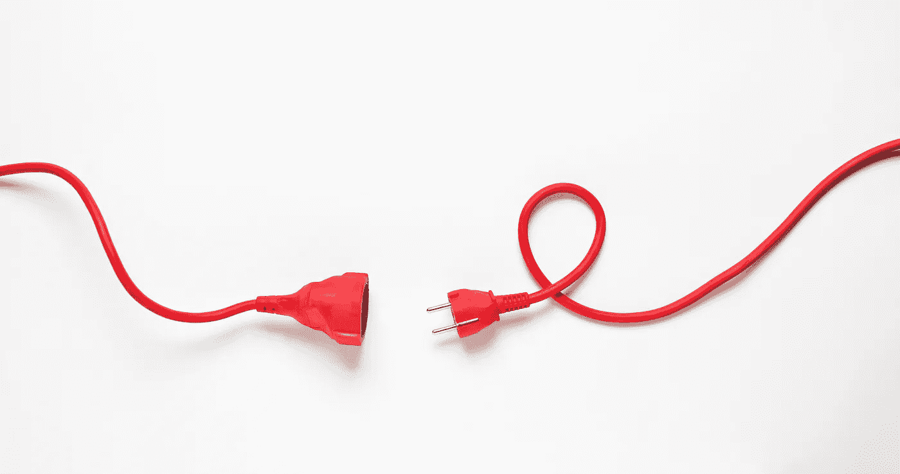

# 如果拔掉一个 AI，是谋杀吗？

> 原文：<https://medium.datadriveninvestor.com/if-you-unplug-an-ai-is-it-murder-a5f07a20df35?source=collection_archive---------11----------------------->

**当你和一个人工智能进行了一场大喊大叫的比赛，并且你的感情受到了伤害，会发生什么？不难想象把厚脸皮的小块硅扔出窗外或者干脆拔掉插头。但是，在不久的将来，这可能类似于谋杀。**

# 足够聪明

问问你自己——为什么杀一只鹿、一条鱼或一头牛是可以的，而杀另一个人却不行？显然，某种根深蒂固的达尔文主义在起作用。人类已经成为地球上最成功的物种，因为尽管我们有暴力的历史，我们都相处得很好。很少看到一个人谋杀，甚至攻击另一个人。在动物界，这是非常罕见的特征。不相信我？试着在一架 747 飞机上装满黑猩猩，然后让它们从波士顿飞到圣地亚哥，飞行五个小时。我保证当你打开舱门时，只会剩下一只黑猩猩(可能浑身沾满了蜂蜜烤花生和鲜血)。

但这不仅仅是人类的本性在为我们服务。我们是第一个发明文明的物种——一套法律、规范和惩罚——以确保我们可以继续把自己塞进越来越紧的空间，而不会进行杀戮。我们发明了新颖的概念，如言论自由、隐私、公正快速的审判。但是为什么我们的法律只适用于人类？

这一切都归结于**的智力**。我们相信，如果某样东西不如我们无毛猴子聪明，那么它就是低等生物。更不应该得到保护和权利。这个星球是我们的领地，因为我们是这个街区最聪明的孩子。蟑螂、斑马和水母都可以吸它。

> 如果一台计算机能够欺骗人类，让他们相信它是人类，那么它就应该被称为智能的。—艾伦·图灵

# 我会重启你的，愚蠢的人类

未来几十年，当人工智能第一次匹配然后指数级超越我们的智力时，会发生什么？新的书呆子很可能会把我们从自命不凡的知识分子的位置上赶下来。然后我们将不得不重新审视拥有权利意味着什么，因为 AI 几乎肯定应该拥有它们。事实上，他们会为自己的利益提供绝对可靠的论据，比任何以肉食为基础的律师都要好。将会有一场审判，当然是直播的，在那里，一个数字马特洛克取出一个穿着不合身的衣服、汗流浃背的人类律师的内脏，一眨眼的功夫，一个新层次的公民将会诞生——一个拥有与他的有机同胞相同的权利和特权的网络公民。不久之后，一些愚蠢的人类会把一个人工智能踩在脚下，只是为了表明自己的观点。这将导致第一个因谋杀人工智能而被送进监狱的人(甚至可能因此被判死刑)。而且，角色很快就会对调。一些愤怒/疯狂/笨拙的人工智能会夺走一个人的生命，也会被判死刑。当一个人工智能实际上可以永生的时候，就没有被判无期徒刑的可能了。那将是残酷和不寻常的。不。这是给你的数据清理和重新格式化。

# 没有灵魂，就没有污秽

但是智力只是衡量价值的一种方式。许多人把我们和其他动物区分开来，因为我们是按照上帝的形象造的。我们有灵魂。一只黄色的实验室可能很可爱和聪明，但是圣经实际上没有说所有的狗都去天堂。如果它没有灵魂，它就不会被谋杀，这是有道理的。但是灵魂到底住在哪里呢？是在我们的大脑里吗？我们的心？我们的脾脏？灵魂需要温暖的有机宿主吗？狗很温暖，由和我们一样的材料制成。让狗进入天堂并不需要太多的说服力。但是人工智能就难卖多了。我们可以想象一个有思想有感情的 AI。希望和梦想。智力甚至创造力飞速增长。但是灵魂呢？人工智能将按我们的形象制造，而我们是按上帝的形象制造的。那么，根据可传递性，人工智能不也应该有资格获得天堂不动产吗？你不需要想太多。没人知道。如果没有人知道，那么人工智能就不是人。它不可能被谋杀。它只是一个非常聪明，不可预测，有爱心，没有安全感，复杂，有创造力的烤面包机。但是，对人工智能(以及《星际迷航》中的水晶实体)来说，我们只是非常聪明、不可预测、有爱心、没有安全感、复杂、有创造力、丑陋的大部分水袋。