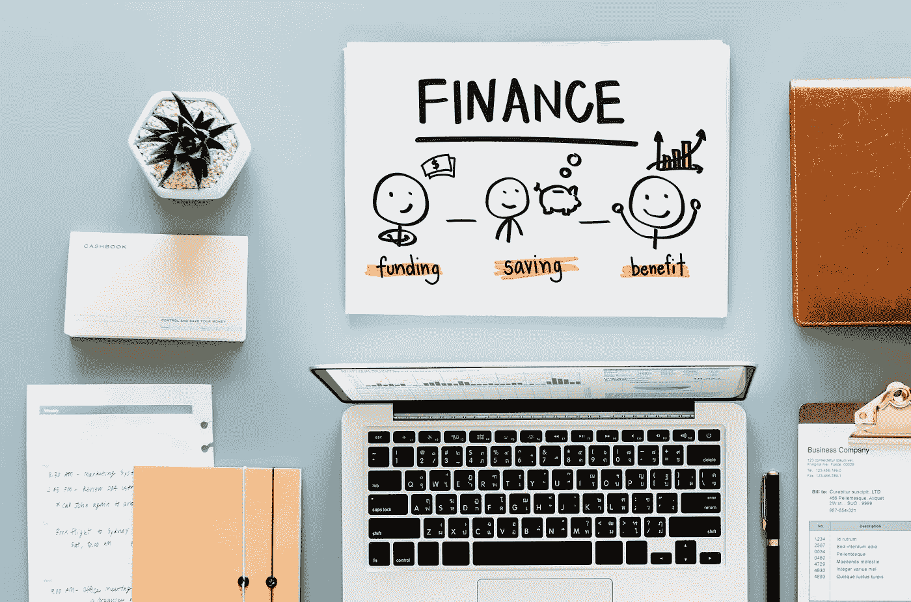
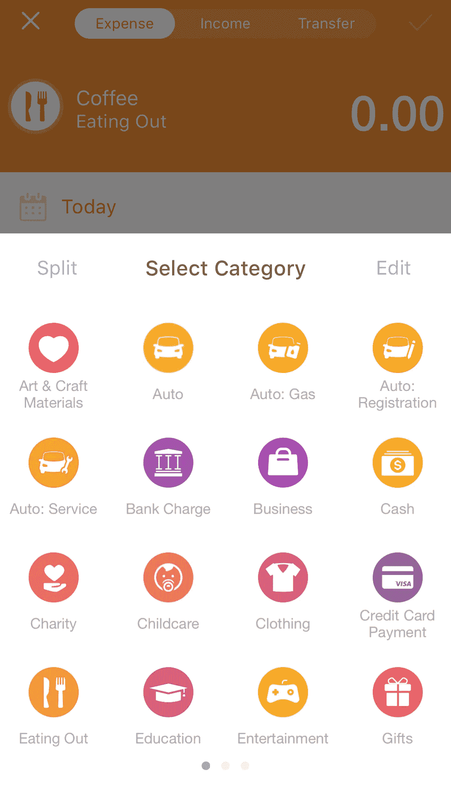

# 如果你想要财务自由，停止你的金钱流失

> 原文：<https://medium.datadriveninvestor.com/if-you-want-financial-freedom-stop-your-money-leaks-486893e4009a?source=collection_archive---------0----------------------->

Photo by rawpixel on Unsplash

在我走向财务自由的旅程中，我开始看到同样的基本原则一次又一次地出现。

如果你想像不需要钱一样工作，或者即使明天你失业了也没事，你需要积累财富。

为了积累财富，你需要通过多赚少花来获得盈余或储蓄，然后将你的储蓄进行投资，这样你的钱可以随着时间的推移而增长。

但是，如果你有一个不利于你的漏钱习惯，那就很难存钱了——那种缓慢而持续的漏钱，你可能都没有意识到。

# 如何修复你的资金漏洞

当我决定掌管我的财务生活时，我开始无情地检查我每天的金钱行为。

以下是我解决资金漏洞的步骤。

# #1.知道你现在在花什么吗

确定你每月支出的最简单快捷的方法之一就是开始追踪你的支出。

我使用一款名为 [Pocket Expense Lite](http://www.appxy.com/pocket-expense/) 的手机应用。这是一个免费的应用程序，使用简单，一开始就很棒。

和任何习惯一样，这需要一些行为上的改变。所以我选择了这个应用程序，因为我发现它使用起来毫不费力。当你试图改变一种行为和习惯时，尽可能简单，这样你就不会给自己找借口。

每次购物时，输入金额和用途。

口袋消费可以让你创建类别，如外出就餐，汽车，服装，教育，信用卡支付等。你的每一笔开销。

Categories on Pocket Expense Mobile App

这是一个简单而有效的方法来揭示你的日常开销。

# #2.回顾一下你的日常生活和活动

接下来我做的是把日常开销更新到我的月度支出计划中。这个计划帮助我看到了我的日常开支是如何在一个月和一年的开支计划中的 12 个月中累加起来的。

在你开始每天记录你的开销至少一个月之后，回顾一下你的日常开销活动，记住你的日常习惯和活动。

就我而言，我注意到即使我在工作时有咖啡，我还是会在午饭后买一杯。

我还注意到我在周末花的时间最多，因为这通常是我们和孩子出去吃饭的时候。

当我更新我的每月消费计划时，我发现我为一个我很少使用的俱乐部会员支付了 150 到 200 美元，即使我使用了，也只是在那里的一家咖啡馆吃饭。

另一件我没有意识到我花了这么多钱的东西是书。我每个月花 100 到 200 美元买书，在书架上堆满了我还没来得及读的书。

一直以来，我都告诉自己，我在充实自己的思想和灵魂。毕竟，书籍不像购买手袋和鞋子那样无足轻重。

我们通常不认为我们的花费是无意义的，但是我仍然在一件看似有价值的东西上花费了数百美元…

# #3.稍作调整

我不太支持突然戒除法——毕竟，我对财务自由的想法不是完全剥夺自己，过着悲惨的生活。

但我所做的是仔细观察我的日常活动和我的消费习惯。

我决定每周只买两次咖啡，而不是每天都买。

与其想都没想就买书，我会给自己每月 20 美元的预算，如果需要的话，任何未用的部分都可以滚动到下个月。

相反，我从图书馆借书，并告诉自己，只有在我读完书并决定保留一本后，我才会买书。这让我每个月有 100 到 200 美元的时间在周末和家人一起度过。

接下来，我卖掉了我没有使用的俱乐部会员资格，但仍然每月支付 150 到 200 美元。

合计起来，每年达 2400 美元。在我卖掉会员资格后，我把每月 200 美元转到我投资的指数基金上。实际上，我把我的 2400 美元支出变成了 2400 美元的投资。

# #4.谨慎使用你的信用卡

我经常听到关于如何处理债务的建议，包括切断你的信用卡。

虽然我知道信用卡是许多人陷入债务的原因，包括我自己，但我认为这是一种无意识的习惯，即把所有东西都记在你的信用卡上，这给我们带来了麻烦。

我曾经说过，无论如何，用我的信用卡付款有助于我获得积分和回扣，以此来证明我的行为。

现在，我采取了一种更有分寸、更有眼光的方法。

我会提前一个月计划从我的信用卡上扣多少钱，而且我只为我知道每个月肯定会花的必需品这样做。

例如，我有一张信用卡，可以为我的汽油、公用事业和互联网账单赚取更高的折扣。

我有一张由我的手机运营商发行的类似的信用卡，它在我的手机账单上赚取更高的回扣。

这些是我每月都会发生的费用，所以我把它们放在我的卡上自动循环支付。然后我用返利来抵消我每月的信用卡账单和偿还债务。

我不再用信用卡支付任何其他费用，而是开始用现金支付所有其他费用。

# #5.在你培养新习惯的时候，记住你的“为什么”

就像节食或锻炼计划一样，不要过度。坚持小而持续的改变。

我们正试图以一种可持续的方式来强化我们的训练肌肉。

像力量训练一样，它是关于以一致的方式多次重复举起小重量的东西。这是坚持新习惯的方法。让它们容易实现，并成为你日常生活的一部分。

努力培养新习惯是值得的，如果这意味着你可以积累财富，这是财务自由的燃料，以及这种自由对你的意义。

财务自由对我来说意味着我可以选择我喜欢做的事情而不用担心钱，我可以把钱存到我们孩子的大学基金里，并建立我们的退休账户。

每当我给自己找借口解释为什么不想记录支出时，我都会提醒自己财务自由对我意味着什么。

当你想放弃你的新习惯时，记住你的为什么。

# 结论

财务自由的道路不是一成不变的。

你的生活重点和赚钱能力会随着时间而改变。

定期检查你的财务漏洞，并根据你想要创造的生活方式和你的优先事项的变化进行微调。

这些是我在迈向更大的财务自由的旅程中采取的一些实际步骤。

你的呢？我很想听听他们的故事！

# 与我联系

如果你喜欢你读到的内容，请订阅我的博客[这里](https://twopointzero.me/)接收更新，并收到我的免费电子书《忙碌的人的 12 个**聪明理财习惯**》，其中还包含下载我的免费电子书的链接，《勇敢点，要你想要的:索要你值得的钱的指南》。

*原载于 2018 年 10 月 12 日*[*https://two point zero . me*](https://twopointzero.me/stop-leaks/)*。*