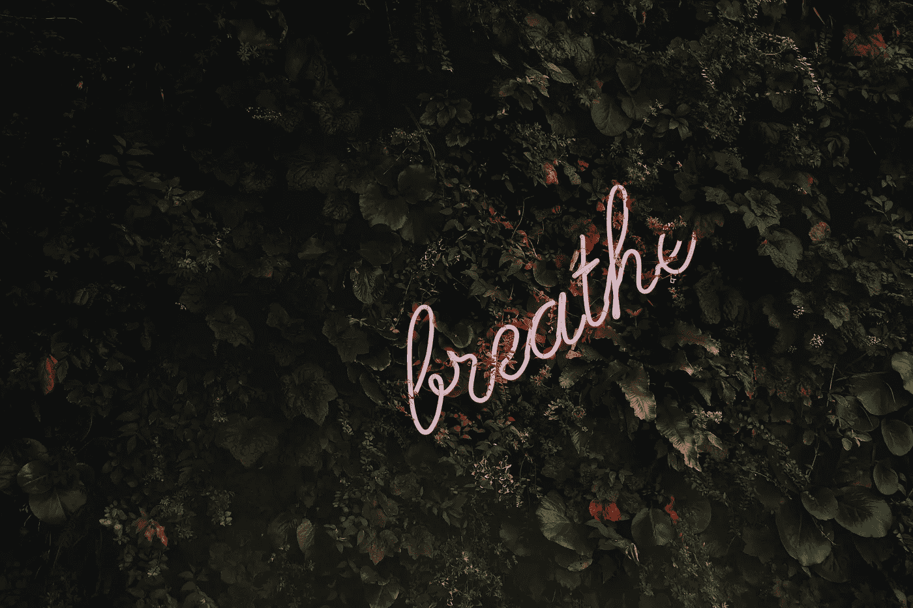

# 如果你想对抗拖延症，试着什么都不做。我的意思是:

> 原文：<https://medium.datadriveninvestor.com/if-you-want-to-counter-procrastination-try-doing-nothing-heres-what-i-mean-d5bae61808a4?source=collection_archive---------7----------------------->

> 说到拖延症的补救措施，我有两条。

一，是咖啡。

啊，是的——每当我感到拖延症开始发作时(通常是在已经拖延了相当长一段时间之后),我就会煮一壶咖啡或煮一杯浓缩咖啡来“充电”。这就是我告诉自己的——我需要充电。

有时候咖啡会起作用。我会喝完一大杯刚煮好的法国烤肉，突然，像变魔术一样，我又想“做事”了。

> 疯狂吧？

作为一个经常喝咖啡的人，这并不总是奏效。我感觉到最初的咖啡因兴奋，但喝咖啡来对抗拖延症是一个短期的解决方案。

我对拖延的第二个也是更重要的对策是…

# 无所事事。

没错。当我发现自己在拖延时——我指的是像《办公室》第三季中的 *hard* core 一样，试着自学尤克里里式拖延——我悄悄后退一步，什么也不做。

说到底，拖延本身并不是“无所事事”的行为——当你拖延的时候，你几乎总是在*消耗一些东西*。

当我拖延时，我会停下来，什么也不做——我是说绝对不做——大约 20 分钟。通常，我只需要这 20 分钟来充电，因为它不是由咖啡因提供能量，所以没有“磨合期”。

我不会称之为冥想，当然也不是打盹。只是给自己短暂的 20 分钟休息。

> 没有电视。
> 
> 没有电话。
> 
> 没有阅读和写作。

没有，嗯，没有*什么也没有。*

只是个人的，安静的，20 分钟无所事事的快乐时光。

# 每次都管用。

我们生活在数字时代——一个如此公开、如此互联的时代，如果我们去寻找私人时间，很难找到。

只要按一下按钮，我们就可以享受我们可能想要的各种娱乐。现在，每当我们不想做我们应该做的事情时，打开推特或网飞已经成了我们的第二天性。

而且很容易上瘾。

当我们拖延时，是因为我们不想“做”。我们有某种义务需要努力和专注，在一个无尽消费触手可及的世界里，很难不去娱乐。我们想要做的，就是消费，消费，消费。

而且我们消耗的越多，就越难打破这个循环。

# 下次你想拖延时，停止你正在做的一切，什么也不做。

去找一个安静的地方坐下，或者躺下来，如果你认为你能保持清醒，并找到清晰。

起初，你会烦躁不安，可能会伸手去拿手机——请不要这样。就像我说的，我们已经习惯了消费，以至于看不到它实际上有多上瘾。

> 你的大脑真正需要的是休息。

利用这 20 分钟左右的时间逃离你周围的喧嚣世界。把这段时间*完全*留给自己。几分钟后,“做点什么”的冲动会消失，你会发现自己处于放松状态。

尝试什么都不做的最初几次会带来挑战。对我来说，我无法摆脱脑海中的那个声音，*“你在浪费时间。”*我会在那里坐 3、4 分钟，说“算了吧”,然后继续我之前在做的事情。五分钟后，我发现自己又开始拖延了。

# 每天抽出 20 分钟简单地“做自己”对生产力至关重要。

当你脑中的那个声音告诉你你在浪费时间时，忽略它。

如果你需要，口头上说“不，我不是”，然后继续什么也不做。最终，声音会消失。

试着完全不去想。作为一个多虑者，我意识到这有多难。如果你需要思考，不要去想你有什么义务或者你还能做什么。而是想想自己的感受；理解安静地坐着，只是“做”是什么感觉。

每次我花 20 分钟独处的时候——没有任何干扰或打扰——我感觉完全恢复了活力。减压时间是双份浓缩咖啡效果的 10 倍。在那 20 分钟的安慰之后，我很高兴去做任何需要做的事情。

在这个时代，个人时间是最重要的良药。

所以要定期服用。

## **感谢阅读！**