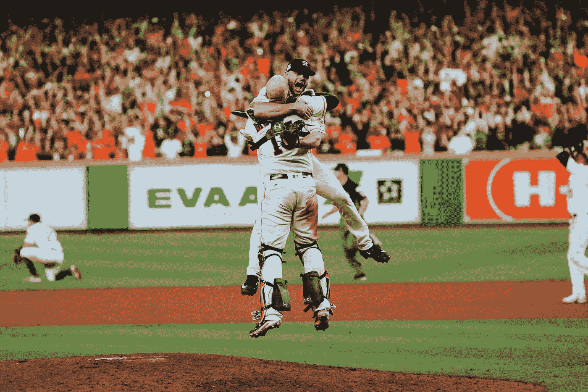
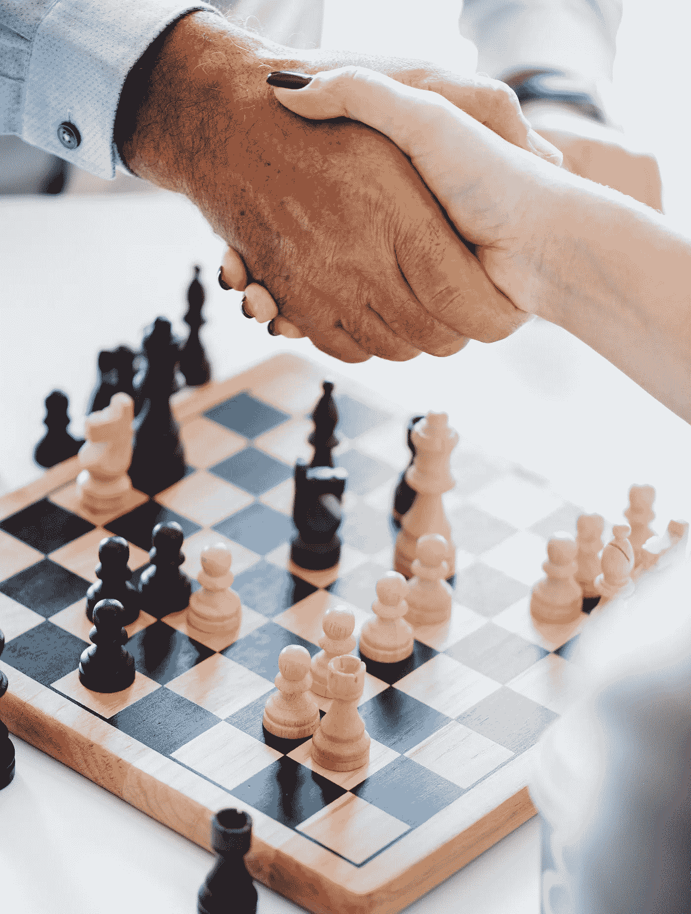

# 如果你想成功，就不断失败

> 原文：<https://medium.datadriveninvestor.com/if-you-want-to-succeed-keep-failing-32ae6f8beff0?source=collection_archive---------6----------------------->

Photo by [Kyle Johnson](https://unsplash.com/photos/Yi-4X9ZJU6Y?utm_source=unsplash&utm_medium=referral&utm_content=creditCopyText) on [Unsplash](https://unsplash.com/search/photos/training?utm_source=unsplash&utm_medium=referral&utm_content=creditCopyText)

> "失败只是重新开始的机会，这次会更聪明."~亨利·福特

生活是一场大游戏。有数不清的因素在起作用。但如果你想成为赢家，只有一条主要规则可以遵循:

从来没有。给。向上。

大多数人读到今天的伟人都会感到苦涩。这是为什么呢？因为他们内心深处不相信自己也能做到。他们只看到其他人的成功，却看不到他们取得成功所付出的一切。

他们看不到血、汗和泪。他们看不到对他们现在的地位做出贡献的巨大的时间、努力和毅力。他们看不到失败。只有成功。

一百年前，詹姆斯·艾伦非常雄辩地阐述了这种普遍的思想病理学是什么——大多数人的误导性思维模式:

> “轻率的、无知的、懒惰的，只看到事物表面的
> 效果，而不是事物本身，谈论运气、命运和
> 机会。看到一个人变得富有，他们会说:“他多幸运啊！看到
> 又一个人变得有知识了，他们惊叹道:“他是多么得天独厚啊！注意到另一个人圣洁的性格和广泛的影响，他们评论道:“机会总是帮助他！“他们看不到这些人为了获得经验而自愿经历的考验、失败和斗争；我不知道他们所做出的牺牲，不知道他们所付出的无畏的努力，不知道他们所行使的信念，不知道他们可能会克服明显不可逾越的障碍，实现他们心中的愿景。他们不知道黑暗和心痛；他们只看到光明和喜悦，并称之为“幸运”；不要看到漫长而艰苦的旅程，而只看到令人愉快的目标，称之为“好运”；不理解过程，只感知结果，并称之为“偶然”。”~詹姆斯·艾伦，[作为一个男人的想法](https://www.amazon.com/gp/product/164032013X/ref=as_li_tl?ie=UTF8&camp=1789&creative=9325&creativeASIN=164032013X&linkCode=as2&tag=spencers0f-20&linkId=d57e226fbbdb005aff1b485256d564e8)

TLDR:大多数人不明白，为了成功，你必须先经历许多痛苦。

你必须是那种拒绝走出拳击台的人，无论你被打得多惨，无论别人多么希望你放弃，无论恐惧、怀疑或犹豫不决会让你做什么。

**听起来似乎有悖常理，但你必须不断失败！**

大多数人看到了成功，却看不到是什么真正创造了成功。他们想要快速的答案，快速的结果，即时的名声，财富，声望和所有其他他们渴望的东西，但是当他们遇到挫折的时候，当不好的事情发生的时候，当他们*失败的时候，他们就认输了，让自己注定平庸的生活。不是因为他们只能做到这些，而是因为他们相信自己能做到这些。*

> *这是你的头号敌人。。。*

# *害怕失败*

> *“记住你的梦想，并为之奋斗。你必须知道你想从生活中得到什么。只有一件事让你的梦想变得不可能:对失败的恐惧。”~保罗·柯艾略*

*对失败的恐惧让大多数人不敢开始他们梦想的事情。*

*他们看着机会，看着他们想要实现的梦想，怀疑像疾病一样蔓延开来，质疑他们是否能做到，说服他们不能，最终描绘出一幅痛苦的画面:如果他们尝试，他们就会搞砸，如果他们搞砸了，他们就会失败。*

## ***这与成功截然相反。每一次巨大的成功都是由许多次失败的烈火磨炼出来的。***

**

*Photo by [Braden Collum](https://unsplash.com/photos/ttbCwN_mWic?utm_source=unsplash&utm_medium=referral&utm_content=creditCopyText) on [Unsplash](https://unsplash.com/search/photos/success?utm_source=unsplash&utm_medium=referral&utm_content=creditCopyText)*

*托马斯·爱迪生在发明灯泡之前失败了多少次？1000 次，就像他说的，****我没有失败 1000 次。灯泡是一项有 1000 个步骤的发明。”*****

**想成为亨利·福特那样的人吗？失败和破产五次，然后我们再谈。**

**想成为下一个迈克尔·乔丹吗？9000 次投篮不中，输掉 300 场比赛，先把致胜球搞砸 26 次。**

**约翰·克瑞希收到了 753 封退稿信，然后出版了 564 本书。**

**失败让你害怕的是什么？不应该。**

**你应该害怕的是从不尝试和从不失败——因为这就是平庸生活的含义。要成为世界级的，要克服所有你认为阻碍你的限制，你需要克服逆境，直到它放弃并让你获胜。**

**你会选择哪条路？**

> **"当我们做我们害怕的事情时，我们变得无所畏惧。"~罗宾·夏尔马**

# **接受这个事实:事情会阻碍你！**

**不管你在做什么，都会有障碍。我们每个人都会倒霉。重要的不是发生了什么，而是你对此做了什么。**

**你如何应对障碍决定了你能否克服它们。最后，有两个选择:**

> **1)成为受害者**
> 
> **2)成为赢家**

**大多数人采取一种受害者心态。他们看着竞争，或经济，或他们可怜的机会，或一百万个其他借口，然后责怪他们。他们将失败的责任归咎于外部事物，而不是接受自己处于掌控之中的事实。**

**然而，极少数人，接受每一次厄运和障碍，像他们天生的坏蛋一样继续前进。**

**约翰·弥尔顿失去了视力，然而 16 年后他写出了标志性的作品《失乐园》。**

**这就是我们作为人类的能力。这就是你能做的。无论发生什么，你都能成就伟大。**

> **"巨大的成功是建立在失败、挫折甚至灾难之上的."~萨姆纳·雷德斯通**

****

**Photo by [Matheus Ferrero](https://unsplash.com/photos/VWkWP3CMgm8?utm_source=unsplash&utm_medium=referral&utm_content=creditCopyText) on [Unsplash](https://unsplash.com/search/photos/success?utm_source=unsplash&utm_medium=referral&utm_content=creditCopyText)**

# **从失败中吸取教训**

> **“失败是成功的关键；每一个错误都教会了我们一些东西。”~Morihei Ueshiba**

**失败就是学习。我们生来并不完美。我们不知道所有的答案。前进的唯一方式是与我们不完整、不完美的自我一起工作，用我们有限的专业知识和知识，去努力吧！**

**是的，我们在这个过程中失败了很多。怎么可能是其他方式呢？正是通过那些错误，那些*失败*，我们学到了新的更好的方法。**

**如果你从未失败过，你会学到什么？要么你生来在各方面都是完美的，并且了解宇宙，要么——这是最有可能的——你没有做任何超出你舒适区的事情。**

**胜利可能会告诉你做对了什么，但失败会告诉你做错了什么——并迫使你看到它并解决它。**

> **“成功不是良师，失败让你卑微。”~沙鲁克·汗**

****向前失败。从每一个错误中学习。让每一个人都像拼图中的一块一样，为你是谁的更大、更好的版本做出贡献。****

> **失败是燃料！**

****

**Photo by [Goh Rhy Yan](https://unsplash.com/photos/x9iToq_5I4k?utm_source=unsplash&utm_medium=referral&utm_content=creditCopyText) on [Unsplash](https://unsplash.com/search/photos/race?utm_source=unsplash&utm_medium=referral&utm_content=creditCopyText)**

# **培养一种经得起失败考验的心态**

> **“我没有失败。我刚刚发现了一万种行不通的方法。”~托马斯·A·爱迪生**

**你如何看待失败就是一切。**

**心态固定的人认为每一次挫折都是他们的极限。然而，他们可以超越这些限制！**

**采取一种[成长心态](https://www.brainpickings.org/2014/01/29/carol-dweck-mindset/)，你就永远不会失败——因为失败只发生在你放弃的时候。**

**据他在一家报社的老板说，华特·迪士尼既没有想象力也没有好主意，因此被解雇了。他几次破产。但是现在呢？迪斯尼乐园有印象吗？**

**他没有放弃。他没有让失败定义他的极限。你也不应该。**

**不是迪士尼粉丝？还有查尔斯·舒尔茨，他提交给高中年鉴工作人员的每一幅漫画都被拒绝了。华特·迪士尼不肯雇用他。你猜怎么着？**

**没问题。**

# **继续**

> **"我们最大的荣耀不在于从不跌倒，而在于每次跌倒后都能爬起来."~孔子**

**失败让你离梦想成真更近了一步。每一次拒绝都让你离最终的胜利更近一步。它们是垫脚石，而不是绊脚石，不要混淆这两者。**

**所以请记住:**

**每一张拒绝单。。。**

***每一个“不”。。。***

**每次你都是最后一个来。。。**

***经过一整天的训练后，每一块酸痛的肌肉。。。***

***每次别人叫你退出的时候。。。***

***每次摔个嘴啃泥。。。***

> **继续前进！**

**在大多数人被失败绊倒的地方，你可以利用它们上升到更高的水平。当你大获全胜的时候。有勇气爬起来继续走下去。**

***“在这个世界上，没有什么能代替坚持。天赋不会:没有什么比拥有天赋的不成功男人更常见的了。天才不会:没有回报的天才几乎是一句谚语。教育不会:这个世界充满了受过教育的弃儿。只有坚持和决心是万能的。”~卡尔文·柯立芝***

****你将如何*看到*的失败？你将如何使用它？****

****

**Photo by [Marcus Wright](https://unsplash.com/photos/H7VezrWRqCg?utm_source=unsplash&utm_medium=referral&utm_content=creditCopyText) on [Unsplash](https://unsplash.com/search/photos/victory?utm_source=unsplash&utm_medium=referral&utm_content=creditCopyText)**

# **最后**

> **"成功不是最终的，失败也不是致命的:重要的是继续下去的勇气."~温斯顿·丘吉尔**

**生活是一场地狱般的游戏，你是决定是提前放弃还是经历所有考验的人。失败是伟大的代价，如果你想成功，你必须经历比大多数人能忍受的更多的失败。**

**生活是游戏，艰难是你的对手，梦想是你的棋子。在这场游戏中，获胜的唯一方法是继续玩下去——不管你的对手把你打得多惨。**

**不要害怕失败。**

**接受这是过程的一部分。**

**从每次失败中吸取教训。**

***化失败为燃料。***

***保持。去吧。***

**做到这一点，最后，当一切都结束了，当你超越了所有的障碍到达终点时，失败会看着你的眼睛，握着你的手，说:**

****“你没有放弃。不管我伤你多深，你都不会放弃。为此，你可以拥有一切。”****

> **继续玩。**

****

**Photo by [rawpixel](https://unsplash.com/photos/gUpbcU58B70?utm_source=unsplash&utm_medium=referral&utm_content=creditCopyText) on [Unsplash](https://unsplash.com/search/photos/success?utm_source=unsplash&utm_medium=referral&utm_content=creditCopyText)**